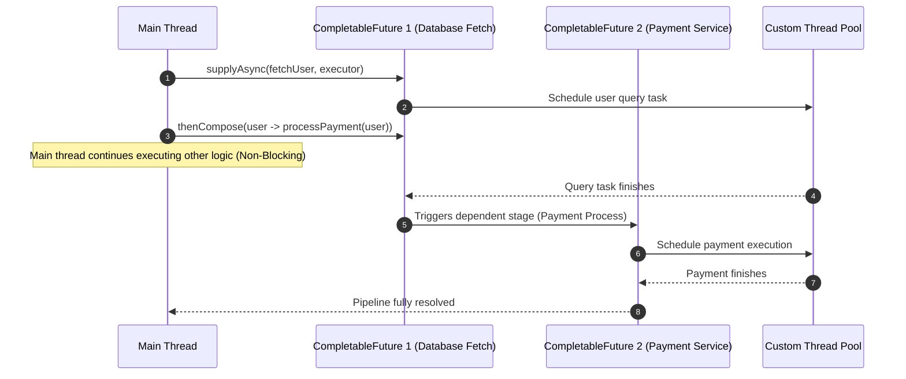

# CompletableFuture in Java

## Introduction
Introduced in Java 8, `CompletableFuture` is a class implementing both `Future` and `CompletionStage`. It revolutionized asynchronous programming in Java by allowing developers to write non-blocking, event-driven, and functional-style asynchronous code, resolving the limitations of legacy Java futures.

---

## Problem Statement
The older `Future` interface (returned by `ExecutorService.submit()`) was passive. It acted as a container for a pending computation, but to retrieve the result, the caller had to either block the main thread by calling `future.get()`, or poll using a busy-waiting CPU loop (`while (!future.isDone())`). Developers could not chain dependent tasks (e.g., "fetch customer details, then when done, calculate order price, then notify client") without incurring blocking calls.

---

## Why this exists
To enable asynchronous pipelines and reactive composition. `CompletableFuture` allows developers to register callbacks that execute automatically once a task completes. It supports chaining, combining parallel independent streams, handling exceptions functionally, and specifying target thread execution contexts for every computational step.

---

## Real-world analogy
Think of ordering custom furniture:
- **Old `Future` (Blocking):** You place an order for a table (submit task). You are forced to wait at the warehouse entrance (blocking `.get()`), doing absolutely nothing else, until the carpenter finishes building it.
- **`CompletableFuture` (Non-Blocking):** You place the order, and the warehouse gives you a tracking receipt (CompletableFuture). You go home, work on other projects, or read a book. You also attach instructions: *"When the table is done, paint it red (`thenApply`), then deliver it to my home (`thenAccept`). If anything breaks during transit, call my insurance (`exceptionally`)"*. You never stand idle waiting.

---

## Definition
- **CompletableFuture:** A class representing an asynchronous computation stage that can be explicitly completed by setting its value and status.
- **CompletionStage:** A promise interface representing a stage of a larger computation that performs an action or computes a value when another CompletionStage completes.

---

## Key concepts
1. **Asynchronous Execution**: Launching tasks using helper methods like `supplyAsync` (for tasks returning values) or `runAsync` (for tasks returning void).
2. **Pipelines**: Chaining stages sequentially:
   - `thenApply()`: Transforms the result (maps $T \to U$).
   - `thenAccept()`: Consumes the result (maps $T \to \text{void}$).
3. **Composition vs. Combination**:
   - `thenCompose()`: Sequences dependent tasks (maps $T \to \text{CompletableFuture}<U>$ and flattens to `CompletableFuture<U>`).
   - `thenCombine()`: Merges two independent concurrent tasks together.
4. **Asynchronous Suffix (`*Async`)**: Methods ending in `Async` (e.g., `thenApplyAsync`) execute their callbacks in a separate thread from the executor pool instead of executing on the thread that completed the previous task.

---

## Internal working / Mermaid diagram



---

## Python/Java implementation

### 1. Bad Implementation: Blocking Immediate `get()` calls
Retrieving the value of a Future immediately after submitting it nullifies all benefits of asynchronous execution, acting identically to synchronous execution.

```java
import java.util.concurrent.*;

public class BadFuturePipeline {
    public void runPipeline() throws ExecutionException, InterruptedException {
        ExecutorService executor = Executors.newFixedThreadPool(2);
        
        Future<String> userFuture = executor.submit(() -> {
            Thread.sleep(1000); // Fetch user
            return "John Doe";
        });

        // CRITICAL BUG: Blocking get() immediately suspends the calling thread, 
        // preventing any concurrent overlap with subsequent task submissions.
        String user = userFuture.get(); 

        Future<String> paymentFuture = executor.submit(() -> {
            Thread.sleep(1000); // Process payment for user
            return user + "_Paid";
        });

        String receipt = paymentFuture.get(); // Blocks again
        System.out.println("Receipt: " + receipt);
        executor.shutdown();
    }
}
```

### 2. Better Implementation: CompletableFuture with Unhandled Exceptions
Using `CompletableFuture` allows chaining, but neglecting exception handling can leave the application hanging or silently ignoring critical errors.

```java
import java.util.concurrent.CompletableFuture;

public class BetterFuturePipeline {
    public void runPipeline() {
        CompletableFuture<String> pipeline = CompletableFuture.supplyAsync(() -> {
            if (Math.random() > 0.5) {
                // BUG: If this exception is thrown, it propagates silently down the pipeline 
                // and the final Consumer is never notified unless they block on get().
                throw new RuntimeException("Network timeout!");
            }
            return "UserDetails";
        });

        pipeline.thenApply(user -> user + "_Validated")
                .thenAccept(result -> System.out.println("Processed: " + result));
    }
}
```

### 3. Best Implementation: Fully Asynchronous Pipelines with Error Recovery
Chaining dependent tasks (`thenCompose`), executing independent runs concurrently (`thenCombine`), and managing errors gracefully using functional fallbacks.

```java
import java.util.concurrent.*;

public class BestFuturePipeline {
    private final ExecutorService ioExecutor = Executors.newFixedThreadPool(10);
    private final ExecutorService cpuExecutor = Executors.newFixedThreadPool(4);

    public void processOrderFlow(String userId, String itemId) {
        // 1. Task A: Fetch user data (I/O bound)
        CompletableFuture<User> userStage = CompletableFuture.supplyAsync(
                () -> fetchUserFromDb(userId), ioExecutor
        );

        // 2. Task B: Fetch product price (I/O bound)
        CompletableFuture<Double> priceStage = CompletableFuture.supplyAsync(
                () -> fetchItemPrice(itemId), ioExecutor
        );

        // 3. Combine independent concurrent tasks: User & Price
        CompletableFuture<OrderReceipt> receiptStage = userStage.thenCombineAsync(priceStage, (user, price) -> {
            // CPU-bound composition
            return new OrderReceipt(user, price);
        }, cpuExecutor);

        // 4. Compose dependent task: Process billing (dependent on OrderReceipt)
        CompletableFuture<Boolean> billingStage = receiptStage.thenCompose(receipt -> 
                CompletableFuture.supplyAsync(() -> chargeUser(receipt), ioExecutor)
        );

        // 5. Functional Error Recovery and terminal execution
        billingStage.exceptionally(ex -> {
            System.err.println("Pipeline failed: " + ex.getCause().getMessage());
            return false; // Recovery fallback state
        }).thenAccept(success -> {
            System.out.println("Order completed successfully: " + success);
        });
    }

    // Mock Methods
    private User fetchUserFromDb(String id) { return new User(id, "Alice"); }
    private double fetchItemPrice(String id) { return 49.99; }
    private boolean chargeUser(OrderReceipt receipt) { return true; }

    static class User {
        String id, name;
        User(String id, String name) { this.id = id; this.name = name; }
    }
    static class OrderReceipt {
        User user; double total;
        OrderReceipt(User u, double t) { this.user = u; this.total = t; }
    }
}
```

---

## Step-by-step explanation
1. **Concurrent Initiation**: In the `Best` implementation, `userStage` and `priceStage` start running in parallel across the custom I/O thread pool (`ioExecutor`).
2. **Asynchronous Combination**: Once both independent futures complete, `thenCombineAsync` receives both outputs (`User` and `Double`) and merges them into an `OrderReceipt`. This step is scheduled on `cpuExecutor` since it is purely computational.
3. **Sequential Composition**: The payment step depends on the receipt. `thenCompose` is called to launch `chargeUser` asynchronously, preventing nested types like `CompletableFuture<CompletableFuture<Boolean>>`.
4. **Exception Handling**: `.exceptionally()` acts as a catch block. If any previous stage (database query, pricing service, or bank API) throws an exception, the pipeline halts normal execution, forwards the exception to this block, logs it, and returns `false` to recover.
5. **Terminal Consumer**: `.thenAccept()` consumes the final output to execute print or callback operations.

---

## Multiple real-world examples
1. **E-commerce Checkout:** Querying loyalty points, processing credit cards, updating inventories, and sending email receipts simultaneously.
2. **API Gateways:** Aggregating data from multiple microservices concurrently to build a unified response payload for mobile clients.
3. **Data Extract-Transform-Load (ETL) Pipelines:** Reading bulk CSV chunks asynchronously, parsing them in parallel CPU pools, and saving the results database-by-database.

---

## Pros
- **Non-blocking Execution:** Frees up threads during I/O waits, maximizing server throughput.
- **Readable Composition:** Avoids the deep nesting of callbacks ("Callback Hell") through clean functional chaining.
- **Granular Thread Tuning:** Allows assigning different tasks to dedicated pools via `Async` suffixes.

---

## Cons
- **Debugging Pain:** Stack traces are detached from the initiating thread, making root-cause analysis difficult.
- **ThreadLocal Isolation:** Contexts like Spring Security principal or Logback MDC transaction IDs do not propagate to async worker threads automatically.
- **Resource Saturation:** Using the default `ForkJoinPool.commonPool()` for blocking I/O can starve other parts of the application.

---

## Interview questions

### Beginner
- **Q: What is the difference between `runAsync` and `supplyAsync`?**
  - **A:** `runAsync()` accepts a `Runnable` and returns `CompletableFuture<Void>` (no result returned). `supplyAsync()` accepts a `Supplier<T>` and returns `CompletableFuture<T>` containing the output computed by the supplier.

### Intermediate
- **Q: What happens if an exception is thrown in a middle stage of a `CompletableFuture` chain?**
  - **A:** The execution of subsequent normal processing stages (like `thenApply`) is bypassed. The exception travels down the pipeline until it reaches an exception-handling stage like `exceptionally()`, `handle()`, or `whenComplete()`. If no handler exists, the error is swallowed inside the future object.

### Senior
- **Q: Compare `thenApply` and `thenCompose`.**
  - **A:** 
    - `thenApply` is used for synchronous transformations where the mapper returns a raw value $U$ (yielding `CompletableFuture<U>`).
    - `thenCompose` is used for asynchronous transformations where the mapper returns another `CompletableFuture<U>`. It flattens the result, preventing nested futures (`CompletableFuture<CompletableFuture<U>>`), acting like `flatMap`.

### Staff Engineer
- **Q: Explain how you would propagate `ThreadLocal` contexts (like transaction tracing headers or authentication tokens) across `CompletableFuture` async boundaries.**
  - **A:** Because `CompletableFuture` shifts task execution to thread pools, native `ThreadLocal` values are lost. To resolve this, one must intercept task submission. This is achieved by creating a decorator pattern around the `ExecutorService`. The custom executor captures the active thread context during task submission (`submit`/`execute`), wraps the `Runnable`/`Callable` to inject the captured context into the worker thread before execution, and cleans it up in a `finally` block after completion:
  ```java
  public class ContextPropagatingExecutor implements Executor {
      private final Executor delegate;
      public ContextPropagatingExecutor(Executor delegate) { this.delegate = delegate; }
      @Override
      public void execute(Runnable command) {
          String traceId = TraceContext.getTraceId(); // Capture context
          delegate.execute(() -> {
              TraceContext.setTraceId(traceId); // Inject context
              try {
                  command.run();
              } finally {
                  TraceContext.clear(); // Clean up context
              }
          });
      }
  }
  ```

---

## Common mistakes
- **Using the common ForkJoinPool for Blocking I/O:** The common pool has a small number of threads optimized for CPU-bound tasks. Saturating it with blocking socket I/O blocks the entire JVM.
- **Forgetting Exception Handlers:** Leaving out `.exceptionally()` or `.handle()` leads to silent failures where database errors or API failures vanish without warnings.
- **Calling `.get()` or `.join()` inside pipeline steps:** Doing this defeats the purpose of non-blocking chaining, locking thread execution mid-pipeline.

---

## Best practices
- **Always provide a custom executor:** Pass a dedicated, sized thread pool to all async calls.
- **Keep pipelines clean:** Avoid mutating shared state inside lambdas; strive for pure, stateless functions.
- **Handle all errors:** Terminate pipelines with `exceptionally()` to log errors and supply fallback states.

---

## When NOT to use
- **Simple synchronous operations:** If steps are light and sequential, the overhead of task scheduling and thread allocation outweighs any concurrency gains.
- **Virtual Thread environments (JDK 21+):** When using Virtual Threads, standard blocking code is already extremely efficient, reducing the need for complex reactive future pipelines.

---

## Comparison with similar concepts

| Metric | Future | CompletableFuture | RxJava / Project Reactor |
| :--- | :--- | :--- | :--- |
| **Model** | Pull (blocking) | Push (event-driven callbacks) | Push (reactive streams) |
| **Cardinality** | Single value | Single value | Zero-to-infinity stream (Flux/Mono) |
| **Chaining Support**| No | Yes | Yes (Advanced operations) |
| **Backpressure** | N/A | N/A | Yes |

---

## Summary
`CompletableFuture` provides powerful asynchronous task composition in Java. By utilizing non-blocking callbacks, mapping composition, and functional error handling, developers can construct fast, thread-safe request pipelines while managing background resource pools effectively.

---

## Related topics
- [Executors & Thread Pools](../executors-thread-pools)
- [Memory Models](../memory-models)
- [Streams & Functional Programming](../../java/streams-functional)
