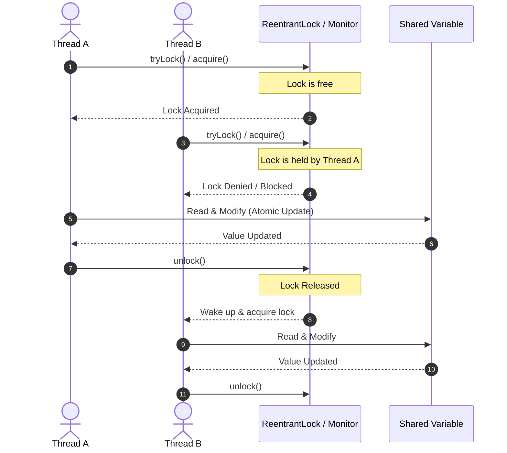

# Concurrency & Synchronization

## Introduction
While multithreading allows tasks to run concurrently, it introduces the critical problem of **Shared State**. When multiple threads attempt to read and write to the same memory location simultaneously, data corruption occurs. Synchronization is the collection of mechanisms that coordinate thread access to critical sections, ensuring data integrity, visibility, and ordering.

---

## Problem Statement
Imagine a ticketing system where a single seat remains.
1. Thread A (User 1) reads `availableSeats = 1`.
2. Thread B (User 2) reads `availableSeats = 1`.
3. Thread A decrements `availableSeats` to 0 and issues ticket A.
4. Thread B, relying on its outdated read of 1, also decrements `availableSeats` to -1 and issues ticket B.
Both users are double-booked for the exact same seat, creating inconsistent state due to a **Race Condition**.

---

## Why this exists
In modern processors, operations on memory are not atomic at the hardware level, and threads run on different CPU cores with separate caches. Without synchronization, threads can work on stale data cached in CPU registers or interleave their operations in unpredictable sequences, causing data corruption and nondeterministic behavior.

---

## Real-world analogy
Think of a single-occupancy restroom in an office building:
- **No Synchronization (Bad):** There is no lock on the door. Anyone can barge in at any time, leading to collisions and embarrassment (Race Condition).
- **Mutual Exclusion (Better):** A manual lock is on the door. Once a person enters, they slide the bolt. Anyone else who tries the door must wait outside until the lock is released.
- **Lock-Free Atomic Exchange (Best):** A high-speed turnstile that scans badges and allows exactly one person to pass through per swipe, tracking the count electronically without requiring a slow manual locking mechanism.

---

## Definition
- **Critical Section:** A block of code that accesses shared mutable resources and must not be concurrently executed by multiple threads.
- **Race Condition:** A condition where the output of a program depends on the relative timing or execution order of concurrent threads.
- **Lock Contention:** A performance bottleneck that occurs when multiple threads wait to acquire the same lock.
- **Atomic Operation:** An operation that appears to occur instantaneously to the rest of the system; it either completes entirely or does not execute at all.

---

## Key concepts
1. **Intrinsic Locks (Monitors):** Every Java object has an implicit internal monitor lock. The `synchronized` keyword uses these monitors to enforce mutual exclusion.
2. **Explicit Locks (`Lock` and `ReentrantLock`):** Found in `java.util.concurrent.locks`. They offer advanced capabilities like non-blocking lock attempts (`tryLock()`), interruptible lock acquisitions, and fairness policies.
3. **Atomic Classes:** Classes in `java.util.concurrent.atomic` (e.g., `AtomicInteger`, `AtomicReference`) that leverage CPU-level Compare-And-Swap (CAS) instructions to perform thread-safe mutations without blocking.
4. **Visibility vs. Atomicity:** `volatile` guarantees that changes to a variable are flushed to main memory and are visible to other threads immediately, but does NOT make compound operations (like `count++`) atomic.

---

## Internal working / Mermaid diagram



---

## Python/Java implementation

### 1. Bad Implementation: Unsynchronized Race Condition
In this example, concurrent counter increments result in lost updates due to data races.

```java
public class BadCounter {
    private int count = 0;

    public void increment() {
        // CRITICAL BUG: count++ is a 3-step non-atomic operation (read, add, write).
        // Under high concurrency, updates will be lost.
        count++;
    }

    public int getCount() {
        return count;
    }
}
```

### 2. Better Implementation: Heavy Intrinsic Method-Level Synchronization
Adding `synchronized` to the method level works, but forces all threads into a strict queue, causing severe lock contention.

```java
public class BetterCounter {
    private int count = 0;

    // Mutex lock is acquired on the entire 'this' object.
    // Highly contentive and blocks other threads even if they execute unrelated reads.
    public synchronized void increment() {
        count++;
    }

    public synchronized int getCount() {
        return count;
    }
}
```

### 3. Best Implementation: Explicit Locks with Timeouts & Atomic Counters
Combining explicit `ReentrantLock` with timeout attempts to avoid deadlocks, alongside lock-free CPU-level atomic integers for simple mutations.

```java
import java.util.concurrent.TimeUnit;
import java.util.concurrent.atomic.AtomicInteger;
import java.util.concurrent.locks.ReentrantLock;

public class BestSynchronizedCounter {
    // 1. Lock-free Atomic integer using CPU Compare-And-Swap (CAS) instructions
    private final AtomicInteger atomicCount = new AtomicInteger(0);

    // 2. Explicit lock for complex multi-resource mutations
    private final ReentrantLock lock = new ReentrantLock(true); // fair lock
    private double balance = 1000.0;

    // Use AtomicInteger for ultra-fast, lock-free, single-variable counters
    public void incrementCount() {
        atomicCount.incrementAndGet();
    }

    // Use ReentrantLock with timeouts to prevent deadlock under contention
    public boolean transferFundsSafely(double amount) {
        try {
            // Attempt to acquire the lock within 500 milliseconds
            if (lock.tryLock(500, TimeUnit.MILLISECONDS)) {
                try {
                    if (balance >= amount) {
                        balance -= amount;
                        return true;
                    }
                } finally {
                    lock.unlock(); // Ensure lock release
                }
            } else {
                System.err.println("Lock acquisition timed out for thread: " + Thread.currentThread().getName());
            }
        } catch (InterruptedException e) {
            Thread.currentThread().interrupt();
        }
        return false;
    }

    public int getCount() {
        return atomicCount.get();
    }

    public double getBalance() {
        return balance;
    }
}
```

---

## Step-by-step explanation
1. **Unsynchronized Increment**: In the `BadCounter`, multiple threads read the same base value of `count`, add 1, and write the same incremented value back, overwriting each other's changes.
2. **Intrinsic Synchronization**: The `BetterCounter` uses Java's built-in monitor lock on `this`. While Thread A is executing `increment()`, Thread B is blocked in the JVM's entry queue.
3. **Compare-And-Swap (CAS)**: The `Best` implementation uses `AtomicInteger`. It performs mutations using a loop containing a native instruction: `Compare-and-Swap`. It reads the value, calculates the new value, and writes it only if the current value hasn't changed. If it has changed, it loops and retries.
4. **Explicit Lock Acquisition**: `lock.tryLock(500, TimeUnit.MILLISECONDS)` tries to acquire the lock. If another thread holds the lock, rather than blocking indefinitely (which risks deadlocks), the thread backs off after 500ms.
5. **Ensuring Release**: The lock is unlocked in a `finally` block, ensuring that even if runtime exceptions occur, the lock is freed for waiting threads.

---

## Multiple real-world examples
1. **Financial Transaction Processing:** Transferring money between account objects must acquire locks in a consistent order using timeouts to prevent deadlock.
2. **Thread-Safe LRU Cache:** Utilizing a `ReentrantReadWriteLock` so multiple threads can read cache items concurrently, while write requests temporarily block readers to update cache entries safely.
3. **Inventory Allocator:** Ensuring that an item is only sold if inventory count > 0 using database locks or Atomic variables at the application level.
4. **Connection Pool Managers:** Using atomic counters to track leased connections and locks to safeguard the list of idle database connections.

---

## Pros
- **Consistency:** Prevents race conditions and ensures memory visibility.
- **Thread Coordination:** Enables complex operations to run atomically without interruption.
- **Resource Protection:** Prevents concurrent writes from corrupting internal states of custom data structures.

---

## Cons
- **Performance Loss:** High lock contention turns parallel execution back into sequential execution.
- **Deadlocks & Livelocks:** Poor lock ordering can halt the entire application.
- **Priority Inversion:** A low-priority thread holding a lock blocks a high-priority thread from executing.

---

## Interview questions

### Beginner
- **Q: What is a Critical Section?**
  - **A:** It is a segment of code that accesses shared mutable resources (like files, variables, or sockets). To prevent race conditions, only one thread should execute in the critical section at any given time.

### Intermediate
- **Q: What is the difference between `synchronized` blocks and `ReentrantLock`?**
  - **A:** `synchronized` blocks are implicit, clean, and automatically released by the JVM when the scope is exited. `ReentrantLock` is explicit, requiring manual unlocking, but provides advanced options like non-blocking lock attempts (`tryLock()`), interruptible locks, fairness policies, and multiple wait conditions.

### Senior
- **Q: How does Compare-And-Swap (CAS) work, and why is it considered lock-free?**
  - **A:** CAS is a hardware-supported CPU instruction that updates a memory location's value only if its current value matches an expected old value. It is considered lock-free because threads do not suspend or block when contention occurs; instead, they fail the CAS attempt, loop, and retry without incurring OS-level thread context-switching overhead.

### Staff Engineer
- **Q: Explain the memory visibility guarantees of the Java Memory Model (JMM) in the context of the "happens-before" relationship.**
  - **A:** The JMM defines the "happens-before" relationship to guarantee that memory writes by one thread are visible to reads by another. Key rules include: An unlock on a monitor happens-before every subsequent lock on the same monitor; a write to a `volatile` field happens-before every subsequent read of that same field; and `Thread.start()` happens-before any action in the started thread. Without these happens-before boundaries, compiler optimizations and CPU out-of-order execution can reorder instructions, causing other threads to read stale or partially initialized states.

---

## Common mistakes
- **Locking on primitive wrappers or string constants:** Locking on `synchronized("myLock")` locks the interned string instance, meaning unrelated libraries using the same string will block each other globally.
- **Nested locks without ordered acquisition:** Locking Object A then B in Thread 1, while Thread 2 locks Object B then A, causes a deadlock.
- **Assuming thread-safe wrappers protect composite actions:** Running multiple calls on a `Vector` or `Collections.synchronizedList` (e.g., check-then-act `if(!list.contains(x)) list.add(x)`) is NOT atomic unless the caller explicitly locks the collection instance.

---

## Best practices
- **Minimize Lock Scope:** Keep synchronized blocks as small as possible.
- **Release Locks in Finally Blocks:** Always release explicit locks in a `finally` block to prevent resource leaks.
- **Use Concurrency Utilities:** Prefer high-level concurrent classes (e.g., `ConcurrentHashMap`, `CopyOnWriteArrayList`, `AtomicLong`) over manual locks.

---

## When NOT to use
- **Read-only Shared Data:** If shared data is read-only (immutable), synchronization is completely unnecessary and adds overhead.
- **Thread-Isolated Resources:** Using synchronization on variables that are strictly local to a thread (e.g., local variables inside a method) is redundant.

---

## Comparison with similar concepts

| Feature | Intrinsic Locks (`synchronized`) | Explicit Locks (`ReentrantLock`) | Atomic Classes (`AtomicInteger`) |
| :--- | :--- | :--- | :--- |
| **Locking Mechanism** | Implicit / Blocking | Explicit / Blocking or Non-Blocking | Lock-Free / CAS Loop |
| **Deadlock Risk** | High (if nested locks exist) | Medium (mitigated by `tryLock`) | None |
| **Performance** | Good (highly optimized by JVM) | High (best under heavy contention) | Ultra-high (for single variable) |
| **Fairness Policy** | No | Yes (Optional) | N/A |

---

## Summary
Synchronization maintains structural order and data consistency in concurrent systems. Developers must choose between intrinsic locks for simplicity, explicit locks for sophisticated deadlock avoidance, and atomic variables for lock-free performance. Applying the least restrictive locking model is essential for scalable application architectures.

---

## Related topics
- [Multithreading](../multithreading)
- [Executors & Thread Pools](../executors-thread-pools)
- [Memory Models](../memory-models)
