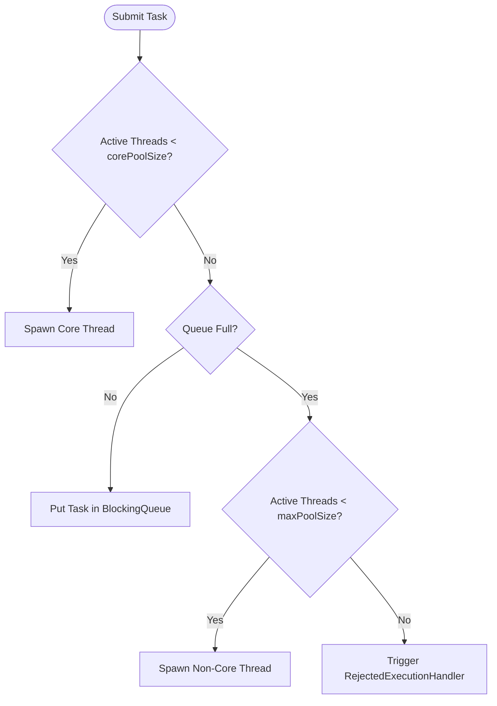

# Executors & Thread Pools

## Introduction
While threads are the core units of concurrency in Java, creating and destroying them is computationally expensive. The Java Executor Framework (introduced in Java 5) abstracts thread management away from the developer by introducing managed thread pools. This decoupling of task submission from task execution improves resource management, increases performance, and protects applications from crashing under peak traffic.

---

## Problem Statement
Spawning a native OS thread requires allocating a private stack (~1MB of RAM) and executing context-switching overhead on CPU registers. In an application where a new thread is spawned manually for every incoming request (e.g., `new Thread(task).start()`), a traffic spike of 5,000 concurrent users will attempt to allocate 5GB of system RAM instantly. This results in the classic JVM crash: `java.lang.OutOfMemoryError: unable to create new native thread`.

---

## Why this exists
To limit and reuse thread resources. Thread pools keep a configured number of worker threads active. When a new task arrives, instead of creating a new thread, the executor puts the task into a queue. Active worker threads pull tasks from this queue, execute them, and return to the pool for reuse, protecting system resources from exhaustion.

---

## Real-world analogy
Imagine a shipping warehouse with 10 delivery vans (the **Thread Pool**):
- **Unmanaged Spawning:** Every time a customer places an order, the warehouse buys a brand-new delivery van, hires a driver, drives the parcel, and destroys the van afterwards. This bankrupts the warehouse under heavy sales (OutOfMemoryError).
- **Thread Pool:** The warehouse keeps exactly 10 vans. If 100 packages need delivery, they wait in a shipping queue (the **Blocking Queue**). The 10 drivers deliver packages one by one. As soon as a driver returns, they take the next package from the queue.

---

## Definition
- **ExecutorService:** An interface extending `Executor` that manages the lifecycle of a thread pool, allowing task submission, tracking, and shutdown control.
- **BlockingQueue:** A thread-safe queue used by the thread pool to store tasks that are waiting for execution by worker threads.
- **ThreadFactory:** An interface used by the thread pool to instantiate new threads dynamically.

---

## Key concepts
1. **Core vs. Maximum Pool Size**:
   - `corePoolSize`: The number of threads kept alive in the pool, even if they are idle.
   - `maximumPoolSize`: The maximum number of threads allowed in the pool when the queue becomes full.
2. **Keep-Alive Time**: The maximum time that excess idle threads (above core pool size) will wait for new tasks before terminating.
3. **Rejection Handler Policies**: When the queue is full and the thread count reaches `maximumPoolSize`, subsequent tasks are rejected. Java provides four default strategies:
   - `AbortPolicy` (Default): Throws `RejectedExecutionException`.
   - `CallerRunsPolicy`: The thread submitting the task executes it itself, temporarily slowing down task submission.
   - `DiscardPolicy`: Silently drops the rejected task.
   - `DiscardOldestPolicy`: Drops the oldest unhandled task in the queue and retries execution.

---

## Internal working / Mermaid diagram



---

## Python/Java implementation

### 1. Bad Implementation: Unbounded Cached Thread Pool (OOM Threat)
Using `Executors.newCachedThreadPool()` or fixed pools with unbounded queues can cause memory starvation under high load.

```java
import java.util.concurrent.ExecutorService;
import java.util.concurrent.Executors;

public class BadThreadPool {
    public void handleHighVolumeTraffic() {
        // CRITICAL BUG: newCachedThreadPool creates an unbounded number of threads (Integer.MAX_VALUE).
        // Under a massive request burst, it will trigger OutOfMemoryError.
        ExecutorService executor = Executors.newCachedThreadPool();

        for (int i = 0; i < 1_000_000; i++) {
            executor.submit(() -> {
                try {
                    Thread.sleep(5000); // Simulate database operation
                } catch (InterruptedException e) {
                    Thread.currentThread().interrupt();
                }
            });
        }
    }
}
```

### 2. Better Implementation: Fixed Pool with Silent Rejection / Unbounded Queue
Creating a fixed pool is safer, but relying on `Executors.newFixedThreadPool()` uses an unbounded `LinkedBlockingQueue` that can grow indefinitely.

```java
import java.util.concurrent.ExecutorService;
import java.util.concurrent.Executors;

public class BetterThreadPool {
    public void processTasks() {
        // BETTER: Core and max threads are bounded.
        // BUG: Uses an unbounded LinkedBlockingQueue under the hood.
        // If consumer threads are slower than task submission, the queue will eat up JVM heap.
        ExecutorService executor = Executors.newFixedThreadPool(10);

        for (int i = 0; i < 1_000_000; i++) {
            executor.submit(() -> {
                System.out.println("Processing on: " + Thread.currentThread().getName());
            });
        }
        executor.shutdown();
    }
}
```

### 3. Best Implementation: Custom Bounded ThreadPoolExecutor with Bounded Queue & Rejection Policy
Designing a custom `ThreadPoolExecutor` using explicit bounds, a custom thread naming factory, and a safe backup rejection handler (`CallerRunsPolicy`).

```java
import java.util.concurrent.*;
import java.util.concurrent.atomic.AtomicInteger;

public class BestThreadPool {
    private final ThreadPoolExecutor executor;

    public BestThreadPool() {
        int corePoolSize = 4;
        int maxPoolSize = 8;
        long keepAliveTime = 60L;
        
        // Bounded queue prevents OutOfMemoryError
        BlockingQueue<Runnable> queue = new LinkedBlockingQueue<>(500);

        // Custom ThreadFactory to name threads (critical for debug thread dumps)
        ThreadFactory threadFactory = new CustomThreadFactory("order-processor");

        // CallerRunsPolicy: If queue is full, the submitting thread executes the task, 
        // acting as a natural backpressure mechanism.
        RejectedExecutionHandler handler = new ThreadPoolExecutor.CallerRunsPolicy();

        this.executor = new ThreadPoolExecutor(
                corePoolSize,
                maxPoolSize,
                keepAliveTime,
                TimeUnit.SECONDS,
                queue,
                threadFactory,
                handler
        );
    }

    public void processRequestsSafely(int totalRequests) {
        for (int i = 0; i < totalRequests; i++) {
            final int requestId = i;
            executor.submit(() -> {
                try {
                    // Simulate task execution
                    Thread.sleep(100);
                    System.out.println("Handled request " + requestId + " on " + Thread.currentThread().getName());
                } catch (InterruptedException e) {
                    Thread.currentThread().interrupt();
                }
            });
        }
        
        // Graceful Shutdown Sequence
        executor.shutdown();
        try {
            if (!executor.awaitTermination(30, TimeUnit.SECONDS)) {
                executor.shutdownNow();
            }
        } catch (InterruptedException e) {
            executor.shutdownNow();
            Thread.currentThread().interrupt();
        }
    }

    static class CustomThreadFactory implements ThreadFactory {
        private final String prefix;
        private final AtomicInteger threadNumber = new AtomicInteger(1);

        public CustomThreadFactory(String prefix) {
            this.prefix = prefix;
        }

        @Override
        public Thread newThread(Runnable r) {
            Thread thread = new Thread(r, prefix + "-worker-" + threadNumber.getAndIncrement());
            thread.setDaemon(false);
            thread.setPriority(Thread.NORM_PRIORITY);
            return thread;
        }
    }
}
```

---

## Step-by-step explanation
1. **Task Submission**: The client submits a task via `executor.submit()`.
2. **Core Allocation**: The executor checks if the number of running worker threads is less than `corePoolSize`. If yes, it creates a new thread to run the task immediately.
3. **Queueing**: If core threads are busy, the executor attempts to place the task into the bounded `LinkedBlockingQueue` of size 500.
4. **Max Growth**: If the queue is completely full, the executor checks if the running thread count is less than `maximumPoolSize`. If yes, it spawns a temporary non-core worker thread to execute the task.
5. **Backpressure (Rejection Handler)**: If the thread count matches `maxPoolSize` and the queue is full, the next task triggers the `CallerRunsPolicy`. The main thread calling `processRequestsSafely` will run this task itself, which naturally blocks the main thread from submitting more tasks, allowing the thread pool to catch up.

---

## Multiple real-world examples
1. **API Gateways (Rate Limiting):** Setting thread pool bounds to limit how many concurrent requests are routed to downstream services, protecting backend infrastructure from service crashes.
2. **PDF Generators:** Using a small, dedicated `FixedThreadPool` (e.g., 2-4 threads) to render PDFs, preventing heavy CPU computations from starving standard web traffic workers.
3. **Scheduled Analytics Syncs:** Using a `ScheduledThreadPoolExecutor` to run a database clean-up script every day at midnight and health checks every 10 seconds.
4. **Asynchronous Notification Senders:** Offloading verification emails and SMS notifications to a thread pool with a `DiscardOldestPolicy` to prevent transient system spikes from failing critical request flows.

---

## Pros
- **Resource Protection:** Enforces limits on memory and thread allocations.
- **Lower Latency:** Eliminates thread creation overhead by keeping worker threads alive.
- **Graceful Degradation:** Provides handlers to manage excess tasks smoothly when resources are exhausted.

---

## Cons
- **Thread Starvation Deadlocks:** Occurs when tasks running in the thread pool block waiting for other tasks submitted to the same pool.
- **Silent Failures:** If a task submitted via `execute()` throws an exception, it prints to standard error but does not alert the caller unless wrapped in a try-catch.
- **Memory Overhead:** Bounded queues holding large tasks can still consume significant heap memory.

---

## Interview questions

### Beginner
- **Q: What is the difference between `submit()` and `execute()`?**
  - **A:** `execute()` (defined in `Executor`) takes a `Runnable` and returns `void`. It is fire-and-forget. `submit()` (defined in `ExecutorService`) can take a `Runnable` or `Callable` and returns a `Future` object, which allows the caller to retrieve results and track exceptions.

### Intermediate
- **Q: Why should you avoid using `Executors.newFixedThreadPool()` in production?**
  - **A:** Under the hood, `newFixedThreadPool()` uses an unbounded `LinkedBlockingQueue`. If the incoming request rate is higher than the processing rate, tasks will accumulate in the queue indefinitely, eventually causing an `OutOfMemoryError`. It is always safer to use a custom `ThreadPoolExecutor` with a bounded queue.

### Senior
- **Q: Explain Thread Starvation Deadlock.**
  - **A:** This occurs when threads in a pool submit new tasks to the same pool and block waiting for their results (using `Future.get()`). If all threads in the pool are blocked waiting for queued tasks, and those queued tasks cannot start because there are no free threads, the system deadlocks. It can be prevented by using separate thread pools for different tasks.

### Staff Engineer
- **Q: How would you determine the optimal sizes for `corePoolSize` and `maximumPoolSize` for CPU-bound vs. I/O-bound tasks?**
  - **A:** 
    - For **CPU-bound** tasks (e.g., mathematical calculations, rendering), the bottleneck is the processor. The optimal size is typically equal to `Number of CPU Cores + 1`. Spawning more threads than CPU cores causes context-switching overhead, degrading performance.
    - For **I/O-bound** tasks (e.g., database queries, network APIs), the threads spend most of their time blocked. The formula is:
      $$\text{Threads} = \text{CPU Cores} \times \left(1 + \frac{\text{Wait Time}}{\text{Compute Time}}\right)$$
      In practice, this is determined through load testing and profiling to find the point where thread count maximizes network/database throughput without exhausting system RAM.

---

## Common mistakes
- **Not shutting down the executor:** Thread pool threads are non-daemon by default. Failing to call `shutdown()` prevents the JVM from exiting.
- **Sharing a single thread pool for all tasks:** Mixing fast UI tasks and slow DB queries in the same pool leads to database calls starving UI response workers.
- **Setting maximum pool size without bounding the queue:** If you use an unbounded queue, the executor will never create more than `corePoolSize` threads, rendering `maximumPoolSize` useless.

---

## Best practices
- **Always specify thread names:** Implement a custom `ThreadFactory` to assign clean names to threads.
- **Enforce queues boundaries:** Always bound your blocking queues to protect system memory.
- **Tune thread pools separately:** Create separate executors for different business functionalities (e.g., email-pool, database-pool).

---

## When NOT to use
- **Low-frequency tasks:** For tasks that run rarely (e.g., once every hour), a persistent thread pool consumes unnecessary memory. Use a simple scheduler or serverless function instead.
- **Virtual Thread Candidates (Java 21+):** For lightweight I/O bound tasks, Virtual Threads eliminate the need to pool thread resources.

---

## Comparison with similar concepts

| Metric | Fixed Thread Pool | Cached Thread Pool | Scheduled Thread Pool |
| :--- | :--- | :--- | :--- |
| **Thread Limit** | Bounded (Fixed count) | Unbounded (`Integer.MAX_VALUE`) | Bounded (Fixed count) |
| **Queue Type** | `LinkedBlockingQueue` (Unbounded by default) | `SynchronousQueue` (Zero-capacity handoff) | `DelayedWorkQueue` |
| **Use Case** | Steady-state resource-constrained loads | Short-lived, unpredictable bursty tasks | Repeating cron-like tasks |

---

## Summary
The Executor Framework provides advanced resource pooling for Java concurrency. By structuring custom `ThreadPoolExecutor` configurations with bounded queues and custom rejection policies, developers can safeguard memory limits and build resilient, production-ready asynchronous backends.

---

## Related topics
- [CompletableFuture](../completable-future)
- [Multithreading](../multithreading)
- [Memory Models](../memory-models)
