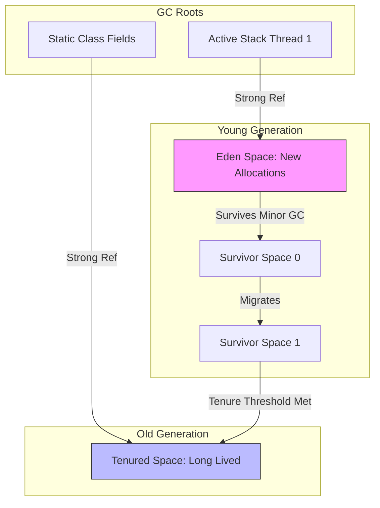

# Garbage Collection (GC) in Java

## Introduction
Garbage Collection (GC) is an automated memory management process executed by the Java Virtual Machine (JVM). It runs as a low-priority background daemon thread, identifying unreachable objects in the Heap memory, freeing up system RAM, and reclaiming space to allow subsequent allocations.

---

## Problem Statement
In languages like C and C++, developers must manually manage memory allocation (`malloc()`) and deallocation (`free()`). 
If a developer forgets to free memory, the application slowly consumes all system RAM, causing a memory leak that eventually crashes the server. Conversely, if memory is freed while pointers are still active, accessing that memory triggers segmentation faults, corrupted states, or use-after-free security vulnerabilities.

---

## Why this exists
To eliminate memory-related programming errors. By automating the reclamation of unused objects, Java shifts the burden of memory safety from the developer to the runtime. This prevents memory leaks, dangling pointer crashes, and buffer overflows, increasing software stability and developer velocity.

---

## Real-world analogy
Think of a busy restaurant:
- **Manual Memory (C++):** Every time a diner finishes eating a dish, they must explicitly flag the waiter and write a signed request to clear that specific plate. If they forget, the table fills up with dirty dishes, and eventually, no new food can be served (OutOfMemoryError).
- **Automated Memory (Java GC):** A busboy (Garbage Collector) walks around the tables. If they spot a glass with no one sitting at the seat, or a plate containing only scraps with no active diner interacting with it, they clear the plate immediately.

---

## Definition
- **Reachability:** The state of an object being reachable from active references (called GC Roots) in the execution context.
- **Stop-The-World (STW):** A state where the JVM halts all application execution threads (mutators) to allow GC threads to safely scan the heap, relocate objects, and reclaim memory.
- **Generational Hypothesis:** The empirical observation that the vast majority of allocated objects survive for only a very short duration.

---

## Key concepts
1. **GC Roots**: Starting points for reachability analysis. Any object reachable from a root is kept alive. Roots include:
   - Local variables and parameters in active method stack frames.
   - Active Java threads.
   - Static variables declared in classes.
   - JNI (Java Native Interface) global references.
2. **Memory Generations**:
   - **Young Generation:** Composed of Eden and two Survivor spaces (S0/S1). New objects start in Eden. Surviving objects migrate between survivors, increments their "tenure age".
   - **Old (Tenured) Generation:** Long-lived objects promoted from the Young Generation after crossing an age threshold (default: 15).
   - **Metaspace:** Holds class metadata, loaded class representations, and method structures (stored in native memory, not JVM heap).
3. **Reference Types**:
   - **Strong Reference (`new Object()`):** Never garbage collected while active.
   - **Weak Reference (`WeakReference<T>`):** Garbage collected during the next GC cycle regardless of memory levels, if there are no strong references remaining.
   - **Soft Reference (`SoftReference<T>`):** Garbage collected only when the JVM is running out of memory.
   - **Phantom Reference:** Used to schedule post-mortem cleanups before finalization.

---

## Internal working / Mermaid diagram



---

## Python/Java implementation

### 1. Bad Implementation: Memory Leak via Static Accumulators
Retaining references to objects in static collections prevents the GC from reclaiming them, causing frequent, slow Stop-The-World pauses before throwing an OutOfMemoryError.

```java
import java.util.HashMap;
import java.util.Map;
import java.util.UUID;

public class BadCacheSystem {
    // CRITICAL BUG: Static maps persist for the lifetime of the JVM.
    // Objects added here are never reclaimed because this map is a GC Root.
    private static final Map<String, LargePayload> cache = new HashMap<>();

    public void cacheData(String id) {
        cache.put(id, new LargePayload(new byte[1024 * 1024])); // 1MB allocation
    }

    static class LargePayload {
        byte[] data;
        LargePayload(byte[] d) { this.data = d; }
    }
}
```

### 2. Better Implementation: Manual GC Indication
Using manual system suggestions to force memory cleanup is a poor workaround that causes long, unpredictable freezes without resolving the root cause of the memory leaks.

```java
public class BetterCacheSystem {
    private static final Map<String, byte[]> cache = new HashMap<>();

    public void addAndCleanup(String id, byte[] data) {
        cache.put(id, data);
        
        // BUG/ANTI-PATTERN: Suggests GC execution. This forces a heavy, synchronous 
        // Stop-The-World Full GC pause. It degrades application performance 
        // and may be completely ignored by the JVM anyway.
        System.gc(); 
    }
}
```

### 3. Best Implementation: WeakReference Cache & JVM Tuning Configuration
Utilizing `WeakHashMap` (which uses `WeakReference` keys) to allow GC to clean up keys when they are no longer in active use, combined with optimized G1GC/ZGC parameters.

```java
import java.util.Map;
import java.util.WeakHashMap;

public class BestCacheSystem {
    // KEYS are stored as WeakReferences.
    // If the key object has no strong reference outside this map, 
    // the entry is automatically cleared and garbage collected.
    private final Map<Key, LargePayload> cache = new WeakHashMap<>();

    public void put(Key key, LargePayload payload) {
        cache.put(key, payload);
    }

    public LargePayload get(Key key) {
        return cache.get(key);
    }

    public int size() {
        return cache.size();
    }

    // JVM Tuning recommendation to run with this Best Cache:
    // For G1 GC (Low Pause / High Throughput):
    //   java -XX:+UseG1GC -XX:MaxGCPauseMillis=200 -Xmx4G -jar app.jar
    // For ZGC (Ultra-low latency <1ms pauses for massive heaps):
    //   java -XX:+UseZGC -XX:ZAllocationSpikeTolerance=5 -Xmx8G -jar app.jar

    public static class Key {
        private final String id;
        public Key(String id) { this.id = id; }
    }

    public static class LargePayload {
        private final byte[] data;
        public LargePayload(byte[] data) { this.data = data; }
    }
}
```

---

## Step-by-step explanation
1. **Strong References**: In the `Bad` cache, entries are strongly referenced by a static map. The static variable is a permanent GC Root. Even if the rest of the application forgets the `id`, the reference chain from the map keeps the `LargePayload` alive.
2. **Sweep Failure**: Under memory pressure, the GC runs. It starts at `cache` (GC Root) and walks the map. It marks all entries as alive. The sweep phase cannot free the memory.
3. **Weak Reference Resolution**: In the `Best` cache, keys are wrapped in `WeakReference`. When a key's strong reference is discarded elsewhere in the application, the only reference remaining is weak.
4. **Automated Reclamation**: During the next Young or Old GC run, the collector identifies the key as weakly reachable. It immediately reclaims both the key and the associated value, freeing up memory without application intervention.
5. **JVM Tuning**: Selecting `-XX:+UseG1GC` divides the heap into regions and sets a target max pause time (`-XX:MaxGCPauseMillis=200`). Modern low-latency JVM collectors like `-XX:+UseZGC` perform reference processing concurrently, bringing Stop-The-World pauses down to microseconds.

---

## Multiple real-world examples
1. **HTTP Session Managers:** Utilizing WeakReferences to manage session data, ensuring user sessions are collected if idle or disconnected.
2. **Metadata Parsers:** Caching database column layouts or class introspection metadata via `WeakHashMap` to allow runtime memory adjustments when classes are unloaded.
3. **Image Loading Libraries (Glide/Picasso):** Storing bitmap representations in a SoftReference cache, allowing fast UI loads while ensuring memory is cleared before an OutOfMemoryError is triggered.

---

## Pros
- **Automated Memory Safety:** Eliminates memory corruptions, use-after-free bugs, and double-free crashes.
- **Dynamic Heap Management:** Modern GCs adjust region allocations dynamically based on application workloads.
- **Low Latency Options:** Collectors like ZGC deliver predictable response times regardless of heap size.

---

## Cons
- **CPU Resource Overhead:** Scanning references, compacting memory, and managing queues requires CPU cycles.
- **STW Latency Pauses:** Traditional GCs can cause system pauses that interrupt time-sensitive requests.
- **Increased Memory Footprint:** The JVM requires extra memory buffer space (~20-30% overhead) to operate GC sweeps efficiently.

---

## Interview questions

### Beginner
- **Q: What is the purpose of `System.gc()`?**
  - **A:** It suggests that the JVM run the Garbage Collector. However, there is no guarantee that the JVM will execute it immediately or at all. Calling it is considered an anti-pattern in production code because it triggers full, blocking Stop-The-World pauses.

### Intermediate
- **Q: What is the Generational Hypothesis in JVM memory management?**
  - **A:** It is the empirical observation that most created objects are short-lived (die young). Because of this, the JVM splits the heap into the Young Generation (frequently swept using fast Minor GCs) and the Old Generation (rarely swept using Major GCs), optimizing performance.

### Senior
- **Q: Explain the difference between G1 GC and ZGC.**
  - **A:** 
    - **G1 GC (Garbage-First):** Generational collector that divides the heap into equal-sized regions. It prioritizes collecting regions with the most garbage. It has configurable Stop-The-World pause targets (e.g., 200ms).
    - **ZGC (Z Garbage Collector):** A scalable, low-latency collector that performs all major phases (marking, compaction, reference processing) concurrently with the application threads. It keeps Stop-The-World pauses to less than 1ms, even on terabyte-scale heaps.

### Staff Engineer
- **Q: How does ZGC achieve sub-millisecond pauses during compaction, and what is the role of Colored Pointers and Load Barriers?**
  - **A:** ZGC utilizes **Colored Pointers** and **Load Barriers** to execute compaction concurrently while application threads (mutators) are running.
    - **Colored Pointers:** ZGC stores metadata directly in the reference pointer itself (using 42-46 bits for the object's virtual address, and 4 bits to store GC metadata flags: marked, relocated, etc.).
    - **Load Barriers:** When an application thread attempts to read a reference from the heap, the JVM executes a JIT-compiled Load Barrier. If the colored bits of the pointer indicate the target object has been relocated but not yet updated in this reference, the load barrier intercepts the read, checks the relocation table, updates the reference pointer to the new address (self-healing), and returns the new object reference. Thus, application threads never read stale object addresses, allowing memory compaction to run concurrently without halting execution.

---

## Common mistakes
- **Ignoring GC logs:** Operating production applications without GC logs (`-Xlog:gc*`) prevents diagnostics of latency spikes and memory footprints.
- **Unbounded Collections:** Using static lists or maps as caches without TTLs or size limits.
- **Relying on Finalizers:** Overriding `finalize()` delays garbage collection by requiring multiple GC passes, often leaking native resources.

---

## Best practices
- **Limit Static Variables:** Avoid storing dynamic data in static collections.
- **Use WeakHashMap for Caches:** Prefer WeakReferences or specialized libraries (e.g., Caffeine Cache) with eviction policies.
- **Configure GC Settings:** Select the appropriate GC based on application constraints (`-XX:+UseG1GC` for overall performance, `-XX:+UseZGC` for low latency).

---

## When NOT to use
- **Deterministic Hard Real-Time Systems:** In systems requiring sub-microsecond predictability (e.g., engine control software, high-frequency trading), the latency of any GC run is unacceptable. Use Rust or C instead.
- **Memory-Constrained Micro-controllers:** Systems with very low RAM capacities (e.g., less than 32MB) cannot support JVM GC overhead.

---

## Comparison with similar concepts

| Metric | Strong Reference | Soft Reference | Weak Reference |
| :--- | :--- | :--- | :--- |
| **GC Reclamation Condition** | Never (while referenced) | Only during low memory conditions | During any GC run (when no strong refs exist) |
| **Primary Use Case** | Default variables | Memory-sensitive caches | Metadata lookup tables / listener lists |
| **JVM Safety** | Can trigger OOM | Protects against OOM | Does not affect OOM directly |

---

## Summary
Garbage Collection provides automated memory management in Java. By categorizing memory into generations and utilizing reference wrappers like `WeakReference`, developers can prevent memory leaks. Selecting and tuning JVM collectors like G1GC and ZGC enables robust, low-latency execution under heavy production workloads.

---

## Related topics
- [Java Memory Model](../memory-models)
- [Classes & Objects](../../oop-fundamentals/classes-objects)
- [Collections (List, Set, Map)](../../java/collections)
