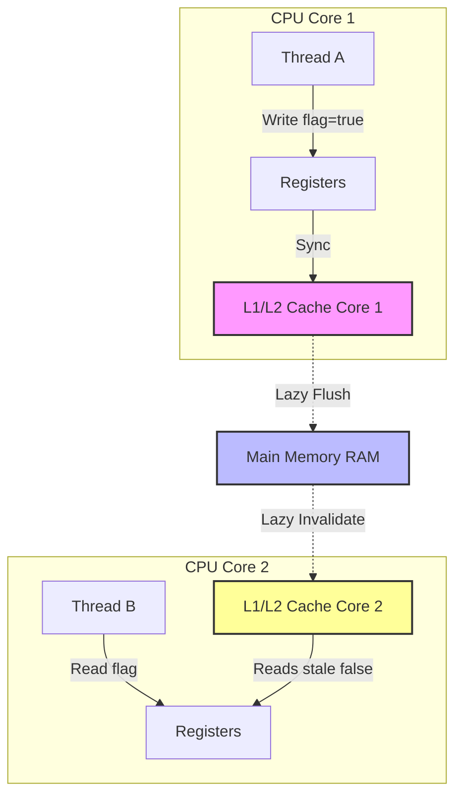

# Java Memory Model (JMM)

## Introduction
The Java Memory Model (JMM) is a critical specification within the Java Virtual Machine (JVM) specification. It defines the rules and guidelines governing how threads interact through memory, specifying when a write to a shared variable by one thread becomes visible to a read by another thread. It establishes a platform-independent memory behavior model.

---

## Problem Statement
Modern hardware uses multi-core processors. To bridge the speed gap between high-speed CPU registers and slow main RAM, each CPU core has private L1, L2, and L3 caches.
If Thread A on Core 1 updates `flag = true`, the change might only reside in Core 1's L1 cache. If Thread B on Core 2 reads `flag`, it pulls from Core 2's L1 cache (or main memory before it is updated), reading the stale value `false`. This leads to the **Visibility Problem**, where thread updates are not synchronized across caches, potentially locking threads in infinite loops.

---

## Why this exists
Different CPU architectures (e.g., x86 vs. ARM) enforce different memory models. x86 utilizes a strongly ordered memory model (total store order), whereas ARM enforces a weakly ordered memory model where instruction reordering and cache delays are frequent. 
The JMM exists to abstract these hardware variances. It provides standard language-level primitives (like `volatile` and `synchronized`) that generate architectural-specific memory barriers, ensuring Java's "Write Once, Run Anywhere" guarantee holds true for concurrent execution.

---

## Real-world analogy
Imagine a corporate office tracking sales:
- **Visibility Problem (Bad):** The Sales Director and Finance Director work in separate offices. They copy the sales target from a shared chalkboard onto their personal desktop sticky notes. The Sales Director changes the target on their sticky note. The Finance Director has no idea, continuing to execute calculations with outdated numbers.
- **Barrier Enforcement (Best):** The company implements a rule: Any update to the target must be written directly to the main chalkboard. Before reading the target, managers are forced to look at the main chalkboard instead of their sticky notes.

---

## Definition
The **Java Memory Model** is a set of rules defining the visibility of variables across threads. It is specified in terms of actions (reads, writes, lock acquisitions, thread starts) and their **"Happens-Before"** relationships, which define a partial ordering of execution steps.

---

## Key concepts
1. **Happens-Before Relationship**: A guarantee that action $A$ happens-before action $B$. If $A$ happens-before $B$, the memory changes made by $A$ are guaranteed to be visible to $B$. Examples include:
   - **Monitor Lock Rule:** An unlock on a monitor happens-before every subsequent lock on that same monitor.
   - **Volatile Variable Rule:** A write to a volatile field happens-before every subsequent read of that same field.
   - **Thread Start Rule:** Calling `Thread.start()` happens-before any action in the started thread.
   - **Thread Join Rule:** All actions in a thread happen-before any other thread successfully returns from a `join()` on that thread.
2. **Instruction Reordering**: To optimize execution, compilers (JIT) and CPU execution pipelines can rearrange instructions. The JMM guarantees that instructions will not be reordered across happens-before boundaries.
3. **Memory Barriers (Fences)**: Hardware instructions inserted by the JVM compiler (e.g., `LoadLoad`, `LoadStore`, `StoreStore`, `StoreLoad`) to prevent CPUs from reordering instructions or using cached values.

---

## Internal working / Mermaid diagram



---

## Python/Java implementation

### 1. Bad Implementation: Cache Visibility Loop
Here, a thread spins on a flag that does not use volatile, causing CPU cache caching and an infinite loop.

```java
public class BadVisibilitySimulation {
    private boolean keepRunning = true; // CRITICAL BUG: No visibility guarantee

    public void startWorker() {
        new Thread(() -> {
            long count = 0;
            // The JIT compiler may optimize this to: if (keepRunning) while(true) { count++; }
            while (keepRunning) {
                count++;
            }
            System.out.println("Worker stopped. Count: " + count);
        }).start();
    }

    public void stopWorker() {
        keepRunning = false; // Main thread writes, but worker may never see it
    }
}
```

### 2. Better Implementation: Synchronized Accessors
Using `synchronized` solves the visibility issue by forcing main memory flushes, but it introduces execution locking overhead.

```java
public class BetterVisibilitySimulation {
    private boolean keepRunning = true;

    // Synchronized reader and writer force monitor acquisition and RAM flush
    public synchronized boolean isKeepRunning() {
        return keepRunning;
    }

    public synchronized void stopWorker() {
        this.keepRunning = false;
    }

    public void startWorker() {
        new Thread(() -> {
            long count = 0;
            while (isKeepRunning()) {
                count++;
            }
            System.out.println("Worker stopped safely. Count: " + count);
        }).start();
    }
}
```

### 3. Best Implementation: Volatile Flag visibility
Using `volatile` ensures that reads and writes bypass local caches to access main memory directly without lock contention.

```java
public class BestVisibilitySimulation {
    // volatile guarantees visibility and prevents instruction reordering.
    // Every read fetches directly from main memory.
    private volatile boolean keepRunning = true;

    public void startWorker() {
        new Thread(() -> {
            long count = 0;
            // Evaluates fresh from RAM every time
            while (keepRunning) {
                count++;
            }
            System.out.println("Worker stopped instantly. Count: " + count);
        }).start();
    }

    public void stopWorker() {
        keepRunning = false; // Flushes to RAM immediately
    }
}
```

---

## Step-by-step explanation
1. **Cache Caching**: In the `Bad` simulation, the JVM JIT compiler optimizes the `while (keepRunning)` loop. Since `keepRunning` is never modified in the thread itself, it assumes it will never change, caching it in the core's L1 cache or registers.
2. **Volatile Write**: In the `Best` simulation, when the main thread executes `stopWorker()`, the JVM inserts a write memory barrier (`StoreStore` / `StoreLoad` fence). This flushes the value `false` directly to Main Memory.
3. **Volatile Read**: Simultaneously, the worker thread executing the loop encounters a read memory barrier (`LoadLoad` / `LoadStore` fence). This invalidates the L1 cache for `keepRunning` and forces a reload from Main Memory.
4. **Instruction Reordering Prevention**: The `volatile` flag prevents the JVM from optimizing the loop condition out of the loop block, preserving correct logical order.

---

## Multiple real-world examples
1. **Graceful Thread Shutdown:** Using a volatile `running` flag to safely terminate server socket loops.
2. **Double-Checked Locking (Singleton):** Creating lazy singletons using a volatile instance reference to prevent other threads from accessing a partially constructed object due to instruction reordering.
3. **Status Broadcasting:** Using volatile status fields (e.g., `volatile Status state = Status.INITIALIZING`) to communicate state changes to watcher threads.

---

## Pros
- **Consistent Execution:** Guarantees multithreading code behaves identically on x86, ARM, and other architectures.
- **Low Overhead Visibility:** `volatile` is significantly faster than using synchronization locks.
- **Optimized Execution:** Gives the JVM freedom to reorder instructions where safe to maximize execution performance.

---

## Cons
- **Limited Scope:** `volatile` only addresses visibility; it does not make compound operations (like `count++`) atomic.
- **System Memory Latency:** Frequent volatile reads and writes bypass fast L1 caches, increasing bus traffic to main memory.
- **Complexity:** Hard-to-trace bugs occur if Happens-Before guarantees are misunderstood.

---

## Interview questions

### Beginner
- **Q: What is the Java Memory Model (JMM)?**
  - **A:** The JMM is a specification that defines the rules and behaviors of how threads access and share memory in Java, clarifying memory visibility and instruction reordering rules across different hardware architectures.

### Intermediate
- **Q: What is instruction reordering and why does the JVM do it?**
  - **A:** Instruction reordering is an optimization performed by the JIT compiler and CPU pipelines to execute instructions out of order to maximize execution unit utilization, as long as it does not change the sequential outcome of a single thread.

### Senior
- **Q: How does `volatile` prevent instruction reordering in the Double-Checked Locking Singleton pattern?**
  - **A:** Building an object involves three steps: 1) Allocate memory, 2) Run the constructor (initialize values), and 3) Assign the reference to the variable. Without `volatile`, the compiler can reorder these to 1, 3, then 2. If Thread B calls `getInstance()` after Thread A executes step 3 but before step 2, it will receive a partially initialized, corrupted object. Marking the instance variable `volatile` inserts write-read memory barriers that prevent this reordering.

### Staff Engineer
- **Q: Explain the difference between TSO (Total Store Order) and Weak Memory Ordering models at the hardware level, and how the JVM maps JMM barriers to CPU instructions.**
  - **A:** 
    - **TSO (e.g., x86):** Enforces strong ordering where writes are ordered relative to other writes (no `StoreStore` reordering), but reads can bypass writes (`StoreLoad` reordering is allowed).
    - **Weak Memory Ordering (e.g., ARM, PowerPC):** Allows all types of reordering (`LoadLoad`, `LoadStore`, `StoreStore`, `StoreLoad`) to maximize CPU instruction-level parallelism.
    - **JVM Mapping:** To maintain Happens-Before guarantees, the JIT compiler maps Java primitives to native instructions:
      - On **x86**, a volatile write is typically followed by a `lock addl` or `mfence` instruction (acting as a `StoreLoad` fence), since x86 already prevents other reorderings.
      - On **ARM**, the JVM must emit explicit memory barrier instructions (like `DMB` - Data Memory Barrier) to enforce correctness, converting JMM constraints into CPU-level cache coherency protocols.

---

## Common mistakes
- **Assuming `volatile` guarantees thread-safe counters:** Performing `volatileCount++` leads to lost updates since it is not atomic.
- **Locking on volatile variables:** Lock-acquisition requires monitor tracking, which is independent of volatile cache visibility.
- **Neglecting reordering on non-volatile writes:** Thinking that a non-volatile write following a volatile write is safe from reordering without a happens-before link.

---

## Best practices
- **Use Volatile for Flags:** Limit `volatile` to state indicators (e.g., `boolean stopRequested`) that are read frequently but updated rarely.
- **Prefer Atomic Variables:** For numeric operations, use `AtomicInteger` or `AtomicLong` which handle CAS visibility and atomicity under the hood.
- **Leverage Immutable Objects:** Immutable objects (`final` fields) are implicitly thread-safe and do not require synchronization or memory barriers once constructed.

---

## When NOT to use
- **Complex Mutex Scenarios:** If multiple state variables must be updated together in an all-or-nothing transaction, `volatile` is insufficient. Intrinsic or explicit locks are required.
- **Single-Threaded Applications:** Adding memory barrier instructions in single-threaded systems adds execution overhead without providing any benefits.

---

## Comparison with similar concepts

| Concept | `volatile` | `synchronized` | `AtomicInteger` |
| :--- | :--- | :--- | :--- |
| **Visibility Guarantee** | Yes | Yes | Yes |
| **Atomicity Guarantee** | No | Yes | Yes (via CAS) |
| **Thread Blocking** | No | Yes | No |
| **Hardware cost** | Low memory barriers | High monitor locks | Medium CAS loops |

---

## Summary
The Java Memory Model defines the visibility and execution boundaries of concurrent Java code. Through Happens-Before rules and memory barriers, the JMM ensures CPU caches synchronize predictably, enabling developers to write high-performance concurrent code using `volatile` and atomic classes.

---

## Related topics
- [Concurrency & Synchronization](../concurrency-synchronization)
- [Executors & Thread Pools](../executors-thread-pools)
- [Multithreading](../multithreading)
