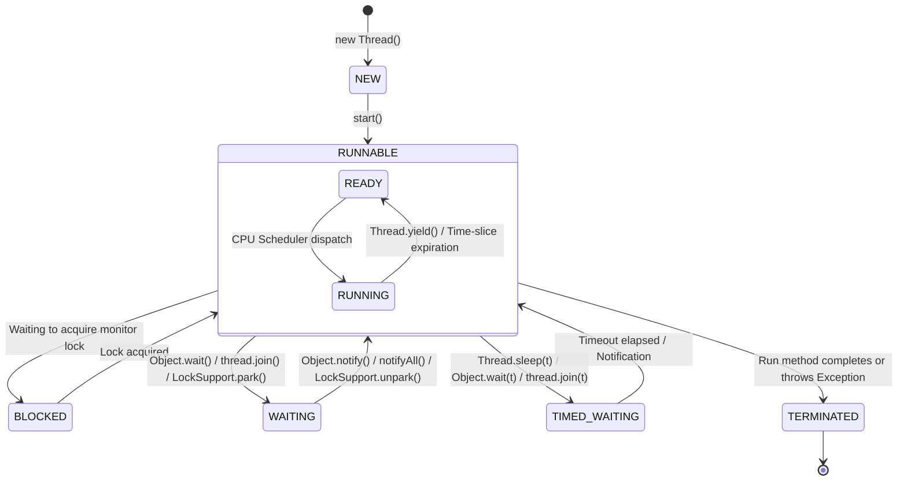

# Multithreading in Java

## Introduction
Multithreading is a core capability in Java that enables concurrent execution of two or more parts of a program. By allowing multiple threads to run concurrently within a single process, developers can maximize CPU utilization, prevent resource starvation, and build highly responsive systems.

---

## Problem Statement
Imagine a backend payment gateway server that processes transactions. In a single-threaded architecture, the server must handle each transaction step-by-step (e.g., verifying credentials, querying bank APIs, updating database records, sending email receipts) sequentially. If a third-party bank API takes 3 seconds to respond, the entire application blocks. No other transaction can be processed during this period, leaving CPU cores idle while users experience terrible lag or timeouts.

---

## Why this exists
To enable asynchronous execution and parallel processing. Multithreading allows a program to split work into independent units of execution. While one thread blocks on database or network I/O, other threads continue execution on available CPU cores. This dramatically increases application throughput, responsiveness, and resource utilization.

---

## Real-world analogy
Consider a restaurant kitchen:
- **Single-threaded:** A single chef prepares every dish sequentially. They put a steak on the grill and stand idle for 10 minutes waiting for it to cook, before moving on to chopping vegetables or plating another dish.
- **Multithreaded:** The same kitchen employs multiple chefs (threads) sharing the same kitchen resources (heap memory, ingredients). While Chef A waits for the steak to grill, Chef B chops vegetables, and Chef C plates finished orders. If one chef gets blocked, others keep the kitchen moving.

---

## Definition
- **Process:** An operating system container that has its own isolated memory space (virtual memory address space, file handles, security contexts).
- **Thread:** The smallest execution unit within a process. A thread shares the process's heap memory, global variables, and system resources with other threads, but maintains its own private call stack, program counter (PC), and local variables.

---

## Key concepts
1. **Thread Lifecycle**:
   - **NEW:** A thread instance created via `new Thread()` but not yet started.
   - **RUNNABLE:** A thread executing in the JVM, either active or waiting for OS CPU resource allocation.
   - **BLOCKED:** A thread waiting to acquire an object monitor lock to enter a synchronized block/method.
   - **WAITING:** A thread waiting indefinitely for another thread to perform a specific action (via `Object.wait()`, `Thread.join()`, or `LockSupport.park()`).
   - **TIMED_WAITING:** A thread waiting for a specified duration (via `Thread.sleep(ms)`, `Object.wait(ms)`, `Thread.join(ms)`).
   - **TERMINATED:** A thread that has completed its execution run.
2. **Context Switching**: The process by which the OS CPU scheduler saves the state (registers, stack pointers) of an active thread and loads the state of another thread. Context switching has a computational cost.
3. **User vs. Daemon Threads**:
   - **User Threads:** High-priority threads that perform application-level tasks. The JVM will not exit as long as there is at least one active User Thread.
   - **Daemon Threads:** Low-priority background helper threads (e.g., Garbage Collector). The JVM exits immediately once all User Threads terminate, regardless of daemon thread execution.

---

## Internal working / Mermaid diagram



---

## Python/Java implementation

Below is a comparison of raw, unmanaged multithreading, manual thread joining, and thread-safe task execution using execution duration profiling.

### 1. Bad Implementation: Raw Unmanaged Thread Spawning
Spawning unmanaged threads in a loop without bounding can quickly saturate system memory and crash the JVM.

```java
import java.util.UUID;

public class BadMultithreading {
    // CRITICAL BUG: Spawns a raw thread for every task without any bounding, 
    // potentially causing OutOfMemoryError (OOM) due to thread stack allocation.
    public void processOrders(int totalOrders) {
        for (int i = 0; i < totalOrders; i++) {
            final int orderId = i;
            Thread thread = new Thread(() -> {
                try {
                    // Simulate order processing
                    System.out.println("Processing order " + orderId + " on " + Thread.currentThread().getName());
                    Thread.sleep(1000);
                } catch (InterruptedException e) {
                    Thread.currentThread().interrupt();
                }
            });
            thread.start(); // Spawns raw OS thread immediately
        }
    }
}
```

### 2. Better Implementation: Manual Thread Joining & Coordination
Using `Runnable` tasks, maintaining thread references, and using `.join()` to coordinate lifecycle, but still incurring high thread-creation overhead.

```java
import java.util.ArrayList;
import java.util.List;

public class BetterMultithreading {
    public void processOrdersCoordinated(int totalOrders) {
        List<Thread> workers = new ArrayList<>();
        
        for (int i = 0; i < totalOrders; i++) {
            final int orderId = i;
            Thread worker = new Thread(() -> {
                try {
                    System.out.println("Coordinated processing: " + orderId + " on " + Thread.currentThread().getName());
                    Thread.sleep(200); 
                } catch (InterruptedException e) {
                    Thread.currentThread().interrupt();
                }
            }, "OrderWorker-" + i);
            workers.add(worker);
            worker.start();
        }

        // Coordinate termination manually
        for (Thread worker : workers) {
            try {
                worker.join(); // Wait for each thread to finish execution
            } catch (InterruptedException e) {
                Thread.currentThread().interrupt();
            }
        }
        System.out.println("All coordinated threads finished execution.");
    }
}
```

### 3. Best Implementation: Thread-Safe Task Execution with Profiling & Bounded Pool
Using `ExecutorService` to reuse thread resources, capturing execution metrics, and gracefully shutting down thread pools.

```java
import java.util.concurrent.ExecutorService;
import java.util.concurrent.Executors;
import java.util.concurrent.TimeUnit;
import java.util.concurrent.atomic.LongAdder;

public class BestMultithreading {
    private final ExecutorService executor;
    private final LongAdder processedCount = new LongAdder();

    public BestMultithreading(int poolSize) {
        // Limit the number of concurrent threads to prevent resource exhaustion
        this.executor = Executors.newFixedThreadPool(poolSize);
    }

    public void processOrdersSafely(int totalOrders) {
        long startTime = System.nanoTime();

        for (int i = 0; i < totalOrders; i++) {
            final int orderId = i;
            executor.submit(() -> {
                try {
                    // Simulate atomic updates and task work
                    Thread.sleep(50);
                    processedCount.increment();
                } catch (InterruptedException e) {
                    Thread.currentThread().interrupt();
                }
            });
        }

        // Initiate clean shutdown
        executor.shutdown();
        try {
            if (!executor.awaitTermination(10, TimeUnit.SECONDS)) {
                executor.shutdownNow(); // Force shutdown if tasks take too long
            }
        } catch (InterruptedException e) {
            executor.shutdownNow();
            Thread.currentThread().interrupt();
        }

        long endTime = System.nanoTime();
        double durationMs = (endTime - startTime) / 1_000_000.0;
        
        System.out.println("Successfully processed " + processedCount.sum() + " orders.");
        System.out.println("Total Execution Time: " + durationMs + " ms");
    }
}
```

---

## Step-by-step explanation
1. **Thread Instantiation**: In the `Best` implementation, rather than creating a `new Thread()`, tasks are submitted as `Runnable` instances to an `ExecutorService` thread pool.
2. **Task Queueing**: The thread pool maintains an internal blocking queue. If all threads are busy, incoming tasks wait in the queue.
3. **Execution Profiling**: The start time is recorded using high-resolution `System.nanoTime()` to measure performance.
4. **Atomic Counter Updates**: A lock-free `LongAdder` is used to track completion status safely across multiple concurrent execution paths without bottlenecking performance.
5. **Lifecycle Orchestration**: `executor.shutdown()` tells the pool to stop accepting new tasks. `awaitTermination()` blocks the calling thread (main) until all queued tasks complete or the timeout is hit.

---

## Multiple real-world examples
1. **Web Servers (Tomcat/Jetty):** Spawns worker threads to handle separate client HTTP requests concurrently so one client's slow DB query doesn't freeze the website for other users.
2. **Desktop & Mobile Apps (UI Threads):** Long-running network downloads or file imports are delegated to worker background threads to prevent UI freezes (avoiding Android's "Application Not Responding" (ANR) errors).
3. **Parallel Image Processing:** Splitting an image into multiple chunks, letting separate threads apply filters concurrently, and stitch the segments back together.
4. **Log Aggregation Agents:** Spawning background daemon threads that monitor system logs and stream updates to Elasticsearch or Prometheus without impacting application execution paths.

---

## Pros
- **High Throughput:** Improves overall system efficiency, particularly on multi-core processors.
- **Enhanced Responsiveness:** Asynchronous worker threads keep main UI/API controllers responsive.
- **Resource Efficiency:** Multi-threaded sharing of memory is much faster than multi-process OS IPC mechanisms.

---

## Cons
- **Debugging & Race Conditions:** Difficult-to-reproduce bugs, thread starvation, data races, and memory visibility issues.
- **High Overhead:** Thread context switching costs CPU cycles; heavy spawning consumes RAM (each thread typically allocates a ~1MB stack).
- **Deadlocks:** Risk of mutual lock dependency where threads wait forever for resources held by one another.

---

## Interview questions

### Beginner
- **Q: What is the difference between `start()` and `run()` in the `Thread` class?**
  - **A:** Calling `start()` registers the thread with the operating system scheduler and creates a new call stack before executing `run()`. Calling `run()` directly runs the task synchronously on the caller's current thread without spawning a new execution path.

### Intermediate
- **Q: Why is implementing `Runnable` generally preferred over extending `Thread`?**
  - **A:** Java does not support multiple class inheritance. By implementing `Runnable`, a class retains its ability to extend another base class (e.g., `BaseController`). Moreover, it separates the task description (`Runnable`) from the execution mechanism (`Thread`), adhering to the Single Responsibility Principle.

### Senior
- **Q: Explain Thread Starvation and Livelock.**
  - **A:** **Thread Starvation** occurs when a thread is perpetually denied CPU time or lock acquisition because other high-priority threads monopolize resources. **Livelock** is a condition where two or more threads continuously change their states in response to changes in other threads without doing any actual work (similar to two polite people repeatedly shifting to the same side of a narrow hallway to let the other pass).

### Staff Engineer
- **Q: How does the OS scheduling model map to Java Threads, and what are the performance implications of context switches?**
  - **A:** Modern Java Virtual Machines (JVMs) use a 1:1 mapping where each Java thread maps directly to a native kernel thread managed by the Operating System scheduler. A context switch requires saving the CPU registers, stack pointers, and program counters of the current thread, invalidating CPU caches (L1/L2), and loading the context of the incoming thread. For latency-sensitive systems, high thread counts lead to thrashing, where CPU spends more time switching context than executing business logic, requiring strategies like non-blocking I/O (Virtual Threads/Project Loom) or thread-affinity binding.

---

## Common mistakes
- **Creating new threads inside an API request lifecycle:** Can quickly exhaust memory limits during peak traffic.
- **Using unsafe data structures across threads:** Sharing raw collections like `HashMap` or `ArrayList` leads to silent data corruption or infinite loops during resizing.
- **Forgetting to handle `InterruptedException`:** Swallowing the exception without resetting the thread's interrupted flag (`Thread.currentThread().interrupt()`) prevents threads from responding to cancellation requests.

---

## Best practices
- **Always use Thread Pools:** Manage worker threads via `ExecutorService` rather than spawning raw `new Thread()`s.
- **Name your threads:** Use a custom `ThreadFactory` to assign meaningful names (e.g., `payment-processor-thread-0`) to ease debugging and profiling.
- **Leverage Virtual Threads (JDK 21+):** For I/O heavy tasks, utilize Virtual Threads to gain high concurrency without the overhead of heavy OS kernel threads.

---

## When NOT to use
- **CPU-bound tasks on single-core machines:** Context switching overhead will degrade performance compared to sequential execution.
- **Simple sequential pipelines:** If tasks are completely interdependent and must execute sequentially, multithreading adds complexity without any performance benefits.

---

## Comparison with similar concepts

| Metric | Thread | Process |
| :--- | :--- | :--- |
| **Memory** | Shares heap and resources with other threads in the same process | Isolated memory space; cannot access another process's memory directly |
| **Creation Cost** | Light-weight (microseconds) | Heavy-weight (milliseconds) |
| **Communication** | Fast communication via shared memory space (volatile/synchronization needed) | Inter-Process Communication (IPC) via sockets, pipes, or message queues |

---

## Summary
Multithreading is a powerful paradigm in Java for achieving high responsiveness and hardware utilization. By leveraging threads, applications can perform tasks concurrently. However, sharing memory requires careful management of locks, thread safety, and thread pools to avoid execution pitfalls like deadlocks and race conditions.

---

## Related topics
- [Concurrency & Synchronization](../concurrency-synchronization)
- [Executors & Thread Pools](../executors-thread-pools)
- [Memory Models](../memory-models)
