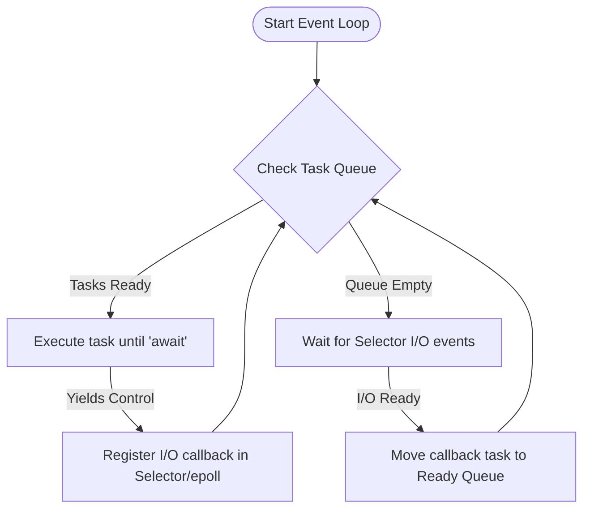

# Python Asyncio & Coroutines

## Introduction
Python's `asyncio` module provides a framework for writing single-threaded concurrent code using the `async` and `await` syntax. By utilizing an **Event Loop** and **Coroutines**, asyncio enables **Cooperative Multitasking**, allowing applications to handle thousands of concurrent network connections or I/O-bound tasks with minimal memory overhead compared to traditional thread-based concurrency.

---

## Problem Statement
Traditional multithreading scales poorly for massive I/O workloads (e.g. handling 10,000 concurrent websocket connections) because each thread allocates its own private call stack (typically 8MB in Java or 1MB in OS limits), consuming gigabytes of system RAM. Additionally, threads rely on preemptive OS scheduling, which adds high context-switch CPU overhead. We need a single-threaded concurrency model that yields control cooperatively and scales efficiently.

---

## Why this exists
To maximize I/O throughput with minimal resources. Asyncio runs a single event loop on a single thread. When a task waits for I/O (e.g. a database query response or network packet), it voluntarily yields control back to the event loop. The loop then runs other tasks in the meantime, bypassing the memory allocations and context-switch costs of OS threads.

---

## Real-world analogy
Think of a single waiter serving multiple tables in a restaurant:
- **Multithreading (Preemptive):** Hiring one waiter per table. If a table is studying the menu (waiting for I/O), the waiter stands there doing nothing, wasting salary (RAM).
- **Asyncio (Cooperative):** A single waiter serving 10 tables. The waiter takes Table 1's order and tells the kitchen. Instead of waiting for the food (blocking), the waiter immediately walks to Table 2 to take their order. When Table 1's food is ready (I/O completes), the kitchen rings a bell (Event Loop callback), and the waiter delivers the food. The waiter only moves when there is active work to do.

---

## Definition
- **Event Loop:** The core engine of asyncio. It runs in a continuous loop, monitoring I/O events (sockets, timers) and running registered tasks when their I/O completes.
- **Coroutine:** A special type of Python generator function declared with `async def`. It can pause its execution using the `await` keyword, returning control to the event loop.
- **Task:** A wrapper that schedules a coroutine on the event loop, running it concurrently as a background operation.

---

## Key concepts
1. **Cooperative Multitasking:** Unlike threads (where the OS preempts and pauses threads arbitrarily), asyncio tasks must **voluntarily** yield control back to the event loop using the `await` keyword on non-blocking operations.
2. **Blocking the Event Loop:** If a task executes a synchronous blocking operation (like `time.sleep()` or synchronous database queries) inside an async function, it freezes the entire thread, halting the event loop and blocking all other concurrent tasks.
3. **Asyncio Futures:** Low-level objects representing a result that has not yet been computed. Tasks inherit from Futures.
4. **Task Concurrency APIs:**
   - `asyncio.gather()`: Runs multiple coroutines concurrently and waits for all to complete, returning results in order.
   - `asyncio.as_completed()`: An iterator that yields tasks as they finish, allowing results to be processed immediately as they arrive.

---

## Internal working / Mermaid diagram

### Asynchronous Event Loop Lifecycle



---

## Python implementation

### 1. Bad Implementation: Blocking the Async Event Loop
Executing a synchronous blocking call (`time.sleep`) inside an async function. This blocks the single-threaded event loop, forcing all other tasks to run sequentially.

```python
import asyncio
import time

async def blocking_task(task_id):
    print(f"Task {task_id}: Start")
    # CRITICAL BUG: time.sleep() is synchronous and blocking.
    # It freezes the single thread, preventing the event loop from running other tasks.
    time.sleep(1) 
    print(f"Task {task_id}: End")

# Running these concurrently will take 3 seconds instead of 1 second.
async def bad_concurrent_run():
    start = time.perf_counter()
    # Executed sequentially due to loop block
    await asyncio.gather(
        blocking_task(1),
        blocking_task(2),
        blocking_task(3)
    )
    print(f"Bad Duration: {time.perf_counter() - start:.4f}s")
```

### 2. Better Implementation: Non-Blocking Cooperative Sleep
Using `await asyncio.sleep()` to yield control back to the event loop, allowing other tasks to run concurrently.

```python
import asyncio
import time

async def cooperative_task(task_id):
    print(f"Task {task_id}: Start")
    # Better: Yields control back to the event loop for 1 second
    await asyncio.sleep(1) 
    print(f"Task {task_id}: End")

# Running these concurrently will finish in exactly 1 second.
async def better_concurrent_run():
    start = time.perf_counter()
    await asyncio.gather(
        cooperative_task(1),
        cooperative_task(2),
        cooperative_task(3)
    )
    print(f"Better Duration: {time.perf_counter() - start:.4f}s")
```

### 3. Best Implementation: Concurrent Gathering with Exception Handling
An optimized implementation running multiple coroutines concurrently with timeout limits, error wrapping, and using `as_completed` to process results immediately as they finish.

```python
import asyncio
import time

async def fetch_url_data(task_id, delay, fail=False):
    print(f"Fetching Data for Task {task_id} (delay: {delay}s)...")
    await asyncio.sleep(delay) # Yield control
    
    if fail:
        raise ValueError(f"Task {task_id} failed connection")
        
    return f"Result {task_id}"

# TIME COMPLEXITY: O(N) tasks completed in Max(Delay) time
# SPACE COMPLEXITY: O(N) lightweight task context allocations (bytes per task)
async def best_async_pipeline():
    start = time.perf_counter()
    
    # 1. Gather tasks with exception suppression
    tasks = [
        fetch_url_data(1, 1),
        fetch_url_data(2, 2, fail=True),
        fetch_url_data(3, 1.5)
    ]
    
    print("Launching asyncio.gather...")
    # return_exceptions=True prevents one failed task from canceling the others
    results = await asyncio.gather(*tasks, return_exceptions=True)
    
    for i, res in enumerate(results, start=1):
        if isinstance(res, Exception):
            print(f"Task {i} error caught: {res}")
        else:
            print(f"Task {i} output: {res}")
            
    # 2. Process tasks immediately as they complete using as_completed
    print("\nLaunching asyncio.as_completed...")
    new_tasks = [fetch_url_data(i, delay) for i, delay in [(10, 2), (20, 0.5), (30, 1)]]
    
    for future in asyncio.as_completed(new_tasks):
        try:
            # wait for the next finished task
            result = await future 
            print(f"Received finished output: {result}")
        except Exception as e:
            print(f"Error handling task: {e}")
            
    print(f"\nPipeline Finished in {time.perf_counter() - start:.4f}s")

# To run the pipeline:
# asyncio.run(best_async_pipeline())
```

---

## Step-by-step explanation
1. **The Event Loop Freeze**: In `bad_concurrent_run`, when Thread 1 executes `time.sleep(1)`, it does not yield control. The CPU core sleeps, halting the event loop. No other task can run until the sleep timer completes, running tasks sequentially.
2. **Cooperative Yielding**: In `better_concurrent_run`, calling `await asyncio.sleep(1)` registers a timer callback on the event loop and yields control. The event loop immediately switches to Task 2, starts it, and registers its timer. All 3 tasks run their setups and sleep concurrently, completing in 1 second.
3. **Exception Resilience (Best)**: In `best_async_pipeline`, setting `return_exceptions=True` in `gather()` wraps raised exceptions (like `ValueError`) and returns them as result objects in the output list instead of raising them immediately, ensuring that other successful tasks complete.
4. **Immediate Processing**: `asyncio.as_completed()` returns an iterator of futures. Instead of waiting for the slowest task (which takes 2s), it yields results as they finish (e.g. Task 20 completes in 0.5s first), minimizing response latency.

---

## Multiple real-world examples
1. **Asynchronous Web Servers:** High-performance web frameworks like Sanic, FastAPI, or Tornado handling thousands of requests concurrently using async event loops.
2. **Websocket Servers:** Maintaining thousands of active, low-traffic websocket connections to stream real-time stock updates or chat messages.
3. **Microservice API Aggregation:** Querying 5 separate external APIs concurrently using an async HTTP client (`aiohttp`) to aggregate data, reducing page response times from the sum of delays to the maximum single delay.

---

## Pros
- **High Scalability:** Handles tens of thousands of concurrent connections on a single thread.
- **Low Memory Footprint:** Coroutines are lightweight objects (costing bytes of memory), unlike OS threads which require megabytes of stack allocations.
- **No Thread Synchronization:** Since all code runs on a single thread, race conditions on shared memory variables are eliminated, avoiding complex locks.

---

## Cons
- **Single-Thread GIL Limits:** Cannot parallelize CPU-bound tasks across multiple cores.
- **Entire Ecosystem Must Be Async:** If you use a single blocking database library (like standard `psycopg2` or `requests`), it blocks the event loop, neutralizing the benefits of async. You must use async equivalents (`aiopg`, `httpx`).
- **Debugging Complexity:** Stack traces in async code can be long and difficult to trace due to the event loop callback wrappers.

---

## Interview questions

### Beginner
- **Q: What is cooperative multitasking, and how does it differ from preemptive multitasking?**
  - **A:** 
    - **Preemptive Multitasking:** The operating system scheduler decides when to pause a running thread to give CPU time to another thread. Used in standard multithreading.
    - **Cooperative Multitasking:** The running task must **voluntarily** yield control back to the scheduler (event loop) using the `await` keyword. Used in asyncio. If a task fails to yield, no other task can progress.

### Intermediate
- **Q: What happens if you run a CPU-bound calculation inside an async function? How do you resolve it?**
  - **A:** Running a CPU-bound task inside an async function blocks the single-threaded event loop, preventing all other tasks from executing. To resolve this, you must run the CPU-bound task in a separate process pool using the event loop's executor:
    ```python
    loop = asyncio.get_running_loop()
    # Runs in a separate process pool, leaving the event loop unblocked
    result = await loop.run_in_executor(process_pool_executor, cpu_bound_func, arg)
    ```

### Senior
- **Q: Compare asyncio.gather() and asyncio.wait(). When should you use each?**
  - **A:** 
    - `asyncio.gather()` is a high-level API used to run multiple tasks concurrently and return their results in the exact order they were submitted. It supports wrapping exceptions as results (`return_exceptions=True`).
    - `asyncio.wait()` is a lower-level API that offers more granular control over task completion. It takes a list of tasks and returns two sets: `(done, pending)`. It accepts a `return_when` parameter (e.g. `FIRST_COMPLETED`, `FIRST_EXCEPTION`, `ALL_COMPLETED`), allowing you to handle tasks dynamically as they finish.

### Staff Engineer
- **Q: How does the underlying selector/epoll system call work in asyncio to monitor multiple sockets without busy-waiting?**
  - **A:** 
    - **Underlying Mechanism:** Asyncio uses OS-specific I/O multiplexing system calls like `epoll` (Linux), `kqueue` (macOS), or `IOCP` (Windows) via Python's `selectors` module.
    - **Process:** When a coroutine awaits network I/O, the event loop registers the socket file descriptor and the type of event (read/write) with the OS selector. It then moves the task to a suspended state and checks other ready tasks.
    - **Wakeup:** If no tasks are ready, the event loop blocks on the selector system call (`epoll_wait()`). The OS suspends the thread. When a network packet arrives, the hardware network card triggers an interrupt, and the OS wakes up the thread, returning the active file descriptors. The event loop then moves the corresponding callback tasks back to the ready queue, avoiding CPU-intensive polling loops.

---

## Common mistakes
- **Blocking the event loop:** Using synchronous calls like `requests.get()` or `time.sleep()` in async functions.
- **Forgetting the await keyword:** Calling a coroutine function without `await` (e.g., `fetch_data()`), which returns a coroutine object without executing it.
- **Leaking task exceptions:** Running background tasks without handling exceptions, causing silent failures.

---

## Best practices
- **Use async clients:** Always use asynchronous libraries (`httpx`, `aiofiles`, `asyncpg`) for I/O operations.
- **Wrap blocking calls in executors:** Run legacy blocking code in thread/process pools using `run_in_executor`.
- **Set timeouts:** Always wrap network requests in timeout limits using `asyncio.wait_for()` to prevent hung connections from consuming resources indefinitely.

---

## When NOT to use
- **CPU-bound Architectures:** For applications that perform heavy data processing or calculations with minimal network I/O, do not use `asyncio`. Use `multiprocessing` instead.

---

## Comparison of Concurrency Models

| Metric | Multithreading | Multiprocessing | Asyncio |
| :--- | :--- | :--- | :--- |
| **Thread Count** | Multiple | Multiple (Processes) | Single |
| **Max Concurrent Tasks**| Hundreds | Limited by CPU Cores | Tens of Thousands |
| **RAM Usage** | Medium (~1MB/thread) | High (~20MB/process) | Extremely Low (bytes/task) |
| **Race Conditions** | Yes | No (Isolated memory) | No (Single thread) |

---

## Summary
Python Asyncio enables high-performance cooperative multitasking on a single thread. By utilizing an event loop and yielding control on I/O waits using `async/await`, it scales to thousands of concurrent connections with minimal memory usage.

---

## Related topics
- [Threads & GIL](../threads-gil)
- [Multiprocessing](../multiprocessing)
- [Pools & Futures](../pools-futures)
