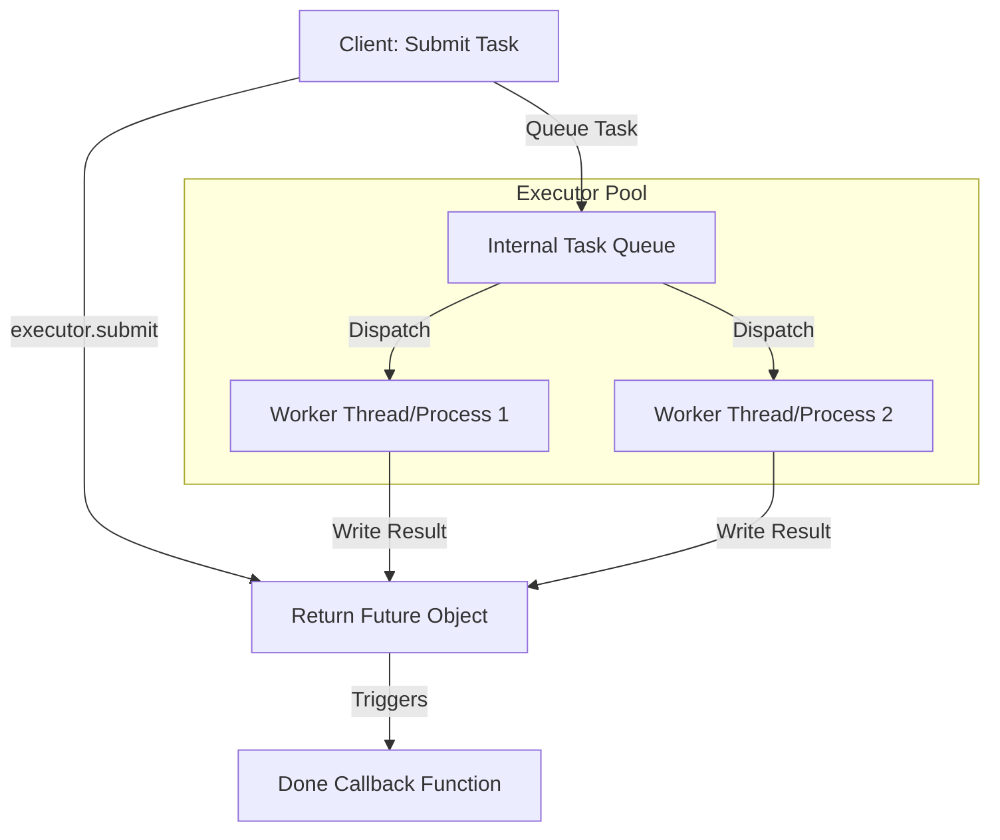

# Python Pools & Futures

## Introduction
The `concurrent.futures` module provides a high-level asynchronous execution API in Python. By abstracting the low-level complexities of raw thread and process management, it introduces **ThreadPoolExecutor** and **ProcessPoolExecutor** to manage resource reuse pools, alongside **Future** objects to track the execution states of asynchronous tasks.

---

## Problem Statement
Manually spawning and destroying threads or processes for every incoming task adds significant resource creation overhead, consuming system memory and CPU cycles. Additionally, managing task queues, coordinating thread joins, and handling exceptions across raw workers requires complex boilerplate code. We need unified, high-level abstractions that handle resource pooling and task scheduling automatically.

---

## Why this exists
To simplify concurrent task management and improve resource reuse:
- **Executors:** Maintain a warm pool of reusable worker threads or processes, avoiding the overhead of creating and destroying resources repeatedly.
- **Futures:** Act as placeholders for results that have not yet been computed, allowing threads to query status, register callback handlers, or block until completion.

---

## Real-world analogy
Think of a taxi company dispatcher:
- **Raw Threading:** Buying a new taxi and hiring a new driver every time a customer calls for a ride, and selling the taxi when the ride ends (high overhead).
- **ThreadPoolExecutor:** Maintaining a fleet of 5 taxis (the pool). When a customer calls, the dispatcher assigns the next available taxi. When the ride completes, the taxi returns to the garage, ready for the next customer.
- **Future:** The booking ticket number given to the customer. The customer can use the ticket number to check if the taxi is on its way (status query), tell the system to send an SMS when it arrives (callback), or wait at the curb until it pulls up (blocking wait).

---

## Definition
- **Executor:** An abstract class defining methods to execute calls asynchronously. `ThreadPoolExecutor` and `ProcessPoolExecutor` are the two concrete implementations.
- **Future:** An object representing the eventual result of an asynchronous operation. Also known as a Promise or Deferred object in other languages.
- **Task Queue:** An internal queue used by Executors to buffer tasks when all worker threads or processes are busy.

---

## Key concepts
1. **ThreadPoolExecutor vs ProcessPoolExecutor Selection:**
   - **ThreadPoolExecutor:** Reuses threads. Ideal for I/O-bound tasks (web scraping, database queries) where the GIL is released during wait states.
   - **ProcessPoolExecutor:** Reuses processes. Ideal for CPU-bound tasks (math, data processing) where tasks must run in parallel on separate cores.
2. **Executor Sizing Heuristics:**
   - **Thread Pool Capacity:** Typically $\text{CPU Cores} \times 5$ or more, since threads spend most time sleeping during I/O waits.
   - **Process Pool Capacity:** Typically equal to the number of physical CPU cores ($\text{os.cpu\_count()}$), preventing resource contention and thrashing.
3. **Future Callbacks:** Using `future.add_done_callback(fn)` allows you to register functions that run automatically when the future completes, avoiding the need to block the main thread.

---

## Internal working / Mermaid diagram

### Executor Task Pooling Architecture



---

## Python implementation

### 1. Bad Implementation: Spawning Raw Threads in Loops
Manually creating and joining raw threads for every task in a loop. This leads to high resource overhead, lacks task queue limits, and risks memory exhaustion.

```python
import threading
import time

def scrape_task(task_id):
    # Simulate network wait
    time.sleep(0.5)
    return f"Data {task_id}"

# CRITICAL BUG: Spawns 1,000 raw threads simultaneously.
# This exhausts system memory limits and risks OS thread allocation crashes.
def bad_raw_thread_loop():
    threads = []
    start = time.perf_counter()
    
    for i in range(1000):
        t = threading.Thread(target=scrape_task, args=(i,))
        threads.append(t)
        t.start()
        
    for t in threads:
        t.join()
        
    print(f"Bad Raw Duration: {time.perf_counter() - start:.4f}s")
```

### 2. Better Implementation: Basic Executor with Blocking Results
Using a `ThreadPoolExecutor` to manage thread reuse, but retrieving results in submission order using blocking `.result()` calls, which limits concurrency.

```python
from concurrent.futures import ThreadPoolExecutor
import time

def scrape_task(task_id):
    time.sleep(task_id * 0.1) # Variable delay
    return f"Data {task_id}"

# Better: Uses thread pool, but blocking loops limit processing speed.
def better_blocking_executor():
    start = time.perf_counter()
    futures = []
    
    # Pool size limited to 5 threads
    with ThreadPoolExecutor(max_workers=5) as executor:
        for i in range(5, 0, -1):
            # Submits tasks in reverse order of delays
            futures.append(executor.submit(scrape_task, i))
            
        # BUG: future.result() blocks the loop. We wait for Task 5 (0.5s)
        # before checking Task 1 (0.1s), even though Task 1 finished first.
        for f in futures:
            print(f"Result: {f.result()}") 
            
    print(f"Better Duration: {time.perf_counter() - start:.4f}s")
```

### 3. Best Implementation: Optimized Executor with Dynamic as_completed and Callbacks
An optimized implementation using `ThreadPoolExecutor` or `ProcessPoolExecutor` with `as_completed` to process tasks immediately as they finish, task submission using `.submit()`, and `add_done_callback()` to run post-processing tasks asynchronously.

```python
from concurrent.futures import ThreadPoolExecutor, ProcessPoolExecutor, as_completed
import time
import os

# CPU-bound calculation
def cpu_heavy_calc(number):
    return sum(i * i for i in range(number))

# Callback function executed automatically when future finishes
def process_callback(future):
    try:
        result = future.result()
        print(f"Callback Thread: Processed result = {result}")
    except Exception as e:
        print(f"Callback Thread: Task failed with error: {e}")

# TIME COMPLEXITY: O(N) tasks completed in Max(Burst) time across K cores
# SPACE COMPLEXITY: O(K) resource pool memory allocations
def best_executor_pipeline():
    start = time.perf_counter()
    
    # 1. CPU-Bound Tasks: ProcessPoolExecutor sized to physical cores
    cores = os.cpu_count() or 2
    tasks = [5_000_000] * 4
    
    print(f"Launching ProcessPoolExecutor (Workers: {cores})...")
    with ProcessPoolExecutor(max_workers=cores) as executor:
        futures = {executor.submit(cpu_heavy_calc, num): num for num in tasks}
        
        # as_completed yields futures immediately as they finish, avoiding blocking waits
        for future in as_completed(futures):
            task_input = futures[future]
            try:
                result = future.result()
                print(f"Calculation for {task_input} completed: {result}")
            except Exception as e:
                print(f"Calculation for {task_input} failed: {e}")
                
    # 2. I/O-Bound Tasks: ThreadPoolExecutor with Async Callbacks
    print("\nLaunching ThreadPoolExecutor with done callbacks...")
    with ThreadPoolExecutor(max_workers=3) as executor:
        for i in range(3):
            # Simulate I/O burst
            future = executor.submit(time.sleep, 0.2)
            # Register callback to run asynchronously on task completion
            future.add_done_callback(process_callback)
            
    print(f"\nPipeline Finished in {time.perf_counter() - start:.4f}s")
```

---

## Step-by-step explanation
1. **The Raw Thread Threat**: In `bad_raw_thread_loop`, spawning 1,000 raw threads forces the OS to allocate thread stacks (usually 1MB per thread), consuming 1GB of RAM instantly and causing high context-switching CPU overhead.
2. **Blocking Future Loops**: In `better_blocking_executor`, because we loop through `futures` in their submission order, `futures[0].result()` blocks the loop. If the first task takes 0.5s and the second takes 0.1s, the second task's result is held up, increasing latency.
3. **Dynamic Yielding (Best)**: In `best_executor_pipeline`, `as_completed(futures)` acts as a completion queue. It yields futures immediately as they finish, ensuring that fast tasks are processed without waiting for slow ones.
4. **Asynchronous Callbacks**: Using `future.add_done_callback(process_callback)` registers a callback handler. When the worker thread finishes the task, it executes the callback function immediately on that thread, bypassing the need for the main thread to poll or block.

---

## Multiple real-world examples
1. **Concurrent Web Crawlers:** Reusing thread pools to scrape web pages concurrently, parsing results in callbacks.
2. **Image Thumbnail Converters:** Distributing image resizing tasks across a process pool to leverage multi-core CPUs.
3. **Database Connection Pools:** Reusing database connections to execute queries, preventing the overhead of creating connections repeatedly.

---

## Pros
- **Resource Reuse:** Pools prevent the overhead of constant process/thread creation and destruction.
- **API Simplification:** A unified interface makes it easy to switch between threads and processes by changing the class name.
- **Asynchronous Tracking:** Future objects simplify status checks and exception handling across workers.

---

## Cons
- **GIL Constraints on ThreadPool:** CPU-bound tasks in `ThreadPoolExecutor` are restricted to a single core by the GIL.
- **Process Memory Footprint:** `ProcessPoolExecutor` spawns separate Python interpreters, consuming high memory.
- **Serialization Costs:** Passing tasks and results to `ProcessPoolExecutor` requires pickling data, adding CPU overhead.

---

## Interview questions

### Beginner
- **Q: What is a ThreadPoolExecutor, and why is it preferred over spawning raw threads?**
  - **A:** A `ThreadPoolExecutor` maintains a warm pool of reusable worker threads. Instead of spawning and destroying threads for every task (which has high resource creation overhead), it places tasks in a queue and assigns them to available threads. This limits memory usage and prevents system crashes from spawning too many threads.

### Intermediate
- **Q: How does a Future object work? Name 3 methods on it.**
  - **A:** A Future represents the eventual result of an asynchronous operation. It acts as a placeholder while the task runs. Key methods:
    1. `done()`: Returns `True` if the task has completed or been canceled.
    2. `result(timeout=None)`: Blocks the caller until the result is ready. If the task raised an exception, calling `result()` raises that exception.
    3. `add_done_callback(fn)`: Registers a callback function that runs automatically when the task finishes.

### Senior
- **Q: How do you size the max_workers parameter for ThreadPoolExecutor vs ProcessPoolExecutor?**
  - **A:** 
    - **ProcessPoolExecutor (CPU-bound):** Sized strictly to the number of physical CPU cores (`os.cpu_count()`). Sizing it larger causes CPU core contention and context-switching overhead, degrading performance.
    - **ThreadPoolExecutor (I/O-bound):** Sized larger than the CPU count (typically `os.cpu_count() * 5` or up to 32). Since threads spend most time sleeping during I/O waits, having more threads allows other tasks to run while waiting.

### Staff Engineer
- **Q: What happens to exceptions raised inside tasks running in a ThreadPoolExecutor? How do you ensure they do not fail silently?**
  - **A:** Exceptions raised inside worker tasks are caught by the executor and stored inside the corresponding Future object. They do **not** print to stderr or crash the parent process immediately.
    - **Ensuring Visibility:**
      1. **Explicit Check:** Call `future.result()` or `future.exception()`. If an exception occurred, it is raised or returned.
      2. **As Completed Loop:** Wrap result lookups in try-except blocks:
         ```python
         for future in as_completed(futures):
             try:
                 res = future.result()
             except Exception as e:
                 logger.error(f"Task failed: {e}")
         ```
      3. **Done Callbacks:** Always check `future.exception()` inside registered done callbacks to catch and log failures.

---

## Common mistakes
- **Sizing process pools too large:** Setting `max_workers=100` on a 4-core machine in `ProcessPoolExecutor`.
- **Forgetting to handle future exceptions:** Leaving exceptions un-checked, causing silent failures.
- **Blocking inside executor threads:** Running heavy CPU-bound tasks in a `ThreadPoolExecutor` without releasing the GIL.

---

## Best practices
- **Use context managers:** Always wrap executors in `with` statements to ensure they shut down and join workers automatically.
- **Catch exceptions in callbacks:** Always check `future.exception()` inside done callbacks.
- **Reuse executors:** Instantiate a single executor at the application level rather than creating new executors inside loops or functions.

---

## When NOT to use Executors
- **Simple Asynchronous Network Requests:** If you are building high-concurrency network tasks (e.g. 5,000 concurrent HTTP requests), do not use thread pools. The thread count overhead is too high. Use `asyncio` with an async HTTP client (`httpx` or `aiohttp`) instead.

---

## Comparison of Executors

| Metric | ThreadPoolExecutor | ProcessPoolExecutor |
| :--- | :--- | :--- |
| **Worker Unit** | Native OS Thread | OS Process |
| **Memory Isolation** | Shared memory | Isolated address space |
| **GIL Bound** | Yes | No (Bypasses GIL) |
| **Best For** | I/O-bound tasks (network, disk) | CPU-bound tasks (math, data parsing) |
| **IPC Overhead** | None | High (Pickle serialization) |

---

## Summary
The `concurrent.futures` module simplifies concurrent execution using thread and process pools. By utilizing Executors to manage resource reuse and Futures to track asynchronous results, developers can write clean, scalable concurrent Python code.

---

## Related topics
- [Threads & GIL](../threads-gil)
- [Multiprocessing](../multiprocessing)
- [Asyncio & Coroutines](../asyncio-coroutines)
