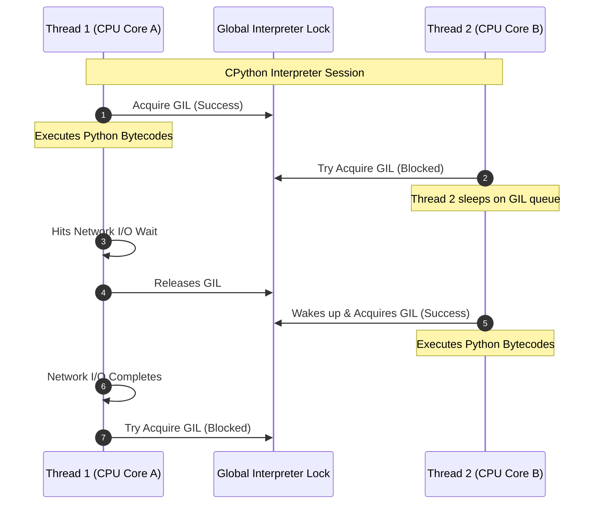

# Python Threads & The GIL

## Introduction
Python supports multithreading using the standard `threading` library, which maps Python threads directly to native operating system threads. However, the standard CPython implementation utilizes a mechanism called the **Global Interpreter Lock (GIL)** to manage interpreter state. The GIL restricts Python bytecode execution to a single thread at a time, creating distinct performance behaviors for CPU-bound versus I/O-bound workloads.

---

## Problem Statement
When developing concurrent systems, we want to maximize processor core utilization. If we attempt to use Python threads to run multiple heavy mathematical or computational tasks in parallel, we discover that the execution runs slower than a simple sequential loop. This is caused by threads fighting for the Global Interpreter Lock, adding context-switch overhead without gaining parallel hardware speedups. We need to understand how the GIL operates and how to synchronize shared state safely when threading is appropriate.

---

## Why this exists
To simplify CPython memory management and integrate C extensions. CPython uses reference counting for garbage collection. Without a global lock, concurrent modifications to reference counters would cause race conditions and memory leaks. The GIL solves this simply, ensuring that interpreter internals (like dictionary lookups and object memory allocations) are thread-safe by default, and allowing legacy C libraries to be easily wrapped in Python.

---

## Real-world analogy
Think of a single whiteboard in a classroom:
- **CPU Cores:** Students in the classroom.
- **Python Threads:** Students wanting to write their own calculations on the whiteboard.
- **The GIL:** A single marker (the lock). Even if there are 8 students (8 CPU cores) wanting to write, only the student holding the marker (holding the lock) can write on the whiteboard at any moment.
- **I/O-Bound Task:** If a student needs to look up a formula in a book (waiting for network/disk I/O), they pass the marker to another student (releasing the GIL) while they read, maximizing board utilization.

---

## Definition
- **Global Interpreter Lock (GIL):** A mutual exclusion lock used by the CPython interpreter to prevent multiple native threads from executing Python bytecodes at once.
- **CPython:** The default, reference implementation of Python written in C, which contains the GIL. Alternative implementations like Jython (Java-based) or IronPython (.NET-based) do not have a GIL.
- **Thread-safe Queue (`queue.Queue`):** A multi-producer, multi-consumer queue implementation that uses internal locks to allow threads to exchange data safely.

---

## Key concepts
1. **CPU-bound vs I/O-bound Workloads:**
   - **CPU-bound:** Tasks that spend most time executing instructions (e.g. image processing, machine learning, calculations). Threads are blocked by the GIL.
   - **I/O-bound:** Tasks that spend most time waiting for external resources (e.g. network requests, database queries, file reads). The CPython interpreter releases the GIL during these waits, making threading highly effective.
2. **GIL Release Mechanisms:** CPython releases the GIL:
   - When a thread waits for network socket reads/writes or file I/O.
   - When executing C extensions that explicitly release the lock (like NumPy matrix math or cryptography operations).
3. **Synchronization Primitives:**
   - `threading.Lock`: Simple mutual exclusion lock (Mutex).
   - `threading.RLock`: Reentrant lock. Allows the same thread to acquire the lock multiple times without deadlocking itself.
   - `threading.Condition`: Condition variable allowing threads to wait for state changes.

---

## Internal working / Mermaid diagram

### GIL Alternation under Thread Contention



---

## Python implementation

### 1. Bad Implementation: CPU-Bound Execution Using Threads
Attempting to run CPU-intensive mathematical tasks in parallel using the `threading` module. The GIL forces threads to run sequentially, running slower than a single-threaded loop due to context-switch overhead.

```python
import threading
import time

def cpu_bound_task(count):
    # Pure CPU calculation
    total = 0
    for i in range(count):
        total += i * i
    return total

# CRITICAL BUG: The GIL prevents parallel execution on multi-core CPUs.
# These threads run sequentially, adding thread scheduling overhead.
def bad_cpu_threading(limit):
    t1 = threading.Thread(target=cpu_bound_task, args=(limit,))
    t2 = threading.Thread(target=cpu_bound_task, args=(limit,))
    
    start = time.perf_counter()
    t1.start(); t2.start()
    t1.join(); t2.join()
    print(f"Bad Threading Duration: {time.perf_counter() - start:.4f}s")
```

### 2. Better Implementation: Explicit Locks for Shared State
Using standard threading to increment a shared counter, protecting the critical section with a mutex (`threading.Lock`) to prevent race conditions.

```python
import threading

# Protecting critical sections using threading.Lock.
# TIME COMPLEXITY: O(1) lock overhead
# SPACE COMPLEXITY: O(1)
class BetterThreadSafeCounter:
    def __init__(self):
        self.value = 0
        self.lock = threading.Lock()

    def increment(self):
        # Acquire lock, ensuring mutual exclusion
        with self.lock:
            self.value += 1
```

### 3. Best Implementation: Thread-Safe Producer-Consumer Queue
An optimized implementation of a Producer-Consumer pipeline using `queue.Queue`. It abstracts lock management, leverages condition variables, and prevents race conditions cleanly.

```python
import threading
import queue
import time

# Thread-safe pipeline using queue.Queue.
# TIME COMPLEXITY: O(1) enqueue and dequeue operations (no manual locks needed)
# SPACE COMPLEXITY: O(K) where K is the queue capacity
class TaskPipeline:
    def __init__(self, capacity=5):
        # queue.Queue handles thread synchronization internally
        self.task_queue = queue.Queue(maxsize=capacity)
        self.lock = threading.Lock()

    def producer(self, task_id):
        print(f"Producer: Creating Task {task_id}")
        # Blocks automatically if the queue is full (maxsize reached)
        self.task_queue.put(task_id) 

    def consumer(self):
        # Blocks automatically if the queue is empty
        task_id = self.task_queue.get()
        try:
            print(f"Consumer: Processing Task {task_id}")
            time.sleep(0.1) # Simulate I/O work (releases GIL)
        finally:
            # Signal the queue that the item is processed
            self.task_queue.task_done()

# Setup pipeline
pipeline = TaskPipeline()
```

---

## Step-by-step explanation
1. **The GIL Bottleneck**: In `bad_cpu_threading`, CPython's GIL restricts execution to a single thread. The OS scheduler continuously pauses Thread 1 and resumes Thread 2. This context switching uses CPU cycles without achieving parallel execution.
2. **Race Conditions on += 1**: In Python, the operation `self.value += 1` is not atomic. It compiles into multiple bytecodes (load, increment, store). Without `self.lock` in `BetterThreadSafeCounter`, threads can overwrite each other's updates.
3. **Queue Synchronization (Best)**: In `TaskPipeline`, we use `queue.Queue`:
   - If a producer calls `put()` on a full queue, it is blocked using an internal condition variable (`not_full.wait()`), releasing the GIL.
   - If a consumer calls `get()` on an empty queue, it is blocked using `not_empty.wait()`.
   This avoids CPU-intensive polling loops (busy-waiting) and handles thread safety automatically.

---

## Multiple real-world examples
1. **Web Scrapers:** Fetching hundreds of web pages concurrently using threads. The GIL is released during network socket waits, allowing requests to run in parallel.
2. **GUI Desktop Applications (Tkinter/PyQt):** Running long database queries on a background worker thread to keep the main UI thread responsive.
3. **Log Aggregators:** Reading logs from multiple files in separate threads, writing them to a centralized queue.

---

## Pros
- **Lightweight Concurrency:** Threads share memory, avoiding the high memory overhead of spawning processes.
- **I/O Efficiency:** Highly effective for optimizing network, disk, and database waiting times.
- **Easy Data Sharing:** Direct memory sharing simplifies data transfer between threads.

---

## Cons
- **CPython GIL Limits:** CPU-bound tasks cannot run in parallel on multi-core systems.
- **Race Condition Risks:** Unprotected shared mutable memory can lead to data corruption.
- **Deadlock Risks:** Incorrect nested locking configurations can freeze applications permanently.

---

## Interview questions

### Beginner
- **Q: What is Python's GIL, and why does it exist?**
  - **A:** The Global Interpreter Lock (GIL) is a mutex used by CPython to ensure only one thread executes Python bytecodes at a time. It exists to simplify memory management (specifically reference counting) and make C extensions easy to write and integrate.

### Intermediate
- **Q: Why does multithreading work well for I/O-bound tasks in Python despite the GIL?**
  - **A:** During I/O operations (like reading files, querying databases, or making HTTP requests), the CPython interpreter releases the GIL. This allows other threads to run and execute bytecode while the blocked thread waits for network or disk responses, achieving concurrency.

### Senior
- **Q: What is the difference between threading.Lock and threading.RLock? When should you use RLock?**
  - **A:** 
    - `threading.Lock` is a simple mutex. If a thread attempts to acquire the lock it already holds, it will block itself, causing a deadlock.
    - `threading.RLock` is a reentrant lock. It tracks ownership and recursion level. The thread holding the lock can acquire it again without blocking. RLock must be released the same number of times it was acquired.
    - **Usage:** RLock is used in recursive functions or when multiple methods inside the same class call each other and acquire the same lock.

### Staff Engineer
- **Q: If Python has a GIL, why do we still need Thread Locks (threading.Lock) to prevent race conditions on shared variables?**
  - **A:** The GIL guarantees that *interpreter internals* (like reference counting and dictionary lookups) are thread-safe. It does **not** make user code operations atomic.
    - **Example:** The Python statement `counter += 1` is compiled into multiple bytecodes: `LOAD_FAST`, `LOAD_CONST`, `INPLACE_ADD`, `STORE_FAST`.
    - **GIL Preemption:** The interpreter can context-switch threads between any of these bytecodes. If Thread 1 loads the counter value and is preempted before saving, Thread 2 will read the original value. When Thread 1 resumes, it will write its incremented value, overwriting Thread 2's update. Locks are still required to make these multi-bytecode operations atomic.

---

## Common mistakes
- **Using threads for math/computations:** Expecting multithreading to speed up CPU-heavy Python tasks.
- **Omitting finally blocks for unlock:** Acquiring locks without using context managers (`with`) or `try-finally` blocks, risking permanent deadlocks if exceptions occur.
- **Infinite loops in threads:** Creating non-daemon threads that loop infinitely, preventing the main process from exiting.

---

## Best practices
- **Use with locks:** Always acquire locks using the `with` statement: `with lock:`.
- **Use queue.Queue:** Prefer built-in synchronized queues over manual lock implementations for producer-consumer workflows.
- **Match task to concurrency model:** Use threads for network and database wait states; use processes for CPU-bound computations.

---

## When NOT to use
- **CPU-bound Calculations:** For tasks like data analysis, matrix math, or image rendering, do not use the `threading` module. Use the `multiprocessing` module or libraries like NumPy (which bypasses the GIL) instead.

---

## Comparison of Threading Primitives

| Primitive | Lock | RLock | Semaphore | Condition |
| :--- | :--- | :--- | :--- | :--- |
| **Reentrant** | No | Yes | No | No |
| **Ownership** | No | Yes | No | Yes |
| **Concept** | Mutex (0 or 1) | Recursive Mutex | Token pool ($K$) | State signaler |
| **Wait API** | `acquire()` | `acquire()` | `acquire()` | `wait()` / `notify()` |

---

## Summary
Python threads run on native OS threads but are restricted by CPython's Global Interpreter Lock (GIL). Multithreading is highly effective for I/O-bound tasks but ineffective for CPU-bound tasks. Locks and synchronized queues are still required to protect shared mutable state.

---

## Related topics
- [Multiprocessing](../multiprocessing)
- [Asyncio & Coroutines](../asyncio-coroutines)
- [Pools & Futures](../pools-futures)
