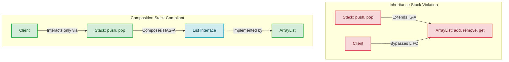

# Composition vs Inheritance

## Introduction
The principle "Favor Composition over Inheritance" is a foundational guideline in object-oriented design. First popularized by the *Gang of Four* in their book *Design Patterns*, it advises developers to build reusable, flexible systems by composing objects rather than establishing rigid compile-time class hierarchies.

## Problem Statement
Inheritance (the "IS-A" relationship) is often the first tool developers use to share code. For example, to build a `Stack` class, a developer might make it inherit from `ArrayList` to reuse its storage and list manipulation methods. However, this inheritance leaks the parent class's interface. Clients can call `stack.add(0, item)` or `stack.remove(5)`, bypassing the stack's Last-In-First-Out (LIFO) invariants and corrupting its state.

## Why this exists
To prevent brittle, tightly coupled code structures. Deep inheritance hierarchies suffer from the **Fragile Base Class** problem: changing a parent class can unexpectedly break subclass behaviors. Composition solves this by assembling small, interchangeable components at runtime, creating decoupled systems.

## Real-world analogy
Consider a **desktop computer**.
A computer does not *inherit* from a Graphics Card, a CPU, or a Hard Drive (an inheritance "IS-A" relationship). Instead, a computer **HAS-A** Graphics Card, **HAS-A** CPU, and **HAS-A** Hard Drive (composition). If you want to upgrade your graphics, you swap out the graphics card component. You do not have to redesign the entire computer architecture.

Another analogy is a **luggage set**. You do not build a "SuitcaseWithWheelsAndLock" class by inheriting from a base "Box" class. Instead, you compose a suitcase by attaching wheels and a combination lock component to it.

## Definition
- **Inheritance (Whitebox Reuse):** Code reuse achieved by subclassing a parent class. The subclass is exposed to the parent's internal representation, coupling them together.
- **Composition (Blackbox Reuse):** Code reuse achieved by assembling objects inside other objects. The containing class holds private references to the component classes, interacting solely through their public interfaces.

## Key concepts
- **IS-A vs. HAS-A:**
  - **IS-A (Inheritance):** A structural relationship where a child class specializes a parent class.
  - **HAS-A (Composition):** A behavioral relationship where a class contains one or more components to execute tasks.
- **Fragile Base Class:** A design issue where modifications to a base class introduce bugs in derived classes.
- **Gorilla-Banana Problem:** Coined by Joe Armstrong, illustrating that inheriting a small behavior can pull in unnecessary parent context: *"You wanted a banana but what you got was a gorilla holding the banana and the entire jungle."*

## Internal working / Mermaid diagram



## Python/Java implementation

### Bad implementation
*A `Stack` class that inherits from `ArrayList` to reuse its storage methods. This exposes index-based updates to clients, violating encapsulation and LIFO invariants.*

```java
package bad;

import java.util.ArrayList;

// Violates encapsulation and LSP: Stack is exposed as a list
public class Stack<T> extends ArrayList<T> {
    public void push(T item) {
        add(item); // Inherited from ArrayList
    }

    public T pop() {
        if (isEmpty()) {
            throw new IllegalStateException("Stack is empty");
        }
        return remove(size() - 1); // Inherited from ArrayList
    }

    public static void main(String[] args) {
        Stack<String> names = new Stack<>();
        names.push("Alice");
        names.push("Bob");

        // Client can call arbitrary ArrayList methods, breaking LIFO invariants!
        names.add(0, "Eve"); // Inserted at the bottom of the stack
        names.remove(1); // Removed from the middle
    }
}
```

### Better implementation
*Subclassing but overriding list mutators to throw exceptions. While this protects the stack's state, it pollutes the class with stub methods and breaks the Liskov Substitution Principle.*

```java
package better;

import java.util.ArrayList;

public class Stack<T> extends ArrayList<T> {
    public void push(T item) {
        super.add(item);
    }

    public T pop() {
        return super.remove(super.size() - 1);
    }

    // Overriding parent methods to prevent misuse. Breaks LSP!
    @Override
    public void add(int index, T element) {
        throw new UnsupportedOperationException("Index-based insertions not allowed in a Stack");
    }

    @Override
    public T remove(int index) {
        throw new UnsupportedOperationException("Index-based removals not allowed in a Stack");
    }
}
```

### Best implementation
*A fully composed `Stack`. The class holds a private reference to a `List` interface and exposes only the required stack operations, preserving encapsulation.*

```java
package best;

import java.util.ArrayList;
import java.util.List;
import java.util.Objects;

// Composition: Stack HAS-A List, exposing only Stack behaviors
public class Stack<T> {
    private final List<T> storage; // Private, encapsulated component

    // Program to the interface (List) and inject the implementation
    public Stack() {
        this.storage = new ArrayList<>();
    }

    public Stack(List<T> storage) {
        this.storage = Objects.requireNonNull(storage, "Storage cannot be null");
    }

    public void push(T item) {
        storage.add(item); // Delegated to the list component
    }

    public T pop() {
        if (isEmpty()) {
            throw new IllegalStateException("Stack is empty");
        }
        return storage.remove(storage.size() - 1);
    }

    public T peek() {
        if (isEmpty()) {
            throw new IllegalStateException("Stack is empty");
        }
        return storage.get(storage.size() - 1);
    }

    public boolean isEmpty() {
        return storage.isEmpty();
    }

    public int size() {
        return storage.size();
    }
}
```

## Step-by-step explanation
1. **Identify the Relationship:** We evaluate `Stack` and realize it is a storage structure, but it is not logically a list ("HAS-A" list, not "IS-A" list).
2. **Declare Private Component:** We replace `extends ArrayList<T>` with a private instance field `private final List<T> storage`.
3. **Delegate Operations:** The `push` and `pop` methods delegate storage operations to the private `List` instance.
4. **Encapsulate Interface:** The stack exposes only LIFO methods (`push`, `pop`, `peek`, `isEmpty`), preventing clients from accessing the list's index mutators.

## Multiple real-world examples
- **Java Input/Output Streams:** The Java I/O library uses composition (via the Decorator pattern). `new BufferedReader(new FileReader("file.txt"))` wraps a file reader to add buffering, rather than using inheritance.
- **Game Engine Components:** Engines like Unity use Entity-Component-System (ECS) models. Game entities are composed by attaching components (e.g., `Transform`, `RigidBody`, `MeshRenderer`) instead of inheriting from a base `GameObject` class.
- **UI Frameworks (React/Flutter):** Modern frontend libraries compose interfaces by nesting simple widget elements (e.g., placing `Icon` and `Text` widgets inside a `Button` component) rather than extending parent class components.

## Pros
- **Enforced Encapsulation:** Components are kept private, preventing clients from accessing or modifying internal state.
- **Dynamic Flexibility:** Components can be swapped dynamically at runtime (e.g., changing a character's weapon component from `Sword` to `Bow`).
- **Simplified Testing:** Individual components can be isolated and mocked in unit tests.

## Cons
- **Increased Boilerplate:** Requires writing delegating methods and constructor injection code.

## Interview questions

### Beginner
- **Q: What is the difference between an "IS-A" and a "HAS-A" relationship?**
- **A:** "IS-A" represents Inheritance, where a subclass specializes a parent class (e.g., a `Dog` IS-A `Animal`). "HAS-A" represents Composition, where a class contains a reference to another object (e.g., a `Car` HAS-A `Engine`).

### Intermediate
- **Q: Why does the Java standard library `java.util.Stack` class violate this design principle?**
- **A:** The standard `java.util.Stack` class extends `java.util.Vector`, exposing list mutators like `insertElementAt()` and `removeElement()`. This violates encapsulation by allowing clients to bypass the stack's LIFO constraints.

### Senior
- **Q: What is the "Fragile Base Class" problem, and how does composition solve it?**
- **A:** The Fragile Base Class problem occurs when modifications to a superclass break subclass behaviors because subclasses depend on the parent's internal state. Composition solves this by keeping component objects private and interacting only through their public interfaces, isolating the containing class from internal changes in the components.

### Staff Engineer
- **Q: How does the JVM optimize delegated method calls in composition (inlining), and does this close the performance gap with inheritance?**
- **A:**
  - **The Optimization:** The JVM's Just-In-Time (JIT) compiler uses **method inlining** to optimize delegated calls. When a method delegates to a component (e.g., `storage.add(item)`), the JIT compiler replaces the method call with the direct bytecodes of the target method, eliminating invocation overhead.
  - **Inlining Limits:** The JIT compiler can inline methods easily for monomorphic calls (where the target interface has only one active implementation class). If there are multiple active implementations (polymorphism), lookup overhead is higher. Overall, the JIT compiler's optimizations make the performance difference between composition and inheritance negligible for most applications.

## Common mistakes
- **Inheriting to reuse a helper method:** Extending a class just to use a utility method, which creates tight coupling.
- **Exposing internal components:** Providing public getter methods that return references to internal mutable components.

## Best practices
- Program to interfaces rather than concrete implementations inside composition models.
- Mark classes as `final` if they are not designed to be subclassed, protecting them from inheritance misuse.
- Use constructor injection to pass components to the containing class.

## When NOT to use
- **Strict Taxonomies:** When designing stable, hierarchical taxonomies where subclasses can always substitute the superclass (e.g., extending `RuntimeException` for custom application errors).

## Comparison with similar concepts
- **Composition vs Aggregation:**
  - **Composition:** A strong relationship where the life cycles of the component and container are bound (if the container is destroyed, the component is destroyed).
  - **Aggregation:** A weaker relationship where the component can exist independently of the container (e.g., a `Department` has a `Professor`).

## Summary
Favoring composition over inheritance preserves encapsulation and avoids brittle class hierarchies. Assembling classes from interchangeable components keeps codebases modular and easy to extend.

## Related topics
- [Inheritance](../../oop-fundamentals/inheritance)
- [Liskov Substitution Principle](../../solid-principles/liskov-substitution-principle)
- [SOLID Principles](../../solid-principles)
