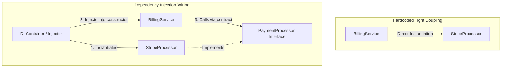

# Dependency Injection (DI)

## Introduction
Dependency Injection (DI) is a software design pattern used to implement Inversion of Control (IoC). It is the practical implementation of the SOLID Dependency Inversion Principle, delegating the responsibility of object instantiation and dependency resolution to an external coordinator.

## Problem Statement
When a class instantiates its own dependencies directly (e.g., a `BillingService` doing `new StripePaymentProcessor(new StripeConfig("API_KEY"))` in its constructor), the class becomes tightly coupled to that specific implementation. If the payment gateway changes (e.g., migrating to PayPal) or if you need to run unit tests without hitting live payment APIs, you must modify the service's source code, violating the Open/Closed Principle.

## Why this exists
To create loosely coupled code by separating object configuration and wiring from business logic execution. This allows developers to swap components and inject mocks during unit testing without modifying the client class.

## Real-world analogy
Consider a **surgeon** (the dependent class) performing an operation.
- **Without DI:** The surgeon must forge the steel, sharpen the blade, and build their own scalpel before beginning the surgery.
- **With DI:** The surgeon enters the operating room. A nurse (the DI injector) hands the surgeon the exact scalpel (dependency) required for that operation. The surgeon focuses on performing the surgery, unaware of how the scalpel was manufactured.

Another analogy is a **car radio**. The dashboard provides a standard slot (interface). You plug a radio component (dependency) into the slot. You do not weld the radio directly into the car's engine block (hardcoding dependencies).

## Definition
Dependency Injection is a technique where an object receives its dependencies from an external source (an injector or container) rather than creating them itself.

## Key concepts
- **Dependency:** An external service or object required by a class to perform its task.
- **Client (Dependent):** The class that depends on the external object.
- **Injector (Container):** The component that instantiates and injects the dependencies into the client.
- **Constructor Injection:** Passing dependencies through the class constructor. This is the recommended approach as it guarantees the class is fully initialized.
- **Setter Injection:** Passing dependencies through setter methods, useful for optional dependencies.
- **Inversion of Control (IoC):** The design principle of delegating control of application flow and object creation to a framework.

## Internal working / Mermaid diagram



## Python/Java implementation

### Bad implementation
*A service that directly instantiates its concrete payment client inside its constructor, creating tight coupling and making it impossible to test without live API credentials.*

```java
package bad;

class StripeProcessor {
    private final String apiKey;

    public StripeProcessor(String apiKey) {
        this.apiKey = apiKey;
    }

    public void process(double amount) {
        System.out.println("Processing $" + amount + " using Stripe API key: " + apiKey);
    }
}

public class BillingService {
    // Violates DIP/DI: Hardcoded concrete class dependency
    private final StripeProcessor paymentProcessor;

    public BillingService() {
        // Service manages its own configuration and instantiation
        this.paymentProcessor = new StripeProcessor("live_sk_stripe_12345");
    }

    public void completeOrder(double total) {
        paymentProcessor.process(total);
    }
}
```

### Better implementation
*Using the Service Locator pattern to look up dependencies from a global registry. While this avoids direct instantiation, it hides class dependencies and makes testing difficult.*

```java
package better;

import java.util.HashMap;
import java.util.Map;

interface PaymentProcessor {
    void process(double amount);
}

class StripeProcessor implements PaymentProcessor {
    public void process(double amount) { System.out.println("Processing Stripe: " + amount); }
}

// Service Locator Registry: Hides class contracts and creates global state issues
class ServiceLocator {
    private static final Map<String, Object> services = new HashMap<>();

    public static void register(String name, Object service) { services.put(name, service); }
    public static Object get(String name) { return services.get(name); }
}

class BillingService {
    private final PaymentProcessor paymentProcessor;

    public BillingService() {
        // Hides dependencies: You cannot tell what this service needs without reading the constructor code
        this.paymentProcessor = (PaymentProcessor) ServiceLocator.get("paymentProcessor");
    }

    public void completeOrder(double total) {
        paymentProcessor.process(total);
    }
}
```

### Best implementation
*Constructor-based Dependency Injection. The service depends on the `PaymentProcessor` interface and receives the instance via its constructor, making it loosely coupled and testable.*

```java
package best;

import java.util.Objects;

// 1. Interface defining the contract
interface PaymentProcessor {
    void process(double amount);
}

// 2. Concrete implementations
class StripeProcessor implements PaymentProcessor {
    private final String apiKey;

    public StripeProcessor(String apiKey) {
        this.apiKey = Objects.requireNonNull(apiKey);
    }

    @Override
    public void process(double amount) {
        System.out.println("Stripe processing: " + amount);
    }
}

class PayPalProcessor implements PaymentProcessor {
    @Override
    public void process(double amount) {
        System.out.println("PayPal processing: " + amount);
    }
}

// 3. Client service receiving dependencies via Constructor Injection
public class BillingService {
    private final PaymentProcessor paymentProcessor; // Loose coupling

    // Constructor Injection: Explicitly declares required dependencies
    public BillingService(PaymentProcessor paymentProcessor) {
        this.paymentProcessor = Objects.requireNonNull(paymentProcessor, "Processor cannot be null");
    }

    public void completeOrder(double total) {
        paymentProcessor.process(total);
    }
}

// 4. Test environment (Injecting Mock/Stub)
class MockProcessor implements PaymentProcessor {
    public double processedAmount = 0;

    @Override
    public void process(double amount) {
        this.processedAmount = amount; // Capture without network calls
    }
}
```

## Step-by-step explanation
1. **Define the Interface:** We create the `PaymentProcessor` interface to define the method signature `process(double amount)`.
2. **Implement Senders:** We implement concrete strategies like `StripeProcessor` and `PayPalProcessor`.
3. **Decouple the Client Service:** We modify `BillingService` to accept the `PaymentProcessor` interface in its constructor.
4. **Wire Dependencies:** We inject the appropriate implementation instance when constructing `BillingService`, keeping it decoupled.

## Multiple real-world examples
- **Spring Framework:** Uses annotations like `@Autowired` and `@Component` to manage class dependencies and wire them at runtime.
- **JUnit Testing:** Injecting mock objects (e.g., using Mockito `@Mock` annotations) to test service logic in isolation.
- **Frontend Frameworks (Angular):** Components receive services (like `HttpClient`) via constructor injection managed by Angular's DI container.

## Pros
- **Improved Testability:** Simpler to isolate and mock dependencies, avoiding live network calls or database writes in tests.
- **Decoupled Code:** Client services are decoupled from component configuration and instantiation logic.
- **Single Responsibility:** Classes focus purely on business logic rather than managing dependencies.

## Cons
- **Wiring Complexity:** Requires an external system (like a DI container) to construct objects and manage their lifecycles.
- **Implicit Flow:** For beginners, DI containers can make class flows difficult to trace as objects are wired automatically.

## Interview questions

### Beginner
- **Q: What is Dependency Injection?**
- **A:** Dependency Injection is a pattern where an object receives its dependencies from the outside rather than constructing them itself using the `new` keyword.

### Intermediate
- **Q: Why is Constructor Injection preferred over Field Injection?**
- **A:** Constructor Injection clearly declares mandatory dependencies, allows fields to be marked `final` for immutability, and simplifies manual instantiation in unit tests without requiring a reflection framework.

### Senior
- **Q: Compare the Dependency Injection pattern with the Service Locator pattern.**
- **A:**
  - **Dependency Injection:** Dependencies are explicitly declared in the constructor, making class contracts transparent.
  - **Service Locator:** Dependencies are retrieved internally from a global registry, hiding class contracts and introducing global state issues that make testing harder.

### Staff Engineer
- **Q: How do you resolve circular dependencies during object wiring in DI containers?**
- **A:** Circular dependencies (where Class A depends on Class B, and Class B depends on Class A) indicate poor design. Resolve them by:
  1. **Refactoring Code:** Extract the shared logic causing the cycle into a third class (e.g., Class C).
  2. **Using Setter/Field Injection:** Switch one dependency to setter injection to allow the container to instantiate the objects before wiring.
  3. **Using Lazy Proxies:** Configure the DI container to inject a lazy proxy for one of the dependencies, delaying resolution until the method is called.

## Common mistakes
- **Injecting Data Transfer Objects (DTOs):** Passing simple data carriers (like a `User` object) via DI containers rather than instantiating them directly.
- **Using Field Injection (`@Autowired`):** Hiding dependencies and complicating manual instantiation in unit tests.

## Best practices
- Use Constructor Injection for mandatory dependencies and Setter Injection for optional ones.
- Program to interfaces rather than concrete classes.
- Avoid passing the DI container itself into classes (Service Locator anti-pattern).

## When NOT to use
- **Simple, Non-Configurable Utilities:** If a utility class (like a math helper) has no external dependencies and is not mockable, standard static methods are preferred.

## Comparison with similar concepts
- **DIP vs DI vs IoC:**
  - **DIP:** The design principle advising dependencies on interfaces rather than details.
  - **IoC:** The broad principle of delegating application flow to a framework.
  - **DI:** The design pattern used to pass dependencies into objects.

## Summary
Dependency Injection decouples class logic from dependency lifecycle management. Injecting interface implementations via constructors improves testability and keeps codebases flexible.

## Related topics
- [Dependency Inversion Principle](../../solid-principles/dependency-inversion-principle)
- [Unit Testing & Mocking](../../java/exception-handling)
- [SOLID Principles](../../solid-principles)
