# KISS (Keep It Simple, Stupid)

## Introduction
KISS (Keep It Simple, Stupid) is an engineering design principle noted by the U.S. Navy in 1960. It states that systems operate best when they are kept simple rather than made complex; therefore, simplicity should be a key goal in software design, and unnecessary complexity should be avoided.

## Problem Statement
Software engineers often default to over-engineering. When presented with a straightforward requirement—such as finding a specific user in a collection—developers may write generic reflection wrappers, complex custom stream reducers, or multi-layered callback abstractions. This "clever" code takes longer to write, is harder to read, introduces debugging vectors, and complicates testing.

## Why this exists
To prioritize code maintainability and readability. Code is read far more often than it is written. The primary metric of good software design is not how clever it looks, but how easily a developer can understand and debug it during an outage.

## Real-world analogy
Consider a **door latch**.
- A **KISS door latch** is a simple mechanical sliding bolt. You slide it to lock or unlock. It is easy to repair and operates reliably for decades.
- A **complex door latch** uses a Bluetooth scanner, an RFID card reader, a motorized gear system, and an API connection to verify identity. If the Wi-Fi goes down or the battery dies, you are locked out.

Another analogy is the **space pen** myth. The US space agency spent millions developing a pressurized ink cartridge that could write in zero gravity, while astronauts simply used pencils. (Regardless of historical accuracy, the analogy highlights the value of simple, low-cost solutions to practical problems).

## Definition
The KISS principle states that simplicity should be a key goal in software design, and unnecessary complexity should be avoided.
- **Simplicity:** Code that does exactly what is required in a direct and readable manner.
- **Stupid:** A reminder not to make things unnecessarily complex.

## Key concepts
- **Clever Code:** Code that uses obscure language features, hacks, or dense one-liners to perform a task that could be written in a few readable lines.
- **Essential Complexity:** The inherent difficulty of the business problem itself (e.g., calculating satellite trajectories).
- **Accidental Complexity:** The complexity introduced by the developer's design choices (e.g., using a distributed messaging queue to pass a simple flag between local threads).

## Internal working / Mermaid diagram

```mermaid
graph TD
    subgraph Over-engineered Search Flow
        Client[Client] -->|Invoke via Reflection| Ref[ReflectionHelper]
        Ref -->|Execute| Wrap[GenericSearchWrapper]
        Wrap -->|Process stream| Filter[Stateful Custom Reducer]
        Filter -->|Match| Result[User Object]
    end

    subgraph KISS Search Flow
        Client2[Client] -->|Map Lookup| Map[HashMap: O_1 time]
        Map -->|Return| Result2[User Object]
    end

    %% Styles
    classDef over fill:#f8d7da,stroke:#dc3545,stroke-width:2px,color:#721c24;
    classDef kiss fill:#d4edda,stroke:#28a745,stroke-width:2px,color:#155724;

    class Client,Ref,Wrap,Filter,Result over;
    class Client2,Map,Result2 kiss;
```



## Python/Java implementation

### Bad implementation
*A developer using reflection and generic collection streams with stateful predicates just to find a user by ID, introducing high cognitive load and runtime overhead.*

```java
package bad;

import java.lang.reflect.Field;
import java.util.Collection;

public class UserFinder {
    // Over-engineered search using reflection: fragile, slow, and hard to debug
    public static <T> T findByFieldReflection(Collection<T> items, String fieldName, Object value) {
        return items.stream()
            .filter(item -> {
                try {
                    Field field = item.getClass().getDeclaredField(fieldName);
                    field.setAccessible(true);
                    Object fieldValue = field.get(item);
                    return fieldValue != null && fieldValue.equals(value);
                } catch (Exception e) {
                    return false;
                }
            })
            .findFirst()
            .orElse(null);
    }
}
```

### Better implementation
*A dense, nested ternary operator one-liner. While it avoids reflection, it remains hard to read and scan quickly.*

```java
package better;

import java.util.List;

class User {
    private final String id;
    public User(String id) { this.id = id; }
    public String getId() { return id; }
}

public class UserFinder {
    public User findUser(List<User> users, String targetId) {
        // Hard to read at a glance: nested conditions in a single line
        return users == null ? null : users.stream().filter(u -> u != null && u.getId() != null ? u.getId().equals(targetId) : false).findFirst().orElse(null);
    }
}
```

### Best implementation
*A simple map lookup for $O(1)$ time complexity, falling back to a straightforward `for-each` loop if filtering a list. The code is readable, fast, and easy to debug.*

```java
package best;

import java.util.Map;
import java.util.Objects;

class User {
    private final String id;
    private final String name;

    public User(String id, String name) {
        this.id = id;
        this.name = name;
    }

    public String getId() { return id; }
    public String getName() { return name; }
}

public class UserRegistry {
    private final Map<String, User> userCache; // Keyed by User ID

    public UserRegistry(Map<String, User> userCache) {
        this.userCache = Objects.requireNonNull(userCache);
    }

    // KISS: A direct map lookup. O(1) complexity, instantly readable.
    public User findUserById(String userId) {
        if (userId == null) {
            return null;
        }
        return userCache.get(userId);
    }
}
```

## Step-by-step explanation
1. **Analyze the Requirements:** We only need to locate a `User` by their unique string ID.
2. **Select the Right Data Structure:** Instead of storing users in a list and iterating through them, we store them in a `Map` (hash table) to enable $O(1)$ lookups.
3. **Write Readable Logic:** The `findUserById` method checks if the input is null and retrieves the user directly from the map, keeping the execution path simple.

## Multiple real-world examples
- **Database Choices:** Using SQLite for local application data storage rather than setting up a distributed, multi-node database cluster.
- **Deployment Pipelines:** Hosting a static blog on Netlify or S3 rather than configuring a Kubernetes cluster to manage dockerized containers.
- **REST APIs:** Using standard JSON payloads and HTTP status codes rather than building custom transport protocols.

## Pros
- **Easier Maintenance:** Simple code paths are easy to refactor, upgrade, and debug.
- **Faster Onboarding:** New team members can understand the codebase and contribute immediately.
- **High Reliability:** Fewer classes and abstractions reduce the surface area for bugs.

## Cons
- **Lack of Extensibility Hooks:** Simple designs may require refactoring later if complex features (like database replication) are introduced.
- **Friction with Developer Preferences:** Developers may find simple code unchallenging or "uncool" compared to complex designs.

## Interview questions

### Beginner
- **Q: What does KISS stand for?**
- **A:** Keep It Simple, Stupid. It is a design principle prioritizing simplicity and readability over complex or clever coding patterns.

### Intermediate
- **Q: How do you balance the DRY and KISS principles when they conflict?**
- **A:** DRY and KISS can conflict when eliminating duplicate code requires building complex generic abstractions. In such cases, prioritize KISS: accept minor, local duplication (WET) if the alternative is an unreadable, heavily parameterized shared function.

### Senior
- **Q: Explain the difference between Accidental Complexity and Essential Complexity.**
- **A:** Essential complexity is the inherent difficulty of the business problem itself (e.g., calculating compound interest rates based on dynamic rules). Accidental complexity is the difficulty introduced by the developer's design choices (e.g., using reflection or choosing the wrong framework to solve a simple problem). Good design minimizes accidental complexity.

### Staff Engineer
- **Q: How do you establish a team culture that values "boring," simple code over complex, "clever" solutions?**
- **A:** Establish this culture through:
  1. **Strict Code Reviews:** Reject code that uses obscure language tricks, reflection, or unnecessary patterns when simpler alternatives exist.
  2. **Consistent Metrics:** Evaluate developers based on code readability, test coverage, and simplicity rather than lines of code or the use of complex frameworks.
  3. **Refactoring Encouragement:** Schedule time for teams to simplify complex code and reward developers who reduce codebase size while maintaining functionality.

## Common mistakes
- **Using complex tools for simple tasks:** Choosing tools like Apache Kafka when a simple in-memory queue is sufficient.
- **Prioritizing brevity over clarity:** Believing that writing a dense, complex one-liner is better than writing a few lines of readable code.

## Best practices
- Write "boring," readable code that reads like a book.
- Before introducing a new library or pattern, ask: "Is there a simpler way to do this?"
- Limit nesting levels in loops and conditionals to keep code paths clear.

## When NOT to use
- **Inherently Complex Domains:** Systems managing complex processes (like real-time video encoding or compiler optimization) require sophisticated algorithms that cannot be simplified without losing performance.

## Comparison with similar concepts
- **KISS vs Over-engineering:**
  - **KISS:** Focuses on writing only what is needed in a readable way.
  - **Over-engineering:** Building complex architectures to handle hypothetical future requirements that may never arise.

## Summary
The KISS principle prioritizes simplicity and readability over clever coding tricks. Using direct, boring code paths reduces bugs and makes systems easier to maintain.

## Related topics
- [YAGNI (You Aren't Gonna Need It)](../yagni)
- [DRY (Don't Repeat Yourself)](../dry)
- [SOLID Principles](../../solid-principles)
