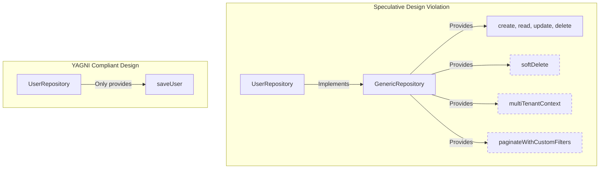

# YAGNI (You Aren't Gonna Need It)

## Introduction
YAGNI (You Aren't Gonna Need It) is a design principle originating from Extreme Programming (XP). It advises software developers that they should not add functionality or write code based on anticipated future requirements until those requirements are explicitly requested.

## Problem Statement
Developers frequently engage in speculative design. While building a basic feature (e.g., saving a user record), a developer might assume: *"Eventually, we will need to support soft-deletes, multi-tenancy, custom fields, and generic query pagination. I should write interfaces and generic repository classes to support all of this right now."* This leads to weeks of over-engineering, resulting in unused, complex code that must be compiled, tested, and maintained.

## Why this exists
To optimize development speed, reduce codebase bloat, and maintain agility. Code is a liability, not an asset. Every line of code written must be understood, tested, and refactored by future developers. Writing speculative code today wastes time and slows the team down.

## Real-world analogy
Consider packing for a **weekend beach trip**.
- **Following YAGNI:** You pack a swimsuit, a couple of t-shirts, and sunscreen.
- **Violating YAGNI:** You think, *"What if it snows? What if I get invited to a formal gala? What if I need to chop firewood?"* You pack a heavy winter coat, a tuxedo, and an axe. You now have to drag a 100-pound suitcase around for a weekend beach trip.

Another analogy is a **family home extension**. If you build a five-story foundation and install plumbing lines for four extra bathrooms "just in case" you have guests in ten years, you spend money and effort maintaining pipes that remain dry and unused, rather than focusing on completing the primary living spaces.

## Definition
The YAGNI principle states: Always implement features when you actually need them, never when you merely foresee that you might need them.
- **Extend when needed:** Add code only when a specific requirement is scheduled for development.
- **Avoid Speculation:** Do not write boilerplate or structures for hypothetical future features.

## Key concepts
- **Speculative Design:** The practice of writing code or adding interfaces based on assumptions of future requirements.
- **Dead Code:** Unused classes, methods, or configurations that remain in the codebase.
- **Refactorability:** The ease with which simple, clean code can be modified in the future when new requirements arise.

## Internal working / Mermaid diagram



## Python/Java implementation

### Bad implementation
*A developer creating a generic query layer, soft-delete flags, multi-tenancy checks, and audit logging features "just in case" they are needed, complicating a simple database save.*

```java
package bad;

import java.util.List;
import java.util.Map;

// A generic repository with speculative features that are not yet needed
interface Repository<T> {
    void save(T entity);
    void softDelete(String id); // Not requested
    List<T> findAllPaginated(int page, int size, Map<String, Object> filters); // Not requested
    void enableMultiTenancy(String tenantId); // Not requested
}

class User {
    private String id;
    private String username;
    // Getters and setters...
}

class UserRepository implements Repository<User> {
    @Override
    public void save(User entity) {
        System.out.println("Saving User to database");
    }

    @Override
    public void softDelete(String id) {
        // Speculative: throwing exception as there is no business logic yet
        throw new UnsupportedOperationException("Soft delete not yet implemented");
    }

    @Override
    public List<User> findAllPaginated(int page, int size, Map<String, Object> filters) {
        throw new UnsupportedOperationException("Pagination not yet implemented");
    }

    @Override
    public void enableMultiTenancy(String tenantId) {
        throw new UnsupportedOperationException("Multi-tenancy not yet implemented");
    }
}
```

### Better implementation
*Creating interfaces and abstract base repositories to allow future extensions, but leaving them empty of unimplemented methods to reduce bloat.*

```java
package better;

interface UserRepository {
    void save(User user);
}

class User {
    private String username;
    public User(String username) { this.username = username; }
    public String getUsername() { return username; }
}

class SqlUserRepository implements UserRepository {
    @Override
    public void save(User user) {
        System.out.println("Saving " + user.getUsername() + " to SQL");
    }
}
```

### Best implementation
*A simple, concrete class containing only the required `saveUser` method. No interfaces, no base classes, and no speculative methods. If extensions are needed later, they are refactored into the code when requested.*

```java
package best;

class User {
    private final String username;

    public User(String username) {
        this.username = username;
    }

    public String getUsername() {
        return username;
    }
}

// YAGNI: A simple, concrete repository. Only contains what is needed today.
public class UserRepository {
    public void save(User user) {
        System.out.println("Saving user to DB: " + user.getUsername());
    }
}
```

## Step-by-step explanation
1. **Analyze Today's Requirements:** The only requirement is to save a user record to the database.
2. **Write Only the Core Logic:** We write a concrete `UserRepository` class with a single `save` method, avoiding interfaces and generic class parameters.
3. **Defer Abstractions:** We do not create base interfaces or abstract factories until we have at least two concrete repository implementations (e.g., `MongoUserRepository` and `SqlUserRepository`) that require polymorphism.

## Multiple real-world examples
- **Database Schema Fields:** Storing only required contact fields (like `email`) instead of speculatively adding fields for `pager_number` or `fax_number`.
- **Framework Adoption:** Using a simple local scheduler rather than setting up an enterprise orchestration engine like Kubernetes for a basic application.
- **REST Endpoints:** Exposing only the specific endpoints required by the frontend client rather than building full CRUD endpoints upfront.

## Pros
- **Faster Delivery:** Saves time by avoiding the development and testing of unused features.
- **Cleaner Codebase:** Eliminates dead code, empty method stubs, and unused abstractions.
- **Fact-Based Design:** When a feature is eventually requested, developers can design it based on actual requirements rather than speculative guesses.

## Cons
- **Refactoring Effort:** If a simple design must be extended later, it may require refactoring class structures and interfaces. (Agile methodologies accept this trade-off, as refactoring clean code is generally cheaper than maintaining unused code).

## Interview questions

### Beginner
- **Q: What is the YAGNI principle?**
- **A:** YAGNI stands for You Aren't Gonna Need It. It advises developers against writing code or adding abstractions for future features until those features are explicitly requested.

### Intermediate
- **Q: How does YAGNI differ from the Open/Closed Principle (OCP)?**
- **A:**
  - **OCP:** Guides you to write code that can be extended without modifying existing source files.
  - **YAGNI:** Advises against writing the actual extension code or abstract layers until they are needed.
  - **Balance:** Design your architecture to be modular and clean so that it *can* be extended (OCP), but do not write the abstract interfaces or classes until the requirement arises (YAGNI).

### Senior
- **Q: How does YAGNI prevent the "Fragile Base Class" problem?**
- **A:** Speculatively adding features to a base class can introduce bugs that affect all subclasses. By applying YAGNI and keeping base classes focused only on active requirements, developers minimize complexity and reduce regression risks in inherited classes.

### Staff Engineer
- **Q: How do you address concerns that adhering to YAGNI causes technical debt when requirements scale?**
- **A:** Address these concerns by clarifying the relationship between YAGNI and clean code:
  1. **YAGNI is not "Quick and Dirty":** Adhering to YAGNI means writing simple, well-structured, and fully tested code for *today's* requirements. It does not justify cutting corners or neglecting test coverage.
  2. **Refactoring is Cheaper than Speculation:** Maintaining unused complex code over years adds constant cognitive load. In contrast, refactoring simple, clean code when requirements change is a structured, low-risk process.
  3. **Guiding Principle:** Focus on write-time simplicity. If a feature can be added in less than a day, do not build abstractions to support it today.

## Common mistakes
- **Writing ghost features:** Adding utility methods or classes that are never executed in production.
- **Conflating YAGNI with poor design:** Writing messy, hardcoded code under the guise of keeping things simple, which makes future refactoring difficult.

## Best practices
- Focus on delivering only the features scheduled for the current development cycle.
- Keep codebase boundaries clean to make future refactoring easy.
- Write thorough unit tests so you can refactor simple structures safely when requirements change.

## When NOT to use
- **Hardware/Protocol Standards:** When building systems that must conform to fixed hardware specifications or communication protocols, designing for future standards is necessary.

## Comparison with similar concepts
- **YAGNI vs Premature Optimization:**
  - **YAGNI:** Focuses on avoiding unnecessary *features* and abstractions.
  - **Premature Optimization:** Focuses on avoiding performance modifications before measuring real bottlenecks.

## Summary
The YAGNI principle prevents software bloat by advising against writing code for anticipated future requirements. Building only what is needed today keeps codebases lean and maintainable.

## Related topics
- [KISS (Keep It Simple, Stupid)](../kiss)
- [DRY (Don't Repeat Yourself)](../dry)
- [SOLID Principles](../../solid-principles)
