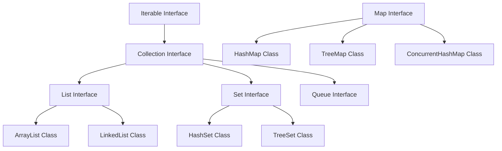

# Java Collections Framework

## Introduction
The Java Collections Framework (JCF) is a unified architecture for representing and manipulating collections of objects. It provides highly optimized, pre-built data structures (such as Lists, Sets, and Maps) and algorithms (such as sorting and binary search) to minimize development effort and maximize runtime performance.

## Problem Statement
Prior to the introduction of the JCF (in Java 1.2), developers had to manage groups of objects using raw Arrays, Vectors, or Hashtables. These classes lacked standard interfaces, and arrays had fixed sizes. If a developer needed to expand an array, they had to manually create a new, larger array, copy the elements over, and manage the indices. This manual management was prone to errors, memory leaks, and performance bottlenecks.

## Why this exists
To provide a standard set of high-performance interfaces and implementations. By standardizing collection operations, JCF allows developers to select optimized data structures for specific use cases (e.g., fast random access vs. fast insertion) and pass data uniformly across APIs.

## Real-world analogy
Consider **storage containers in a logistics warehouse**.
- **List (ArrayList):** A bookshelf where boxes are kept in a specific, numbered order. You can easily find the 5th box (index access).
- **Set (HashSet):** A unique stamp collection. You cannot have duplicates; if you try to add a stamp you already own, it is rejected.
- **Map (HashMap):** A phone book. You look up a specific name (Key) to instantly find their phone number (Value).

Another analogy is a **toll booth queue**. Cars queue in a strict First-In-First-Out (FIFO) line to pay tolls. In Java, this is represented by the `Queue` interface, ensuring that the first element added is the first one processed.

## Definition
A unified framework containing interfaces, implementations, and algorithms for storing and manipulating collections of objects as a single unit.

## Key concepts & Interfaces
- **Collection Interface:** The root interface of the collection hierarchy (excluding `Map`).
  - **`List`:** An ordered collection (sequence) that allows duplicates (e.g., `ArrayList`, `LinkedList`).
  - **`Set`:** A collection containing no duplicate elements (e.g., `HashSet`, `TreeSet`, `LinkedHashSet`).
  - **`Queue` / `Deque`:** A collection designed for holding elements prior to processing (FIFO or LIFO) (e.g., `PriorityQueue`, `ArrayDeque`).
- **Map Interface:** An object mapping unique keys to values. It does not extend the `Collection` interface (e.g., `HashMap`, `TreeMap`, `LinkedHashMap`, `ConcurrentHashMap`).
- **Autoboxing/Unboxing:** The automatic conversion the JVM performs between primitives (e.g., `int`) and their corresponding object wrappers (e.g., `Integer`). Since collections only store object references, this adds memory and garbage collection overhead.

## Internal working / Mermaid diagram



## Python/Java implementation

### Bad implementation
*A Java program that uses raw collection types (losing type safety) and uses a custom class as a Map key without overriding `hashCode()` and `equals()`. This causes duplicate keys and makes lookups fail.*

```java
package bad;

import java.util.HashMap;
import java.util.Map;

class User {
    private String name;
    public User(String name) { this.name = name; }
}

public class BadCollections {
    @SuppressWarnings({"rawtypes", "unchecked"})
    public static void main(String[] args) {
        // Raw Map lacks compile-time type safety!
        Map userMap = new HashMap();
        
        User user1 = new User("Alice");
        User user2 = new User("Alice");

        userMap.put(user1, "Admin");
        
        // Since User has no custom hashCode/equals, this lookup returns null!
        System.out.println("User role: " + userMap.get(user2)); // Output: null
        System.out.println("Size: " + userMap.size()); // Output: 1
    }
}
```

### Better implementation
*Using generics to enforce type safety, and overriding `hashCode()` and `equals()`. However, using a standard `HashMap` in a multi-threaded context can cause thread-safety issues and data corruption.*

```java
package better;

import java.util.HashMap;
import java.util.Map;
import java.util.Objects;

class User {
    private final String name;

    public User(String name) {
        this.name = name;
    }

    @Override
    public boolean equals(Object o) {
        if (this == o) return true;
        if (o == null || getClass() != o.getClass()) return false;
        User user = (User) o;
        return Objects.equals(name, user.name);
    }

    @Override
    public int hashCode() {
        return Objects.hash(name);
    }
}

public class BetterCollections {
    public static void main(String[] args) {
        // Enforces type safety via generics
        Map<User, String> userMap = new HashMap<>();
        
        User user1 = new User("Alice");
        User user2 = new User("Alice");

        userMap.put(user1, "Admin");
        System.out.println("User role: " + userMap.get(user2)); // Output: Admin (Success)
        
        // DANGER: Standard HashMap is not thread-safe and can cause infinite loops or data loss under concurrent writes
    }
}
```

### Best implementation
*A Java simulation demonstrating thread-safe concurrent collections, sorted sets, and immutable value keys, ensuring both data integrity and type safety.*

```java
package best;

import java.util.Map;
import java.util.Objects;
import java.util.Set;
import java.util.TreeSet;
import java.util.concurrent.ConcurrentHashMap;

// 1. Immutable Value Key Class to protect Hash Codes
public final class UserKey implements Comparable<UserKey> {
    private final String userId;

    public UserKey(String userId) {
        this.userId = Objects.requireNonNull(userId, "UserId cannot be null");
    }

    public String getUserId() {
        return userId;
    }

    @Override
    public boolean equals(Object o) {
        if (this == o) return true;
        if (o == null || getClass() != o.getClass()) return false;
        UserKey userKey = (UserKey) o;
        return Objects.equals(userId, userKey.userId);
    }

    @Override
    public int hashCode() {
        return Objects.hash(userId);
    }

    @Override
    public int compareTo(UserKey o) {
        return this.userId.compareTo(o.userId);
    }
}

public class OptimizedCollectionsDemo {
    // 2. Thread-Safe HashMap using segment-level locking
    private final Map<UserKey, String> activeUsers = new ConcurrentHashMap<>();
    
    // 3. Sorted Set using red-black tree structures
    private final Set<UserKey> sortedRoster = new TreeSet<>();

    public void registerUser(String id, String role) {
        UserKey key = new UserKey(id);
        
        // ConcurrentHashMap operations are atomic
        activeUsers.put(key, role);
        
        synchronized (sortedRoster) {
            sortedRoster.add(key); // TreeSet is not thread-safe; requires synchronization
        }
    }

    public String getRole(String id) {
        return activeUsers.get(new UserKey(id));
    }

    public void printSortedUsers() {
        synchronized (sortedRoster) {
            sortedRoster.forEach(user -> System.out.println("User ID: " + user.getUserId()));
        }
    }
}
```

## Step-by-step explanation
1. **Declare Immutable Keys:** In `best.UserKey`, the `userId` field is `final` and cannot be modified after construction. This guarantees the object's hash code remains constant, preventing lookup failures in hash tables.
2. **Override `hashCode` and `equals`:** We override both methods to ensure that two key objects containing the same `userId` are resolved as identical keys.
3. **Establish Sorting Contract:** `UserKey` implements `Comparable<UserKey>` and defines `compareTo`, allowing it to be used within sorted collections like `TreeSet` or `TreeMap`.
4. **Enforce Concurrent Access:** We use `ConcurrentHashMap` to allow multi-threaded access without locking the entire map, keeping performance high.

## Multiple real-world examples
- **Web Application Sessions:** `ConcurrentHashMap` is used to store active user session contexts in web servers.
- **Task Scheduling:** `PriorityQueue` is used in job schedulers to execute high-priority tasks first.
- **Audit Logs:** `LinkedHashMap` is used to build cache structures (like Least Recently Used/LRU caches) by maintaining insertion or access orders.

## Pros
- **Optimized Performance:** JCF implementations are written by JVM developers and optimized for execution speed.
- **Interoperability:** Standard interfaces (like `List`, `Map`) make it easy to share data across different libraries.
- **Thread Safety Options:** Provides concurrent implementations (like `ConcurrentHashMap`) for multi-threaded applications.

## Cons
- **Autoboxing Memory Overhead:** Collections cannot store primitive types directly (e.g., `List<Integer>` instead of `List<int>`), introducing memory overhead for object wrappers.

## Interview questions

### Beginner
- **Q: What is the difference between List and Set in Java?**
- **A:** A `List` is an ordered collection that permits duplicate elements, allowing access by index. A `Set` is an unordered collection that prohibits duplicates.

### Intermediate
- **Q: How does a `HashMap` work internally in Java?**
- **A:** It uses an array of "buckets." Calling `put(Key, Value)` hashes the key to determine the array index. If multiple keys hash to the same index (a collision), they are stored in a linked list at that index. In Java 8+, if the list size exceeds 8, it converts to a balanced red-black tree to improve lookup time from $O(N)$ to $O(\log N)$.

### Senior
- **Q: Why does a `ConcurrentHashMap` perform better than a synchronized HashMap in multithreaded environments?**
- **A:** A synchronized map locks the entire map for every read and write operation, causing thread contention. `ConcurrentHashMap` uses lock stripping (segment-level locking) and CAS (Compare-And-Swap) operations, locking only the specific bucket or node being updated, which allows concurrent reads and writes.

### Staff Engineer
- **Q: How does Java's garbage collector handle objects stored in collections, and how do you prevent memory leaks when caching elements?**
- **A:**
  - **The Leak:** Objects stored in collections remain in memory as long as the collection itself is reachable, even if they are no longer used by the rest of the application, leading to memory leaks.
  - **The Solution:** Use `WeakHashMap` for cache implementations. `WeakHashMap` stores keys using weak references (`WeakReference`). When a key is no longer referenced elsewhere, the garbage collector reclaims it, and its entry is automatically removed from the map.

## Common mistakes
- **Modifying a collection during iteration:** Using a `for-each` loop to remove items, which throws a `ConcurrentModificationException`. Use `Iterator.remove()` or `removeIf()` instead.
- **Mutable keys in HashMaps:** Modifying an object's fields after it has been used as a map key, which changes its hash code and makes the value unretrievable.

## Best practices
- Program to interfaces rather than concrete implementations (e.g., `List<String> list = new ArrayList<>()`).
- Pre-allocate collection sizes (e.g., `new ArrayList<>(500)`) if the final count is known, avoiding expensive resizing operations.
- Always use immutable objects (like `String` or records) as Map keys.

## When NOT to use
- **High-Performance Primitive Math:** If a system must process millions of primitive numbers (like float arrays in audio rendering), avoid collections to prevent the memory overhead of boxing.

## Comparison with similar concepts
- **ArrayList vs LinkedList:**
  - **ArrayList:** Uses a dynamic array, providing fast $O(1)$ random access but slow $O(N)$ middle insertions.
  - **LinkedList:** Uses doubly-linked nodes, providing fast $O(1)$ middle insertions but slow $O(N)$ sequential access.

## Summary
The Java Collections Framework standardizes data structures in Java. Using immutable keys, overriding `hashCode`/`equals`, and selecting concurrent collections prevents data loss and ensures thread safety.

## Related topics
- [Streams & Functional Programming](../streams-functional)
- [Hash Tables](../../../../04-dsa-patterns/hash-tables)
- [Arrays & Strings](../../../../04-dsa-patterns/arrays-strings)
