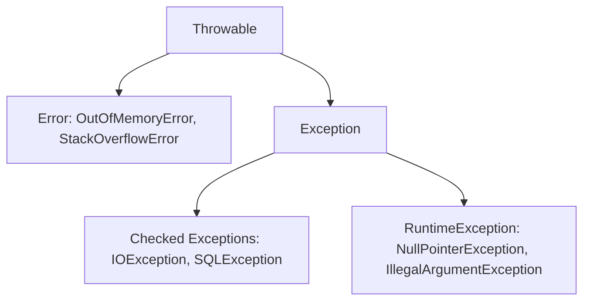

# Exception Handling

## Introduction
Exception Handling is a core runtime mechanism in Java designed to handle anomalous conditions (errors) that occur during execution. It allows applications to maintain their normal control flow, recover from transient failures, or terminate gracefully without crashing the JVM.

## Problem Statement
When a program encounters a runtime error—such as trying to open a missing file, dividing by zero, or encountering a database timeout—the JVM stops executing instructions and throws a stack trace before crashing. In enterprise systems, a single user's database timeout must not be allowed to crash the entire application, serving thousands of other concurrent users.

## Why this exists
To separate error-handling code from main business logic. It provides a structured, bubble-up propagation mechanism to capture runtime issues, release system resources (like database locks or file handles), and run recovery or fallback routines.

## Real-world analogy
Consider **driving a car**.
- **Normal Flow:** Driving smoothly on the highway.
- **Checked Exception:** The low-fuel dashboard light. You anticipate it will happen eventually. The manufacturer forces you to look at the indicator, and you have a clear recovery plan: pull into the nearest gas station.
- **Unchecked Exception:** A tire blow-out. You did not plan for it at that exact second, but when it happens, you execute emergency handling: pull onto the shoulder to change the tire.
- **Error:** The engine physically explodes. There is no catching or recovering from this; the vehicle cannot be driven further.

Another analogy is a **postal delivery service**. If a package address is illegible, the mail carrier does not burn the truck down. Instead, they trigger an exception process, routing the package back to the regional return-to-sender sorting bin.

## Definition
The structured language mechanism of intercepting runtime errors through a `try-catch-finally` block, converting system faults into object representations (`Throwable`), and managing resource lifecycles.

## Key concepts & Hierarchy
- **Throwable:** The root class of the Java exception hierarchy. Only instances of this class can be thrown by the JVM.
- **Error:** Represents serious problems (like `OutOfMemoryError` or `StackOverflowError`) that applications should not catch. These indicate JVM resource exhaustion.
- **Exception:** Represents conditions that a program should catch and handle.
  - **Checked Exceptions:** Inherit directly from `Exception` (excluding `RuntimeException`). The compiler verifies these at compile-time, forcing methods to declare them using `throws` or handle them using `try-catch` (e.g., `IOException`, `SQLException`).
  - **Unchecked Exceptions (RuntimeExceptions):** Inherit from `RuntimeException`. They represent programming bugs or invalid states and are not checked at compile-time (e.g., `NullPointerException`, `IllegalArgumentException`).
- **Try-With-Resources:** A resource management structure introduced in Java 7 that automatically closes objects implementing `AutoCloseable` at the end of the block.
- **Exception Translation (Wrapping):** Catching a low-level exception (e.g., `SQLException`) and wrapping it in a higher-level custom exception (e.g., `DatabaseAccessException`) before rethrowing it, protecting architectural boundaries.

## Internal working / Mermaid diagram



## Python/Java implementation

### Bad implementation
*A program that catches a general `Exception` silently and ignores it (swallowing), or uses exceptions for normal flow control (throwing exceptions to break a loop), introducing performance penalties.*

```java
package bad;

public class FlowControlException {
    public static void main(String[] args) {
        String[] data = {"Alice", "Bob", "Charlie"};
        int i = 0;
        
        try {
            // Bad: Using exception handling for normal loop flow control
            while (true) {
                System.out.println(data[i++]);
            }
        } catch (ArrayIndexOutOfBoundsException e) {
            // Swallowing the exception silently. Worst practice!
        }
    }
}
```

### Better implementation
*Declaring `throws Exception` on all method signatures and letting raw database exceptions bubble up directly to UI controllers. This leaks database details and couples layers together.*

```java
package better;

import java.sql.SQLException;

class UserRepository {
    // Better, but leaks raw database implementation details to the caller
    public void saveUser(String name) throws SQLException {
        if (name == null) throw new IllegalArgumentException("Name cannot be null");
        throw new SQLException("Connection timed out"); // Raw database exception
    }
}

public class UserController {
    private final UserRepository repo = new UserRepository();

    public void createUser(String name) throws Exception {
        // High-level controller is forced to declare database exceptions
        repo.saveUser(name);
    }
}
```

### Best implementation
*A Java program demonstrating custom business exceptions, Exception Translation (wrapping a low-level exception in a clean domain exception), and automatic resource cleanup using Try-With-Resources.*

```java
package best;

import java.io.Closeable;
import java.io.IOException;
import java.util.Objects;

// 1. Custom Domain Exception (Unchecked)
class DataAccessException extends RuntimeException {
    public DataAccessException(String message, Throwable cause) {
        super(message, cause);
    }
}

class UserCreationException extends RuntimeException {
    public UserCreationException(String message) {
        super(message);
    }
}

// 2. Resource implementing AutoCloseable
class DatabaseConnection implements Closeable {
    public void executeQuery(String sql) throws IOException {
        if (sql.contains("FAIL")) {
            throw new IOException("Physical disk read failed"); // Raw system I/O error
        }
        System.out.println("Executing SQL: " + sql);
    }

    @Override
    public void close() {
        System.out.println("Database connection closed automatically.");
    }
}

// 3. Repository executing Exception Translation
class UserRepository {
    public void save(String username) {
        Objects.requireNonNull(username, "Username cannot be null");
        if (username.isBlank()) {
            throw new UserCreationException("Username cannot be empty");
        }

        // Try-with-resources: guarantees connection is closed even if execution crashes
        try (DatabaseConnection conn = new DatabaseConnection()) {
            conn.executeQuery("INSERT INTO users VALUES ('" + username + "')");
        } catch (IOException e) {
            // Exception Translation: wrap low-level system error into clean domain exception
            throw new DataAccessException("Failed to persist user to repository", e);
        }
    }
}

// 4. Controller handling user boundaries
public class UserController {
    private final UserRepository repository = new UserRepository();

    public void createUser(String username) {
        try {
            repository.save(username);
            System.out.println("User created successfully.");
        } catch (UserCreationException e) {
            System.err.println("Validation Error: " + e.getMessage());
        } catch (DataAccessException e) {
            System.err.println("System Error: Please try again later. Cause: " + e.getCause().getMessage());
        }
    }
}
```

## Step-by-step explanation
1. **Model Custom Exceptions:** We create `DataAccessException` and `UserCreationException` to represent specific domain issues.
2. **Implement Try-With-Resources:** The `DatabaseConnection` implements `Closeable`. In the repository, we instantiate it within the `try(...)` parameters. When the block exits, the JVM calls `close()` automatically.
3. **Translate Exceptions:** When `conn.executeQuery` throws an `IOException`, the catch block intercepts it and wraps it inside a `DataAccessException`, preserving the stack trace while hiding raw I/O details.
4. **Isolate layers:** The controller catches the clean domain exceptions, resolving errors without needing to manage database connection details.

## Multiple real-world examples
- **Web Application Controllers:** Spring `@ControllerAdvice` catches exceptions globally and translates them into appropriate HTTP status codes (e.g., returning `404 Not Found` for `UserNotFoundException`).
- **REST Clients:** Services catch raw connection timeouts and wrap them in custom exceptions to trigger retry logic or fallback options.
- **Enterprise File Parsers:** Readers catch parse errors and log line numbers, continuing to process the remaining lines rather than stopping execution.

## Pros
- **Clean Separation of Logic:** Business flows remain free of conditional error-code checking logic.
- **Guaranteed Cleanup:** Try-with-resources prevents resource leaks and database lock accumulation.
- **Stack Trace Audits:** Exceptions capture call stack histories, simplifying debugging in production.

## Cons
- **Performance Cost:** Capturing a stack trace requires traversing the thread stack, which adds CPU overhead. Avoid using exceptions for normal flow control.

## Interview questions

### Beginner
- **Q: What is the difference between `throw` and `throws` in Java?**
- **A:** `throw` is used inside a method body to trigger and throw an exception object (e.g., `throw new IllegalArgumentException()`). `throws` is used in a method signature to declare that the method might throw the specified exception, delegating the responsibility of handling it to the caller.

### Intermediate
- **Q: Does the `finally` block execute if a `return` statement is placed inside the `try` block?**
- **A:** Yes. The JVM executes the `finally` block immediately before returning from the method. The only cases where `finally` does not execute are if `System.exit(0)` is called, the thread is interrupted, or a JVM crash occurs.

### Senior
- **Q: Why are checked exceptions controversial, and why do modern languages (like Kotlin or Go) exclude them?**
- **A:** Checked exceptions force developers to write empty, meaningless `catch` blocks or declare `throws` on method signatures up the call stack to satisfy the compiler. This can lead to cluttered code and tight coupling. Modern frameworks often wrap checked exceptions in unchecked runtime exceptions to maintain clean signatures.

### Staff Engineer
- **Q: How does the JVM optimize stack trace generation during exception instantiation, and how can you optimize custom exceptions for performance-critical systems?**
- **A:**
  - **The JVM Overhead:** When an exception is created, the JVM traverses the call stack to populate the stack trace, which is CPU-intensive.
  - **The Optimization:** For performance-critical systems where the stack trace is unnecessary (e.g., validation checks), you can optimize custom exceptions by overriding the `fillInStackTrace()` method:
    ```java
    @Override
    public synchronized Throwable fillInStackTrace() {
        return this; // Do not populate stack trace, improving instantiation speed
    }
    ```
  - This prevents stack traversal, making exception instantiation fast.

## Common mistakes
- **Swallowing Exceptions:** Catching an exception silently and ignoring it (`catch (Exception e) {}`), which hides errors and complicates debugging.
- **Catching top-level Throwable:** Catching `Throwable` directly, which intercepts fatal JVM errors (like `OutOfMemoryError`) that the application cannot recover from.

## Best practices
- Prefer unchecked (Runtime) exceptions for business logic and validation errors.
- Always use try-with-resources to manage closeable resources.
- Translate low-level exceptions to clean domain exceptions at architectural boundaries.

## When NOT to use
- **Normal Flow Control:** Do not use try-catch blocks to handle expected conditions (such as checking if a collection contains an element).

## Comparison with similar concepts
- **Checked vs Unchecked Exceptions:**
  - **Checked Exceptions:** Verified at compile-time; the compiler forces developers to handle or declare them.
  - **Unchecked Exceptions:** Verified at runtime; represents programming bugs or invalid states.

## Summary
Java Exception Handling isolates error-handling code from business logic. Using custom runtime exceptions, try-with-resources, and exception translation keeps codebases modular and easy to maintain.

## Related topics
- [File I/O](../file-io)
- [Java Collections](../collections)
- [Clean Code & SOLID Principles](../../solid-principles)
