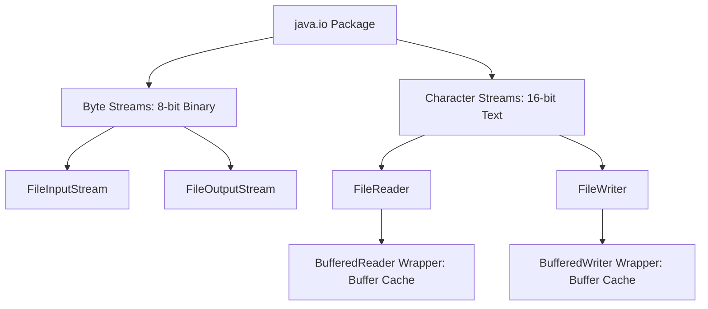

# File I/O (Input/Output)

## Introduction
File I/O (Input/Output) refers to the process of reading data from and writing data to persistent storage devices. In Java, file operations are managed by the legacy `java.io` package (stream-based) and the modern `java.nio` (New I/O) package (buffer/channel-based), providing platform-independent APIs to interact with local filesystems.

## Problem Statement
Applications cannot store all data in volatile RAM. To persist configurations, transaction logs, or user databases, programs must write bytes to non-volatile physical disks. Because disk read/write operations are exponentially slower than RAM access, unbuffered I/O operations can block execution threads and degrade application performance. Additionally, failing to release system file descriptors causes file locks and memory leaks.

## Why this exists
To provide standard, platform-independent filesystem abstractions. File I/O streams hide operating system differences (Windows vs. Unix paths, block allocations), allowing developers to interact with files uniformly.

## Real-world analogy
Consider a **warehouse** (the hard drive) and a **factory floor** (the RAM).
- **Unbuffered I/O:** A worker travels to the warehouse to fetch a single screw, returns to the factory floor to assemble a part, and then travels back to the warehouse for the next screw. This is extremely slow.
- **Buffered I/O:** The worker takes a large bin (buffer) to the warehouse, fills it with 1,000 screws, and returns to the factory. The worker then uses screws from the bin, minimizing trips to the warehouse.

Another analogy is a **water hose**. Water flows continuously through the hose (stream) from the tap (source) to the bucket (destination), allowing you to stream large volumes of water without needing to transport it in a single giant container.

## Definition
The API and runtime mechanisms used to read and write bytes or characters to persistent filesystems, organized into Byte Streams, Character Streams, and modern non-blocking NIO Channels.

## Key concepts & Hierarchy
- **Stream:** A continuous sequence of data flowing from a source to a destination.
- **Byte Streams:** Process data byte-by-byte (8-bit). Used for binary data like images, compressed files, and PDFs (e.g., `FileInputStream`, `FileOutputStream`).
- **Character Streams:** Process data character-by-character (16-bit Unicode), managing character encodings automatically (e.g., `FileReader`, `FileWriter`).
- **Buffered Streams:** Wrapper streams that load data chunks into an in-memory buffer (usually 8KB) to minimize direct disk interactions (e.g., `BufferedReader`, `BufferedWriter`).
- **NIO.2 (New I/O):** A buffer-and-channel-based API introduced in Java 7 that supports non-blocking operations, filesystem path abstractions (`Path`), and optimized utility methods (`Files`).

## Internal working / Mermaid diagram



## Python/Java implementation

### Bad implementation
*Reading file contents byte-by-byte using raw, unbuffered `FileInputStream` and closing resources manually in a fragile `finally` block, risking resource leaks.*

```java
package bad;

import java.io.File;
import java.io.FileInputStream;
import java.io.IOException;

public class UnbufferedFileLeak {
    public void readLogFile(String path) {
        FileInputStream fis = null;
        try {
            File file = new File(path);
            fis = new FileInputStream(file);
            int data;
            // Bad: Reads byte-by-byte from physical disk. Slow and resource-intensive.
            while ((data = fis.read()) != -1) {
                System.out.print((char) data);
            }
        } catch (IOException e) {
            System.err.println("Error reading file: " + e.getMessage());
        } finally {
            // Bad: Manual close is fragile. If close() throws an exception, locks remain!
            if (fis != null) {
                try {
                    fis.close();
                } catch (IOException e) {
                    // Swallowing exception
                }
            }
        }
    }
}
```

### Better implementation
*Using `BufferedReader` to buffer disk reads, but closing the reader manually, which can leak resources if exceptions occur before the close statement.*

```java
package better;

import java.io.BufferedReader;
import java.io.FileReader;
import java.io.IOException;

public class ManualBufferedIO {
    public void readText(String path) {
        BufferedReader br = null;
        try {
            // Buffered, but resource management is still manual and unsafe
            br = new BufferedReader(new FileReader(path));
            String line;
            while ((line = br.readLine()) != null) {
                System.out.println(line);
            }
            br.close(); // Leaks resource if an exception is thrown above!
        } catch (IOException e) {
            System.err.println("IO Error: " + e.getMessage());
        }
    }
}
```

### Best implementation
*A Java program utilizing modern try-with-resources for automatic resource closing, specifying explicit character encodings (UTF-8), and using NIO.2 `Files.lines()` for memory-safe streaming of large files.*

```java
package best;

import java.io.BufferedReader;
import java.io.BufferedWriter;
import java.io.IOException;
import java.nio.charset.StandardCharsets;
import java.nio.file.Files;
import java.nio.file.Path;
import java.nio.file.Paths;
import java.nio.file.StandardOpenOption;
import java.util.Objects;
import java.util.stream.Stream;

public class OptimizedFileManager {

    // 1. Safe, Buffered Writing using Try-With-Resources and explicit UTF-8 encoding
    public void writeLog(String filePath, String content) {
        Objects.requireNonNull(filePath);
        Objects.requireNonNull(content);
        Path path = Paths.get(filePath);

        try (BufferedWriter writer = Files.newBufferedWriter(path, 
                StandardCharsets.UTF_8, 
                StandardOpenOption.CREATE, 
                StandardOpenOption.APPEND)) {
            writer.write(content);
            writer.newLine();
        } catch (IOException e) {
            System.err.println("Failed to write to file: " + e.getMessage());
        }
    }

    // 2. Memory-Safe Reading using NIO.2 Files.lines() (Streaming approach)
    public void processLargeLogFile(String filePath) {
        Objects.requireNonNull(filePath);
        Path path = Paths.get(filePath);

        // Files.lines() returns a lazy stream; does not load the entire file into RAM
        try (Stream<String> lines = Files.lines(path, StandardCharsets.UTF_8)) {
            lines.filter(line -> line.contains("ERROR"))
                 .map(String::trim)
                 .forEach(System.out::println);
        } catch (IOException e) {
            System.err.println("Failed to stream log file: " + e.getMessage());
        }
    }

    // 3. Alternative: try-with-resources with BufferedReader wrapper
    public void readBuffered(String filePath) {
        Path path = Paths.get(filePath);
        try (BufferedReader reader = Files.newBufferedReader(path, StandardCharsets.UTF_8)) {
            String line;
            while ((line = reader.readLine()) != null) {
                System.out.println("Line: " + line);
            }
        } catch (IOException e) {
            System.err.println("Failed to read buffered file: " + e.getMessage());
        }
    }
}
```

## Step-by-step explanation
1. **Initialize Paths:** We use `Paths.get(filePath)` to create a `Path` object, which is OS-independent.
2. **Implement Try-With-Resources:** The `BufferedWriter` and `Stream<String>` resources are declared inside the `try(...)` parameters. They are closed automatically when the block exits.
3. **Specify Character Encoding:** We pass `StandardCharsets.UTF_8` explicitly to prevent encoding issues when running the code on different operating systems.
4. **Use Lazy Streams:** `Files.lines()` streams the file line-by-line rather than loading it entirely into memory, keeping the memory footprint low.

## Multiple real-world examples
- **Web Server Logs:** Servers write logging events to files asynchronously using buffered output streams.
- **CSV Data Ingestion:** Importing large database records by reading and parsing CSV files line-by-line.
- **Config file parsers:** Reading properties files (`.properties` or `.yaml`) on application startup to load configuration settings.

## Pros
- **Optimized Performance:** Buffered wrappers and NIO.2 utilities minimize direct disk interactions, improving I/O speed.
- **Memory Safety:** Streaming utilities allow processing large files without risking `OutOfMemoryError`.
- **Automatic Resource Cleanup:** Try-with-resources prevents file descriptor leaks and locks.

## Cons
- **Thread Blocking:** Standard Java I/O operations block threads. If a thread reads a large file, it blocks until the operation completes.

## Interview questions

### Beginner
- **Q: What is the difference between a Byte Stream and a Character Stream?**
- **A:** Byte Streams (e.g., `FileInputStream`) process raw binary data (8-bit bytes) and are used for files like images or PDFs. Character Streams (e.g., `FileReader`) process text data (16-bit Unicode characters), managing character encodings automatically.

### Intermediate
- **Q: Why should you always wrap a `FileReader` in a `BufferedReader`?**
- **A:** A raw `FileReader` reads characters directly from the physical disk, which is slow. Wrapping it in a `BufferedReader` loads a large chunk of data (usually 8KB) into an in-memory buffer on the first read, satisfying subsequent read requests from memory and reducing disk operations.

### Senior
- **Q: How do you process a 50GB CSV file in Java on a machine with only 4GB of RAM?**
- **A:** You must avoid loading the entire file into memory (such as using `Files.readAllLines()`). Instead, use `Files.lines(path)` to process the file as a lazy stream line-by-line. The garbage collector reclaims memory from processed lines, keeping the memory footprint low regardless of the file size.

### Staff Engineer
- **Q: What is the difference between Java IO (blocking) and Java NIO (non-blocking), and how does the OS handle non-blocking operations under the hood?**
- **A:**
  - **Java IO (Blocking):** A thread blocks until the I/O operation completes, which can waste CPU cycles.
  - **Java NIO (Non-blocking):** Uses **Channels** and **Selectors**. A single thread can manage multiple channels.
  - **Under the Hood:** The Selector delegates to the operating system's multiplexing system calls (such as `epoll` in Linux or `IOCP` in Windows). The OS monitors the file descriptors and notifies the Selector when data is ready to be read or written, allowing a single thread to handle thousands of concurrent I/O streams without blocking.

## Common mistakes
- **Ignoring Character Encoding:** Omitting the character encoding (e.g., `UTF_8`) when writing text, which can cause characters to render incorrectly on different operating systems.
- **Loading large files entirely into memory:** Using `Files.readAllLines()` on large files, which risks throwing `OutOfMemoryError`.

## Best practices
- Always use try-with-resources to manage closeable resources.
- Specify character encodings explicitly for all text operations.
- Prefer `java.nio.file.Files` for basic filesystem actions.

## When NOT to use
- **Volatile Caching:** Avoid using files for temporary data caching; use in-memory caches like Redis or Guava instead.

## Comparison with similar concepts
- **IO vs NIO:**
  - **IO:** Stream-oriented, blocking execution, handles one byte or character at a time.
  - **NIO:** Buffer-and-channel-oriented, supports non-blocking execution, reads blocks of data at once.

## Summary
Java File I/O persist data to non-volatile storage. Using try-with-resources, buffered streams, and NIO.2 streaming prevents memory leaks and ensures high performance.

## Related topics
- [Exception Handling](../exception-handling)
- [Streams & Functional Programming](../streams-functional)
- [Java Collections](../collections)
