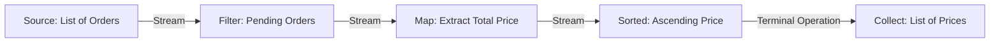

# Streams & Functional Programming

## Introduction
Introduced in Java 8, the Stream API and Functional Interfaces brought functional programming paradigms to Java. They allow developers to process sequences of elements declaratively, enabling concise, readable, and parallelizable data-processing pipelines.

## Problem Statement
Prior to Java 8, manipulating collections (e.g., filtering inactive users, mapping them to their emails, sorting them, and grouping them by region) required writing verbose imperative loops and conditional blocks. This approach requires managing indices, iterators, and temporary lists, making the code hard to read, prone to off-by-one errors, and difficult to parallelize safely.

## Why this exists
To enable declarative programming. Instead of writing loops to coordinate *how* data is processed, developers specify *what* transformations should occur. The Stream API optimizes execution, enabling automatic parallelization over multi-core CPUs.

## Real-world analogy
Consider a **water treatment facility**.
- **Imperative Approach (Pre-Java 8):** A worker manually carries buckets of water between separate processing stations: first filtering out debris, then boiling the water, and finally bottling it. The worker manages each step manually.
- **Declarative Stream Approach (Java 8+):** The facility installs a unified pipeline. Water enters at the source (lake) and flows through inline filters, heating pipes, and packaging valves without manual transport. If capacity demands increase, you install parallel pipes (parallel streams) without modifying the stations themselves.

Another analogy is a **mail sorting room**. Letters flow down a conveyor belt. Sorters filter out junk mail, scan barcodes to extract addresses, sort them by postal code, and package them into delivery bins, forming a structured pipeline.

## Definition
- **Stream:** A sequence of elements supporting sequential and parallel aggregate operations, representing a pipeline of transformations rather than a storage structure.
- **Functional Interface:** An interface containing exactly one abstract method, which can be represented by lambda expressions or method references (e.g., `Predicate`, `Function`, `Consumer`).
- **Pure Function:** A function whose output is determined solely by its input values, without causing side effects in the external environment.

## Internal working / Mermaid diagram



## Python/Java implementation

### Bad implementation
*An imperative approach using nested loops and conditional statements to filter, sort, and group user data, resulting in verbose and tightly coupled logic.*

```java
package bad;

import java.util.*;

class User {
    private final String name;
    private final int age;
    private final String region;

    public User(String name, int age, String region) {
        this.name = name;
        this.age = age;
        this.region = region;
    }

    public String getName() { return name; }
    public int getAge() { return age; }
    public String getRegion() { return region; }
}

public class ImperativeProcessing {
    public Map<String, List<String>> getAdultUserNamesByRegion(List<User> users) {
        // Bad: Verbose imperative looping and manual collection management
        Map<String, List<String>> result = new HashMap<>();
        for (User user : users) {
            if (user.getAge() >= 18) { // Filter
                String region = user.getRegion();
                if (!result.containsKey(region)) {
                    result.put(region, new ArrayList<>());
                }
                result.get(region).add(user.getName()); // Map and group
            }
        }
        return result;
    }
}
```

### Better implementation
*Using the Stream API, but introducing side effects by mutating external variables inside a `forEach` loop, which makes the stream unsafe for parallel execution.*

```java
package better;

import java.util.*;

class User {
    private final String name;
    private final int age;
    private final String region;
    public User(String name, int age, String region) {
        this.name = name;
        this.age = age;
        this.region = region;
    }
    public String getName() { return name; }
    public int getAge() { return age; }
    public String getRegion() { return region; }
}

public class StatefulStreamProcessing {
    public Map<String, List<String>> processUsers(List<User> users) {
        Map<String, List<String>> result = new HashMap<>(); // External state

        // Violates functional principles: modifying external variables inside stream pipeline
        // This will crash or cause race conditions if parallelStream() is used!
        users.stream()
             .filter(u -> u.getAge() >= 18)
             .forEach(u -> {
                 result.computeIfAbsent(u.getRegion(), k -> new ArrayList<>()).add(u.getName());
             });

        return result;
    }
}
```

### Best implementation
*A pure functional pipeline using declarative intermediate operations and collectors. The stream maintains no side effects, ensuring safety and enabling automatic parallelization.*

```java
package best;

import java.util.List;
import java.util.Map;
import java.util.Objects;
import java.util.stream.Collectors;

public record User(String name, int age, String region) {
    public User {
        Objects.requireNonNull(name);
        Objects.requireNonNull(region);
    }
}

class UserStreamProcessor {

    // Pure functional pipeline: no external mutations or side effects
    public Map<String, List<String>> getAdultUserNamesByRegion(List<User> users) {
        return users.stream()
            .filter(user -> user.age() >= 18) // Predicate check
            .collect(Collectors.groupingBy(
                User::region, // Grouping Key classifier
                Collectors.mapping(User::name, Collectors.toList()) // Downstream collector mapping
            ));
    }

    // Parallel stream execution: thread-safe due to the absence of shared mutable state
    public Map<String, List<String>> getAdultUserNamesByRegionParallel(List<User> users) {
        return users.parallelStream() // Leverages common ForkJoinPool automatically
            .filter(user -> user.age() >= 18)
            .collect(Collectors.groupingBy(
                User::region,
                Collectors.mapping(User::name, Collectors.toList())
            ));
    }
}
```

## Step-by-step explanation
1. **Initiate the Stream:** We call `users.stream()` to open a stream pipeline over the data list.
2. **Apply Lazy Filter:** The `.filter()` intermediate operation evaluates users against the predicate `user.age() >= 18`. This is lazy; elements are not processed yet.
3. **Execute Grouping Terminal Operation:** We call `.collect(Collectors.groupingBy(...))` to trigger the pipeline.
4. **Group and Map Elements:** The collector groups users by their region and maps their user objects to name strings, accumulating the results in a map.

## Multiple real-world examples
- **Financial Transaction Analysis:** Taking a list of transaction records, filtering out failed payments, converting currencies, and summing the total value.
- **Log Processing:** Reading application log files, filtering for warning or error levels, and collecting them into diagnostic reports.
- **E-commerce Ordering:** Filtering cart items, applying discounts, and generating totals dynamically.

## Pros
- **Improved Readability:** Declarative pipelines clearly document the transformation steps (Filter $\to$ Map $\to$ Group).
- **Concise Code:** Reduces boilerplate code compared to imperative loops.
- **Safe Parallelization:** Parallel streams execute concurrently across CPU cores without requiring manual lock management, as long as functions are pure.

## Cons
- **Debugging Complexity:** Anonymous lambdas make it difficult to step through stream pipelines using standard debuggers.
- **Allocation Overhead:** Short-lived stream and collector objects can add minor memory overhead in high-throughput applications compared to raw loops.

## Interview questions

### Beginner
- **Q: What is the difference between intermediate and terminal operations in the Stream API?**
- **A:** Intermediate operations (e.g., `filter()`, `map()`) transform the stream and return a new stream. They are lazy and do not execute immediately. Terminal operations (e.g., `collect()`, `count()`) consume the stream, return a non-stream result, and trigger the execution of the entire pipeline.

### Intermediate
- **Q: What is a Functional Interface? Name three common ones introduced in Java 8.**
- **A:** A Functional Interface is an interface containing exactly one abstract method. Common ones include:
  - `Predicate<T>`: Evaluates an input and returns a boolean (used in `filter()`).
  - `Function<T, R>`: Maps an input type to an output type (used in `map()`).
  - `Consumer<T>`: Processes an input and returns no result (used in `forEach()`).

### Senior
- **Q: Why is mutating external state inside a lambda expression (like modifying a standard ArrayList) dangerous inside a Stream?**
- **A:** Lambdas used in streams should be pure and free of side effects. If a lambda modifies shared mutable variables outside the stream, running the stream in parallel (`parallelStream()`) will cause race conditions, data loss, or concurrent modification exceptions. Parallel streams require stateless operations to run safely.

### Staff Engineer
- **Q: How does the JVM optimize Stream execution under the hood (loop fusion and lazy evaluation)?**
- **A:**
  - **Lazy Evaluation:** When intermediate operations are called, the JVM builds a linked pipeline of stages (`AbstractPipeline`). No data is pulled from the source.
  - **Loop Fusion:** When a terminal operation is called, the JVM compiles the pipeline stages. It merges multiple operations (e.g., a filter, a map, and another filter) into a single pass over the data. Instead of creating intermediate collections for each step, elements are processed through all stages individually, reducing memory overhead and loop passes.

## Common mistakes
- **Reusing a stream:** Trying to execute multiple terminal operations on the same stream instance, which throws an `IllegalStateException`.
- **Using side effects inside lambdas:** Modifying variables outside the stream scope, making it unsafe for parallel processing.

## Best practices
- Use method references (e.g., `User::name`) instead of lambdas when possible to keep code clean.
- Ensure all lambdas are pure functions that do not mutate external state.
- Use `parallelStream()` only when processing large collections with heavy computations, as the setup overhead can slow down small operations.

## When NOT to use
- **Trivial list iterations:** For simple, single-step loops (e.g., printing elements), a standard `for-each` loop is simpler and has less overhead.

## Comparison with similar concepts
- **Collection vs Stream:**
  - **Collection:** A data structure that holds elements in memory.
  - **Stream:** A pipeline of computations that pulls and transforms data from a source on-demand, without storing elements.

## Summary
The Stream API modernizes Java data processing by introducing declarative, functional pipelines. Writing stateless, pure lambdas prevents race conditions and enables safe parallelization.

## Related topics
- [Java Collections](../collections)
- [Multithreading & Concurrency](../../concurrency-java/multithreading)
- [JVM Garbage Collection](../../concurrency-java/garbage-collection)
