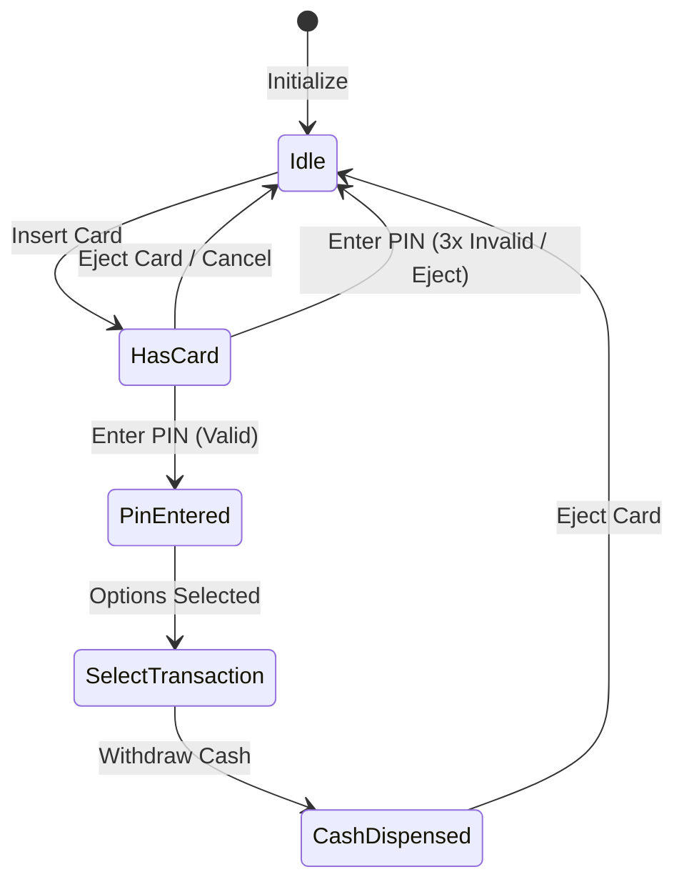
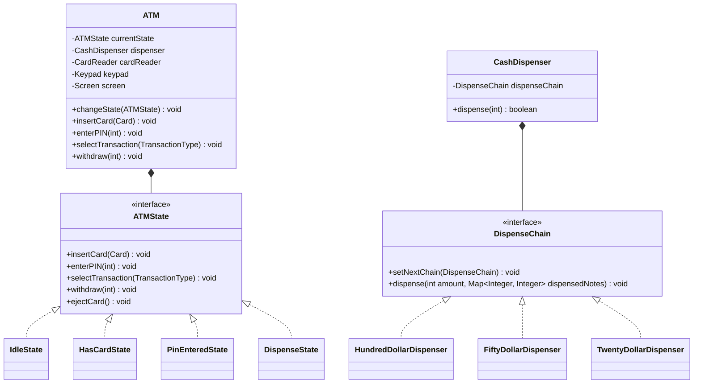

# ATM System Design

## Introduction
An Automated Teller Machine (ATM) is an electronic telecommunications device that enables financial institution customers to perform transactions (cash withdrawals, deposits, balance transfers) without direct teller interaction. Low-level design of an ATM showcases the State Pattern for managing hardware flows, and the Chain of Responsibility Pattern for currency denomination dispensing.

---

## Problem Statement
Design an ATM system that securely authenticates users via card insertion and PIN validation, processes financial actions (balance check, cash withdrawal, deposit), updates bank balances, manages physical cash cassettes, and handles transactional rollbacks if hardware malfunctions (e.g., cash dispenser jams).

---

## Why this exists
To coordinate hardware state switches and transaction consistency. An ATM contains physical devices (card reader, keypad, safe box, cash dispenser) that must function in a precise transactional sequence. If the network drops or the dispenser jams, the software must execute compensating actions to prevent user account discrepancies.

---

## Real-world analogy
Think of an automated vending machine:
- It starts in an **Idle** state. If you press buttons, nothing drops.
- Once you insert money (transitioning to **HasMoney**), pressing a button checks item price, verifies if the item is in stock, dispenses the item, and gives you change.
- If the item gets stuck in the dispenser, the machine must refund your money instead of keeping it.

---

## Definition
An **ATM System** is a state-managed hardware-software integration consisting of Card Readers, Safe Cassettes, Dispensers, Keypads, and State Controllers designed to process financial transactions safely.

---

## Key concepts
1. **State Pattern:** Encapsulating ATM behaviors in state entities (`IdleState`, `HasCardState`, `PinEnteredState`, `CashDispensingState`) to prevent conditional logic errors.
2. **Chain of Responsibility Pattern:** Distributing withdrawal amounts across multiple denomination cash cassettes (e.g., $100, $50, $20, $10 bills) sequentially.
3. **Transaction atomicity (ACID):** Coordinating bank account updates and physical cash release.
4. **Card Locking Safeguards:** Retaining a physical card inside the reader if a wrong PIN is input three times consecutively to prevent fraud.

---

## Internal working / Mermaid diagram

### State Transition Diagram


### Class Diagram


---

## Python/Java implementation

### 1. Bad Implementation: God Class with switch-cases and rigid calculations
A single massive class uses string statuses and conditional statements to track state, and uses hardcoded modulo math that cannot support dynamic cassette expansions.

```java
import java.util.*;

public class BadATM {
    private String state = "IDLE";
    private int cash = 10000;

    // CRITICAL BUG: Deep nested conditionals are highly bug-prone.
    // If the state logic grows, this class becomes unmanageable.
    public void enterPIN(int pin) {
        if (state.equals("HAS_CARD")) {
            if (pin == 1234) {
                state = "AUTHENTICATED";
                System.out.println("Authenticated");
            } else {
                state = "IDLE";
                System.out.println("Card Ejected");
            }
        } else if (state.equals("IDLE")) {
            System.out.println("Insert card first.");
        }
    }

    public void withdraw(int amount) {
        if (state.equals("AUTHENTICATED")) {
            if (amount <= cash) {
                // Hardcoded denomination math
                int hundreds = amount / 100;
                cash -= amount;
                System.out.println("Dispensed " + hundreds + " hundred dollar bills.");
            }
        }
    }
}
```

### 2. Better Implementation: Basic States but Missing Chain of Responsibility
Using distinct state classes, but dispensing cash using simple checks that cannot dynamically route between cassettes or handle jam rollbacks.

```java
class BetterCard {
    private final String cardNo;
    private final int pin;
    public BetterCard(String c, int p) { this.cardNo = c; this.pin = p; }
    public boolean verify(int pin) { return this.pin == pin; }
}

interface BetterState {
    void insertCard(BetterCard card);
    void enterPin(int pin);
    void withdraw(int amount);
}

public class BetterATM implements BetterState {
    private BetterState currentState;
    private BetterCard insertedCard;
    private int balance = 50000;

    public void setState(BetterState state) { this.currentState = state; }

    @Override
    public void insertCard(BetterCard card) {
        this.insertedCard = card;
        System.out.println("Card Inserted");
    }

    @Override
    public void enterPin(int pin) {
        if (insertedCard != null && insertedCard.verify(pin)) {
            System.out.println("PIN OK");
        }
    }

    @Override
    public void withdraw(int amount) {
        // BUG: Subtracts integer balance without calculating physical bill count.
        // If the machine has no $20s left, the transaction will succeed but fail to dispense.
        balance -= amount;
    }
}
```

### 3. Best Implementation: Fully Modular State Machine & Cash Dispenser Chain
Implementing the State Pattern for hardware control, the Chain of Responsibility Pattern for denominational bill extraction, physical sensors mocking, and compensating transactional rollbacks on jams.

```java
import java.util.*;
import java.util.concurrent.locks.ReentrantLock;

// 1. Transaction Types
enum TransactionType { BALANCE_INQUIRY, WITHDRAWAL }

// 2. State Interface
interface ATMState {
    void insertCard(Card card);
    void enterPIN(int pin);
    void selectTransaction(TransactionType type);
    void withdraw(int amount);
    void ejectCard();
}

// 3. Chain of Responsibility for Cash Dispensing
interface DispenseChain {
    void setNextChain(DispenseChain next);
    void dispense(int amount, Map<Integer, Integer> dispensedNotes);
}

abstract class BaseDispenser implements DispenseChain {
    protected DispenseChain next;
    protected final int denomination;
    protected int noteCount;

    public BaseDispenser(int denomination, int noteCount) {
        this.denomination = denomination;
        this.noteCount = noteCount;
    }

    @Override
    public void setNextChain(DispenseChain next) {
        this.next = next;
    }

    protected void processNext(int amount, Map<Integer, Integer> dispensedNotes) {
        if (amount > 0) {
            if (next != null) {
                next.dispense(amount, dispensedNotes);
            } else {
                throw new IllegalArgumentException("Cannot dispense the exact requested amount with current denominations.");
            }
        }
    }
}

class DollarDispenser extends BaseDispenser {
    public DollarDispenser(int denomination, int noteCount) {
        super(denomination, noteCount);
    }

    @Override
    public void dispense(int amount, Map<Integer, Integer> dispensedNotes) {
        if (amount >= denomination) {
            int numNotesNeeded = amount / denomination;
            int numNotesToDispense = Math.min(numNotesNeeded, noteCount);
            
            if (numNotesToDispense > 0) {
                dispensedNotes.put(denomination, numNotesToDispense);
                noteCount -= numNotesToDispense;
                amount -= (numNotesToDispense * denomination);
            }
        }
        processNext(amount, dispensedNotes);
    }
}

// 4. ATM Context Class
class ATM {
    private ATMState currentState;
    private final ATMState idleState = new IdleState(this);
    private final ATMState hasCardState = new HasCardState(this);
    private final ATMState pinEnteredState = new PinEnteredState(this);
    private final ATMState transactionSelectedState = new TransactionSelectedState(this);

    private Card currentCard;
    private final ReentrantLock lock = new ReentrantLock();
    private final DispenseChain dispenserChain;

    public ATM(int hundreds, int fifties, int twenties) {
        // Build Dispenser Chain: $100 -> $50 -> $20
        DispenseChain c1 = new DollarDispenser(100, hundreds);
        DispenseChain c2 = new DollarDispenser(50, fifties);
        DispenseChain c3 = new DollarDispenser(20, twenties);
        c1.setNextChain(c2);
        c2.setNextChain(c3);
        this.dispenserChain = c1;
        this.currentState = idleState;
    }

    public void insertCard(Card card) { currentState.insertCard(card); }
    public void enterPIN(int pin) { currentState.enterPIN(pin); }
    public void selectTransaction(TransactionType type) { currentState.selectTransaction(type); }
    public void withdraw(int amount) { currentState.withdraw(amount); }
    public void ejectCard() { currentState.ejectCard(); }

    public void changeState(ATMState state) { this.currentState = state; }
    public void setCard(Card card) { this.currentCard = card; }
    public Card getCard() { return currentCard; }

    public DispenseChain getDispenserChain() { return dispenserChain; }
    public ReentrantLock getLock() { return lock; }

    // State Objects Getters
    public ATMState getIdleState() { return idleState; }
    public ATMState getHasCardState() { return hasCardState; }
    public ATMState getPinEnteredState() { return pinEnteredState; }
    public ATMState getTransactionSelectedState() { return transactionSelectedState; }
}

// 5. Card Representation
class Card {
    private final String cardNo;
    private final int correctPin;
    private final String accountId;
    private int pinAttemptsLeft = 3;

    public Card(String cardNo, int correctPin, String accountId) {
        this.cardNo = cardNo;
        this.correctPin = correctPin;
        this.accountId = accountId;
    }

    public boolean checkPin(int pin) {
        if (pin == correctPin) {
            pinAttemptsLeft = 3;
            return true;
        }
        pinAttemptsLeft--;
        return false;
    }

    public boolean isLocked() { return pinAttemptsLeft <= 0; }
    public String getAccountId() { return accountId; }
}

// 6. Concrete State Implementations
class IdleState implements ATMState {
    private final ATM atm;
    public IdleState(ATM atm) { this.atm = atm; }

    @Override
    public void insertCard(Card card) {
        if (card.isLocked()) {
            System.out.println("This card is locked. Cannot insert.");
            return;
        }
        atm.setCard(card);
        atm.changeState(atm.getHasCardState());
        System.out.println("Card inserted. Please enter PIN.");
    }
    @Override public void enterPIN(int pin) { System.out.println("Insert card first."); }
    @Override public void selectTransaction(TransactionType type) { System.out.println("Insert card first."); }
    @Override public void withdraw(int amount) { System.out.println("Insert card first."); }
    @Override public void ejectCard() { System.out.println("No card inserted."); }
}

class HasCardState implements ATMState {
    private final ATM atm;
    public HasCardState(ATM atm) { this.atm = atm; }

    @Override public void insertCard(Card card) { System.out.println("Card already inserted."); }
    
    @Override
    public void enterPIN(int pin) {
        Card card = atm.getCard();
        if (card.checkPin(pin)) {
            atm.changeState(atm.getPinEnteredState());
            System.out.println("PIN Verified. Please select transaction.");
        } else {
            System.out.println("Incorrect PIN.");
            if (card.isLocked()) {
                System.out.println("Too many incorrect attempts. Card locked inside machine.");
                atm.setCard(null);
                atm.changeState(atm.getIdleState());
            }
        }
    }
    @Override public void selectTransaction(TransactionType type) { System.out.println("Enter PIN first."); }
    @Override public void withdraw(int amount) { System.out.println("Enter PIN first."); }
    @Override
    public void ejectCard() {
        atm.setCard(null);
        atm.changeState(atm.getIdleState());
        System.out.println("Card returned.");
    }
}

class PinEnteredState implements ATMState {
    private final ATM atm;
    public PinEnteredState(ATM atm) { this.atm = atm; }

    @Override public void insertCard(Card card) { System.out.println("Card already inserted."); }
    @Override public void enterPIN(int pin) { System.out.println("PIN already verified."); }
    
    @Override
    public void selectTransaction(TransactionType type) {
        System.out.println("Transaction selected: " + type);
        atm.changeState(atm.getTransactionSelectedState());
    }
    @Override public void withdraw(int amount) { System.out.println("Select transaction type first."); }
    @Override
    public void ejectCard() {
        atm.setCard(null);
        atm.changeState(atm.getIdleState());
        System.out.println("Card returned.");
    }
}

class TransactionSelectedState implements ATMState {
    private final ATM atm;
    public TransactionSelectedState(ATM atm) { this.atm = atm; }

    @Override public void insertCard(Card card) { System.out.println("Card already inserted."); }
    @Override public void enterPIN(int pin) { System.out.println("PIN already verified."); }
    @Override public void selectTransaction(TransactionType type) { System.out.println("Transaction already selected."); }
    
    @Override
    public void withdraw(int amount) {
        atm.getLock().lock();
        try {
            Map<Integer, Integer> notes = new HashMap<>();
            try {
                // Attempt to run the dispenser chain
                atm.getDispenserChain().dispense(amount, notes);
                
                // Simulate Bank Database check and update
                boolean bankTxSuccess = executeBankDeduction(atm.getCard().getAccountId(), amount);
                
                if (bankTxSuccess) {
                    // Simulate physical dispenser mechanism check
                    boolean physicalJam = simulateDispenseJam();
                    if (physicalJam) {
                        System.out.println("Dispenser Jammed! Aborting physical payout.");
                        rollbackBankDeduction(atm.getCard().getAccountId(), amount);
                        throw new IllegalStateException("Hardware failure: Dispenser Jam.");
                    }
                    
                    System.out.println("Successfully dispensed notes: " + notes);
                } else {
                    System.out.println("Insufficient bank account balance.");
                }
            } catch (Exception e) {
                System.out.println("Transaction failed: " + e.getMessage());
            } finally {
                ejectCard();
            }
        } finally {
            atm.getLock().unlock();
        }
    }

    private boolean executeBankDeduction(String account, int val) { return true; }
    private void rollbackBankDeduction(String account, int val) {
        System.out.println("RECONCILIATION: Account " + account + " credited back $" + val);
    }
    private boolean simulateDispenseJam() { return false; } // false = no jam

    @Override
    public void ejectCard() {
        atm.setCard(null);
        atm.changeState(atm.getIdleState());
        System.out.println("Card returned.");
    }
}
```

---

## Step-by-step explanation
1. **State Redirection**: In the `Best` implementation, state changes execute through `atm.changeState()`. Attempting an action delegates directly to `currentState.enterPIN()` or `currentState.withdraw()`, protecting the logic from bad states (e.g., executing checkout without PIN authentication).
2. **Chain of Responsibility**: When `dispense(460)` is invoked, it passes through the chain:
   - `$100 Dispenser` checks: $460 \ge 100$. It dispenses four $100 bills, updates inventory, and routes the remaining $60 to the next handler.
   - `$50 Dispenser` checks: $60 \ge 50$. It dispenses one $50 bill, updates inventory, and routes $10 to the next handler.
   - `$20 Dispenser` checks: $10 < 20$. It passes $10 to the next handler (which is null, throwing an exception since we cannot dispense $10 bills).
3. **Transaction Rollback (Compensation)**: If the dispenser experiences a physical jam (`simulateDispenseJam() = true`) *after* the bank database deduction returns successfully, the software executes `rollbackBankDeduction()`. This refunds the account balance and ejects the card.

---

## Multiple real-world examples
1. **Bank Branch ATMs:** Multi-function machines supporting checks printing, cash deposition verification, and envelope management.
2. **Drive-Through ATMs:** High-security structures with optimized lighting, transaction timers, and screen filters.
3. **Foreign Exchange Terminals:** ATMs holding multiple currencies, dynamic rate exchange calculations, and fee strategies.

---

## Pros
- **State Cleanliness:** The State Pattern keeps the code modular, preventing complex conditional nesting.
- **Cassette Extensibility:** The Chain of Responsibility allows easily adding new denomination handlers (like a $10 or $5 cassette) without modifying other cassettes.
- **Rollback Safety:** Ensures user balances remain consistent even if mechanical systems fail.

---

## Cons
- **Lock Contention:** If multiple interfaces attempt to mutate cassette counts simultaneously (e.g., dual-sided ATMs), hardware locks block caller execution.
- **State Count Overhead:** Maintaining separate classes for each minor state status increases file counts.

---

## Interview questions

### Beginner
- **Q: Why is the State pattern preferred over switch-case loops for an ATM design?**
  - **A:** An ATM has complex states (Idle, HasCard, Authenticated, etc.). Using switch-cases leads to large, unreadable code blocks where adding a new state requires modifying every single transaction method. The State pattern isolates state-specific behavior into individual classes.

### Intermediate
- **Q: How does the cash dispenser handle cases where the exact requested withdrawal amount cannot be met by the available denominations?**
  - **A:** By implementing the Chain of Responsibility, if a remaining amount reaches the end of the chain (e.g., requesting $35 when only $20 and $50 notes are available), the final handler fails to resolve it, throwing an exception that rolls back the transaction before any cash is dispensed.

### Senior
- **Q: Explain how you would design the balance inquiry transaction to ensure it reflects pending deposits/withdrawals.**
  - **A:** Balance inquiry should query the bank ledger database using strong consistency models (Read Committed isolation with Select-For-Update locks) rather than caching values locally. This guarantees that pending transactions on mobile or online channels are reconciled before displaying the balance.

### Staff Engineer
- **Q: How would you design a highly available ATM network transaction router (switch) that coordinates millions of transactions between 10,000 ATMs and 20 different bank systems, ensuring zero double-dispenses?**
  - **A:** 
    - **Architecture:** We build an ATM Switch using an event-driven microservices model. The Switch communicates with ATMs using ISO 8583 message packets.
    - **Dual-Write Mitigation (TCC Pattern):** To prevent double-dispensing, we implement the **Try-Confirm-Cancel (TCC)** pattern.
      1. **Try:** The ATM reserves physical cash locally, and the Switch requests a temporary hold on the bank server.
      2. **Confirm:** Once both reservations succeed, the Switch tells the ATM to dispense. If the dispenser confirms payout, the Switch fires a commit message to finalize the account deduction.
      3. **Cancel:** If the ATM reports a physical failure (jam, power cut) or timeouts, the Switch sends a cancel transaction to release the hold, ensuring zero discrepancies.
    - **Dead-Letter Queue (DLQ) & Reconciliation:** Any incomplete transaction state is piped to a Kafka topic for automatic asynchronous reconciliation within 5 minutes.

---

## Common mistakes
- **Subtracting money before checking inventory:** Deducting funds from the bank account before verifying if the cash cassettes hold sufficient notes.
- **Hardcoding cassette calculations:** Using static division math instead of utilizing dynamic chains.
- **Neglecting card locking rules:** Failing to retain cards after multiple incorrect PIN entries.

---

## Best practices
- **Enforce State Transitions:** Ensure only the active state can trigger a transition to the next state.
- **Implement Heartbeats:** Periodically monitor network connection statuses to block transactions if the connection is lost.
- **Keep cassettes isolated:** Protect cassette counts inside thread-safe wrappers.

---

## When NOT to use
- **Pure Digital Wallets:** For digital payment apps (like PayPal or Venmo) where physical hardware cash dispensing is completely absent.

---

## Comparison with similar concepts

| Strategy | State Pattern (ATM Flow) | Strategy Pattern (Dispense Rules) |
| :--- | :--- | :--- |
| **Primary Goal** | Change object behavior when internal state changes | Encapsulate interchangeable algorithms (e.g. prioritize small bills vs large bills) |
| **State Transitions** | Managed dynamically by state classes | Set once by the caller context |
| **Structural Impact** | Creates multiple state classes | Creates multiple algorithm classes |

---

## Summary
Designing an ATM system requires separating state transitions from execution logic. Using the State Pattern for transaction flows and the Chain of Responsibility for cash dispensing ensures safe, consistent banking operations.

---

## Related topics
- [Elevator System](../elevator)
- [Design Patterns](../../../01-design-patterns/behavioral/state)
- [SOLID Principles](../../solid-principles/single-responsibility-principle)
