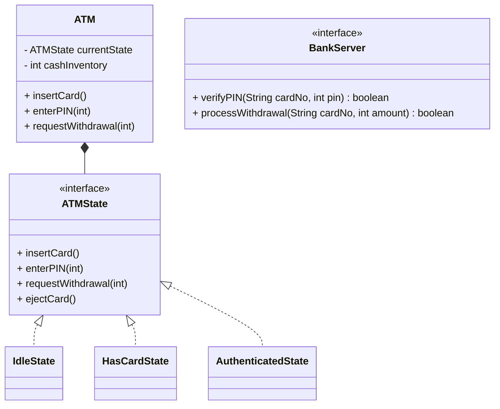

# ATM System

## Problem Statement
Design an Automated Teller Machine (ATM) system. The system should authenticate a user via a debit card and PIN, allow them to check their balance, withdraw cash, and deposit cash/checks. The ATM must accurately track its physical cash inventory and handle transactions safely.

## Requirements

### Functional Requirements
1. **Authentication:** Verify user identity via Card number and PIN.
2. **Transactions:** Support Balance Inquiry, Cash Withdrawal, and Deposit.
3. **Hardware Integration:** The software must interact with hardware components: Card Reader, Cash Dispenser, Keypad, and Screen.
4. **Inventory:** The ATM has a finite amount of physical cash. It cannot dispense more cash than it holds.

### Non-Functional Requirements
1. **Security:** PINs and card data must not be stored in plaintext. 
2. **Consistency (ACID):** If money leaves the user's account, it MUST exit the dispenser. If the dispenser jams, the money MUST be rolled back into the user's account.
3. **State Management:** The ATM flows through strict states (Idle -> Card Inserted -> PIN Verified -> Transaction Select -> Dispense).

## Core Pattern: The State Pattern
An ATM behaves completely differently based on its current state. 
- If you press "Enter" when no card is inserted, nothing happens.
- If you press "Enter" after typing a PIN, it verifies the PIN.
- If you press "Enter" after typing an amount, it dispenses cash.
This is a textbook use case for the **State Design Pattern**, which avoids a massive, unreadable `switch-case` block.

## Class Diagram



## Implementation (Java)

```java
// THE STATE INTERFACE
interface ATMState {
    void insertCard();
    void enterPIN(int pin);
    void requestWithdrawal(int amount);
    void ejectCard();
}

// THE CONTEXT (The ATM)
class ATM {
    ATMState idleState;
    ATMState hasCardState;
    ATMState authenticatedState;
    
    ATMState currentState;
    int cashInventory = 10000; // $10,000 inside the machine

    public ATM() {
        idleState = new IdleState(this);
        hasCardState = new HasCardState(this);
        authenticatedState = new AuthenticatedState(this);
        currentState = idleState; // Start in Idle
    }

    public void setATMState(ATMState state) { this.currentState = state; }
    
    // Delegate actions to the current state
    public void insertCard() { currentState.insertCard(); }
    public void enterPIN(int pin) { currentState.enterPIN(pin); }
    public void requestWithdrawal(int amount) { currentState.requestWithdrawal(amount); }
}

// CONCRETE STATES
class IdleState implements ATMState {
    ATM atm;
    public IdleState(ATM atm) { this.atm = atm; }

    public void insertCard() {
        System.out.println("Card inserted.");
        atm.setATMState(atm.hasCardState);
    }
    public void enterPIN(int pin) { System.out.println("No card inserted."); }
    public void requestWithdrawal(int amount) { System.out.println("No card inserted."); }
    public void ejectCard() { System.out.println("No card to eject."); }
}

class HasCardState implements ATMState {
    ATM atm;
    public HasCardState(ATM atm) { this.atm = atm; }

    public void insertCard() { System.out.println("Card already inserted."); }
    public void enterPIN(int pin) {
        // Assume API call to Bank verifies PIN is 1234
        if (pin == 1234) {
            System.out.println("PIN Correct.");
            atm.setATMState(atm.authenticatedState);
        } else {
            System.out.println("Incorrect PIN.");
            ejectCard();
        }
    }
    public void requestWithdrawal(int amount) { System.out.println("Enter PIN first."); }
    public void ejectCard() {
        System.out.println("Card ejected.");
        atm.setATMState(atm.idleState);
    }
}

class AuthenticatedState implements ATMState {
    ATM atm;
    public AuthenticatedState(ATM atm) { this.atm = atm; }

    public void insertCard() { System.out.println("Already authenticated."); }
    public void enterPIN(int pin) { System.out.println("Already authenticated."); }
    
    public void requestWithdrawal(int amount) {
        if (amount > atm.cashInventory) {
            System.out.println("ATM does not have enough cash.");
            return;
        }
        // Assume API call to Bank verifies user has enough funds
        System.out.println("Dispensing $" + amount);
        atm.cashInventory -= amount;
        ejectCard();
    }
    
    public void ejectCard() {
        System.out.println("Transaction complete. Card ejected.");
        atm.setATMState(atm.idleState);
    }
}
```

## Test Cases
1. **Happy Path:** User inserts card -> Enters valid PIN -> Requests $100 -> ATM dispenses $100 -> Ejects Card.
2. **Invalid State Action:** User walks up to an idle ATM and presses "Withdraw $100" without inserting a card. State handles it gracefully by doing nothing or prompting "Insert Card".
3. **ATM Empty:** User is authenticated and requests $500. The ATM only has $200 in inventory. The ATM must reject the transaction before hitting the bank server.

## Edge Cases
1. **Hardware Failure:** If the Cash Dispenser physically jams while dispensing $100, the ATM software must catch the hardware exception and execute a **Compensating Transaction** via the BankServer API to reverse the $100 deduction from the user's account. (Saga Pattern).
2. **Network Timeout:** If the ATM asks the Bank Server to deduct $100 and the network drops before receiving a response, the ATM cannot dispense the cash. It must queue a reconciliation check to verify with the bank if the deduction went through, and reverse it if it did.

## Improvements & Extensions
- **Chain of Responsibility for Dispensing:** A real ATM doesn't just subtract an integer. It has cassettes of physical bills ($100s, $50s, $20s). The `Dispense` logic should use the Chain of Responsibility pattern. The $100 handler dispenses as many $100s as possible, then passes the remainder to the $50 handler, and so on.
