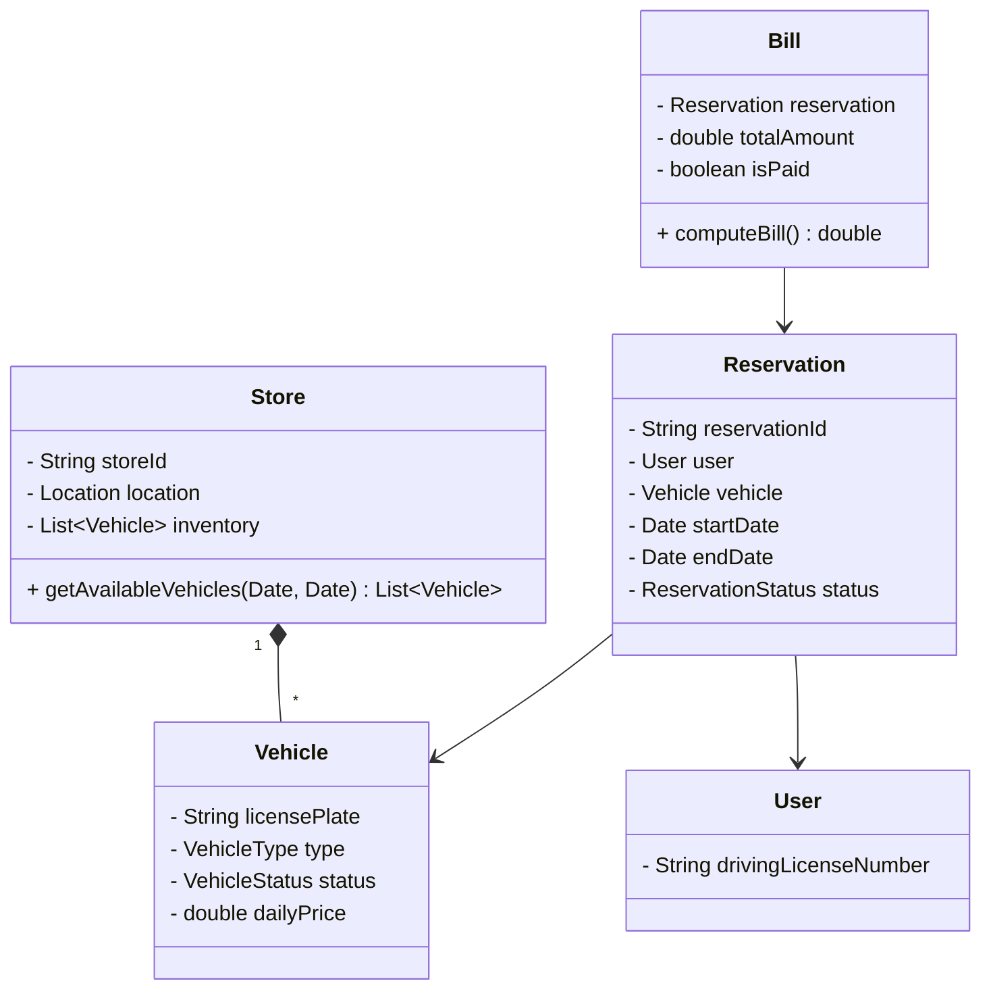

# Car Rental System

## Problem Statement
Design a Car Rental System (like Hertz or Enterprise). The system must maintain an inventory of cars across multiple store locations, allow users to search for available cars by type and date, make reservations, handle the physical pickup and return of the car, and process billing.

## Requirements

### Functional Requirements
1. **Inventory:** Multiple Store locations. Each store has an inventory of Vehicles (Car, SUV, Van).
2. **Search:** Users can search for available cars in a specific Store for a specific Date Range.
3. **Reservation:** Users can reserve a car. Once reserved, the car cannot be booked by anyone else for those dates.
4. **Billing:** Calculate the final bill based on the duration, vehicle type, and any additional equipment (GPS, Child Seat).

### Non-Functional Requirements
1. **Concurrency:** Prevent double-booking if two users try to book the exact same car for the exact same dates simultaneously.
2. **Scalability:** Must support high read volume for searching.

## Class Diagram



## Implementation (Java Skeleton)

```java
import java.util.*;
import java.time.LocalDate;
import java.time.temporal.ChronoUnit;

enum VehicleStatus { AVAILABLE, RESERVED, IN_USE, MAINTENANCE }

class Vehicle {
    String licensePlate;
    double dailyPrice;
    
    // In a real system, you don't just store "status". 
    // You must store a calendar of WHEN it is booked.
    List<Reservation> bookings = new ArrayList<>();

    public Vehicle(String licensePlate, double dailyPrice) {
        this.licensePlate = licensePlate;
        this.dailyPrice = dailyPrice;
    }

    // Critical method to check if a car is free for a date range
    public boolean isAvailable(LocalDate start, LocalDate end) {
        for (Reservation r : bookings) {
            // Check for date overlap
            if (start.isBefore(r.endDate) && end.isAfter(r.startDate)) {
                return false; // Overlaps with an existing reservation!
            }
        }
        return true;
    }
}

class Store {
    List<Vehicle> inventory = new ArrayList<>();

    public List<Vehicle> search(LocalDate start, LocalDate end) {
        List<Vehicle> available = new ArrayList<>();
        for (Vehicle v : inventory) {
            if (v.isAvailable(start, end)) {
                available.add(v);
            }
        }
        return available;
    }
}

class Reservation {
    Vehicle vehicle;
    LocalDate startDate;
    LocalDate endDate;

    public Reservation(Vehicle vehicle, LocalDate start, LocalDate end) {
        this.vehicle = vehicle;
        this.startDate = start;
        this.endDate = end;
    }
}

class RentalSystem {
    // Thread-safe booking method
    public synchronized boolean bookVehicle(Vehicle vehicle, LocalDate start, LocalDate end) {
        if (!vehicle.isAvailable(start, end)) {
            System.out.println("Vehicle no longer available for these dates.");
            return false;
        }
        
        Reservation res = new Reservation(vehicle, start, end);
        vehicle.bookings.add(res);
        System.out.println("Successfully booked " + vehicle.licensePlate);
        return true;
    }

    public double generateBill(Reservation res) {
        long days = ChronoUnit.DAYS.between(res.startDate, res.endDate);
        if (days == 0) days = 1; // Minimum 1 day charge
        return days * res.vehicle.dailyPrice;
    }
}
```

## Test Cases
1. **Happy Path Search:** User searches for a car from Jan 1 to Jan 5. System finds a car with no bookings and returns it.
2. **Booking Overlap:** Car A is booked Jan 1 to Jan 5. User searches for Jan 4 to Jan 10. Car A `isAvailable()` returns false because Jan 4 and 5 overlap. Car A is hidden from search results.
3. **Double Booking:** Two users see Car A available on their screens. Both click "Book" at the exact same millisecond. The `synchronized` block in `bookVehicle()` ensures the first user gets it, and the second user's check fails and throws an error.

## Edge Cases
1. **Late Returns:** If a user returns a car 3 days late, the system must generate an updated Bill charging penalty fees. More importantly, this late return might overlap with the NEXT person's reservation for that car! The system must gracefully handle reassigning the next person to a new vehicle of the same tier.

## Improvements & Extensions
- **Decorator Pattern for Add-ons:** A base rental is $50/day. A user wants to add GPS ($5/day) and a Child Seat ($10/day). Instead of creating a `CarWithGPSAndSeat` class, use the Decorator Pattern to dynamically wrap the `Bill` calculation, keeping the code highly flexible as the company adds new optional equipment.
