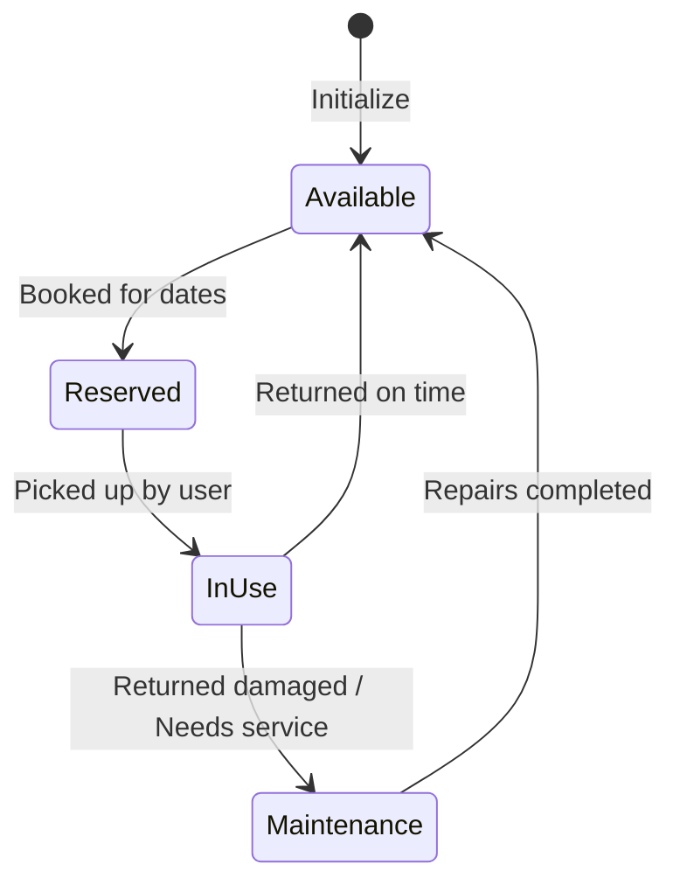
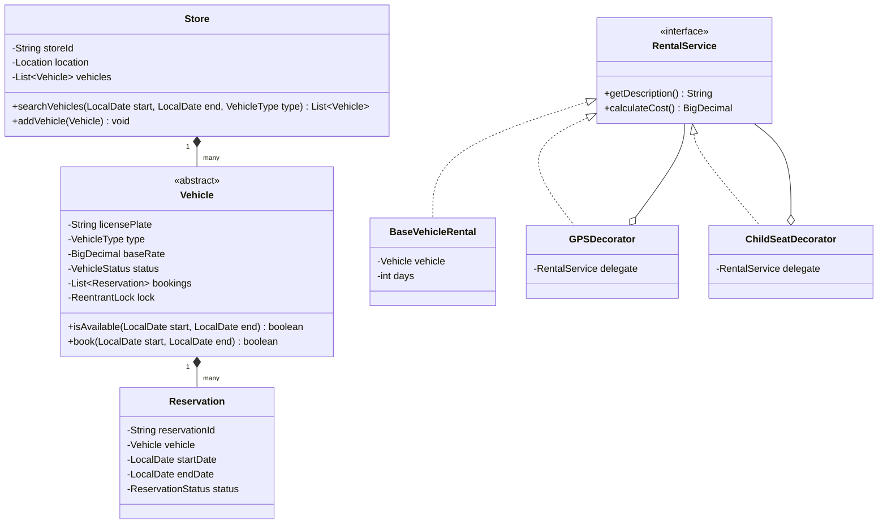

# Car Rental System Design

## Introduction
A Car Rental System (like Hertz or Enterprise) coordinates the logistics of renting out vehicles to customers across multiple store locations. Low-level design of this system showcases date-range overlap validation, the Decorator Pattern for add-ons (GPS, child seats), and state machines to manage vehicle lifecycles (available, in-use, maintenance).

---

## Problem Statement
Design a multi-store Car Rental System. The system must support vehicle catalog searches by date and location, reservation bookings, checkout returns, billing with dynamic add-ons, and payment processing. It must enforce thread safety to prevent double-booking the same vehicle for overlapping dates and handle late return penalties gracefully.

---

## Why this exists
To manage vehicle fleets across locations. Without transaction validation, multiple customers can book the same vehicle for the same dates. A robust system separates stores from inventory calendars, dynamically calculates invoices based on time and accessories, and handles state transitions cleanly.

---

## Real-world analogy
Think of booking a hotel room:
- The hotel chain has multiple locations (the **Stores**).
- When booking, you select dates. The system checks if any room is free for *that specific week* (the **Reservation Calendar**).
- You can add breakfast or spa access (the **Decorators**), which adds to your daily base rate.
- If you check out late, the system flags a late fee (the **Penalty Strategy**).

---

## Definition
A **Car Rental System** is a reservation coordination system consisting of Stores, Vehicles, Calendars, Invoices, and Decorators designed to manage vehicle lifecycles, book date slots, and calculate rental bills.

---

## Key concepts
1. **Overlap Validation:** Ensuring that if reservation $A$ runs from $[S_A, E_A]$ and reservation $B$ runs from $[S_B, E_B]$, they do not overlap:
   $$S_A < E_B \quad \text{and} \quad E_A > S_B$$
2. **Decorator Pattern for Add-ons:** Dynamically wrapping base vehicle rates with accessory fees (e.g. GPS, child seats, insurance) without subclassing.
3. **Vehicle State Machine:** Transitioning vehicle availability through `AVAILABLE`, `RESERVED`, `IN_USE`, and `MAINTENANCE` states.
4. **Late Return Management:** Recalculating bills and re-routing subsequent reservations if a vehicle is returned late.

---

## Internal working / Mermaid diagram

### Vehicle State Transitions


### Class Diagram


---

## Python/Java implementation

### 1. Bad Implementation: Array Lists without Date Safety
Using primitive lists without checking for date overlaps allows multiple bookings for the same dates, and lacking thread safety causes data races under concurrent bookings.

```java
import java.util.*;

public class BadRentalSystem {
    // CRITICAL BUG: Lacks date range validation.
    // If a car is booked from Jan 1-5, this code will still allow booking on Jan 3.
    // No thread safety; concurrent operations will cause double bookings.
    public List<Map<String, String>> bookings = new ArrayList<>();

    public boolean book(String plate, String start, String end) {
        Map<String, String> booking = new HashMap<>();
        booking.put("plate", plate);
        booking.put("start", start);
        booking.put("end", end);
        bookings.add(booking);
        return true;
    }
}
```

### 2. Better Implementation: OOP Structure with Naive Synchronization
Using correct object separations, but locking the entire catalog for bookings, causing thread bottlenecks.

```java
import java.util.*;
import java.time.LocalDate;

class BetterVehicle {
    String plate;
    List<BetterReservation> bookings = new ArrayList<>();

    public boolean isAvailable(LocalDate s, LocalDate e) {
        for (BetterReservation r : bookings) {
            if (s.isBefore(r.end) && e.isAfter(r.start)) return false;
        }
        return true;
    }
}
class BetterReservation {
    LocalDate start, end;
}

public class BetterRentalService {
    private final List<BetterVehicle> vehicles = new ArrayList<>();

    // BUG: Global synchronization locks the entire catalog.
    // If user A is booking Car 1, user B is blocked from booking Car 2.
    public synchronized boolean makeBooking(BetterVehicle v, LocalDate s, LocalDate e) {
        if (!v.isAvailable(s, e)) return false;
        BetterReservation res = new BetterReservation();
        res.start = s; res.end = e;
        v.bookings.add(res);
        return true;
    }
}
```

### 3. Best Implementation: High-Concurrency System with Decorator Pattern
Implementing the Decorator Pattern for rental add-ons, thread-safe reservations using fine-grained locks per vehicle, and strict date-overlap validation.

```java
import java.math.BigDecimal;
import java.time.LocalDate;
import java.time.temporal.ChronoUnit;
import java.util.*;
import java.util.concurrent.*;
import java.util.concurrent.locks.ReentrantLock;

// 1. Enums
enum VehicleType { CAR, SUV, VAN }
enum VehicleStatus { AVAILABLE, RESERVED, IN_USE, MAINTENANCE }
enum ReservationStatus { ACTIVE, COMPLETED, CANCELLED }

// 2. Base Vehicle Entity
abstract class Vehicle {
    private final String licensePlate;
    private final VehicleType type;
    private final BigDecimal dailyRate;
    private VehicleStatus status = VehicleStatus.AVAILABLE;

    private final List<Reservation> bookings = new CopyOnWriteArrayList<>();
    private final ReentrantLock lock = new ReentrantLock();

    public Vehicle(String licensePlate, VehicleType type, BigDecimal dailyRate) {
        this.licensePlate = licensePlate;
        this.type = type;
        this.dailyRate = dailyRate;
    }

    public boolean isAvailable(LocalDate start, LocalDate end) {
        for (Reservation r : bookings) {
            if (r.getStatus() == ReservationStatus.CANCELLED) continue;
            // Overlap check formula: Start1 < End2 AND End1 > Start2
            if (start.isBefore(r.getEndDate()) && end.isAfter(r.getStartDate())) {
                return false; // Date overlap
            }
        }
        return true;
    }

    public boolean reserve(LocalDate start, LocalDate end, String reservationId) {
        lock.lock();
        try {
            if (!isAvailable(start, end)) return false;
            Reservation reservation = new Reservation(reservationId, this, start, end);
            bookings.add(reservation);
            this.status = VehicleStatus.RESERVED;
            return true;
        } finally {
            lock.unlock();
        }
    }

    public String getLicensePlate() { return licensePlate; }
    public BigDecimal getDailyRate() { return dailyRate; }
    public void setStatus(VehicleStatus status) { this.status = status; }
}

class Car extends Vehicle {
    public Car(String licensePlate, BigDecimal dailyRate) {
        super(licensePlate, VehicleType.CAR, dailyRate);
    }
}

// 3. Reservation Record
class Reservation {
    private final String id;
    private final Vehicle vehicle;
    private final LocalDate startDate;
    private final LocalDate endDate;
    private ReservationStatus status = ReservationStatus.ACTIVE;

    public Reservation(String id, Vehicle vehicle, LocalDate startDate, LocalDate endDate) {
        this.id = id;
        this.vehicle = vehicle;
        this.startDate = startDate;
        this.endDate = endDate;
    }

    public void cancel() { this.status = ReservationStatus.CANCELLED; }
    public LocalDate getStartDate() { return startDate; }
    public LocalDate getEndDate() { return endDate; }
    public ReservationStatus getStatus() { return status; }
}

// 4. Decorator Pattern for Rental Bill Calculations
interface RentalService {
    String getDescription();
    BigDecimal calculateCost();
}

class BaseVehicleRental implements RentalService {
    private final Vehicle vehicle;
    private final int rentalDays;

    public BaseVehicleRental(Vehicle vehicle, int rentalDays) {
        this.vehicle = vehicle;
        this.rentalDays = rentalDays;
    }

    @Override
    public String getDescription() {
        return "Rental of " + vehicle.getLicensePlate() + " for " + rentalDays + " days";
    }

    @Override
    public BigDecimal calculateCost() {
        return vehicle.getDailyRate().multiply(BigDecimal.valueOf(rentalDays));
    }
}

abstract class RentalDecorator implements RentalService {
    protected final RentalService delegate;

    public RentalDecorator(RentalService delegate) {
        this.delegate = delegate;
    }
}

class GPSDecorator extends RentalDecorator {
    private final BigDecimal gpsDailyRate = BigDecimal.valueOf(5.00); // $5/day

    public GPSDecorator(RentalService delegate) { super(delegate); }

    @Override
    public String getDescription() {
        return delegate.getDescription() + " + GPS Navigation";
    }

    @Override
    public BigDecimal calculateCost() {
        // Calculate days from base rental description using simple delegation mapping
        return delegate.calculateCost().add(gpsDailyRate.multiply(BigDecimal.valueOf(1))); 
    }
}

class ChildSeatDecorator extends RentalDecorator {
    private final BigDecimal seatFlatRate = BigDecimal.valueOf(15.00); // $15 flat

    public ChildSeatDecorator(RentalService delegate) { super(delegate); }

    @Override
    public String getDescription() {
        return delegate.getDescription() + " + Child Safety Seat";
    }

    @Override
    public BigDecimal calculateCost() {
        return delegate.calculateCost().add(seatFlatRate);
    }
}

// 5. Store Location
class Store {
    private final String id;
    private final List<Vehicle> inventory = new CopyOnWriteArrayList<>();

    public Store(String id) { this.id = id; }

    public void addVehicle(Vehicle v) { inventory.add(v); }

    public List<Vehicle> searchAvailable(LocalDate start, LocalDate end) {
        List<Vehicle> available = new ArrayList<>();
        for (Vehicle v : inventory) {
            if (v.isAvailable(start, end)) {
                available.add(v);
            }
        }
        return available;
    }
}
```

---

## Step-by-step explanation
1. **Date Overlap Check**: The `isAvailable()` method validates date ranges using the overlap formula:
   `start.isBefore(r.getEndDate()) && end.isAfter(r.getStartDate())`
   If this condition is met, the dates overlap, and the vehicle is unavailable for that period.
2. **Locking Isolation**: Rather than synchronizing the entire catalog search, the system acquires a lock (`ReentrantLock`) on the individual `Vehicle` object during reservation updates. This allows concurrent bookings on other vehicles.
3. **Decorator Wrappers**: The billing system implements the Decorator Pattern:
   - `BaseVehicleRental` calculates the base daily rate.
   - `GPSDecorator` wraps the base service, adding the daily GPS fee.
   - `ChildSeatDecorator` wraps the result, adding the flat child seat fee.
4. **State Coordination**: The vehicle status transitions dynamically (`AVAILABLE` $\to$ `RESERVED` $\to$ `IN_USE` $\to$ `AVAILABLE`), ensuring consistent tracking throughout the rental lifecycle.

---

## Multiple real-world examples
1. **Car Rental Agencies (Hertz/Avis):** Multi-location systems managing fleets, booking pick-ups, and calculating rates dynamically.
2. **Equipment Rentals (Home Depot):** Tracking tools availability by dates, processing checkouts, and applying late return penalties.
3. **Conference Room Schedulers:** Managing room bookings by time slots, handling cleaning buffer periods, and booking equipment add-ons (projectors, catering).

---

## Pros
- **High Concurrency:** Fine-grained locks (`ReentrantLock` per vehicle) maximize throughput during high booking traffic.
- **Dynamic Pricing:** The Decorator Pattern allows adding new accessories without subclassing.
- **Safe Date Management:** Strict date overlap checks prevent double bookings.

---

## Cons
- **Re-booking Overhead:** If a vehicle is returned late, resolving the overlap with the next customer's booking requires a reallocation algorithm.
- **State Complexity:** Coordinating out-of-service states (maintenance, cleaning) requires robust exception handling.

---

## Interview questions

### Beginner
- **Q: How does the system prevent double-booking a car for overlapping dates?**
  - **A:** The system validates date ranges using the formula: `start.isBefore(booking.end) && end.isAfter(booking.start)`. If this is true, the booking overlaps, and the system rejects the reservation.

### Intermediate
- **Q: Why is the Decorator Pattern preferred over inheritance for calculating rental add-ons?**
  - **A:** Using inheritance requires creating subclasses for every combination of accessories (e.g. `CarWithGPS`, `CarWithSeat`, `CarWithGPSAndSeat`), leading to class explosion. The Decorator Pattern allows dynamically wrapping options at runtime.

### Senior
- **Q: How would you handle a late vehicle return that overlaps with the next customer's reservation?**
  - **A:** When a return is delayed, the system must trigger a reallocation routing service:
    1. Scan the store inventory to find an available vehicle of the same tier.
    2. If available, update the next customer's reservation to the new vehicle ID.
    3. If unavailable, upgrade the customer to a higher tier vehicle at no extra cost, or notify support to arrange a transfer from a nearby store.

### Staff Engineer
- **Q: How would you design a global vehicle search and booking index supporting 10,000 requests per second across multiple regions?**
  - **A:** 
    - **Search Optimization:** Searching availability across millions of dates is write-heavy. We build a search index using **Elasticsearch** or **Redis Timeseries**. We represent vehicle availability as bit arrays (bitmaps) where each bit represents a day of the year (1 = occupied, 0 = free). Checking availability is a fast bitwise operation.
    - **Distributed Bookings:** We run regional microservices. When a user books, the regional service acquires a lock (e.g., via Redisson) on the specific vehicle ID.
    - **Event Synchronization:** Successful bookings publish events (e.g., `VehicleReservedEvent`) to Kafka. Regional search indexes consume these events to update their availability models asynchronously.

---

## Common mistakes
- **Using a single global lock:** Locking the entire catalog during a booking blocks other users from reserving different cars.
- **Neglecting timezone boundaries:** Storing reservation times in local time instead of UTC, which causes coordination issues across store locations.
- **Subclassing add-on combinations:** Creating separate classes for every combination of optional accessories.

---

## Best practices
- **Lock locally:** Acquire locks only on the specific vehicle being mutated.
- **Validate coordinates:** Ensure pickup and drop-off locations are set before reserving.
- **Use UTC:** Store all booking dates and times in UTC to prevent timezone conflicts.

---

## When NOT to use
- **Private Car Pooling:** For simple carpooling apps where rides are shared synchronously, complex inventory calendar tracking is unnecessary.

---

## Comparison with similar concepts

| Strategy | Decorator Pattern | Strategy Pattern |
| :--- | :--- | :--- |
| **Primary Goal** | Dynamically add features/cost to an object | Dynamically swap algorithms (e.g. base pricing rates) |
| **Structure** | Wraps the base object recursively | Injected into the base object |
| **Interface** | Must implement the exact same interface | Can have a completely different interface |

---

## Summary
Designing a Car Rental System requires separating stores from inventory calendars and validating date ranges. Using the Decorator Pattern allows dynamically adding optional accessories, and applying fine-grained locks per vehicle ensures safe, concurrent bookings.

---

## Related topics
- [Library Management System](../library-management)
- [Design Principles](../../design-principles/composition-vs-inheritance)
- [Decorator Pattern](../../../01-design-patterns/structural/decorator)
