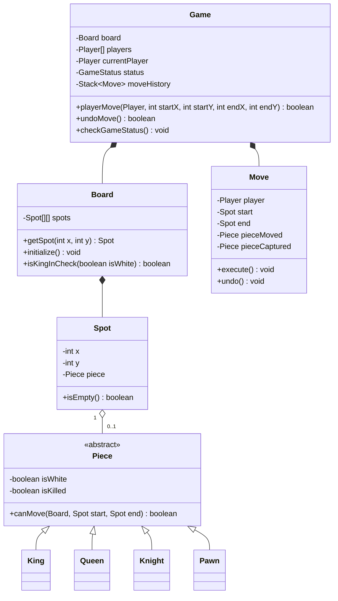

# Chess Game Design

## Introduction
Chess is a strategic, two-player board game played on an 8x8 grid. Low-level design of a chess game is a classic problem showcasing deep inheritance hierarchies, turn-based state machines, move validation algorithms, check/checkmate detection heuristics, and the Command Pattern for undo/replay support.

---

## Problem Statement
Design a console-based or API-driven two-player Chess game. The system must represent the board, cells, and pieces, alternate player turns, validate moves for each unique piece type, restrict moves that place one's own King in check, track move history, handle special moves (Castling, En Passant, Pawn Promotion), and detect terminal states (Checkmate, Stalemate, Draw).

---

## Why this exists
To build a modular, rule-compliant chess simulator. Without clean abstractions, move validation requires nested loops and coordinate offsets that are difficult to debug. An structured OOP model encapsulates movement rules within piece subclasses, isolates board mutation validation from game loop scheduling, and implements undo mechanics cleanly.

---

## Real-world analogy
Think of a physical tournament chess match:
- The match has a referee (the **Game Controller**) who keeps track of whose turn it is, updates the clock, and rules on checkmate.
- A score sheet (the **Move History**) lists every move made (e.g., `1. e4 e5`). This sheet lets players rebuild the board state step-by-step or verify if a move was illegal.
- If you make a mistake, you cannot manually undo it in a real match, but the score sheet would allow you to review the game history.

---

## Definition
A **Chess Game System** is a rule-driven state machine consisting of Boards, Spots, Pieces, Players, and Moves designed to model board setups, validate movement steps, and execute game state updates.

---

## Key concepts
1. **Command Pattern for Moves:** Encapsulating moves as command objects containing source, destination, piece moved, and piece captured, allowing for clean undo and replay flows.
2. **Move Validation Pipeline:** Checking if the target spot is occupied by a teammate, verifying if the path is clear (for Rooks, Bishops, Queens), checking the piece's movement pattern, and verifying the move does not leave the player's King in check.
3. **Turn State Machine:** Strictly alternating turns between White and Black, and locking input permissions to the active color.
4. **Special Operations:** Supporting Castling (moving King and Rook simultaneously), En Passant, and Pawn Promotion.

---

## Internal working / Mermaid diagram



---

## Python/Java implementation

### 1. Bad Implementation: 2D String Array with Global Logic
Storing piece states as strings in a 2D array creates massive, nested conditional blocks to validate moves, making the code brittle and hard to maintain.

```java
public class BadChessGame {
    // CRITICAL BUG: Storing state in raw string arrays requires 
    // parsing string values to validate moves, which is error-prone.
    public String[][] board = new String[8][8];
    public boolean whiteTurn = true;

    public boolean move(int sx, int sy, int ex, int ey) {
        String piece = board[sx][sy];
        if (piece == null) return false;
        
        // Unsafe validation logic
        if (piece.equals("wN")) { // White Knight
            int dx = Math.abs(sx - ex);
            int dy = Math.abs(sy - ey);
            if ((dx == 2 && dy == 1) || (dx == 1 && dy == 2)) {
                board[ex][ey] = "wN";
                board[sx][sy] = null;
                whiteTurn = !whiteTurn;
                return true;
            }
        }
        return false;
    }
}
```

### 2. Better Implementation: OOP Pieces without Command Pattern & Check Simulation
Using classes to represent pieces, but lacking move logging, check verification, undo stacks, or game end state detection.

```java
import java.util.*;

class BetterSpot {
    int x, y;
    BetterPiece piece;
    public BetterSpot(int x, int y) { this.x = x; this.y = y; }
}

abstract class BetterPiece {
    boolean isWhite;
    public BetterPiece(boolean isWhite) { this.isWhite = isWhite; }
    public abstract boolean isValidMove(BetterSpot[][] grid, BetterSpot start, BetterSpot end);
}

class BetterKnight extends BetterPiece {
    public BetterKnight(boolean isWhite) { super(isWhite); }
    @Override
    public boolean isValidMove(BetterSpot[][] grid, BetterSpot start, BetterSpot end) {
        int dx = Math.abs(start.x - end.x);
        int dy = Math.abs(start.y - end.y);
        return (dx == 2 && dy == 1) || (dx == 1 && dy == 2);
    }
}

public class BetterChess {
    private BetterSpot[][] grid = new BetterSpot[8][8];
    private boolean whiteTurn = true;

    // BUG: Allows moves that place or keep the player's own King in Check.
    public boolean executeMove(BetterSpot start, BetterSpot end) {
        if (start.piece.isWhite != whiteTurn) return false;
        if (start.piece.isValidMove(grid, start, end)) {
            end.piece = start.piece;
            start.piece = null;
            whiteTurn = !whiteTurn;
            return true;
        }
        return false;
    }
}
```

### 3. Best Implementation: Extensible Chess with Command Pattern & Check Validation
Implementing class structures, the Command Pattern for moves history and Undos, coordinate validations, and simulating moves to check for King exposure before commit.

```java
import java.util.*;

// 1. Enums
enum GameStatus { ACTIVE, WHITE_WIN, BLACK_WIN, DRAW, STALEMATE }

// 2. Base Piece Class
abstract class Piece {
    private final boolean isWhite;
    private boolean isKilled = false;

    public Piece(boolean isWhite) {
        this.isWhite = isWhite;
    }

    public boolean isWhite() { return isWhite; }
    public boolean isKilled() { return isKilled; }
    public void setKilled(boolean killed) { this.isKilled = killed; }

    public abstract boolean canMove(Board board, Spot start, Spot end);
}

// 3. Concrete Pieces
class Knight extends Piece {
    public Knight(boolean isWhite) { super(isWhite); }

    @Override
    public boolean canMove(Board board, Spot start, Spot end) {
        if (end.getPiece() != null && end.getPiece().isWhite() == this.isWhite()) {
            return false; // Friendly fire block
        }
        int x = Math.abs(start.getX() - end.getX());
        int y = Math.abs(start.getY() - end.getY());
        return x * y == 2; // Matches L-shape (2x1 or 1x2)
    }
}

class King extends Piece {
    public King(boolean isWhite) { super(isWhite); }

    @Override
    public boolean canMove(Board board, Spot start, Spot end) {
        if (end.getPiece() != null && end.getPiece().isWhite() == this.isWhite()) {
            return false;
        }
        int x = Math.abs(start.getX() - end.getX());
        int y = Math.abs(start.getY() - end.getY());
        return (x <= 1 && y <= 1); // Move 1 step in any direction
    }
}

// 4. Spot Representation
class Spot {
    private final int x;
    private final int y;
    private Piece piece;

    public Spot(int x, int y, Piece piece) {
        this.x = x;
        this.y = y;
        this.piece = piece;
    }

    public int getX() { return x; }
    public int getY() { return y; }
    public Piece getPiece() { return piece; }
    public void setPiece(Piece piece) { this.piece = piece; }
}

// 5. Board Representation with Check Verification Heuristics
class Board {
    private final Spot[][] spots = new Spot[8][8];

    public Board() {
        resetBoard();
    }

    public void resetBoard() {
        for (int i = 0; i < 8; i++) {
            for (int j = 0; j < 8; j++) {
                spots[i][j] = new Spot(i, j, null);
            }
        }
        // Place Kings and Knights for validation simulations
        spots[0][4] = new Spot(0, 4, new King(true)); // White King
        spots[7][4] = new Spot(7, 4, new King(false)); // Black King
        spots[0][1] = new Spot(0, 1, new Knight(true)); // White Knight
    }

    public Spot getSpot(int x, int y) {
        if (x < 0 || x > 7 || y < 0 || y > 7) {
            throw new IllegalArgumentException("Coordinate out of bounds.");
        }
        return spots[x][y];
    }

    public boolean isKingInCheck(boolean isWhite) {
        // Find king coordinates
        Spot kingSpot = null;
        for (int i = 0; i < 8; i++) {
            for (int j = 0; j < 8; j++) {
                Piece p = spots[i][j].getPiece();
                if (p instanceof King && p.isWhite() == isWhite) {
                    kingSpot = spots[i][j];
                    break;
                }
            }
        }

        if (kingSpot == null) return false;

        // Verify if any enemy piece can attack the King's spot
        for (int i = 0; i < 8; i++) {
            for (int j = 0; j < 8; j++) {
                Piece p = spots[i][j].getPiece();
                if (p != null && p.isWhite() != isWhite) {
                    if (p.canMove(this, spots[i][j], kingSpot)) {
                        return true; // King is in check
                    }
                }
            }
        }
        return false;
    }
}

// 6. Command Pattern: Move Command
class Move {
    private final Spot start;
    private final Spot end;
    private final Piece pieceMoved;
    private final Piece pieceCaptured;

    public Move(Spot start, Spot end) {
        this.start = start;
        this.end = end;
        this.pieceMoved = start.getPiece();
        this.pieceCaptured = end.getPiece();
    }

    public void execute() {
        end.setPiece(pieceMoved);
        start.setPiece(null);
        if (pieceCaptured != null) {
            pieceCaptured.setKilled(true);
        }
    }

    public void undo() {
        start.setPiece(pieceMoved);
        end.setPiece(pieceCaptured);
        if (pieceCaptured != null) {
            pieceCaptured.setKilled(false);
        }
    }
}

// 7. Game Coordinator
public class Game {
    private final Board board = new Board();
    private boolean isWhiteTurn = true;
    private GameStatus status = GameStatus.ACTIVE;
    private final Stack<Move> moveHistory = new Stack<>();

    public boolean makeMove(int sx, int sy, int ex, int ey) {
        if (status != GameStatus.ACTIVE) return false;

        Spot start = board.getSpot(sx, sy);
        Spot end = board.getSpot(ex, ey);
        Piece piece = start.getPiece();

        if (piece == null || piece.isWhite() != isWhiteTurn) {
            return false; // Wrong turn or empty spot
        }

        if (!piece.canMove(board, start, end)) {
            return false; // Violates piece movement vectors
        }

        // Simulating the move to ensure it doesn't leave own King in Check
        Move move = new Move(start, end);
        move.execute();

        if (board.isKingInCheck(isWhiteTurn)) {
            move.undo(); // Illegal move, rollback
            System.out.println("Invalid move: Leaves King in check.");
            return false;
        }

        // Commit move to history
        moveHistory.push(move);
        isWhiteTurn = !isWhiteTurn;
        return true;
    }

    public boolean undo() {
        if (moveHistory.isEmpty()) return false;
        Move lastMove = moveHistory.pop();
        lastMove.undo();
        isWhiteTurn = !isWhiteTurn;
        return true;
    }
}
```

---

## Step-by-step explanation
1. **Encapsulating Movement Vectors**: Each piece implements `canMove()` which defines its movement boundaries. For example, `Knight` verifies that the absolute horizontal and vertical coordinate differences satisfy the product $x \times y = 2$ ($2 \times 1$ or $1 \times 2$), allowing it to jump over other pieces without path checks.
2. **Move Commands**: The `Move` class acts as a command object, storing snapshot references to start/end spots, the moving piece, and any captured piece.
3. **Simulating Moves**: Before executing a move on the board permanently:
   - The system executes the move command.
   - It runs `board.isKingInCheck(isWhiteTurn)`, scanning if any enemy piece can reach the current King's coordinate.
   - If the King is in check, the move violates chess rules. The system calls `move.undo()`, reverting the board state, and returns `false`.
4. **State Commits**: If the move is valid, it is pushed to `moveHistory`, and the turn boolean flips, waiting for the next player's input.

---

## Multiple real-world examples
1. **Online Chess Platforms (Chess.com):** Handling matchmaking, checking turn clocks, verifying draw rules (like the 50-move rule or three-fold repetition), and saving move histories in PGN format.
2. **Chess Engine Clients (Stockfish):** Interfacing with chess board representations, converting moves to UCI commands, and validating moves before scoring.
3. **Desktop Chess Apps:** Standalone local games supporting local undo options, board theme customization, and game logging.

---

## Pros
- **Strong Encapsulation:** Decoupling rules into piece subclasses prevents giant, unmaintainable board-level conditional checks.
- **Transactional Moves:** Simulating and undoing moves guarantees players can never execute illegal moves that compromise their King.
- **History Tracking:** The Command Pattern enables undoing moves and replaying games step-by-step.

---

## Cons
- **Checking Performance:** Scanning the board on every move to verify if the King is in check requires traversing spots, which can be optimized using bitboards.
- **Complex Special Rules:** Special operations like Castling require tracking whether the King or Rook has previously moved, adding state logic to the `King` and `Rook` classes.

---

## Interview questions

### Beginner
- **Q: Why is it helpful to have an abstract `Piece` class rather than concrete classes for each piece from the start?**
  - **A:** The board only needs to interact with the generic `Piece` interface (calling `canMove()`). This abstraction allows the board to treat all pieces uniformly, simplifying movement validation and rendering logic.

### Intermediate
- **Q: How does the system handle Pawn promotion?**
  - **A:** In the `makeMove()` coordinator flow, after a move executes successfully, the system checks if a `Pawn` has reached the board boundary (Row 0 for Black, Row 7 for White). If true, it triggers a promotion, replacing the `Pawn` object at that spot with a new `Queen`, `Rook`, `Bishop`, or `Knight`.

### Senior
- **Q: How would you implement the "Threefold Repetition" draw rule?**
  - **A:** We represent the board configuration using a hash (e.g., Zobrist hashing). The game controller maintains a map tracking the frequency of each hash configuration. If any board configuration hash count reaches 3, the game status transitions to a `DRAW` by threefold repetition.

### Staff Engineer
- **Q: How would you optimize the board state representation and check validation routines for a chess engine that evaluates 10 million positions per second?**
  - **A:** 
    - **Bitboards:** Instead of using a 2D array of objects (`Spot[][]`), we represent the board using 64-bit integers (`long` in Java). We use one 64-bit integer for each piece type and color (e.g., `White_Pawns`, `Black_Kings`). A bit is set to 1 if a piece occupies that coordinate.
    - **Bitwise Validation:** Move validation is optimized using bitwise operations (AND, OR, XOR, shifts). Finding valid moves for a piece is resolved using precomputed lookup tables and bitwise shifts, avoiding nested loops and array traversals.
    - **Check Heuristic:** Instead of scanning the entire board to see if the King is in check, we precompute attack patterns from the King's coordinate to determine if any enemy pieces intersect those paths.

---

## Common mistakes
- **Representing spots as simple strings:** Violates OOP principles and makes managing piece attributes (e.g., hasMoved, color) difficult.
- **Letting pieces mutate the board directly:** Pieces should only validate moves; the `Game` or `Board` should execute the mutations to ensure coordinate integrity.
- **Neglecting to validate King exposure:** Allowing players to make moves that leave their own King in check.

---

## Best practices
- **Enforce Coordinates Safety:** Verify start and end coordinates are within boundaries (0 to 7) before evaluating moves.
- **Keep Pieces Stateless:** Pieces should not track global board states; they should only evaluate the path from a start spot to an end spot.
- **Use the Command Pattern:** Manage moves through command objects to simplify undo features.

---

## When NOT to use
- **Simplified Board Games:** For games with very simple movement rules (like Checkers or Tic-Tac-Toe), complex piece subclassing and check verification routines are unnecessary.

---

## Comparison with similar concepts

| Metric | Object-Oriented Grid (`Spot[][]`) | Bitboard (`long`) |
| :--- | :--- | :--- |
| **Code Readability** | High (easy to understand and map) | Low (requires complex bitwise operations) |
| **Execution Speed** | Medium (requires array traversals) | Ultra-high (executes in a single CPU instruction) |
| **Memory Footprint** | Kilobytes | Bytes |

---

## Summary
Designing a Chess Game requires subclassing pieces to encapsulate movement rules, and using the Command Pattern to manage moves history. Simulating moves before committing them prevents illegal plays, ensuring a robust, rule-compliant chess simulator.

---

## Related topics
- [Library Management System](../library-management)
- [SOLID Principles](../../solid-principles/liskov-substitution-principle)
- [Command Pattern](../../../01-design-patterns/behavioral/command)
