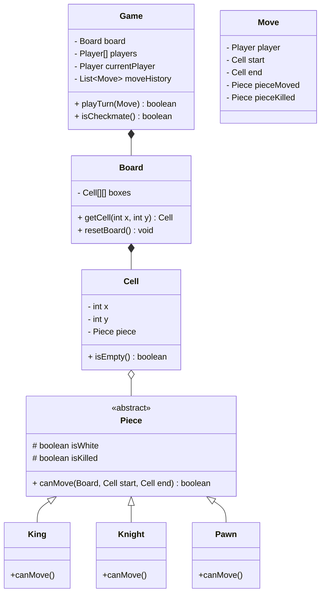

# Chess Game

## Problem Statement
Design a two-player Chess game. The system must represent the 8x8 board, the 32 pieces, enforce the distinct movement rules for each type of piece, manage turns, check for "Check" and "Checkmate" conditions, and record the history of moves.

## Requirements

### Functional Requirements
1. The game is played on an 8x8 grid.
2. There are two players (White and Black).
3. The board starts with 16 pieces per player (King, Queen, Rooks, Bishops, Knights, Pawns).
4. Each piece has unique, strict movement rules.
5. A player cannot make a move that leaves their own King in "Check".
6. The game ends when a player is in "Checkmate", "Stalemate", or resigns.
7. Players alternate turns strictly.

### Non-Functional Requirements
1. **Extensibility:** It should be easy to add new game modes (e.g., Chess960/Fischer Random) without rewriting the core movement logic.
2. **Replayability:** The system should be able to undo moves or replay a full game from a history log.

## Class Diagram



## Implementation (Java)

```java
// DOMAIN MODELS
class Cell {
    int x, y;
    Piece piece;

    public Cell(int x, int y, Piece piece) {
        this.x = x;
        this.y = y;
        this.piece = piece;
    }
}

// PIECES
abstract class Piece {
    private boolean isWhite;
    private boolean isKilled = false;

    public Piece(boolean isWhite) { this.isWhite = isWhite; }
    public boolean isWhite() { return isWhite; }

    // Every piece defines its own movement rules
    public abstract boolean canMove(Board board, Cell start, Cell end);
}

class Knight extends Piece {
    public Knight(boolean isWhite) { super(isWhite); }

    @Override
    public boolean canMove(Board board, Cell start, Cell end) {
        // Cannot kill own piece
        if (end.piece != null && end.piece.isWhite() == this.isWhite()) {
            return false;
        }

        // Knight moves in an 'L' shape: 2 by 1, or 1 by 2
        int xDiff = Math.abs(start.x - end.x);
        int yDiff = Math.abs(start.y - end.y);
        
        return (xDiff == 2 && yDiff == 1) || (xDiff == 1 && yDiff == 2);
    }
}

// THE BOARD
class Board {
    Cell[][] boxes = new Cell[8][8];

    public Board() { resetBoard(); }

    public void resetBoard() {
        // Initialize 64 cells. Place White Knight for demonstration:
        boxes[0][1] = new Cell(0, 1, new Knight(true));
        // ... initialize all other pieces ...
    }
    
    public Cell getCell(int x, int y) { return boxes[x][y]; }
}

// THE GAME ENGINE
class Game {
    private Board board;
    private boolean isWhiteTurn = true;

    public Game() {
        this.board = new Board();
    }

    public boolean playerMove(Cell start, Cell end) {
        Piece sourcePiece = start.piece;
        
        // Validation: No piece there, or moving opponent's piece
        if (sourcePiece == null || sourcePiece.isWhite() != isWhiteTurn) {
            return false;
        }

        // Check if the specific piece is physically allowed to make this move
        if (!sourcePiece.canMove(board, start, end)) {
            return false;
        }

        // Execute move
        Piece destinationPiece = end.piece;
        if (destinationPiece != null) {
            destinationPiece.setKilled(true); // Capture
        }
        
        end.piece = sourcePiece;
        start.piece = null;
        
        // Flip turn
        isWhiteTurn = !isWhiteTurn;
        return true;
    }
}
```

## Test Cases
1. **Valid Move:** White Knight at (0,1) moves to empty cell (2,2). `canMove` returns true. Piece is moved. Turn flips to Black.
2. **Invalid Piece Move:** A Bishop attempts to move like a Rook. `canMove` returns false. Move is rejected.
3. **Friendly Fire:** A White Rook attempts to move to a cell currently occupied by a White Pawn. `canMove` logic checks color and rejects the move.

## Edge Cases
1. **Pawn Rules:** Pawns are exceptionally complex. They move forward 1, but capture diagonally. They can move forward 2 on their very first move. They can perform *En Passant*. They promote to a Queen when reaching the final rank. The `Pawn.canMove()` method will be the most complex of all pieces.
2. **Check Constraint:** You cannot make a move that leaves your King in check. In the `Game.playerMove()` method, you must physically simulate the move on the board, check if the King is under attack by ANY enemy piece, and if so, revert the move and reject it.

## Improvements & Extensions
- **Command Pattern for Undo:** The `Move` class acts perfectly as a Command. By storing a `Stack<Move>`, implementing an "Undo" feature simply means popping the last Move, moving the `sourcePiece` back, and restoring the `pieceKilled` from the grave.
- **AI Integration:** Using the Minimax algorithm with Alpha-Beta pruning, an AI player can evaluate the board state by scoring pieces (Queen=9, Rook=5, etc.) and simulating thousands of moves deep to pick the optimal `Move`.
