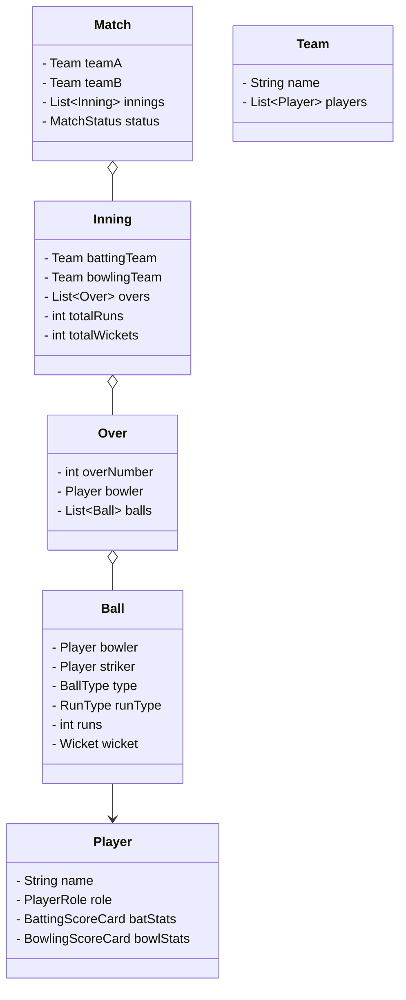

# Cricbuzz (Live Score App)

## Problem Statement
Design a sports scoring and analytics application like Cricbuzz or ESPN. The system needs to track the live progress of a cricket match, ball by ball. It must maintain the score of the batting team, the statistics of individual batsmen and bowlers, manage the overs, and provide a dashboard for users to view live updates.

## Requirements

### Functional Requirements
1. The system must support Tournaments, Matches, Teams, and Players.
2. A Match consists of Innings.
3. An Inning consists of Overs, which consist of Balls.
4. For every ball, the system records the outcome: Runs (0-6), Wicket, Wide, No Ball, Bye, Leg Bye.
5. The system must update player statistics live (Batsman runs/strike rate, Bowler wickets/economy).
6. The system must know who the current Striker and Non-Striker are, and automatically swap them at the end of an over or on odd runs (1, 3).

### Non-Functional Requirements
1. **Real-time Updates:** Thousands of clients looking at the dashboard should receive score updates immediately.
2. **Accuracy:** The scoring logic is complex; the system must strictly adhere to cricket rules.

## Class Diagram



## Implementation (Java Skeleton)

```java
import java.util.*;

// ENUMS
enum BallType { NORMAL, WIDE, NO_BALL }
enum RunType { NORMAL, BYE, LEG_BYE }
enum WicketType { BOWLED, CAUGHT, RUN_OUT, LBW }

// DOMAIN MODELS
class Player {
    String name;
    int runsScored = 0;
    int ballsFaced = 0;
    int wicketsTaken = 0;
    int runsConceded = 0;
    boolean isOut = false;

    public Player(String name) { this.name = name; }
}

class Ball {
    Player bowler;
    Player striker;
    BallType type;
    int runs;
    boolean isWicket;
    WicketType wicketType;
}

// THE SCORING ENGINE
class MatchController {
    Player striker;
    Player nonStriker;
    Player currentBowler;
    
    int totalRuns = 0;
    int totalWickets = 0;
    int ballsBowledInOver = 0;

    public void processBall(Ball ball) {
        // 1. Validate Ball Type
        if (ball.type == BallType.WIDE || ball.type == BallType.NO_BALL) {
            totalRuns += 1; // Penalty run
            currentBowler.runsConceded += 1;
            // The ball does not count towards the over limit
        } else {
            ballsBowledInOver++;
            ball.striker.ballsFaced++;
        }

        // 2. Add Runs
        totalRuns += ball.runs;
        currentBowler.runsConceded += ball.runs;
        ball.striker.runsScored += ball.runs;

        // 3. Handle Wickets
        if (ball.isWicket) {
            totalWickets++;
            ball.striker.isOut = true;
            if (ball.wicketType != WicketType.RUN_OUT) {
                currentBowler.wicketsTaken++;
            }
            // Logic to bring in new batsman would go here
        }

        // 4. Handle Strike Rotation
        if (ball.runs % 2 != 0) {
            swapStrike();
        }

        // 5. Handle Over Completion
        if (ballsBowledInOver == 6) {
            System.out.println("End of Over!");
            swapStrike(); // Strike swaps at end of over
            ballsBowledInOver = 0;
            // Logic to change bowler would go here
        }
    }

    private void swapStrike() {
        Player temp = striker;
        striker = nonStriker;
        nonStriker = temp;
    }
}
```

## Test Cases
1. **Normal Delivery:** Striker hits 2 runs. Total increases by 2. Striker runs increase by 2. Strike does not change.
2. **Odd Runs:** Striker hits 1 run. Total increases by 1. Strike swaps (Striker becomes Non-Striker).
3. **Extra Delivery:** Bowler bowls a WIDE. Total increases by 1. Balls in over remains 0.
4. **End of Over:** 6 valid balls are bowled. Over finishes. Strike is swapped automatically.

## Edge Cases
1. **Run Out on WIDE/NO-BALL:** A player can be run out even if the ball is a wide. The logic must accurately credit the penalty run, not credit the bowler with a wicket, but still update the total wickets and remove the specific batsman.
2. **Short Runs / Penalty Runs:** Complex cricket rules exist where umpires penalize the batting team 5 runs. The system must support arbitrary score modifications outside of the standard ball-by-ball flow.

## Improvements & Extensions
- **Observer Pattern for Live Score:** Millions of web browsers are waiting for the score to update. When `processBall()` finishes, it should notify an event bus (like Apache Kafka). A WebSocket server listens to Kafka and pushes the new JSON scorecard directly to all connected React frontends in real-time. This entirely removes the need for browsers to constantly refresh/poll the server.
