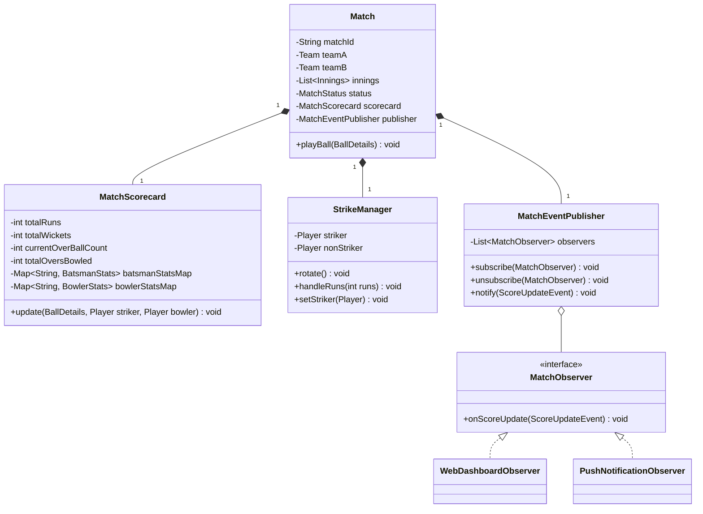

# Cricbuzz (Live Score Aggregator)

## Introduction
Cricbuzz is a sports news and live score aggregator application, particularly famous for its real-time cricket match updates. Designing Cricbuzz at a low level involves modeling complex, domain-specific rules (like striker rotation and extras validation) and implementing real-time event broadcasting (using the Observer Pattern) to keep multiple client dashboards updated.

---

## Problem Statement
Design a sports scoring and analytics system like Cricbuzz. The system must process ball-by-ball match updates, manage striker/non-striker transitions, update individual batsman and bowler statistics, calculate team scores, handle extra runs (wides, no-balls), and publish real-time match events to subscribers (web dashboards, push notifications, API clients).

---

## Why this exists
To build an extensible, real-time sports ledger. Scoring rules in cricket are highly conditional (e.g., striker swaps on odd runs vs. end of over, wickets credit to bowler except for runouts, penalty runs). A robust design decouples scoring rules, maintains state consistency across scoreboard updates, and pushes real-time event updates to millions of concurrent spectators.

---

## Real-world analogy
Consider a live cricket match broadcast:
- The scorer sitting in the stadium enters every ball's outcome on their laptop (the **Scoring Engine**).
- As soon as they hit submit, the stadium big screen, the TV broadcast graphics, and the mobile app dashboards (the **Observers**) update within milliseconds.
- If a batsman scores a single run, the two players physically walk to opposite ends of the pitch (the **Strike Manager**), changing who faces the next delivery.

---

## Definition
A **Cricbuzz System** is an event-driven sports tracking system consisting of Match Engines, Scorecards, Strike Managers, and Event Publishers designed to process ball-by-ball logs, update player stats, and broadcast live scoreboard changes.

---

## Key concepts
1. **Observer Pattern for Live Streaming:** Decoupling the match controller from dashboard update components by broadcasting score change events.
2. **Strike Rotation Management:** Maintaining active references to `striker` and `nonStriker` players, swapping them on odd runs or at the end of an over.
3. **Complex Wicket Rules:** Properly updating bowler stats (a caught-out credits the bowler, while a run-out does not).
4. **Extras Handling:** Correctly managing penalty runs (wides/no-balls) without incrementing the over's valid ball count.

---

## Internal working / Mermaid diagram



---

## Python/Java implementation

### 1. Bad Implementation: God Class & Missing Stats Engine
A single class tracks all runs, wickets, and players using primitive variables. It lacks strike management, ignores individual batsman/bowler stats, and requires clients to poll for updates.

```java
public class BadScorer {
    // CRITICAL BUG: Highly cohesive variables in a single class.
    // Cannot track individual batsman metrics (runs, balls faced, strike rate).
    // Zero update notification system.
    public int runs = 0;
    public int wickets = 0;
    public int balls = 0;

    public void recordBall(int run, boolean wicket, boolean isExtra) {
        if (isExtra) {
            runs += 1; // 1 run penalty
        } else {
            runs += run;
            balls++;
        }
        if (wicket) {
            wickets++;
        }
    }
}
```

### 2. Better Implementation: Basic Entities but Lacking Event Pub/Sub
Applying correct domain structures for `Player` and `Innings`, but lacking real-time event publishing, and using hardcoded updates that fail under network spikes.

```java
import java.util.*;

class BetterPlayer {
    String name;
    int runs;
    int ballsFaced;
    public BetterPlayer(String name) { this.name = name; }
}

public class BetterMatchController {
    private int totalRuns = 0;
    private int wickets = 0;
    private BetterPlayer striker;
    private BetterPlayer nonStriker;

    // BUG: Score updates are synchronous and coupled.
    // Web clients must poll this controller every 5 seconds to show updates.
    public void addRuns(int runs) {
        totalRuns += runs;
        striker.runs += runs;
        striker.ballsFaced++;
        if (runs % 2 != 0) {
            BetterPlayer temp = striker;
            striker = nonStriker;
            nonStriker = temp;
        }
    }
}
```

### 3. Best Implementation: Event-Driven Cricbuzz Engine with Strike Management
Implementing the Observer Pattern for dashboard subscriptions, modular `StrikeManager` rotations, explicit `BatsmanStats`/`BowlerStats` tracking, and extra-run validation filters.

```java
import java.util.*;
import java.util.concurrent.*;

// 1. Core Score Events
class ScoreUpdateEvent {
    private final String matchId;
    private final int totalRuns;
    private final int totalWickets;
    private final double overs;

    public ScoreUpdateEvent(String matchId, int totalRuns, int totalWickets, double overs) {
        this.matchId = matchId;
        this.totalRuns = totalRuns;
        this.totalWickets = totalWickets;
        this.overs = overs;
    }
    public String getMatchId() { return matchId; }
    public int getTotalRuns() { return totalRuns; }
    public int getTotalWickets() { return totalWickets; }
    public double getOvers() { return overs; }
}

// 2. Observer Pattern Interfaces
interface MatchObserver {
    void onScoreUpdate(ScoreUpdateEvent event);
}

class WebDashboardObserver implements MatchObserver {
    @Override
    public void onScoreUpdate(ScoreUpdateEvent event) {
        System.out.println("WEB DASHBOARD: Match " + event.getMatchId() + " score updated to: " 
                + event.getTotalRuns() + "/" + event.getTotalWickets() + " (" + event.getOvers() + " overs)");
    }
}

// 3. Stats trackers
class BatsmanStats {
    int runs = 0;
    int ballsFaced = 0;
}

class BowlerStats {
    int runsConceded = 0;
    int wickets = 0;
    int ballsBowled = 0;
}

// 4. Strike Rotation Manager
class StrikeManager {
    private Player striker;
    private Player nonStriker;

    public StrikeManager(Player striker, Player nonStriker) {
        this.striker = striker;
        this.nonStriker = nonStriker;
    }

    public void handleRuns(int runs) {
        if (runs % 2 != 0) {
            rotate();
        }
    }

    public void rotate() {
        Player temp = striker;
        striker = nonStriker;
        nonStriker = temp;
    }

    public Player getStriker() { return striker; }
    public void setStriker(Player striker) { this.striker = striker; }
    public Player getNonStriker() { return nonStriker; }
}

// 5. Match Scorecard
class MatchScorecard {
    private int totalRuns = 0;
    private int totalWickets = 0;
    private int ballsInCurrentOver = 0;
    private int completedOvers = 0;

    private final Map<String, BatsmanStats> batsmanStats = new ConcurrentHashMap<>();
    private final Map<String, BowlerStats> bowlerStats = new ConcurrentHashMap<>();

    public void recordBall(String strikerId, String bowlerId, int runs, boolean isWicket, boolean isExtra) {
        batsmanStats.putIfAbsent(strikerId, new BatsmanStats());
        bowlerStats.putIfAbsent(bowlerId, new BowlerStats());

        BatsmanStats bat = batsmanStats.get(strikerId);
        BowlerStats bowl = bowlerStats.get(bowlerId);

        if (isExtra) {
            totalRuns += 1; // 1 run penalty for extra
            bowl.runsConceded += 1;
        } else {
            totalRuns += runs;
            bat.runs += runs;
            bat.ballsFaced++;
            
            bowl.runsConceded += runs;
            bowl.ballsBowled++;
            ballsInCurrentOver++;
        }

        if (isWicket) {
            totalWickets++;
            bowl.wickets++;
        }

        if (ballsInCurrentOver == 6) {
            completedOvers++;
            ballsInCurrentOver = 0;
        }
    }

    public double getOversFormatted() {
        return completedOvers + (ballsInCurrentOver / 10.0);
    }

    public int getTotalRuns() { return totalRuns; }
    public int getTotalWickets() { return totalWickets; }
}

// 6. Player Representation
class Player {
    private final String id;
    private final String name;

    public Player(String id, String name) {
        this.id = id;
        this.name = name;
    }
    public String getId() { return id; }
    public String getName() { return name; }
}

// 7. Match Facade
public class Match {
    private final String matchId;
    private final StrikeManager strikeManager;
    private final MatchScorecard scorecard = new MatchScorecard();
    
    // Observer pattern publisher
    private final List<MatchObserver> observers = new CopyOnWriteArrayList<>();

    public Match(String matchId, Player p1, Player p2) {
        this.matchId = matchId;
        this.strikeManager = new StrikeManager(p1, p2);
    }

    public void addObserver(MatchObserver o) { observers.add(o); }
    
    public void recordDelivery(String bowlerId, int runs, boolean isWicket, boolean isExtra) {
        Player striker = strikeManager.getStriker();
        
        scorecard.recordBall(striker.getId(), bowlerId, runs, isWicket, isExtra);
        
        if (!isWicket) {
            strikeManager.handleRuns(runs);
        }
        
        if (scorecard.getOversFormatted() % 1.0 == 0 && runs % 2 == 0 && !isExtra) {
            // Over finished, swap strike
            strikeManager.rotate();
        }

        notifyObservers();
    }

    private void notifyObservers() {
        ScoreUpdateEvent event = new ScoreUpdateEvent(
                matchId, 
                scorecard.getTotalRuns(), 
                scorecard.getTotalWickets(), 
                scorecard.getOversFormatted()
        );
        for (MatchObserver observer : observers) {
            observer.onScoreUpdate(event);
        }
    }

    public void handleBatsmanOut(Player newBatsman) {
        strikeManager.setStriker(newBatsman);
    }
}
```

---

## Step-by-step explanation
1. **Event Dispatching (Observer Pattern)**: The `Match` class holds a list of `MatchObserver` objects. When `recordDelivery()` executes, it calculates the new score, wraps it in a `ScoreUpdateEvent` container, and calls `notifyObservers()` to update all registered dashboard elements.
2. **Strike Rotation Management**: The `StrikeManager` encapsulates striker roles.
   - For every normal delivery, the manager checks the runs: if odd (1 or 3 runs), `strikeManager.rotate()` swaps the striker references.
   - At the end of an over (6 valid balls), the match controller calls `strikeManager.rotate()` to swap striker roles before the next over starts.
3. **Over Accounting**: Extras (wides/no-balls) add penalty runs to `totalRuns` and bowler `runsConceded` but bypass incrementing the over's `ballsInCurrentOver` count, ensuring the over remains open.
4. **Stats Tracking**: Map lookups (`ConcurrentHashMap`) dynamically retrieve and update `BatsmanStats` and `BowlerStats` metrics based on player IDs.

---

## Multiple real-world examples
1. **Sports News Portals (ESPN):** Publishing live scorecards, text commentaries, and graphs to millions of concurrent web users.
2. **Push Notification Services:** Sending match event alerts (e.g. "WICKET! Virat Kohli out at 99") to mobile app subscribers.
3. **Sports Scoring Terminals:** On-field scoring applications used by umpires to log match details during local league games.

---

## Pros
- **Highly Scalable Live Updates:** The Observer Pattern decouples scoreboard calculations from update delivery networks.
- **Single Responsibility Principle (SRP):** `StrikeManager` handles player positioning, `MatchScorecard` handles statistics calculation, and `MatchObserver` handles event presentation.
- **Thread Safety:** Utilizing concurrent lists and maps allows score updates to process safely under concurrent network operations.

---

## Cons
- **Out of Order Events:** If network delays cause ball events to be received out of sequence, the scoreboard states can temporarily desynchronize.
- **Complex Match States:** Handling rare cricket events (e.g. retired hurt, timed out, tie-breaker super overs) requires adding multiple state checks to the controller.

---

## Interview questions

### Beginner
- **Q: What is the purpose of the Observer Pattern in the Cricbuzz design?**
  - **A:** To decouple the score calculations from update delivery networks. When a new ball is scored, the match engine simply notifies registered observers, who push updates to web dashboards or notification services.

### Intermediate
- **Q: How does the system swap striker roles at the end of an over?**
  - **A:** The match scorecard tracks the over's valid ball count. Once the count reaches 6, the over completes, and the match controller calls `strikeManager.rotate()` to swap the striker and non-striker roles before the next over begins.

### Senior
- **Q: How does this system handle a "Run Out" wicket on a WIDE delivery?**
  - **A:** The scorecard processes the wide (adding 1 penalty run and keeping the ball count unchanged), processes the wicket (incrementing the wickets counter and marking the batsman as out), but does not credit the bowler with a wicket, matching cricket rules.

### Staff Engineer
- **Q: How would you scale this live score delivery system to handle 10 million concurrent users during a World Cup Final with sub-second latency?**
  - **A:** 
    - **Architecture:** We separate scoring from delivery. The scoring service is a small, secure cluster that writes to a database.
    - **Event Streaming:** Every score update publishes an event to a **Kafka** topic.
    - **WebSocket Cluster:** We run a cluster of WebSocket servers (using Netty) to maintain connections with the 10 million clients.
    - **Pub/Sub Broker (Redis):** WebSocket nodes subscribe to a Redis Pub/Sub channel. When the scoring service writes to Kafka, a worker consumes the event and publishes it to Redis. Redis broadcasts the event to all WebSocket nodes, which push the update to their connected clients.
    - **Caching (CDN):** For clients that do not require real-time WebSocket connections, we cache JSON scorecards at Edge CDN locations with a 2-second TTL.

---

## Common mistakes
- **Using client polling:** Forcing millions of client apps to query the database every second, which overloads database resources.
- **Tracking score stats in the Player class:** Mixing player details with match-specific scoreboard statistics.
- **Hardcoding strike rotation logic:** Hardcoding striker swaps inside the main match loop instead of decoupling it into a dedicated manager class.

---

## Best practices
- **De-bounce updates:** Group fast consecutive updates (such as check reviews) to minimize network overhead.
- **Keep player stats isolated:** Separate historical stats from current match scorecard statistics.
- **Ensure transaction logging:** Write every ball's outcome as an immutable event log to support replays and corrections.

---

## When NOT to use
- **Non-Cricket Sports:** For sports with simpler scoring models (like Basketball or Soccer where strike rotations and over limits do not exist), this specialized cricket scoring structure is unnecessary.

---

## Comparison with similar concepts

| Strategy | WebSocket Server (Push) | REST Polling (Pull) |
| :--- | :--- | :--- |
| **Data Flow** | Server pushes updates immediately to client | Client repeatedly requests updates from server |
| **Server Load** | Low (connections are held open, data sent only on updates) | High (requires processing millions of redundant HTTP requests) |
| **Update Latency** | Sub-second | Delayed (based on polling interval) |

---

## Summary
Designing Cricbuzz requires separating scoring rules from event delivery. Using a dedicated manager simplifies strike rotations, and applying the Observer Pattern enables real-time scoreboard updates across client applications.

---

## Related topics
- [Chess Game](../chess)
- [Design Principles](../../design-principles/composition-vs-inheritance)
- [Observer Pattern](../../../01-design-patterns/behavioral/observer)
