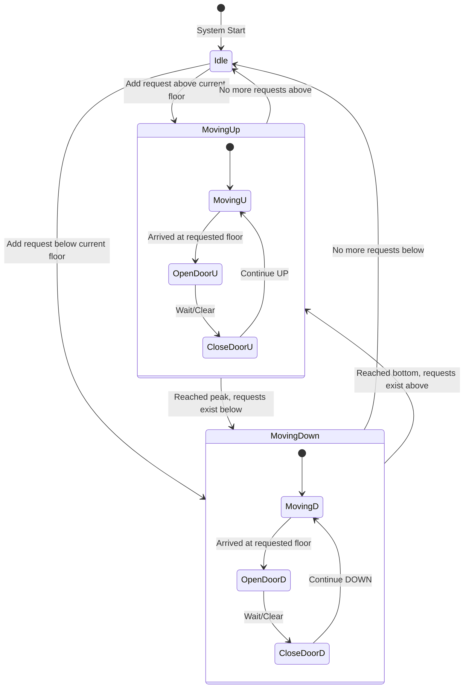
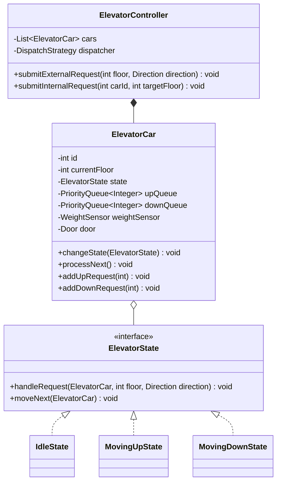

# Elevator System Design

## Introduction
An Elevator System is a vertical transportation mechanism within a building designed to move passengers and goods between floors. Low-level design of an elevator system showcases state machines, concurrent request queue scheduling, and routing algorithms (like the SCAN/LOOK algorithm) to optimize throughput.

---

## Problem Statement
Design an elevator controller that manages a fleet of elevators in a multi-story building. The system must process requests from floor panels (external panels requesting UP/DOWN directions) and elevator car consoles (internal panels requesting specific target floors). It must coordinate movements to minimize wait times, respect maximum weight constraints, handle doors, and safely transition states (Idle, Moving Up, Moving Down) under high request volumes.

---

## Why this exists
To coordinate elevator movement efficiently. Without an optimized control system, elevators would execute requests in a First-In-First-Out (FIFO) manner, causing them to bounce randomly across different floors, wasting energy and causing long passenger wait times. A robust system structures request sorting, applies state machines to simplify code paths, and handles physical constraints like weight thresholds.

---

## Real-world analogy
Consider a shuttle bus route in an airport:
- The bus moves along a corridor in a specific direction. It stops at terminals that passengers requested from inside the bus, or terminals where passengers waiting outside flagged it down *in the same direction*.
- If the bus is heading to Terminal 4, it won't turn around to pick up a passenger at Terminal 2 who wants to go to Terminal 1, even if they pressed the button first. It completes its run, then handles the opposite direction.

---

## Definition
An **Elevator System** is a coordinated state-driven system consisting of Elevator Cars, Controllers, Request Queues, and dispatching strategies that manage vertical travel safety and routing efficiency.

---

## Key concepts
1. **SCAN/LOOK Algorithm:** The elevator travels in one direction, stopping at all requested floors on its path. It only reverses direction when there are no further requests in its current path.
2. **State Pattern:** Decoupling elevator movement logic by splitting it into distinct states: `IdleState`, `MovingUpState`, and `MovingDownState`.
3. **Internal vs. External Requests:**
   - **Internal (Car panel):** Specifies a destination floor.
   - **External (Floor panel):** Specifies a starting floor and desired direction (UP/DOWN).
4. **Safety Interlocks:** Monitoring weight sensors and door status before triggering motor motion.

---

## Internal working / Mermaid diagram

### State Transition Diagram


### Class Diagram


---

## Python/Java implementation

### 1. Bad Implementation: FIFO Request Processing with No States
Using a simple FIFO list to process requests causes the elevator to jump wildly between floors, leading to severe latency and mechanical wear.

```java
import java.util.*;

public class BadElevator {
    private int currentFloor = 0;
    // CRITICAL BUG: FIFO processing is highly inefficient.
    // If Floor 1 requests, then Floor 10, then Floor 2, the elevator moves:
    // 0 -> 1 -> 10 -> 2. Bounces up and down unnecessarily.
    private final List<Integer> requestQueue = new ArrayList<>();

    public void addRequest(int floor) {
        requestQueue.add(floor);
    }

    public void processNext() {
        if (!requestQueue.isEmpty()) {
            int target = requestQueue.remove(0);
            moveToFloor(target);
        }
    }

    private void moveToFloor(int floor) {
        System.out.println("Moving from " + currentFloor + " to " + floor);
        currentFloor = floor;
    }
}
```

### 2. Better Implementation: Basic Queues without State Pattern
Sorting requests using heaps, but relying on complex conditional checks to manage directions, leading to unmaintainable logic.

```java
import java.util.*;

public class BetterElevator {
    private int currentFloor = 0;
    private String direction = "IDLE"; // "UP", "DOWN", "IDLE"
    
    // Min-heap for UP requests
    private final PriorityQueue<Integer> upQueue = new PriorityQueue<>();
    // Max-heap for DOWN requests
    private final PriorityQueue<Integer> downQueue = new PriorityQueue<>(Collections.reverseOrder());

    public void addRequest(int floor) {
        // BUG: Handling state transitions manually via nested strings is error-prone.
        if (floor > currentFloor) {
            upQueue.add(floor);
            if (direction.equals("IDLE")) direction = "UP";
        } else {
            downQueue.add(floor);
            if (direction.equals("IDLE")) direction = "DOWN";
        }
    }

    public void step() {
        if (direction.equals("UP")) {
            if (!upQueue.isEmpty()) {
                currentFloor = upQueue.poll();
            } else {
                direction = downQueue.isEmpty() ? "IDLE" : "DOWN";
            }
        } else if (direction.equals("DOWN")) {
            if (!downQueue.isEmpty()) {
                currentFloor = downQueue.poll();
            } else {
                direction = upQueue.isEmpty() ? "IDLE" : "UP";
            }
        }
    }
}
```

### 3. Best Implementation: SCAN/LOOK Routing with State Pattern & Concurrency
Enforcing clean modularity using the State Pattern, double priority queues (min-heap for UP, max-heap for DOWN) for LOOK scheduling, weight-check sensor interrupts, and thread-safe control coordination.

```java
import java.util.*;
import java.util.concurrent.*;
import java.util.concurrent.locks.ReentrantLock;

enum Direction { UP, DOWN, IDLE }

// 1. Elevator State Interface
interface ElevatorState {
    void handleRequest(ElevatorCar car, int floor, Direction direction);
    void move(ElevatorCar car);
}

// 2. Concrete States
class IdleState implements ElevatorState {
    @Override
    public void handleRequest(ElevatorCar car, int floor, Direction direction) {
        if (floor > car.getCurrentFloor()) {
            car.addUpRequest(floor);
            car.setState(new MovingUpState());
        } else if (floor < car.getCurrentFloor()) {
            car.addDownRequest(floor);
            car.setState(new MovingDownState());
        } else {
            car.openDoor();
        }
    }

    @Override
    public void move(ElevatorCar car) {
        // Do nothing while idle
    }
}

class MovingUpState implements ElevatorState {
    @Override
    public void handleRequest(ElevatorCar car, int floor, Direction direction) {
        if (floor >= car.getCurrentFloor()) {
            car.addUpRequest(floor);
        } else {
            car.addDownRequest(floor); // Handled on the way down
        }
    }

    @Override
    public void move(ElevatorCar car) {
        PriorityQueue<Integer> upQueue = car.getUpQueue();
        if (upQueue.isEmpty()) {
            if (!car.getDownQueue().isEmpty()) {
                car.setState(new MovingDownState());
            } else {
                car.setState(new IdleState());
            }
            return;
        }

        int nextStop = upQueue.poll();
        car.setCurrentFloor(nextStop);
        car.openDoor();
    }
}

class MovingDownState implements ElevatorState {
    @Override
    public void handleRequest(ElevatorCar car, int floor, Direction direction) {
        if (floor <= car.getCurrentFloor()) {
            car.addDownRequest(floor);
        } else {
            car.addUpRequest(floor); // Handled on the way back up
        }
    }

    @Override
    public void move(ElevatorCar car) {
        PriorityQueue<Integer> downQueue = car.getDownQueue();
        if (downQueue.isEmpty()) {
            if (!car.getUpQueue().isEmpty()) {
                car.setState(new MovingUpState());
            } else {
                car.setState(new IdleState());
            }
            return;
        }

        int nextStop = downQueue.poll();
        car.setCurrentFloor(nextStop);
        car.openDoor();
    }
}

// 3. Elevator Car (Context in State Pattern)
class ElevatorCar {
    private final int carId;
    private int currentFloor = 0;
    private double maxWeightCapacity = 800.0; // 800kg limit
    private double currentWeight = 0.0;
    
    private ElevatorState state = new IdleState();
    private final ReentrantLock stateLock = new ReentrantLock();

    // Min-heap for UP stops (stops closest to currentFloor first)
    private final PriorityQueue<Integer> upQueue = new PriorityQueue<>();
    // Max-heap for DOWN stops (stops furthest from ground floor first)
    private final PriorityQueue<Integer> downQueue = new PriorityQueue<>(Collections.reverseOrder());

    public ElevatorCar(int carId) {
        this.carId = carId;
    }

    public void requestFloor(int floor, Direction direction) {
        stateLock.lock();
        try {
            state.handleRequest(this, floor, direction);
        } finally {
            stateLock.unlock();
        }
    }

    public void step() {
        stateLock.lock();
        try {
            if (isOverloaded()) {
                System.out.println("Elevator " + carId + " overloaded! Cannot move.");
                return;
            }
            state.move(this);
        } finally {
            stateLock.unlock();
        }
    }

    public void openDoor() {
        System.out.println("Elevator " + carId + " doors opening at floor " + currentFloor);
        try { Thread.sleep(200); } catch (InterruptedException e) { Thread.currentThread().interrupt(); }
        System.out.println("Elevator " + carId + " doors closing.");
    }

    public boolean isOverloaded() {
        return currentWeight > maxWeightCapacity;
    }

    public void updateWeight(double weight) {
        this.currentWeight = weight;
    }

    // Getters and Setters
    public int getCarId() { return carId; }
    public int getCurrentFloor() { return currentFloor; }
    public void setCurrentFloor(int floor) { this.currentFloor = floor; }
    public PriorityQueue<Integer> getUpQueue() { return upQueue; }
    public PriorityQueue<Integer> getDownQueue() { return downQueue; }
    public void addUpRequest(int floor) { upQueue.add(floor); }
    public void addDownRequest(int floor) { downQueue.add(floor); }
    public void setState(ElevatorState state) { this.state = state; }
}

// 4. Elevator Controller
public class ElevatorController {
    private final List<ElevatorCar> cars = new CopyOnWriteArrayList<>();

    public ElevatorController(int numCars) {
        for (int i = 0; i < numCars; i++) {
            cars.add(new ElevatorCar(i));
        }
    }

    public void submitRequest(int sourceFloor, Direction direction) {
        ElevatorCar bestCar = findOptimalCar(sourceFloor, direction);
        if (bestCar != null) {
            bestCar.requestFloor(sourceFloor, direction);
        }
    }

    private ElevatorCar findOptimalCar(int floor, Direction direction) {
        // LOOK algorithm selection logic:
        // Find car closest to target moving in the same direction or idle.
        ElevatorCar optimal = null;
        int minDistance = Integer.MAX_VALUE;

        for (ElevatorCar car : cars) {
            int distance = Math.abs(car.getCurrentFloor() - floor);
            if (distance < minDistance) {
                minDistance = distance;
                optimal = car;
            }
        }
        return optimal;
    }
}
```

---

## Step-by-step explanation
1. **State Isolation**: In the `Best` implementation, the `ElevatorCar` delegates movement transitions to its `ElevatorState` interface (`IdleState`, `MovingUpState`, `MovingDownState`), decoupling structural code paths.
2. **LOOK Execution**: Instead of sorting requests in a basic queue, the system utilizes two separate `PriorityQueues`. 
   - When going UP, the system reads from `upQueue` (min-heap), guaranteeing we stop at Floor 3 before Floor 7.
   - When going DOWN, the system reads from `downQueue` (max-heap), ensuring we stop at Floor 8 before Floor 2.
3. **Transition Triggering**: Once a state queue is emptied, the active state checks the alternate queue. If populated, it switches the state wrapper (`setState(new MovingDownState())`); if empty, it returns to `IdleState`.
4. **Safety Guard (Weight Interrupt)**: Before invoking any movement step (`move()`), the state checks `isOverloaded()`. If true, the system skips movement and triggers alarms, preventing motor activation.

---

## Multiple real-world examples
1. **Skyscraper Dispatchers:** Heavy traffic structures using Destination Dispatch keypads in the lobby to assign passengers to grouped elevators.
2. **Hospital Elevators:** Configured with prioritization buttons that allow medical personnel to enter emergency bypass states, ignoring external hall panel queues.
3. **Freight Elevators:** Heavy capacity lifts utilizing strict weight-sensor blocks to prevent industrial transit overloading.

---

## Pros
- **Highly Extensible:** The State Pattern makes adding new states (e.g., `MaintenanceState`, `EmergencyFireState`) simple.
- **Optimized Energy Consumption:** LOOK routing prevents unnecessary direction changes, minimizing mechanical wear.
- **Thread Safety:** Fine-grained locks (`ReentrantLock`) protect individual cars from request queue corruption.

---

## Cons
- **Car Starvation Risks:** A car continuously serving UP requests might delay a DOWN request on lower floors, requiring dispatchers to balance requests globally.
- **Complex Dispatch Strategy:** Finding the mathematically optimal car requires tracking multiple variables (distance, current state, load, target floors), leading to complex dispatch heuristic formulas.

---

## Interview questions

### Beginner
- **Q: What is the purpose of using two different PriorityQueues in the elevator car?**
  - **A:** To implement the LOOK algorithm. Going UP requires stopping at the lowest requested floor first (Min-Heap). Going DOWN requires stopping at the highest requested floor first (Max-Heap), ensuring the elevator processes stops sequentially.

### Intermediate
- **Q: How does the system handle a user pressing the UP button at Floor 5 when a car is passing Floor 5 heading UP?**
  - **A:** The `MovingUpState` intercept processes the request. If the car has not yet passed Floor 5, Floor 5 is added to the `upQueue` (min-heap) and the car stops. If the car already passed Floor 5, it is added to the queue to be served on the next pass.

### Senior
- **Q: How would you implement an "Emergency Mode" (e.g., fire alarm) using the State Pattern?**
  - **A:** We define an `EmergencyState` implementing `ElevatorState`. When a fire alarm triggers:
    1. Clear both `upQueue` and `downQueue` immediately.
    2. Transition the car's state to `EmergencyState`.
    3. The `EmergencyState` overrides `move()` to bypass all requests, direct the car to the ground floor, open the doors, and lock the elevator in place.

### Staff Engineer
- **Q: How would you design a Destination Dispatch System for a high-rise building with 60 floors and 8 elevators, and what algorithm would you use?**
  - **A:** 
    - **Architecture:** Passengers enter their destination floor on a keypad in the lobby. The dispatcher calculates the optimal car *before* boarding and prints the car assignment (e.g., "Go to Elevator C"). No buttons are available inside the elevator cabin.
    - **Optimization Algorithm:** We use **Mixed Integer Linear Programming (MILP)** or **Genetic Heuristics** targeting minimization of Wait Time + Time to Destination. The dispatcher groups passengers going to the same floor ranges (e.g., Floors 40-50) into a single car. This reduces the number of intermediate stops, boosting the transport capacity of the elevator bank by up to 30%.
    - **State Coordination:** The dispatcher communicates with cars via messaging protocols. Each car keeps a local queue of assigned stops. Hallway panels display target floor schedules.

---

## Common mistakes
- **Using basic FIFO lists:** Leads to the elevator bouncing randomly between high and low floors.
- **Synchronizing the entire controller:** Causes thread blocking when passengers call separate cars.
- **Allowing doors to open during movement:** Neglecting to check status conditions before activating door mechanics.

---

## Best practices
- **De-bounce buttons:** Prevent duplicate requests if a user repeatedly presses a floor panel button.
- **Implement keep-alive heartbeat:** Ensure the controller detects if an elevator car goes offline.
- **Separate Cabin from Motor:** Wrap hardware actions (moving motor, reading sensors) behind interface adapters.

---

## When NOT to use
- **Pneumatic or Hydraulic Single-Car lifts:** For simple 2-floor residential elevators, a basic boolean state checker is sufficient, rendering priority queues and state pattern architectures over-engineered.

---

## Comparison with similar concepts

| Concept | SCAN Algorithm | LOOK Algorithm | Destination Dispatch |
| :--- | :--- | :--- | :--- |
| **Movement Limit** | Travels to the absolute top and bottom floors before reversing | Only travels as far as the highest/lowest active request | Dynamically scheduled based on passenger destination groupings |
| **Intermediate Stops** | Stops at all requested floors in path | Stops at all requested floors in path | Stops only at grouped target floors |
| **System Throughput** | Medium | Medium-High | High (ideal for skyscrapers) |

---

## Summary
Designing an Elevator System requires coordinating hardware safety boundaries and routing algorithms. Utilizing the State Pattern to manage moving behaviors and dual PriorityQueues for LOOK routing ensures reliable, low-latency passenger transport.

---

## Related topics
- [Parking Lot](../parking-lot)
- [SOLID Principles](../../solid-principles/single-responsibility-principle)
- [State Pattern](../../../01-design-patterns/behavioral/state)
