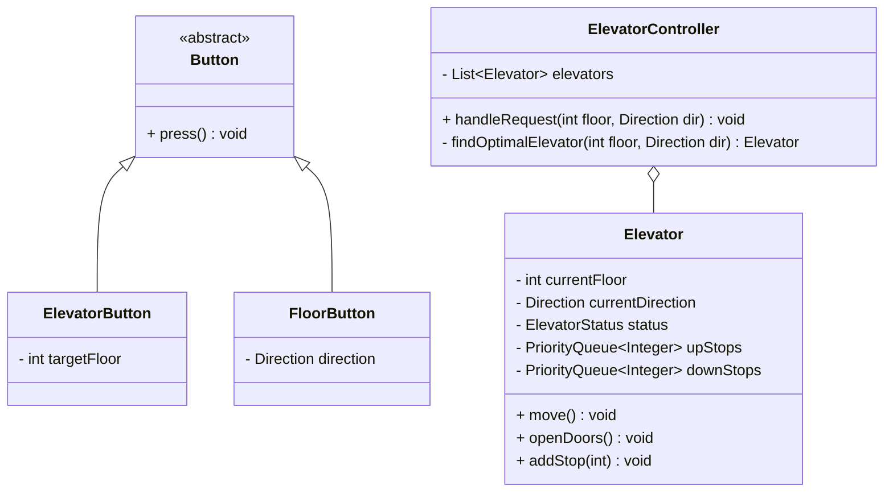

# Elevator System

## Problem Statement
Design the logic for an elevator system in a multi-story building. The system must manage a fleet of elevators, accept requests from both inside the elevator buttons and outside floor panels, and efficiently route the elevators to minimize passenger wait times while conserving power.

## Requirements

### Functional Requirements
1. The building has multiple floors and multiple elevators.
2. Users can request an elevator from any floor going UP or DOWN.
3. Users inside the elevator can press a floor number to go to.
4. Elevators must have states: `UP`, `DOWN`, `IDLE`.
5. The system must dispatch the most optimal elevator to a user's request.
6. The elevator doors open, wait, and close automatically.
7. An elevator has a maximum weight capacity. If exceeded, it triggers an alarm and refuses to move.

### Non-Functional Requirements
1. **Concurrency:** Multiple users can press buttons simultaneously on different floors.
2. **Fairness:** No request should be starved (waiting forever).
3. **Optimization:** The algorithm should minimize the total distance traveled by the elevators.

## Core Algorithm (The Elevator Algorithm / SCAN)
You cannot simply process requests in a FIFO (First In, First Out) queue. If a user on Floor 10 presses UP, and then a user on Floor 1 presses DOWN, the elevator shouldn't bounce wildly between floor 1 and 10.
- **SCAN Algorithm:** The elevator continues moving in its current direction (e.g., UP), stopping at all requested floors on the way up. It only changes direction (to DOWN) when there are absolutely no more requests higher up in the building.

## Class Diagram



## Implementation (Java Skeleton)

```java
import java.util.*;

enum Direction { UP, DOWN, IDLE }
enum Status { MOVING, STOPPED, MAINTENANCE }

// The Elevator Class
class Elevator {
    private int currentFloor = 0;
    private Direction direction = Direction.IDLE;
    
    // Using a Min-Heap for UP requests (we want the smallest floor > currentFloor)
    private PriorityQueue<Integer> upQueue = new PriorityQueue<>();
    
    // Using a Max-Heap for DOWN requests (we want the largest floor < currentFloor)
    private PriorityQueue<Integer> downQueue = new PriorityQueue<>(Collections.reverseOrder());

    public synchronized void addRequest(int targetFloor) {
        if (targetFloor > currentFloor) {
            upQueue.add(targetFloor);
            if (direction == Direction.IDLE) direction = Direction.UP;
        } else if (targetFloor < currentFloor) {
            downQueue.add(targetFloor);
            if (direction == Direction.IDLE) direction = Direction.DOWN;
        }
    }

    // The game loop of the elevator
    public void run() {
        while (true) {
            if (direction == Direction.UP && !upQueue.isEmpty()) {
                int nextStop = upQueue.poll();
                moveToFloor(nextStop);
            } else if (direction == Direction.DOWN && !downQueue.isEmpty()) {
                int nextStop = downQueue.poll();
                moveToFloor(nextStop);
            } else {
                direction = Direction.IDLE; // Wait for requests
            }
        }
    }

    private void moveToFloor(int floor) {
        System.out.println("Elevator moving to floor: " + floor);
        this.currentFloor = floor;
        System.out.println("Doors Opening... Doors Closing.");
    }
}

// The Dispatcher
class ElevatorDispatcher {
    private List<Elevator> elevators = new ArrayList<>();

    public ElevatorDispatcher(int numElevators) {
        for (int i = 0; i < numElevators; i++) {
            elevators.add(new Elevator());
        }
    }

    // Simplistic optimal finding logic
    public void requestElevator(int floor, Direction dir) {
        Elevator optimal = null;
        int minDistance = Integer.MAX_VALUE;

        for (Elevator e : elevators) {
            // Very simplified: find the closest elevator. 
            // A real algorithm factors in the elevator's current direction.
            int distance = Math.abs(e.currentFloor - floor);
            if (distance < minDistance) {
                minDistance = distance;
                optimal = e;
            }
        }
        
        if (optimal != null) {
            optimal.addRequest(floor);
        }
    }
}
```

## Test Cases
1. **Happy Path:** User on Floor 1 presses UP. Elevator is dispatched to Floor 1. User gets in, presses 10. Elevator goes to 10.
2. **Same Direction Pickup:** Elevator is at Floor 1, heading UP to Floor 10. A user on Floor 5 presses UP. The elevator should stop at 5 on the way to 10.
3. **Overload:** If the total weight exceeds the threshold, the doors remain open and the buzzer sounds until someone steps off.

## Edge Cases
1. **Opposite Direction Request:** Elevator is at Floor 1, heading UP to Floor 10. A user on Floor 5 presses DOWN. The elevator should bypass Floor 5 on its way up, and only pick them up on the way back down.
2. **Emergency Stop / Fire Alarm:** If the fire alarm triggers, all elevators must immediately drop to the ground floor, open doors, and disable all internal and external buttons.

## Improvements & Extensions
- **State Pattern:** The Elevator's behavior changes drastically based on its state (`Moving`, `Idle`, `Emergency`). The State Design Pattern is perfect here.
- **Advanced Dispatching:** Modern skyscraper algorithms use **Destination Dispatch**, where users type their destination floor on a keypad *in the lobby*, and the screen tells them which specific elevator letter (A, B, C) to stand in front of. This completely removes the buttons from the inside of the elevator and groups people going to similar floors together, wildly increasing efficiency.
