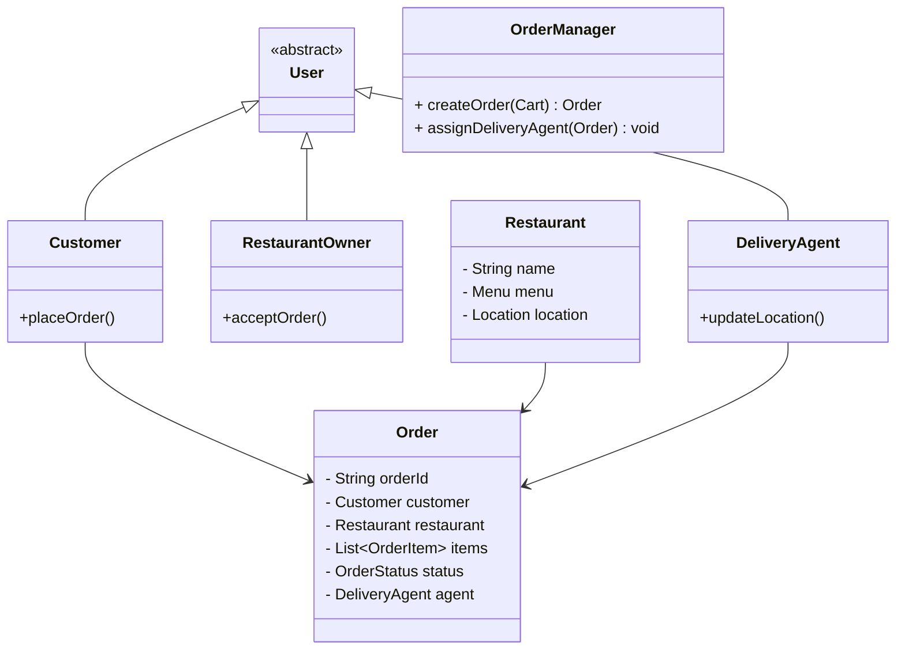

# Food Delivery System (Swiggy / Zomato)

## Problem Statement
Design a food delivery application like Swiggy, Zomato, or UberEats. The system involves three main actors: the Customer, the Restaurant, and the Delivery Agent. Customers can browse menus, place orders, and make payments. Restaurants accept orders and prepare food. Delivery agents pick up the food and deliver it to the customer.

## Requirements

### Functional Requirements
1. **Browsing:** Customers can search for restaurants and view menus.
2. **Ordering:** Customers can add items to a cart and place an order.
3. **Order Lifecycle:** The order goes through states: `PLACED` -> `ACCEPTED` -> `PREPARING` -> `READY_FOR_PICKUP` -> `OUT_FOR_DELIVERY` -> `DELIVERED`.
4. **Dispatching:** The system must assign a Delivery Agent to the order.

### Non-Functional Requirements
1. **Scalability:** The system must handle huge spikes during dinner time.
2. **Real-time Tracking:** Customers need to see the live location of their delivery agent.

## Class Diagram



## Implementation (Java Skeleton)

*This focuses on the Observer Pattern, which is perfect for notifying all parties when an order's state changes.*

```java
import java.util.*;

// OBSERVER PATTERN INTERFACES
interface OrderObserver {
    void update(Order order);
}

// DOMAIN MODELS
enum OrderStatus { PLACED, ACCEPTED, PREPARING, READY, OUT_FOR_DELIVERY, DELIVERED }

class Order {
    String id;
    OrderStatus status;
    private List<OrderObserver> observers = new ArrayList<>();

    public Order(String id) {
        this.id = id;
        this.status = OrderStatus.PLACED;
    }

    public void addObserver(OrderObserver obs) { observers.add(obs); }

    // When state changes, notify everyone!
    public void setStatus(OrderStatus newStatus) {
        this.status = newStatus;
        for (OrderObserver obs : observers) {
            obs.update(this);
        }
    }
}

// THE OBSERVERS
class CustomerApp implements OrderObserver {
    public void update(Order order) {
        System.out.println("PUSH NOTIFICATION TO CUSTOMER: Your order is now " + order.status);
    }
}

class DeliveryAgentApp implements OrderObserver {
    public void update(Order order) {
        if (order.status == OrderStatus.READY) {
            System.out.println("PING DRIVER: Head to the restaurant, the food is ready for pickup!");
        }
    }
}

class RestaurantDashboard implements OrderObserver {
    public void update(Order order) {
        if (order.status == OrderStatus.PLACED) {
            System.out.println("RINGING RESTAURANT IPAD: New order received! Please accept.");
        }
    }
}

// SIMULATION
public class FoodDeliverySystem {
    public static void main(String[] args) {
        Order myOrder = new Order("ORD-123");
        
        // Register the apps listening for updates
        myOrder.addObserver(new CustomerApp());
        myOrder.addObserver(new DeliveryAgentApp());
        myOrder.addObserver(new RestaurantDashboard());

        // Simulate the flow
        System.out.println("--- Customer Clicks Pay ---");
        myOrder.setStatus(OrderStatus.PLACED); // Notifies Restaurant
        
        System.out.println("--- Restaurant Clicks Accept ---");
        myOrder.setStatus(OrderStatus.PREPARING); // Notifies Customer
        
        System.out.println("--- Chef Clicks Done ---");
        myOrder.setStatus(OrderStatus.READY); // Notifies Driver and Customer
    }
}
```

## Test Cases
1. **Order Flow:** Customer places order. Restaurant Dashboard rings. Restaurant accepts. Order enters `PREPARING`. Customer gets a push notification.
2. **Driver Assignment:** When order is `PREPARING`, the system calculates the nearest drivers. When the driver accepts, they are attached to the Order.
3. **Rejection:** Restaurant rejects the order because they ran out of an ingredient. The status becomes `CANCELLED`, initiating an automatic refund to the customer.

## Edge Cases
1. **Driver Cancellation:** A driver accepts the order, drives halfway to the restaurant, gets a flat tire, and cancels. The system must immediately push the order back into the dispatch pool to find a new driver, without cancelling the food preparation at the restaurant.

## Improvements & Extensions
- **Strategy Pattern for Dispatching:** How do you find the best driver? Sometimes you want the *closest* driver (DistanceStrategy). Sometimes you want to give it to a driver who is already picking up another order from that exact same restaurant (BatchingStrategy). Injecting different Dispatch Strategies is crucial for logistics optimization.
