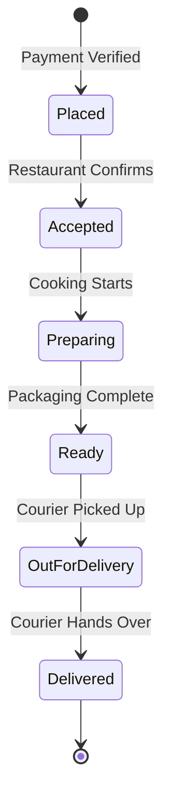
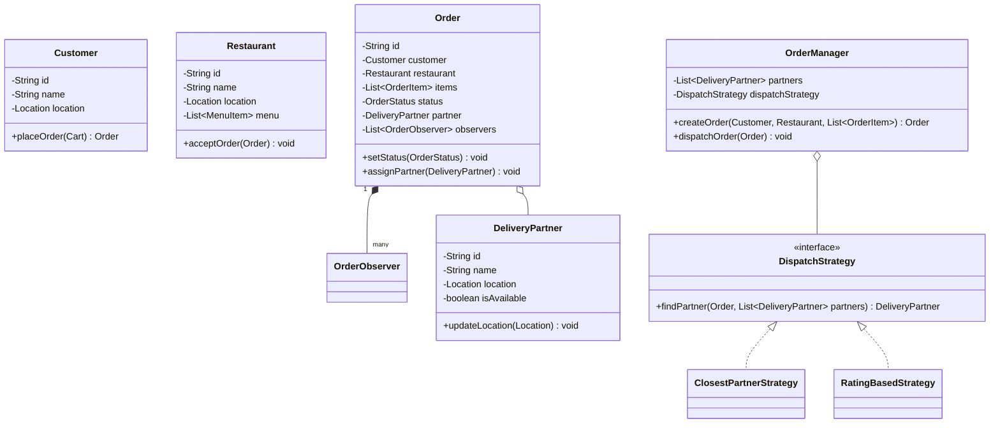

# Food Delivery System (Swiggy / Zomato)

## Introduction
A Food Delivery System (like Swiggy, Zomato, or UberEats) orchestrates menu catalogs, shopping carts, order preparation states, and delivery partner dispatch. Low-level design of this system highlights the Observer Pattern for real-time tracking, the Strategy Pattern for delivery routing, and state machines to manage order lifecycles.

---

## Problem Statement
Design a food delivery platform. The system must allow customers to browse menus, add items to a cart, and place orders. It must manage the order status transition lifecycle (Placed, Accepted, Preparing, Ready, OutForDelivery, Delivered), update restaurant tablets, dispatch delivery partners based on geo-locations, and publish location tracking updates in real-time.

---

## Why this exists
To coordinate logistics between customers, kitchens, and couriers. A delivery request involves three independent parties. If a driver cancels, the order must be re-routed immediately without disrupting food preparation. A robust system separates actors, utilizes strategy patterns for dispatch routing, and streams status updates.

---

## Real-world analogy
Think of ordering food from a local diner:
- You select a meal on your phone (the **Order Cart**).
- The order prints at the kitchen prep station (the **Restaurant Tablet**).
- The system checks for nearby couriers on bicycles (the **Dispatch Strategy**).
- As the courier picks up the package and rides, your phone displays a moving map marker (the **Live Location Observer**).

---

## Definition
A **Food Delivery System** is a real-time logistically coordinated platform consisting of Customers, Restaurants, Couriers, Order Managers, and Geo-Locators designed to process orders, dispatch partners, and track deliveries.

---

## Key concepts
1. **Order Lifecycle State Machine:** Tracking order transitions from `PLACED` to `DELIVERED`, coordinating notifications for each state update.
2. **Strategy Pattern for Dispatching:** Decoupling driver matching algorithms (e.g., shortest path distance, batch routing for multiple orders) from the order manager.
3. **Observer Pattern for Status Broadcasts:** Notifying customer apps, driver terminals, and restaurant dashboards when order states change.
4. **Geo-Location Math:** Managing spatial coordinates to calculate delivery ranges and match nearby couriers.

---

## Internal working / Mermaid diagram

### Order Lifecycle Flow


### Class Diagram


---

## Python/Java implementation

### 1. Bad Implementation: God Class & Direct String Routing
A single class tracks orders, menus, and coordinates in a monolithic list. Lacking separate states and design patterns makes modifying dispatch rules difficult.

```java
import java.util.*;

public class BadFoodDelivery {
    // CRITICAL BUG: Highly coupled variables.
    // Finding a driver requires looping through global arrays, violating SRP.
    public List<Map<String, String>> orders = new ArrayList<>();
    public List<Map<String, Double>> driverLocations = new ArrayList<>();

    public void addOrder(String id, String restaurant, String items) {
        Map<String, String> order = new HashMap<>();
        order.put("id", id);
        order.put("status", "PLACED");
        orders.add(order);
    }

    public void dispatch(String orderId) {
        // Hardcoded driver lookup
        for (Map<String, Double> driver : driverLocations) {
            System.out.println("Dispatched driver: " + driver.get("id"));
            return;
        }
    }
}
```

### 2. Better Implementation: OOP Entities but Coupled Dispatch Logic
Using separate classes for orders and couriers, but calculating driver assignments inside the order manager, which prevents using alternate dispatch algorithms.

```java
import java.util.*;

class BetterDriver {
    String id;
    double lat, lon;
    boolean busy = false;
    public BetterDriver(String id, double lat, double lon) {
        this.id = id; this.lat = lat; this.lon = lon;
    }
}

public class BetterOrderManager {
    private List<BetterDriver> drivers = new ArrayList<>();

    // BUG: Hardcoded closest driver search.
    // Cannot dynamically switch to rating-based or batch routing strategies.
    public BetterDriver findDriver(double resLat, double resLon) {
        BetterDriver closest = null;
        double minDistance = Double.MAX_VALUE;
        for (BetterDriver d : drivers) {
            if (d.busy) continue;
            double dist = Math.hypot(d.lat - resLat, d.lon - resLon);
            if (dist < minDistance) {
                minDistance = dist;
                closest = d;
            }
        }
        return closest;
    }
}
```

### 3. Best Implementation: Extensible Dispatch Strategies with Event Observers
Using the Observer Pattern for push notifications, Strategy Pattern for delivery routing, and a clean thread-safe order lifecycle controller.

```java
import java.math.BigDecimal;
import java.util.*;
import java.util.concurrent.*;

// 1. Coordinates Helper
class Location {
    private final double latitude;
    private final double longitude;

    public Location(double lat, double lon) {
        this.latitude = lat;
        this.longitude = lon;
    }
    public double getLatitude() { return latitude; }
    public double getLongitude() { return longitude; }
    public double distanceTo(Location other) {
        return Math.hypot(this.latitude - other.getLatitude(), this.longitude - other.getLongitude());
    }
}

// 2. Order States & Observer Pattern
enum OrderStatus { PLACED, ACCEPTED, PREPARING, READY_FOR_PICKUP, OUT_FOR_DELIVERY, DELIVERED }

interface OrderObserver {
    void onStatusChange(String orderId, OrderStatus status);
}

class CustomerNotifier implements OrderObserver {
    @Override
    public void onStatusChange(String orderId, OrderStatus status) {
        System.out.println("CUSTOMER PUSH: Order " + orderId + " is now " + status);
    }
}

class RestaurantNotifier implements OrderObserver {
    @Override
    public void onStatusChange(String orderId, OrderStatus status) {
        if (status == OrderStatus.PLACED) {
            System.out.println("RESTAURANT RING: New order received! " + orderId);
        }
    }
}

// 3. Domain Entities
class MenuItem {
    private final String name;
    private final BigDecimal price;

    public MenuItem(String name, BigDecimal price) {
        this.name = name;
        this.price = price;
    }
    public BigDecimal getPrice() { return price; }
}

class DeliveryPartner {
    private final String id;
    private final String name;
    private Location location;
    private boolean isAvailable = true;

    public DeliveryPartner(String id, String name, Location location) {
        this.id = id;
        this.name = name;
        this.location = location;
    }

    public Location getLocation() { return location; }
    public void setLocation(Location location) { this.location = location; }
    public boolean isAvailable() { return isAvailable; }
    public void setAvailable(boolean available) { this.isAvailable = available; }
    public String getId() { return id; }
}

class Order {
    private final String orderId;
    private final Location restaurantLocation;
    private OrderStatus status = OrderStatus.PLACED;
    private DeliveryPartner assignedPartner;
    
    private final List<OrderObserver> observers = new CopyOnWriteArrayList<>();

    public Order(String orderId, Location restaurantLocation) {
        this.orderId = orderId;
        this.restaurantLocation = restaurantLocation;
    }

    public void addObserver(OrderObserver o) { observers.add(o); }

    public void setStatus(OrderStatus newStatus) {
        this.status = newStatus;
        for (OrderObserver observer : observers) {
            observer.onStatusChange(orderId, newStatus);
        }
    }

    public void assignPartner(DeliveryPartner partner) {
        this.assignedPartner = partner;
        partner.setAvailable(false);
    }

    public String getOrderId() { return orderId; }
    public Location getRestaurantLocation() { return restaurantLocation; }
    public OrderStatus getStatus() { return status; }
}

// 4. Strategy Pattern: Dispatch Router
interface DispatchStrategy {
    DeliveryPartner selectPartner(Order order, List<DeliveryPartner> partners);
}

class ClosestPartnerStrategy implements DispatchStrategy {
    @Override
    public DeliveryPartner selectPartner(Order order, List<DeliveryPartner> partners) {
        DeliveryPartner selected = null;
        double minDistance = Double.MAX_VALUE;
        Location target = order.getRestaurantLocation();

        for (DeliveryPartner partner : partners) {
            if (!partner.isAvailable()) continue;
            double dist = partner.getLocation().distanceTo(target);
            if (dist < minDistance) {
                minDistance = dist;
                selected = partner;
            }
        }
        return selected;
    }
}

// 5. Order Management Coordinator
class OrderManager {
    private final List<DeliveryPartner> partners = new CopyOnWriteArrayList<>();
    private final DispatchStrategy dispatchStrategy;

    public OrderManager(DispatchStrategy dispatchStrategy) {
        this.dispatchStrategy = dispatchStrategy;
    }

    public void registerPartner(DeliveryPartner partner) {
        partners.add(partner);
    }

    public void processOrder(Order order) {
        order.setStatus(OrderStatus.ACCEPTED);
        order.setStatus(OrderStatus.PREPARING);
        
        // Find and assign courier using the injected dispatch strategy
        DeliveryPartner partner = dispatchStrategy.selectPartner(order, partners);
        if (partner != null) {
            order.assignPartner(partner);
            System.out.println("Courier " + partner.getId() + " assigned to order " + order.getOrderId());
        } else {
            System.out.println("No couriers available. Retrying...");
        }

        order.setStatus(OrderStatus.READY_FOR_PICKUP);
    }
}
```

---

## Step-by-step explanation
1. **Event Dispatching**: The `Order` class holds a list of `OrderObserver` objects. When `setStatus()` executes, it broadcasts the new status to customer apps and restaurant tablets.
2. **Strategy Routing**: The `OrderManager` delegates courier selection to the injected `DispatchStrategy`.
   - `ClosestPartnerStrategy` calculates the distance between the courier's location and the restaurant, selecting the closest available partner.
3. **Order Lifecycle**: The order progresses through states:
   `PLACED` $\to$ `ACCEPTED` $\to$ `PREPARING` $\to$ `READY_FOR_PICKUP` $\to$ `OUT_FOR_DELIVERY` $\to$ `DELIVERED`, triggering notifications at each step.
4. **Partner Assignment**: When a courier is assigned, their status is set to `isAvailable = false`, preventing other orders from selecting them.

---

## Multiple real-world examples
1. **Food Delivery Apps (Swiggy/Zomato):** Processing orders, tracking couriers, and sending real-time updates.
2. **Ride-Hailing Apps (Uber/Lyft):** Matching drivers with passengers based on location and trip request details.
3. **Logistics Networks (FedEx/UPS):** Routing packages through delivery hubs, tracking trucks, and updating package statuses.

---

## Pros
- **Highly Extensible:** The Strategy Pattern allows adding new routing strategies (e.g. rating-based or batch routing) easily.
- **Real-Time Notification:** The Observer Pattern decoples score calculations from update delivery networks.
- **Thread Safety:** Concurrent lists protect data integrity under high traffic.

---

## Cons
- **Out of Order Events:** Network delays can cause location updates to be received out of sequence.
- **Complex Match States:** Coordinating rare events (e.g. driver cancellations, order modifications) adds complexity to the state machine.

---

## Interview questions

### Beginner
- **Q: What is the purpose of the Observer Pattern in the Swiggy/Zomato design?**
  - **A:** To decouple the order status updates from notification delivery networks, ensuring customer apps, driver terminals, and restaurant tablets are updated in real-time.

### Intermediate
- **Q: How does the system handle driver cancellations?**
  - **A:** If a driver cancels, the order manager frees the driver, resets the order status to `ACCEPTED`, and pushes the order back into the dispatch pool to find a new courier.

### Senior
- **Q: How would you implement dynamic surge pricing based on high demand and low driver availability?**
  - **A:** Implement a `PricingStrategy` in the order manager. The strategy calculates surge multipliers by checking the ratio of pending orders to available drivers in the restaurant's geo-location grid, adding surge fees to the order bill.

### Staff Engineer
- **Q: How would you design a real-time location tracking system supporting 1 million active deliveries, ensuring low database write overhead?**
  - **A:** 
    - **Data Ingestion:** Couriers stream GPS coordinates via WebSockets or UDP to an ingestion layer (e.g. using Netty or Spring WebFlux).
    - **Timeseries Storage (Redis):** Location updates are written to a fast cache like Redis using Geospatial indexes (`GEOADD`), bypass writing coordinates to the main database on every update.
    - **WebSocket Broadcast:** Customer apps subscribe to location update topics. WebSocket nodes read coordinates from Redis and push them to the corresponding customer connections in real-time.
    - **Cold Storage Sync:** A background job writes final delivery paths to the main database once the order is completed.

---

## Common mistakes
- **Using HTTP Polling:** Forcing customer apps to query the database every second to update locations.
- **Coupling dispatch logic:** Hardcoding driver selection inside the order manager class.
- **Swallowing exception failures:** Neglecting to handle driver cancellations or payment timeouts.

---

## Best practices
- **Minimize Lock Scope:** Acquire locks only on the specific order being mutated.
- **Use thread-safe collections:** Coordinate turn-based transitions using thread-safe queues.
- **Validate coordinates:** Ensure pickup and drop-off locations are set before dispatching.

---

## When NOT to use
- **Static Store Pickups:** For systems where customers pick up orders themselves, driver dispatching and live location tracking architectures are unnecessary.

---

## Comparison with similar concepts

| Strategy | WebSocket Server (Push) | HTTP Polling (Pull) |
| :--- | :--- | :--- |
| **Data Flow** | Server pushes updates immediately to client | Client repeatedly requests updates from server |
| **Server Load** | Low (connections are held open) | High (requires processing millions of requests) |
| **Update Latency** | Sub-second | Delayed (based on polling interval) |

---

## Summary
Designing a Food Delivery System requires separating order states from dispatch strategies. Using the Strategy Pattern for routing and the Observer Pattern for notifications ensures reliable, real-time logistics coordination.

---

## Related topics
- [Hotel Booking System](../hotel-booking)
- [Design Principles](../../design-principles/composition-vs-inheritance)
- [Observer Pattern](../../../01-design-patterns/behavioral/observer)
