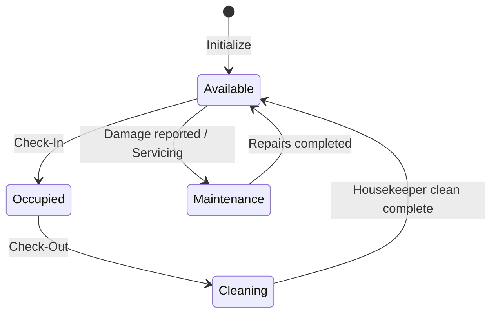
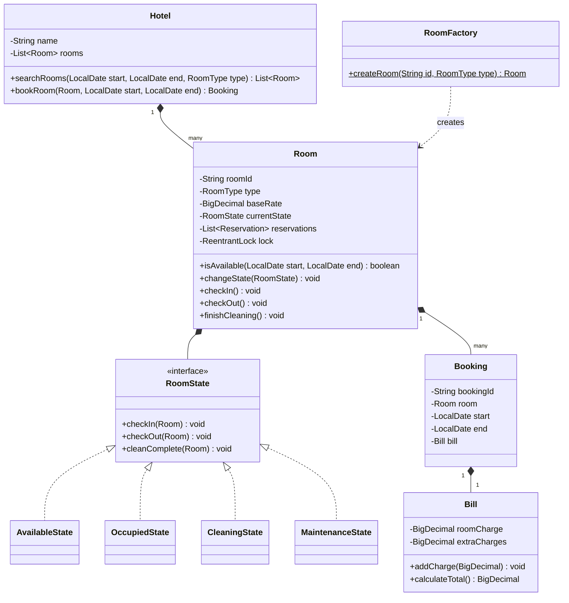

# Hotel Booking System Design

## Introduction
A Hotel Booking System manages room inventories, reservations, guest check-ins/check-outs, and housekeeping workflows across multiple room tiers (e.g. Standard, Deluxe, Suite). Low-level design of a hotel system showcases the State Pattern for managing room availabilities, the Factory Pattern for room instantiation, and thread-safe reservation calendars.

---

## Problem Statement
Design a hotel booking and management system. The system must support searching for available rooms by type and date range, reserving rooms, managing room check-ins/check-outs, billing (room rates, room service, and additional amenities), and transition room states (Available, Occupied, Cleaning, Maintenance) securely under concurrent operations.

---

## Why this exists
To coordinate room inventory states and guest transactions. If multiple guests try to book the same room for the same date concurrently, or if a guest checks into a room that has not been cleared by housekeeping, it creates administrative issues. A robust design coordinates room state transitions, isolates booking transactions using thread-safe calendars, and calculates bills dynamically.

---

## Real-world analogy
Think of a stay at a luxury resort:
- You book a room online for next weekend (the **Reservation Calendar**).
- When you arrive at the front desk, the receptionist checks your ID and issues a keycard (the **Check-In Transition**).
- During your stay, you order room service (the **Billing Decorator/Strategy**).
- After you checkout, a notification is sent to the cleaning staff's tablet. The room stays locked (the **Cleaning State**) until they press "Clean Complete", restoring the room to available status.

---

## Definition
A **Hotel Booking System** is a state-managed inventory coordination system consisting of Rooms, Calendars, Bookings, Housekeeping logs, and Billing systems designed to process reservations, track room statuses, and manage guest billing.

---

## Key concepts
1. **Room State Pattern:** Encapsulating room behaviors in state objects (`AvailableState`, `OccupiedState`, `CleaningState`, `MaintenanceState`) to prevent checking guests into uncleaned or damaged rooms.
2. **Factory Pattern for Rooms:** Decoupling room creations (e.g., standard, deluxe, suite) to allow adding new room configurations (like presidential penthouses) with unique base rates.
3. **Date Overlap Calendar:** Using thread-safe interval trees or booking lists to verify room availability for specific dates.
4. **Housekeeping Integration:** Automatically routing rooms to cleaning states upon checkout, blocking check-ins until verified.

---

## Internal working / Mermaid diagram

### Room State Transitions


### Class Diagram


---

## Python/Java implementation

### 1. Bad Implementation: Unsafe State Codes & Hardcoded Logic
Using primitive integer codes to track state results in invalid state transitions (e.g. checking a guest into a dirty room), and lacking thread safety causes double bookings.

```java
import java.util.*;

public class BadHotelSystem {
    // CRITICAL BUG: Lacks validation check for cleaning state.
    // Thread safety is completely missing; multiple check-ins can occur concurrently.
    public int[] roomStatuses = new int[100]; // 0=Avail, 1=Occupied, 2=Dirty
    public double[] roomPrices = new double[100];

    public boolean checkIn(int roomNum) {
        if (roomStatuses[roomNum] == 0 || roomStatuses[roomNum] == 2) {
            // BUG: Allows checking into a dirty room (status 2)
            roomStatuses[roomNum] = 1; // Occupied
            return true;
        }
        return false;
    }
}
```

### 2. Better Implementation: OOP Entities but Lacking State Pattern & Factories
Using separate classes for rooms and bookings, but managing state transitions via nested if-else checks, which makes adding new states (e.g. Maintenance) complex.

```java
import java.util.*;
import java.time.LocalDate;

class BetterRoom {
    String id;
    String status = "AVAILABLE"; // "AVAILABLE", "OCCUPIED", "DIRTY"
    double baseRate;
    List<LocalDate> bookedDates = new ArrayList<>();

    public BetterRoom(String id, double rate) { this.id = id; this.baseRate = rate; }

    public boolean checkIn() {
        // BUG: Hardcoded state logic is difficult to maintain.
        if (status.equals("AVAILABLE")) {
            status = "OCCUPIED";
            return true;
        }
        return false;
    }
}
```

### 3. Best Implementation: Extensible Hotel System with State Pattern & Room Factory
Applying the State Pattern for room state transitions, the Factory Pattern for room creations, thread-safe date calendars using ReentrantLock, and dynamic billing components.

```java
import java.math.BigDecimal;
import java.time.LocalDate;
import java.util.*;
import java.util.concurrent.*;
import java.util.concurrent.locks.ReentrantLock;

// 1. Enums
enum RoomType { STANDARD, DELUXE, SUITE }

// 2. Room State Interface
interface RoomState {
    void checkIn(Room room);
    void checkOut(Room room);
    void cleanComplete(Room room);
    void reportDamage(Room room);
}

// 3. Concrete States
class AvailableState implements RoomState {
    @Override
    public void checkIn(Room room) {
        room.setState(new OccupiedState());
        System.out.println("Room " + room.getId() + " checked in successfully.");
    }
    @Override public void checkOut(Room room) { System.out.println("Cannot check out of an empty room."); }
    @Override public void cleanComplete(Room room) { System.out.println("Room is already clean."); }
    @Override
    public void reportDamage(Room room) {
        room.setState(new MaintenanceState());
        System.out.println("Room " + room.getId() + " moved to maintenance.");
    }
}

class OccupiedState implements RoomState {
    @Override public void checkIn(Room room) { System.out.println("Room is already occupied."); }
    @Override
    public void checkOut(Room room) {
        room.setState(new CleaningState());
        System.out.println("Room " + room.getId() + " checked out. Moving to cleaning state.");
    }
    @Override public void cleanComplete(Room room) { System.out.println("Cannot clean occupied room."); }
    @Override public void reportDamage(Room room) { System.out.println("Damage reported. Will process after check-out."); }
}

class CleaningState implements RoomState {
    @Override public void checkIn(Room room) { System.out.println("Cannot check in. Room is currently being cleaned."); }
    @Override public void checkOut(Room room) { System.out.println("Room is already checked out."); }
    @Override
    public void cleanComplete(Room room) {
        room.setState(new AvailableState());
        System.out.println("Room " + room.getId() + " cleaning completed. Ready for booking.");
    }
    @Override
    public void reportDamage(Room room) {
        room.setState(new MaintenanceState());
        System.out.println("Room " + room.getId() + " moved from cleaning to maintenance.");
    }
}

class MaintenanceState implements RoomState {
    @Override public void checkIn(Room room) { System.out.println("Cannot check in. Room is under maintenance."); }
    @Override public void checkOut(Room room) { System.out.println("Room is under maintenance."); }
    @Override public void cleanComplete(Room room) { System.out.println("Room is under maintenance, not cleaning."); }
    @Override
    public void reportDamage(Room room) { System.out.println("Damage already recorded."); }
}

// 4. Room Context
class Room {
    private final String id;
    private final RoomType type;
    private final BigDecimal baseRate;
    private RoomState state = new AvailableState();

    private final List<BookingRange> reservations = new CopyOnWriteArrayList<>();
    private final ReentrantLock lock = new ReentrantLock();

    public Room(String id, RoomType type, BigDecimal baseRate) {
        this.id = id;
        this.type = type;
        this.baseRate = baseRate;
    }

    public boolean isAvailable(LocalDate start, LocalDate end) {
        for (BookingRange r : reservations) {
            if (start.isBefore(r.end) && end.isAfter(r.start)) {
                return false;
            }
        }
        return true;
    }

    public boolean reserve(LocalDate start, LocalDate end) {
        lock.lock();
        try {
            if (!isAvailable(start, end)) return false;
            reservations.add(new BookingRange(start, end));
            return true;
        } finally {
            lock.unlock();
        }
    }

    public void checkIn() { state.checkIn(this); }
    public void checkOut() { state.checkOut(this); }
    public void cleanComplete() { state.cleanComplete(this); }
    public void reportDamage() { state.reportDamage(this); }

    public String getId() { return id; }
    public RoomType getType() { return type; }
    public BigDecimal getBaseRate() { return baseRate; }
    public void setState(RoomState state) { this.state = state; }

    static class BookingRange {
        LocalDate start, end;
        BookingRange(LocalDate s, LocalDate e) { this.start = s; this.end = e; }
    }
}

// 5. Factory Pattern: Room Factory
class RoomFactory {
    public static Room createRoom(String id, RoomType type) {
        switch (type) {
            case STANDARD:
                return new Room(id, type, BigDecimal.valueOf(100.00));
            case DELUXE:
                return new Room(id, type, BigDecimal.valueOf(180.00));
            case SUITE:
                return new Room(id, type, BigDecimal.valueOf(350.00));
            default:
                throw new IllegalArgumentException("Unknown room type.");
        }
    }
}

// 6. Billing System
class Bill {
    private final BigDecimal roomCharges;
    private BigDecimal roomServiceCharges = BigDecimal.ZERO;

    public Bill(BigDecimal roomCharges) {
        this.roomCharges = roomCharges;
    }

    public void addRoomService(BigDecimal amount) {
        this.roomServiceCharges = this.roomServiceCharges.add(amount);
    }

    public BigDecimal calculateTotal() {
        return roomCharges.add(roomServiceCharges);
    }
}
```

---

## Step-by-step explanation
1. **State Isolation**: Room actions (such as `checkIn()` and `checkOut()`) are delegated to the `RoomState` interface. If a room is in `CleaningState`, attempting to check in is blocked by the state's rules, preventing administrative issues.
2. **Locking Isolation**: Rather than synchronizing the entire booking catalog, the system acquires a lock (`ReentrantLock`) on the individual `Room` object during reservation updates. This allows concurrent bookings on other rooms.
3. **Decoupled Instantiation**: The `RoomFactory` instantiates rooms based on room types, centralizing pricing configurations.
4. **Billing Calculations**: The `Bill` class manages guest billing. Room service or mini-bar charges are added dynamically using `BigDecimal` to ensure precision.

---

## Multiple real-world examples
1. **Hotel Chains (Marriott/Hilton):** Multi-location networks managing rooms, handling check-ins, and coordinating housekeeping updates.
2. **Short-term Rentals (Airbnb):** Platforms managing property availability calendars, processing bookings, and handling cleaning fees.
3. **Hospital Bed Management:** Coordinating bed availabilities, routing beds to sanitization states after patient discharge, and managing reservation queues.

---

## Pros
- **Clean State Flow:** The State Pattern encapsulates room status transitions, preventing invalid state changes.
- **High Concurrency:** Fine-grained locks per room maximize booking performance.
- **Extensible Room Types:** The Factory Pattern simplifies adding new room tiers with custom pricing configurations.

---

## Cons
- **Overdue Departure Overhead:** If a guest fails to check out on time, resolving the conflict with the next booking requires a reallocation algorithm.
- **Index Synchronization:** Updating search indexes for available rooms across millions of dates requires structured caching strategies.

---

## Interview questions

### Beginner
- **Q: What is the purpose of using the State pattern for Room status management?**
  - **A:** To encapsulate status transitions. A room has strict rules (e.g. guests cannot check into a dirty room). The State pattern moves these rules into separate state classes, keeping the core `Room` class clean and readable.

### Intermediate
- **Q: How does the system handle booking dates validation?**
  - **A:** The system validates date ranges using the formula: `start.isBefore(booking.end) && end.isAfter(booking.start)`. If this is true, the booking overlaps, and the system rejects the reservation.

### Senior
- **Q: How would you handle a housekeeping delay that prevents a checked-out room from being ready for the next guest?**
  - **A:** The system should implement a booking reassignment service:
    1. Scan the hotel inventory to find a clean room of the same tier.
    2. If available, update the guest's booking to the new room ID.
    3. If unavailable, upgrade the guest to a higher tier room at no extra cost, or notify front desk support to coordinate priority cleaning.

### Staff Engineer
- **Q: How would you design a global distribution system (GDS) for a hotel network supporting 10,000 bookings per second during holiday seasons?**
  - **A:** 
    - **Search Cache:** Searching room availability across dates is read-heavy. We cache available room inventories using **Redis Bitmaps**, where each bit represents a day's availability status.
    - **Inventory Allocation:** When a user books, the booking service acquires a distributed lock (e.g., via Redisson) on the specific room ID.
    - **Transactional Consistency:** We write reservation records to a database using optimistic locking. Changes publish events (e.g., `RoomBookedEvent`) to Kafka to synchronize regional caches asynchronously.

---

## Common mistakes
- **Using primitive codes for state:** Managing room statuses with integer codes, which leads to unmaintainable logic.
- **Locking the entire hotel catalog:** Using a global synchronized lock during bookings blocks other users from reserving different rooms.
- **Neglecting cleaning flows:** Allowing guests to check into rooms that have not been cleared by housekeeping.

---

## Best practices
- **Enforce Encapsulation:** Maintain status fields as private, permitting modifications only via validated state transitions.
- **Release Locks in Finally Blocks:** Always release explicit locks in a `finally` block to prevent resource leaks.
- **Leverage factory methods:** Centralize room creation rules inside factories.

---

## When NOT to use
- **Single-Room Cabins:** For single-property rentals, complex state patterns and factory architectures are unnecessary.

---

## Comparison with similar concepts

| Strategy | State Pattern (Room Flow) | Strategy Pattern (Surge Rates) |
| :--- | :--- | :--- |
| **Primary Goal** | Change object behavior when internal state changes | Encapsulate interchangeable pricing algorithms (e.g. peak vs off-peak rates) |
| **Transitions** | Managed dynamically by state classes | Set once by the caller context |
| **Structure** | Creates multiple state classes | Creates multiple algorithm classes |

---

## Summary
Designing a Hotel Booking System requires separating room states from booking transactions. Using the State Pattern for room statuses and fine-grained locks for calendars ensures safe, concurrent check-ins and bookings.

---

## Related topics
- [Car Rental System](../car-rental)
- [Design Principles](../../design-principles/composition-vs-inheritance)
- [State Pattern](../../../01-design-patterns/behavioral/state)
