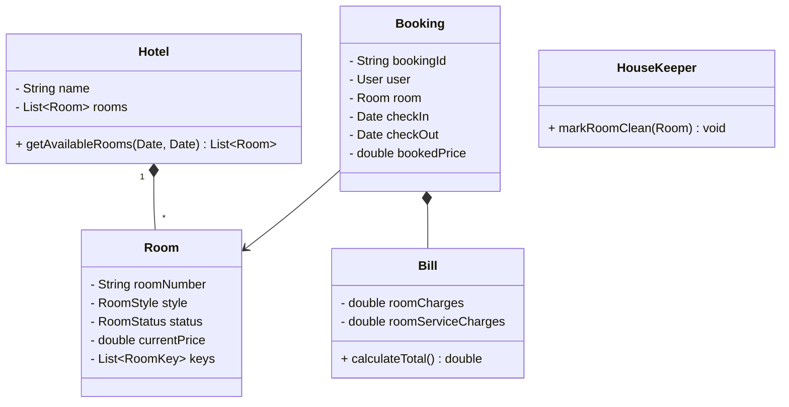

# Hotel Booking System

## Problem Statement
Design a Hotel Management and Booking system (like Marriott or OYO). The system must manage a hotel with various types of rooms (Standard, Deluxe, Suite). Users should be able to search for available rooms for a specific date range, book them, check-in, order room service, and check-out while settling the final bill.

## Requirements

### Functional Requirements
1. **Room Inventory:** The hotel has multiple floors and rooms. Each room has a type, price, and status (Available, Occupied, Cleaning, Maintenance).
2. **Search:** Users can search for rooms by type and date range.
3. **Booking:** A user can reserve a room.
4. **Housekeeping:** After a user checks out, the room status must change to `Cleaning` and cannot be booked until a housekeeper marks it `Available`.
5. **Billing:** Calculate the final bill taking into account the room rate, length of stay, and additional charges (Room service, Mini-bar).

### Non-Functional Requirements
1. **Concurrency:** Ensure no two users can book the exact same room for overlapping dates.
2. **Data Integrity:** Pricing history must be maintained. If a user booked a room a month ago for $100, and the price is now $150, their bill must still say $100.

## Class Diagram



## Implementation (Java Skeleton)

*Note: The booking overlap logic is almost identical to the Car Rental system. Here, we focus on the State Management of the Room.*

```java
import java.util.*;

enum RoomStatus { AVAILABLE, OCCUPIED, CLEANING, MAINTENANCE }

class Room {
    String roomNumber;
    RoomStatus status;
    double pricePerNight;
    
    public Room(String roomNumber, double price) {
        this.roomNumber = roomNumber;
        this.pricePerNight = price;
        this.status = RoomStatus.AVAILABLE;
    }
    
    // Method for Receptionist
    public void checkIn() {
        if (status == RoomStatus.AVAILABLE) {
            status = RoomStatus.OCCUPIED;
            System.out.println("Checked in to room " + roomNumber);
        } else {
            System.out.println("Room is not ready!");
        }
    }
    
    // Method for Receptionist
    public void checkOut() {
        if (status == RoomStatus.OCCUPIED) {
            status = RoomStatus.CLEANING; // Automatically flags for housekeeping
            System.out.println("Checked out of room " + roomNumber + ". Sending housekeeping.");
        }
    }
    
    // Method for Housekeeper app
    public void finishCleaning() {
        if (status == RoomStatus.CLEANING) {
            status = RoomStatus.AVAILABLE;
            System.out.println("Room " + roomNumber + " is sparkling clean and ready to book.");
        }
    }
}

// BILLING 
class Bill {
    double roomCharges;
    double amenitiesCharges = 0;

    public Bill(double roomCharges) {
        this.roomCharges = roomCharges;
    }

    public void addRoomService(double amount) {
        this.amenitiesCharges += amount;
    }

    public double getTotal() {
        return roomCharges + amenitiesCharges;
    }
}
```

## Test Cases
1. **State Flow:** Room is `AVAILABLE`. User checks in -> `OCCUPIED`. User checks out -> `CLEANING`. Housekeeper cleans it -> `AVAILABLE`.
2. **Preventing Dirty Check-ins:** User tries to check into a room that was just vacated but not yet cleaned (Status `CLEANING`). The system must throw an error preventing check-in.
3. **Dynamic Billing:** User books room for 3 nights at $100/night. Room charges are $300. User orders $50 of food. Final bill calculates to $350.

## Edge Cases
1. **No-Shows:** A user books a room but never arrives. The system needs a background Cron job to automatically cancel the reservation at midnight, charge a 1-night penalty fee, and free up the room inventory for the next day.
2. **Maintenance:** A pipe bursts in Room 101. The manager sets the status to `MAINTENANCE`. All future bookings for Room 101 must be queried, and those guests must be automatically reassigned to different rooms of equal or greater value.

## Improvements & Extensions
- **Factory Pattern:** When creating rooms during hotel initialization, use a `RoomFactory` to instantiate standard rooms vs suites, as they will have completely different amenity configurations and pricing algorithms.
