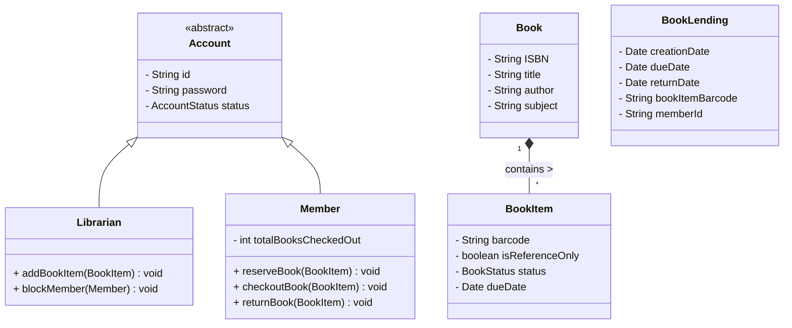

# Library Management System

## Problem Statement
Design an automated Library Management System. The system must allow users to search for books, checkout books, return books, and calculate late fees. It must also handle the inventory of physical books, allowing librarians to add or remove copies.

## Requirements

### Functional Requirements
1. **Search:** Users can search the catalog by Title, Author, Subject, or Publication Date.
2. **Inventory:** Each book can have multiple physical copies (Books vs BookItems).
3. **Checkout/Return:** A registered member can checkout a book. If the limit is reached (e.g., 5 books max), they cannot checkout more.
4. **Reserving:** If a book is currently checked out, a user can place it on hold/reserve it.
5. **Fines:** When a book is returned past its due date, the system must calculate and apply a fine to the user's account.

### Non-Functional Requirements
1. **ACID Properties:** Checking out a book must be transactionally safe so two users cannot check out the exact same physical copy simultaneously.
2. **Notifications:** The system should notify users when a reserved book becomes available or when a book is overdue.

## Class Diagram



## Implementation (Java)

```java
import java.util.*;
import java.time.LocalDate;
import java.time.temporal.ChronoUnit;

// ENUMS
enum BookStatus { AVAILABLE, RESERVED, LOANED, LOST }

// DOMAIN MODELS
class Book {
    private String ISBN;
    private String title;
    private String author;
    
    public Book(String ISBN, String title, String author) {
        this.ISBN = ISBN;
        this.title = title;
        this.author = author;
    }
    public String getTitle() { return title; }
}

// BookItem represents a physical copy of a Book
class BookItem extends Book {
    private String barcode;
    private BookStatus status;
    private LocalDate dueDate;

    public BookItem(String ISBN, String title, String author, String barcode) {
        super(ISBN, title, author);
        this.barcode = barcode;
        this.status = BookStatus.AVAILABLE;
    }

    public boolean checkout() {
        if (this.status != BookStatus.AVAILABLE) return false;
        this.status = BookStatus.LOANED;
        this.dueDate = LocalDate.now().plusDays(14); // 2-week loan
        return true;
    }

    public void returnItem() {
        this.status = BookStatus.AVAILABLE;
        this.dueDate = null;
    }

    public LocalDate getDueDate() { return dueDate; }
    public BookStatus getStatus() { return status; }
}

// MEMBER
class Member {
    private String memberId;
    private int booksCheckedOut = 0;
    private double totalFines = 0.0;
    private static final int MAX_BOOKS = 5;

    public Member(String id) { this.memberId = id; }

    public synchronized boolean checkoutBook(BookItem item) {
        if (booksCheckedOut >= MAX_BOOKS) {
            System.out.println("Checkout limit reached.");
            return false;
        }
        if (item.checkout()) {
            booksCheckedOut++;
            System.out.println("Checked out successfully.");
            return true;
        }
        return false;
    }

    public synchronized void returnBook(BookItem item) {
        LocalDate due = item.getDueDate();
        if (LocalDate.now().isAfter(due)) {
            long daysLate = ChronoUnit.DAYS.between(due, LocalDate.now());
            totalFines += (daysLate * 0.50); // 50 cents a day
            System.out.println("Late! Fines added: $" + totalFines);
        }
        item.returnItem();
        booksCheckedOut--;
    }
}
```

## Test Cases
1. **Happy Path:** Member checks out an available book. The count increases to 1. The book's status becomes LOANED. Due date is set to 14 days from now.
2. **Checkout Limit:** Member checks out 5 books. Member tries to check out a 6th book. System denies the request.
3. **Late Return:** Member returns a book 2 days after the due date. System calculates a $1.00 fine and adds it to their account.

## Edge Cases
1. **Reference Books:** Some books (like encyclopedias) are "Reference Only". They cannot be checked out, only read in the library. The `BookItem` class should have a `isReferenceOnly` flag that `checkout()` validates against.
2. **Lost Books:** If a user loses a book, the status is changed to `LOST`, the user is billed the replacement value of the book, and the `booksCheckedOut` count is decremented so they aren't permanently locked out of borrowing.

## Improvements & Extensions
- **Search Architecture:** In a real library, searching through millions of books via SQL `LIKE` queries is too slow. Implement **Elasticsearch** for fuzzy text searching and fast filtering.
- **Observer Pattern:** When a book is `RESERVED`, the user needs to be notified when the current holder returns it. The `BookItem` could implement the Observer pattern. When `returnItem()` is called, it triggers a `notifyObservers()` call to send an email to the next person in the reservation queue.
