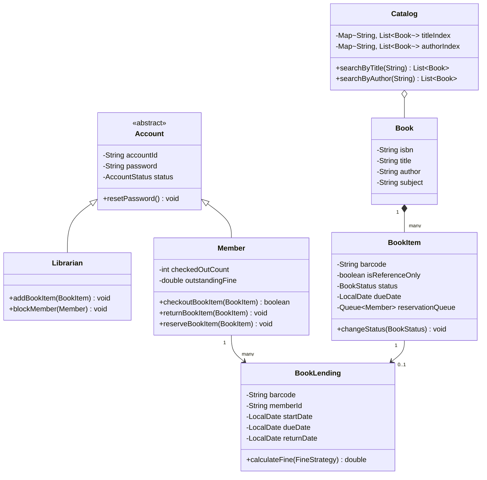

# Library Management System Design

## Introduction
A Library Management System (LMS) manages the catalog of books, member registrations, checkout transactions, and inventory logistics within a library. Low-level design of an LMS showcases separation of entity concepts (e.g., separating the abstract `Book` meta-data from physical `BookItem` copies), indexing, transaction safety, and event notifications.

---

## Problem Statement
Design an automated Library Management System. The system must support catalog searches (by title, author, subject, or publication date), checkouts, returns, book holds/reservations, and fine calculations. It must enforce constraints (e.g., maximum borrow limits per member, reference-only restrictions) and manage concurrency to prevent the same physical book copy from being loaned to multiple members simultaneously.

---

## Why this exists
To maintain consistent state records in a multi-user library. Without proper design, check-outs can conflict, book searching becomes slow as the inventory scales, and tracking reservation queues is error-prone. A robust system separates metadata from assets, optimizes search paths via multi-dimensional indexing, and uses clean state machines for reservations.

---

## Real-world analogy
Think of a public library system:
- The library has a central card catalog cabinet (the **Search Catalog**). Cards are indexed alphabetically by title or author so you can find the shelf location immediately.
- Even if the library has 5 physical copies of "Clean Code", they all share the same details (Author, ISBN) but have different barcodes (the **BookItems**).
- If a copy is gone, you put a sticky note on the checkout slot (the **Reservation Queue**) so you get notified when it is returned.

---

## Definition
A **Library Management System** is an object-oriented tracking system consisting of Catalogs, Accounts, Book Items, Loans, and Reservation components designed to coordinate book circulation, inventory management, and fine billing.

---

## Key concepts
1. **Book vs. BookItem:** Decoupling conceptual metadata (`Book` containing title, author, ISBN) from actual physical instances (`BookItem` containing barcode, condition, shelf location, and loan status).
2. **Search Indexing:** Using hash maps or trie structures to enable $O(1)$ search lookups on metadata fields.
3. **Transaction Coordination:** Ensuring thread-safe checkout states so two concurrent requests for the same barcode do not generate double loans.
4. **Reservation Queueing:** Maintaining a FIFO queue of members waiting for a loaned book item to trigger notifications upon return.

---

## Internal working / Mermaid diagram



---

## Python/Java implementation

### 1. Bad Implementation: Single Monolithic Table & Linear Scans
All books and members reside in a flat list inside a single class. Every search requires traversing the entire array, and checking out lacks synchronization, causing double-bookings.

```java
import java.util.*;

public class BadLibrarySystem {
    // CRITICAL BUG: Thread-unsafe lists and linear scans O(N) degrade performance.
    // Lacks separation between abstract books and physical barcodes.
    public List<Map<String, String>> books = new ArrayList<>(); 
    public List<Map<String, String>> members = new ArrayList<>();

    public boolean checkoutBook(String title, String memberId) {
        for (Map<String, String> book : books) {
            if (book.get("title").equals(title) && book.get("status").equals("FREE")) {
                book.put("status", "LOANED");
                book.put("borrower", memberId);
                return true; // Concurrent thread can execute between read and write!
            }
        }
        return false;
    }

    public List<Map<String, String>> search(String title) {
        List<Map<String, String>> results = new ArrayList<>();
        for (Map<String, String> book : books) {
            if (book.get("title").contains(title)) {
                results.add(book);
            }
        }
        return results;
    }
}
```

### 2. Better Implementation: OOP Entities but Lacking Indexing & Transaction Safety
Applying basic OOP classes, but still scanning loops for searching and lacking concurrency control at the barcode checkout level.

```java
import java.util.*;

class BetterBookItem {
    private String barcode;
    private String title;
    private String status = "AVAILABLE";

    public BetterBookItem(String barcode, String title) {
        this.barcode = barcode;
        this.title = title;
    }
    public synchronized boolean loan() {
        if (!status.equals("AVAILABLE")) return false;
        status = "LOANED";
        return true;
    }
    public String getTitle() { return title; }
}

public class BetterLibrary {
    private final List<BetterBookItem> items = new ArrayList<>();

    // BUG: Searching is O(N) and blocks all checkouts if synchronized globally.
    public synchronized List<BetterBookItem> searchByTitle(String title) {
        List<BetterBookItem> found = new ArrayList<>();
        for (BetterBookItem item : items) {
            if (item.getTitle().equalsIgnoreCase(title)) {
                found.add(item);
            }
        }
        return found;
    }
}
```

### 3. Best Implementation: High-Concurrency Library with Multi-Index Catalog
Applying proper class partitioning, concurrent indexes (O(1) searches), transaction-safe checkouts using ReentrantLock, Strategy pattern for fine calculation, and Observer callbacks for hold notifications.

```java
import java.util.*;
import java.util.concurrent.*;
import java.util.concurrent.locks.ReentrantLock;
import java.time.LocalDate;
import java.time.temporal.ChronoUnit;

// 1. Enums
enum AccountStatus { ACTIVE, BLOCKED }
enum BookStatus { AVAILABLE, LOANED, RESERVED }

// 2. Core Book metadata
class Book {
    private final String isbn;
    private final String title;
    private final String author;
    private final String subject;

    public Book(String isbn, String title, String author, String subject) {
        this.isbn = isbn;
        this.title = title;
        this.author = author;
        this.subject = subject;
    }
    public String getIsbn() { return isbn; }
    public String getTitle() { return title; }
    public String getAuthor() { return author; }
    public String getSubject() { return subject; }
}

// 3. Physical Book Item
class BookItem {
    private final String barcode;
    private final Book book;
    private final boolean isReferenceOnly;
    private BookStatus status = BookStatus.AVAILABLE;
    private LocalDate dueDate;
    
    private final Queue<String> reservationQueue = new ConcurrentLinkedQueue<>();
    private final ReentrantLock lock = new ReentrantLock();

    public BookItem(String barcode, Book book, boolean isReferenceOnly) {
        this.barcode = barcode;
        this.book = book;
        this.isReferenceOnly = isReferenceOnly;
    }

    public boolean reserve(String memberId) {
        lock.lock();
        try {
            if (status == BookStatus.AVAILABLE) return false; // Directly check it out instead
            reservationQueue.add(memberId);
            status = BookStatus.RESERVED;
            return true;
        } finally {
            lock.unlock();
        }
    }

    public boolean checkout(String memberId, int loanDays) {
        lock.lock();
        try {
            if (isReferenceOnly) {
                System.out.println("Reference book cannot be checked out.");
                return false;
            }
            if (status == BookStatus.LOANED) return false;
            if (status == BookStatus.RESERVED) {
                String nextInQueue = reservationQueue.peek();
                if (nextInQueue == null || !nextInQueue.equals(memberId)) {
                    return false; // Reserved for someone else
                }
                reservationQueue.poll(); // Consume reservation
            }
            this.status = BookStatus.LOANED;
            this.dueDate = LocalDate.now().plusDays(loanDays);
            return true;
        } finally {
            lock.unlock();
        }
    }

    public void returnItem() {
        lock.lock();
        try {
            this.dueDate = null;
            if (!reservationQueue.isEmpty()) {
                this.status = BookStatus.RESERVED;
                notifyNextMember(reservationQueue.peek());
            } else {
                this.status = BookStatus.AVAILABLE;
            }
        } finally {
            lock.unlock();
        }
    }

    private void notifyNextMember(String memberId) {
        System.out.println("NOTIFICATION: Book " + book.getTitle() + " now available for reserved member " + memberId);
    }

    public String getBarcode() { return barcode; }
    public Book getBook() { return book; }
    public BookStatus getStatus() { return status; }
    public LocalDate getDueDate() { return dueDate; }
}

// 4. Fine Calculation Strategy
interface FineStrategy {
    double calculateFine(long daysOverdue);
}

class StandardFineStrategy implements FineStrategy {
    private final double dailyRate;
    public StandardFineStrategy(double dailyRate) { this.dailyRate = dailyRate; }

    @Override
    public double calculateFine(long daysOverdue) {
        return daysOverdue * dailyRate;
    }
}

// 5. Lending Transaction Record
class BookLending {
    private final String barcode;
    private final String memberId;
    private final LocalDate startDate;
    private final LocalDate dueDate;
    private LocalDate returnDate;

    public BookLending(String barcode, String memberId, int loanDays) {
        this.barcode = barcode;
        this.memberId = memberId;
        this.startDate = LocalDate.now();
        this.dueDate = LocalDate.now().plusDays(loanDays);
    }

    public double resolveReturn(FineStrategy fineStrategy) {
        this.returnDate = LocalDate.now();
        if (returnDate.isAfter(dueDate)) {
            long days = ChronoUnit.DAYS.between(dueDate, returnDate);
            return fineStrategy.calculateFine(days);
        }
        return 0.0;
    }
}

// 6. Fast Search Catalog Index
class Catalog {
    private final Map<String, List<Book>> titleIndex = new ConcurrentHashMap<>();
    private final Map<String, List<Book>> authorIndex = new ConcurrentHashMap<>();

    public void indexBook(Book book) {
        titleIndex.computeIfAbsent(book.getTitle().toLowerCase(), k -> new CopyOnWriteArrayList<>()).add(book);
        authorIndex.computeIfAbsent(book.getAuthor().toLowerCase(), k -> new CopyOnWriteArrayList<>()).add(book);
    }

    public List<Book> searchByTitle(String title) {
        return titleIndex.getOrDefault(title.toLowerCase(), Collections.emptyList());
    }

    public List<Book> searchByAuthor(String author) {
        return authorIndex.getOrDefault(author.toLowerCase(), Collections.emptyList());
    }
}

// 7. Member Representation
class Member {
    private final String memberId;
    private final String name;
    private AccountStatus status = AccountStatus.ACTIVE;
    private final Map<String, BookLending> activeLoans = new ConcurrentHashMap<>();
    private double outstandingBalance = 0.0;

    public Member(String memberId, String name) {
        this.memberId = memberId;
        this.name = name;
    }

    public boolean canBorrow() {
        return status == AccountStatus.ACTIVE && activeLoans.size() < 5 && outstandingBalance == 0.0;
    }

    public boolean borrowItem(BookItem item, int loanDays) {
        if (!canBorrow()) return false;
        if (item.checkout(memberId, loanDays)) {
            BookLending loan = new BookLending(item.getBarcode(), memberId, loanDays);
            activeLoans.put(item.getBarcode(), loan);
            return true;
        }
        return false;
    }

    public void returnItem(BookItem item, FineStrategy fineStrategy) {
        BookLending loan = activeLoans.remove(item.getBarcode());
        if (loan != null) {
            double fine = loan.resolveReturn(fineStrategy);
            if (fine > 0.0) {
                outstandingBalance += fine;
                System.out.println("Fine of $" + fine + " charged to member " + memberId);
            }
            item.returnItem();
        }
    }

    public String getMemberId() { return memberId; }
}
```

---

## Step-by-step explanation
1. **Separation of Concepts**: Metadata is encapsulated in `Book`, which is immutable. Instances are represented by `BookItem`, which contains state variables (`BookStatus`, `dueDate`, lock locks).
2. **Concurrent Indexing**: In `Catalog`, concurrent mappings (`ConcurrentHashMap` of `CopyOnWriteArrayList` lists) register search keywords. This enables O(1) matching without scanning lists.
3. **Reservation Holds (Observer Pattern)**: When `returnItem()` executes:
   - The thread checks if any reservations are queued in the `ConcurrentLinkedQueue`.
   - If a reservation exists, the book remains in `BookStatus.RESERVED` and blocks checkout attempts from anyone except the member at the front of the queue. It prints a notification callback alerting the member.
4. **Fine Calculation**: Returning a book calls `resolveReturn(fineStrategy)`. It computes the date differences using `ChronoUnit.DAYS` and invokes the strategy injection, avoiding hardcoded rate rules.

---

## Multiple real-world examples
1. **University Library Systems:** Incorporating campus logins, handling student vs. faculty borrow limits, and processing book transits between campus branches.
2. **Public E-Book Platforms:** Managing digital rights, automating checkout expirations, and matching concurrent download licenses.
3. **Corporate Resource Catalogs:** Tracking high-value test equipment, mapping barcode checks, and sending Slack alerts for overdue items.

---

## Pros
- **Highly Scalable Search:** Indexed mappings ensure search times do not degrade as the catalog grows.
- **Thread Safety:** Fine-grained locks (`ReentrantLock` per `BookItem`) allow concurrent checkout operations on different books without blocking.
- **Decoupled Billing:** Strategy injection allows changing late-return fine structures without impacting checkout rules.

---

## Cons
- **Index Sync Overhead:** Adding new books requires updating multiple lookup maps, adding minor synchronization costs during catalog updates.
- **Queue Memory Storage:** High numbers of concurrent reservations across millions of books consume JVM heap space.

---

## Interview questions

### Beginner
- **Q: What is the difference between `Book` and `BookItem` classes?**
  - **A:** `Book` encapsulates immutable metadata about the book (Title, Author, ISBN). `BookItem` represents a physical copy of that book (Barcode, physical condition, current loan status, due date), allowing the library to hold multiple copies of the same book.

### Intermediate
- **Q: How does the system handle concurrent checkout requests for the same physical book copy?**
  - **A:** Each `BookItem` contains a private `ReentrantLock`. When checkout starts, the thread acquires the lock. Only one thread can modify the status to `LOANED` at a time. The losing thread gets blocked or returns `false` when it attempts to acquire the lock.

### Senior
- **Q: How would you design a transaction history log that tracks every checkout and return for auditing?**
  - **A:** Introduce a `LendingRegistry` service. Every time `borrowItem` or `returnItem` succeeds, the system posts an immutable event log (`LendingLogRecord` containing timestamp, action type, memberId, barcode, fine) to a database table or appends it to an append-only event store. This isolates historical analytics from active state models.

### Staff Engineer
- **Q: How would you design a distributed catalog search for a city-wide library network with 50 branches and 10 million books?**
  - **A:** 
    - **Search Architecture:** Local hash map indexes do not scale. We use a distributed search engine like **Elasticsearch**. Catalog records are indexed in a cluster. Searches run via Elasticsearch indexes using fuzzy query matching and sorting.
    - **State Replication:** Inventory states (e.g., barcode status at a branch) are written to a distributed database like PostgreSQL with read replicas. We use a write-through strategy to update the Elasticsearch index via CDC (Change Data Capture) pipelines (e.g., Debezium) to maintain catalog availability status in near real-time.
    - **Inter-branch reservations:** If a book is checked out in Branch A but requested by a user in Branch B, the system flags the reservation, schedules a logistics transit transaction, and routes event messages to notify branch operators.

---

## Common mistakes
- **Using ISBN as a map key for checkouts:** Since there can be multiple copies of the same ISBN, mapping loans by ISBN instead of barcode prevents unique copy tracking.
- **Inheriting BookItem from Book:** Inheriting physical instances from metadata classes violates clean conceptual separation (a physical copy *has* metadata, it *is not* metadata itself).
- **Polling for reservation notification:** Having member threads poll the status of reserved books instead of using observer callbacks is inefficient.

---

## Best practices
- **Enforce Encapsulation:** Maintain status fields as private, permitting modifications only via validated thread-safe methods (`checkout()`, `returnItem()`).
- **Implement soft deletes:** Mark books as `LOST` or class records as `INACTIVE` rather than purging them from SQL tables to preserve transaction history.
- **Apply validation chains:** Verify account status, outstanding fines, and total borrowing count before checking out.

---

## When NOT to use
- **Personal Book Shelves:** For simple home inventory apps, a single flat database or simple list structure is sufficient, making multi-indexed catalogs over-engineered.

---

## Comparison with similar concepts

| Strategy | Local In-Memory Indexing | External Search Index (Elasticsearch) |
| :--- | :--- | :--- |
| **Lookup Latency** | Sub-microsecond (RAM lookup) | Milliseconds (network call) |
| **Search Capabilities** | Simple exact match / starts-with | Full-text search, fuzzy search, facets |
| **Scale Limit** | JVM Memory Capacity | Terabytes of records across clusters |

---

## Summary
Designing a Library Management System requires decoupling metadata from physical assets and utilizing transactional checks for checkouts. Implementing concurrent indexed catalogs guarantees O(1) searches, and observer reservation queues coordinate safe return flows.

---

## Related topics
- [Parking Lot](../parking-lot)
- [Design Principles](../../design-principles/dependency-injection)
- [Collections (List, Set, Map)](../../java/collections)
