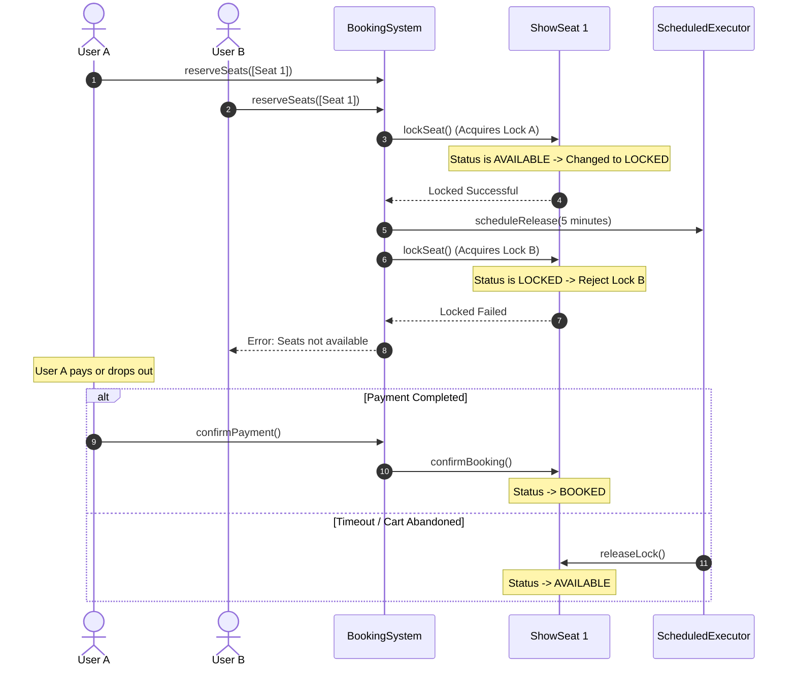
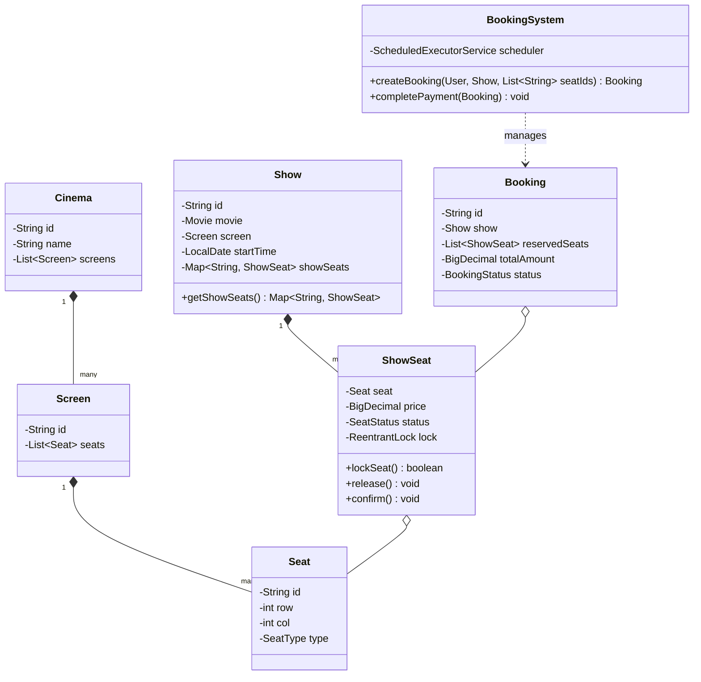

# Movie Ticket Booking System (BookMyShow)

## Introduction
A Movie Ticket Booking System manages theater structures, screens, movie showtimes, seat layout states, and reservations. Low-level design of this system highlights high-concurrency booking validations (preventing double-booking of adjacent seats), transaction locks, and automated timeouts to release unpaid bookings.

---

## Problem Statement
Design a movie ticket booking system like BookMyShow. The system must support searching for shows, viewing screen seat layouts, reserving seats for a show, processing payments, and managing seat statuses (Available, Locked, Booked). It must handle concurrent reservation requests for the same seat, rolling back partial locks on failure, and automatically releasing locked seats if payment timeouts occur.

---

## Why this exists
To coordinate concurrent seat reservations. During peak ticket sales, thousands of users compete for the same seats simultaneously. The system must guarantee that:
- A seat is never double-booked.
- If a user locks 3 seats but one is already taken, all previously locked seats are freed (All-or-Nothing transactional rollback).
- If a user abandons their checkout cart, the locked seats are released automatically.

---

## Real-world analogy
Think of buying concert tickets online:
- You select 2 seats in Row G. The screen shows a 5-minute countdown timer (the **Seat Lock Timeout**).
- During this countdown, those seats turn grey for other users.
- If you complete your payment, the tickets are emailed to you.
- If the timer hits zero before you pay, the seats turn blue (Available) again.

---

## Definition
A **Movie Ticket Booking System** is a concurrency-safe scheduling and reservation system consisting of Cinemas, Screens, Shows, ShowSeats, and Payment coordinators designed to manage seat states, handle concurrent bookings, and orchestrate transaction timeouts.

---

## Key concepts
1. **All-or-Nothing Locking:** If a user requests multiple seats, the system must lock *all* of them successfully. If even one seat lock fails, all other locked seats in that transaction must be rolled back immediately.
2. **Scheduled Release Timeouts:** Using execution schedulers to trigger automatic seat release after a lock duration (e.g., 5 minutes) if payment is pending.
3. **Double-Checked Locking:** Ensuring the seat status is verified *inside* the lock boundary to prevent race conditions.
4. **Different Seat Tiers:** Categorizing seats into tiers (Standard, Gold, Premium) with dynamic pricing strategies.

---

## Internal working / Mermaid diagram

### Seat Reservation Sequence Diagram


### Class Diagram


---

## Python/Java implementation

### 1. Bad Implementation: Lock-Free Condition Checking
Using basic updates on shared maps without locking checks allows concurrent threads to reserve the same seat simultaneously, causing double bookings.

```java
import java.util.*;

public class BadBookingSystem {
    // CRITICAL BUG: Lacks synchronization or locks.
    // If User A and B check "status" at the same time, both read "FREE".
    // Both write "BOOKED", resulting in double-booking.
    public Map<String, String> seatStatuses = new HashMap<>(); // SeatId -> "FREE"/"BOOKED"

    public boolean bookSeat(String seatId) {
        if (seatStatuses.getOrDefault(seatId, "FREE").equals("FREE")) {
            seatStatuses.put(seatId, "BOOKED");
            return true;
        }
        return false;
    }
}
```

### 2. Better Implementation: Loop Locking with Missing Rollbacks
Attempting to lock seats using `synchronized` blocks on list elements, but failing to release previously locked seats if one of the subsequent seats in the transaction is occupied.

```java
import java.util.*;

class BetterShowSeat {
    String id;
    String status = "AVAILABLE"; // "AVAILABLE", "LOCKED", "BOOKED"
    
    public synchronized boolean lock() {
        if (status.equals("AVAILABLE")) {
            status = "LOCKED";
            return true;
        }
        return false;
    }
    public synchronized void unlock() { status = "AVAILABLE"; }
}

public class BetterBooking {
    public boolean bookSeats(List<BetterShowSeat> seats) {
        List<BetterShowSeat> locked = new ArrayList<>();
        for (BetterShowSeat seat : seats) {
            if (seat.lock()) {
                locked.add(seat);
            } else {
                // BUG: If locking fails mid-loop, we fail the booking.
                // However, previously locked seats are NOT rolled back, leaving them permanently locked.
                return false; 
            }
        }
        return true;
    }
}
```

### 3. Best Implementation: Bounded Lock Timeouts & Transactional Rollbacks
Using fine-grained `ReentrantLock` per seat, executing transactional rollbacks on partial failures, and running a `ScheduledExecutorService` to release seat locks if payment times out.

```java
import java.math.BigDecimal;
import java.util.*;
import java.util.concurrent.*;
import java.util.concurrent.locks.ReentrantLock;

// 1. Enums
enum SeatType { STANDARD, GOLD, PREMIUM }
enum SeatStatus { AVAILABLE, LOCKED, BOOKED }
enum BookingStatus { PENDING, CONFIRMED, EXPIRED }

// 2. Physical Seat definition
class Seat {
    private final String id;
    private final SeatType type;

    public Seat(String id, SeatType type) {
        this.id = id;
        this.type = type;
    }
    public String getId() { return id; }
    public SeatType getType() { return type; }
}

// 3. Show-Specific Seat Instance
class ShowSeat {
    private final Seat seat;
    private final BigDecimal price;
    private SeatStatus status = SeatStatus.AVAILABLE;
    private final ReentrantLock lock = new ReentrantLock();

    public ShowSeat(Seat seat, BigDecimal price) {
        this.seat = seat;
        this.price = price;
    }

    public boolean lockSeat() {
        lock.lock();
        try {
            if (status == SeatStatus.AVAILABLE) {
                this.status = SeatStatus.LOCKED;
                return true;
            }
            return false;
        } finally {
            lock.unlock();
        }
    }

    public void release() {
        lock.lock();
        try {
            if (this.status == SeatStatus.LOCKED) {
                this.status = SeatStatus.AVAILABLE;
            }
        } finally {
            lock.unlock();
        }
    }

    public void confirm() {
        lock.lock();
        try {
            if (this.status == SeatStatus.LOCKED) {
                this.status = SeatStatus.BOOKED;
            }
        } finally {
            lock.unlock();
        }
    }

    public String getSeatId() { return seat.getId(); }
    public BigDecimal getPrice() { return price; }
    public SeatStatus getStatus() { return status; }
}

// 4. Booking Record
class Booking {
    private final String bookingId;
    private final List<ShowSeat> reservedSeats;
    private final BigDecimal totalAmount;
    private BookingStatus status = BookingStatus.PENDING;

    public Booking(String bookingId, List<ShowSeat> reservedSeats) {
        this.bookingId = bookingId;
        this.reservedSeats = reservedSeats;
        
        BigDecimal sum = BigDecimal.ZERO;
        for (ShowSeat s : reservedSeats) {
            sum = sum.add(s.getPrice());
        }
        this.totalAmount = sum;
    }

    public void confirm() {
        this.status = BookingStatus.CONFIRMED;
        for (ShowSeat seat : reservedSeats) {
            seat.confirm();
        }
    }

    public void expire() {
        this.status = BookingStatus.EXPIRED;
        for (ShowSeat seat : reservedSeats) {
            seat.release();
        }
    }

    public String getBookingId() { return bookingId; }
    public List<ShowSeat> getReservedSeats() { return reservedSeats; }
}

// 5. Booking Coordinator Service
public class BookingSystem {
    private final ScheduledExecutorService scheduler = Executors.newScheduledThreadPool(4);
    private final Map<String, Booking> activeBookings = new ConcurrentHashMap<>();

    public Booking createBooking(String userId, List<ShowSeat> selectedSeats) {
        List<ShowSeat> lockedSeats = new ArrayList<>();

        // Sort seats by ID to prevent deadlocks from out-of-order locking attempts
        List<ShowSeat> sortedSeats = new ArrayList<>(selectedSeats);
        sortedSeats.sort(Comparator.comparing(ShowSeat::getSeatId));

        for (ShowSeat seat : sortedSeats) {
            if (seat.lockSeat()) {
                lockedSeats.add(seat);
            } else {
                // Transactional Rollback: Free all previously locked seats in this attempt
                for (ShowSeat lockedSeat : lockedSeats) {
                    lockedSeat.release();
                }
                throw new IllegalStateException("Booking failed: Seat " + seat.getSeatId() + " is already locked or booked.");
            }
        }

        String bookingId = UUID.randomUUID().toString();
        Booking booking = new Booking(bookingId, lockedSeats);
        activeBookings.put(bookingId, booking);

        // Schedule automatic seat release after a 5-minute timeout
        scheduler.schedule(() -> {
            Booking active = activeBookings.get(bookingId);
            if (active != null && active.getReservedSeats().get(0).getStatus() == SeatStatus.LOCKED) {
                active.expire();
                activeBookings.remove(bookingId);
                System.out.println("Booking timeout: Released seats for booking " + bookingId);
            }
        }, 5, TimeUnit.MINUTES);

        return booking;
    }

    public void processPaymentSuccess(String bookingId) {
        Booking booking = activeBookings.remove(bookingId);
        if (booking != null) {
            booking.confirm();
            System.out.println("Payment processed. Booking " + bookingId + " confirmed.");
        }
    }
}
```

---

## Step-by-step explanation
1. **Deadlock Prevention**: In `createBooking()`, the selected seats are sorted by ID before acquiring locks. This ensures all threads acquire locks in the same relative order, preventing cyclic waits (deadlocks).
2. **Transactional Rollback**: If a user attempts to book Seats G1, G2, and G3:
   - G1 and G2 are successfully locked.
   - G3 fails because another user locked it.
   - The loop catches the failure, enters the rollback block, calls `release()` on G1 and G2, and throws an exception, keeping the state consistent.
3. **Scheduled Release**: Upon locking, the `ScheduledExecutorService` schedules a task to run after 5 minutes. If `processPaymentSuccess()` is not called within this window, the scheduled task executes `active.expire()`, releasing the seats back to available status.
4. **Lock Isolation**: Locking is scoped to individual `ShowSeat` objects, allowing users to book different seats concurrently without blocking each other.

---

## Multiple real-world examples
1. **Movie Ticket Apps (BookMyShow):** Processing ticket bookings across multiple cities and theaters.
2. **Flight Ticket Schedulers:** Reserving airplane seats during checkout, automatically freeing them if payment fails.
3. **Train Booking Engines (IRCTC):** Allocating coach berths concurrently and managing queue waitlists.

---

## Pros
- **High Concurrency:** Seat-level locking enables high booking throughput.
- **Transactional Consistency:** All-or-nothing checks prevent orphan or partially locked states.
- **Automated Cart Eviction:** Scheduled execution timeouts prevent locked seats from being abandoned.

---

## Cons
- **Deadlock Potential:** Requires sorting seat IDs before booking to prevent deadlocks during concurrent multi-seat checkout requests.
- **Thread Pool Overhead:** Maintaining scheduled execution threads for thousands of active checkouts consumes system memory.

---

## Interview questions

### Beginner
- **Q: What is the purpose of the `ScheduledExecutorService` in the booking system?**
  - **A:** To implement reservation timeouts. When seats are locked, a task is scheduled to run after 5 minutes. If payment is not completed in time, the task automatically releases the seats back to available status.

### Intermediate
- **Q: How does the system handle transactional failures when booking multiple seats?**
  - **A:** If even one seat in the reservation request cannot be locked, the system executes a rollback loop, calling `release()` on all previously locked seats in that transaction, ensuring an all-or-nothing execution.

### Senior
- **Q: How does sorting the selected seats by ID prevent deadlocks?**
  - **A:** If User A attempts to book Seats 1 and 2, and User B attempts to book Seats 2 and 1 simultaneously:
    - Without sorting, User A locks Seat 1 and waits for Seat 2; User B locks Seat 2 and waits for Seat 1, causing a deadlock.
    - Sorting by ID forces both threads to attempt locks in the same order (Seat 1 then Seat 2), preventing deadlocks.

### Staff Engineer
- **Q: How would you scale this system to handle 50,000 bookings per second during a major movie premiere where seating inventories are highly contended?**
  - **A:** 
    - **Distributed Locking:** Local JVM locks do not scale across multiple servers. We use **Redis** to manage seat locks using key patterns (e.g. `show:{id}:seat:{id}`).
    - **Atomic Transactions (Lua):** We acquire multi-seat locks atomically using Redis Lua scripts or transaction blocks (`MULTI`/`EXEC`) to prevent partial lock leaks.
    - **Cache Eviction:** Locked seats are stored in Redis with an explicit TTL (Time-To-Live) of 5 minutes, allowing Redis to handle timeouts automatically without JVM thread overhead.
    - **Write-Behind Database Sync:** When a booking is confirmed, it is written to a fast cache and pushed to a Kafka queue. A database consumer group updates the main database asynchronously.

---

## Common mistakes
- **Acquiring locks out of order:** Failing to sort seat IDs before booking, which leads to deadlocks.
- **Swallowing lock failures:** Neglecting to release previously locked seats when a subsequent lock fails.
- **Using JVM locks in distributed environments:** Using local `ReentrantLock` wrappers when the application runs across multiple server instances.

---

## Best practices
- **Enforce all-or-nothing locks:** Verify and lock all requested seats together.
- **Sort resources before locking:** Always sort seat IDs before attempting to acquire locks.
- **Utilize TTL caches:** Use Redis with TTL configurations to manage booking timeouts in production.

---

## When NOT to use
- **General Standing Admission Tickets:** For events without designated seating (e.g., general admission music festivals), tracking individual seat layouts is unnecessary. Use simple atomic counters instead.

---

## Comparison with similar concepts

| Metric | Local ReentrantLock | Distributed Redis Lock (Redisson) |
| :--- | :--- | :--- |
| **Scope** | Single JVM instance | Distributed cluster instances |
| **Complexity** | Low | Medium-High (requires external Redis configuration) |
| **Performance** | Sub-microsecond | Milliseconds (network call) |

---

## Summary
Designing a Movie Ticket Booking System requires coordinating concurrent seat states and checkout timeouts. Implementing seat-level locking prevents double bookings, and using scheduled executors manages checkout timeouts efficiently.

---

## Related topics
- [Hotel Booking System](../hotel-booking)
- [Design Principles](../../design-principles/composition-vs-inheritance)
- [Executors & Thread Pools](../../concurrency-java/executors-thread-pools)
