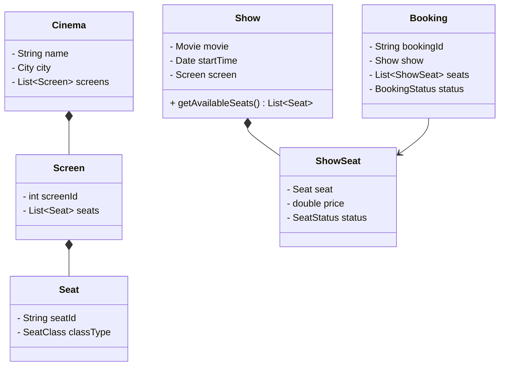

# Movie Ticket Booking (BookMyShow)

## Problem Statement
Design a movie ticket booking system like BookMyShow or Fandango. The system must manage Cities, Cinemas, Movies, Shows (Screenings), and individual Seats. Users should be able to browse movies in their city, select a specific showtime, pick their exact seats visually, and pay to confirm the booking.

## Requirements

### Functional Requirements
1. **Catalog:** A City has multiple Cinemas. A Cinema has multiple Screens. A Screen runs multiple Shows.
2. **Seats:** Each Screen has a layout of Seats (e.g., Row A, Seat 1). Seats can be Silver, Gold, or Premium, with different pricing.
3. **Booking:** A user can select multiple seats for a specific show and book them.
4. **Payment:** The booking is only confirmed after a successful payment.

### Non-Functional Requirements
1. **Concurrency (The core challenge):** When a highly anticipated movie like *Avengers* opens, 10,000 people will try to click the exact same middle seats at the exact same second. The system MUST prevent double-booking.
2. **Timeouts:** If a user selects a seat, they have 10 minutes to pay. If they don't pay in time, the seat is released back to the public.

## Class Diagram



## Implementation (Java Skeleton)

*The most critical part of this system is the locking mechanism during checkout.*

```java
import java.util.*;
import java.util.concurrent.locks.ReentrantLock;

enum SeatStatus { AVAILABLE, LOCKED, BOOKED }

class ShowSeat {
    String seatId;
    SeatStatus status;
    private final ReentrantLock lock = new ReentrantLock();

    public ShowSeat(String id) {
        this.seatId = id;
        this.status = SeatStatus.AVAILABLE;
    }

    // Attempt to temporarily lock the seat while user enters credit card info
    public boolean lockSeat() {
        if (lock.tryLock()) {
            try {
                if (status == SeatStatus.AVAILABLE) {
                    status = SeatStatus.LOCKED;
                    return true;
                }
            } finally {
                lock.unlock();
            }
        }
        return false; // Someone else is already looking at this seat
    }

    public void confirmBooking() {
        this.status = SeatStatus.BOOKED;
    }

    public void releaseLock() {
        this.status = SeatStatus.AVAILABLE;
    }
}

class BookingSystem {
    
    public Booking createBooking(User user, Show show, List<ShowSeat> selectedSeats) {
        List<ShowSeat> successfullyLockedSeats = new ArrayList<>();

        // Try to lock ALL selected seats
        for (ShowSeat seat : selectedSeats) {
            if (seat.lockSeat()) {
                successfullyLockedSeats.add(seat);
            } else {
                // If even ONE seat fails, we must release all previously locked seats 
                // and fail the booking. (All or Nothing)
                for (ShowSeat lockedSeat : successfullyLockedSeats) {
                    lockedSeat.releaseLock();
                }
                throw new RuntimeException("One of the selected seats is no longer available.");
            }
        }

        System.out.println("Seats locked for 10 minutes. Proceed to payment.");
        return new Booking(user, show, successfullyLockedSeats);
    }
    
    public void processPayment(Booking booking) {
        // If payment succeeds:
        for (ShowSeat seat : booking.seats) {
            seat.confirmBooking();
        }
        System.out.println("Tickets booked successfully!");
    }
}
```

## Test Cases
1. **Happy Path:** User selects 2 available seats. System locks them. User pays. Status changes to `BOOKED`.
2. **Race Condition:** User A and User B select the same seat. User A clicks checkout first. The system locks the seat for A. When User B's request arrives milliseconds later, `lockSeat()` fails, and B is shown an error message.
3. **Payment Failure/Timeout:** User A locks a seat but closes their browser. A background job (or TTL in Redis) expires the lock after 10 minutes, calling `releaseLock()`, making the seat `AVAILABLE` again.

## Edge Cases
1. **Orphan Seat Rule:** Many cinemas have a business rule preventing you from leaving a single empty seat. E.g., If there are 3 empty seats in a row, you cannot book the middle one, because it leaves two un-bookable orphan seats. This logic must be validated before locking.

## Improvements & Extensions
- **Distributed Locking:** In a real distributed system with multiple backend servers, a simple Java `ReentrantLock` will not work (because Server 1 doesn't know about Server 2's memory). You must use a Distributed Cache like **Redis** (using SETNX commands) to lock the seat ID globally across the entire cluster.
