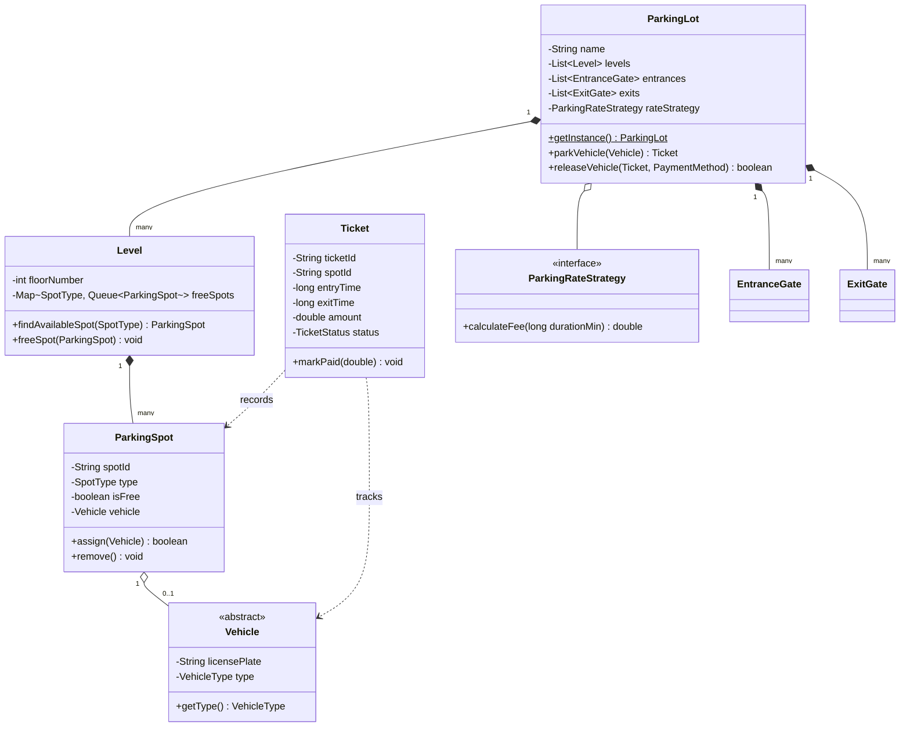

# Parking Lot Design

## Introduction
A Parking Lot is a multi-floor structure designed to store vehicles of various types (e.g., Cars, Trucks, Motorcycles) in designated slots. Low-level design of a parking lot is a classic software engineering interview problem that demonstrates object-oriented analysis, encapsulation, scalability, thread-safe synchronization, and separation of concerns.

---

## Problem Statement
Design a parking lot management system that processes vehicle check-ins and check-outs across multiple entrances and exits simultaneously. The system must allocate the nearest parking spot matching a vehicle's type, print a parking ticket, calculate fees based on duration and rates at checkout, process payments, and update spot availabilities safely under high concurrent traffic.

---

## Why this exists
To automate parking structure logistics. Without an automated, concurrent system, manual cashiers cannot scale to multiple gates, double-booking spots is common, and pricing rules are rigid. A robust design ensures clean API interfaces, O(1) spot allocation, thread-safety when multiple gates assign spots at the same millisecond, and strategy-driven pricing.

---

## Real-world analogy
Think of an automated airport parking garage:
- You approach an entrance gate and press a button (Entrance Panel).
- The system checks available spots, allocates a ticket with a barcode containing your entry timestamp, opens the gate, and turns on a green light pointing to your floor.
- While you are parking, hundreds of other users are entering/exiting different floors.
- When leaving, you scan the barcode at an exit gate terminal, pay by credit card, and the gate opens.

---

## Definition
A **Parking Lot System** is an object-oriented system that coordinates the states of vehicles, parking slots, levels, and gates to manage automated vehicle ingress and egress, rate calculation, and payment transactions safely and efficiently.

---

## Key concepts
1. **Dynamic Spot Allocation:** Instantly locating a free spot of the correct type (Compact, Large, Handicapped, Motorcycle) close to the entrance gate.
2. **Strategy-Based Pricing:** Decoupling fee calculation logic from the ticket system to allow changing rate models (e.g., hourly rates, flat rates, weekday vs. weekend surge pricing).
3. **Concurrency Control:** Ensuring that if only one spot remains, two vehicles entering different gates concurrently cannot both be assigned the same spot.
4. **Clean Abstractions:** Separating `Vehicle` types from `ParkingSpot` types, allowing new vehicle classes (like Electric Vehicles with charging stations) to be added without modifying existing code (OCP).

---

## Internal working / Mermaid diagram



---

## Python/Java implementation

### 1. Bad Implementation: God Class & Unsafe Concurrency
A single monolithic class handles all operations with primitive arrays, long switch-cases, and zero thread safety, leading to double-booked spots under concurrent operations.

```java
import java.util.*;

public class BadParkingLot {
    // CRITICAL BUG: Hardcoded arrays and type checking limit scalability.
    // Thread safety is completely missing; multiple threads running park() will overwrite state.
    public String[] spots = new String[100]; // stores license plates
    public String[] spotTypes = new String[100]; // "COMPACT", "LARGE", "MOTORCYCLE"

    public boolean park(String licensePlate, String vehicleType) {
        for (int i = 0; i < spots.length; i++) {
            if (spots[i] == null) {
                // Ugly type mapping logic
                if (vehicleType.equals("CAR") && spotTypes[i].equals("COMPACT")) {
                    spots[i] = licensePlate;
                    return true;
                } else if (vehicleType.equals("TRUCK") && spotTypes[i].equals("LARGE")) {
                    spots[i] = licensePlate;
                    return true;
                }
            }
        }
        return false;
    }

    public double calculateFee(int hours, String vehicleType) {
        // Rigid hardcoded fee rules
        if (vehicleType.equals("CAR")) return hours * 4.0;
        if (vehicleType.equals("TRUCK")) return hours * 8.0;
        return hours * 2.0;
    }
}
```

### 2. Better Implementation: OOP Structure with Naive Synchronization
Using correct object separations, but locking the entire class for simple operations, causing thread congestion.

```java
import java.util.*;

class BetterParkingSpot {
    private final String id;
    private final String type;
    private boolean isFree = true;

    public BetterParkingSpot(String id, String type) {
        this.id = id;
        this.type = type;
    }
    public synchronized boolean assign() {
        if (!isFree) return false;
        isFree = false;
        return true;
    }
    public synchronized void release() { isFree = true; }
    public String getType() { return type; }
}

public class BetterParkingLot {
    private final List<BetterParkingSpot> spots = new ArrayList<>();

    // CRITICAL BUG: Synchronizing the entire search method locks the entire parking lot.
    // Entrance Gates will block, killing system throughput during peak hours.
    public synchronized BetterParkingSpot findAndReserveSpot(String vehicleType) {
        for (BetterParkingSpot spot : spots) {
            if (spot.getType().equals(vehicleType) && spot.assign()) {
                return spot;
            }
        }
        return null;
    }
}
```

### 3. Best Implementation: High-Concurrency Thread-Safe Parking Lot
Utilizing concurrent queues to enable O(1) spot allocation, fine-grained locks to prevent double-booking without blocking the entire structure, and the Strategy Pattern for flexible billing rates.

```java
import java.util.*;
import java.util.concurrent.*;
import java.util.concurrent.locks.ReentrantLock;

// 1. Domain Enums
enum VehicleType { MOTORCYCLE, COMPACT_CAR, LARGE_TRUCK }
enum SpotType { MOTORCYCLE, COMPACT, LARGE }
enum TicketStatus { ACTIVE, PAID, LOST }

// 2. Extensible Vehicle Hierarchy
abstract class Vehicle {
    private final String licensePlate;
    private final VehicleType type;

    public Vehicle(String licensePlate, VehicleType type) {
        this.licensePlate = licensePlate;
        this.type = type;
    }
    public String getLicensePlate() { return licensePlate; }
    public VehicleType getType() { return type; }
}

class Car extends Vehicle {
    public Car(String licensePlate) { super(licensePlate, VehicleType.COMPACT_CAR); }
}

class Truck extends Vehicle {
    public Truck(String licensePlate) { super(licensePlate, VehicleType.LARGE_TRUCK); }
}

// 3. Strategy Pattern for Parking Fee Calculation
interface PricingStrategy {
    double calculateFee(long durationMs);
}

class HourlyPricingStrategy implements PricingStrategy {
    private final double hourlyRate;
    public HourlyPricingStrategy(double hourlyRate) { this.hourlyRate = hourlyRate; }

    @Override
    public double calculateFee(long durationMs) {
        double hours = durationMs / (1000.0 * 60.0 * 60.0);
        return Math.max(1.0, Math.ceil(hours)) * hourlyRate; // Minimum 1 hour charge
    }
}

// 4. Thread-Safe Parking Spot Representation
class ParkingSpot {
    private final String spotId;
    private final SpotType type;
    private final ReentrantLock lock = new ReentrantLock();
    private boolean isOccupied = false;
    private Vehicle parkedVehicle;

    public ParkingSpot(String spotId, SpotType type) {
        this.spotId = spotId;
        this.type = type;
    }

    public boolean reserve(Vehicle vehicle) {
        lock.lock();
        try {
            if (isOccupied) return false;
            this.parkedVehicle = vehicle;
            this.isOccupied = true;
            return true;
        } finally {
            lock.unlock();
        }
    }

    public void vacate() {
        lock.lock();
        try {
            this.parkedVehicle = null;
            this.isOccupied = false;
        } finally {
            lock.unlock();
        }
    }

    public String getSpotId() { return spotId; }
    public SpotType getType() { return type; }
}

// 5. Level Management with O(1) Search via ConcurrentQueues
class Level {
    private final int levelNumber;
    // Map SpotType to thread-safe concurrent queues for O(1) spot extraction
    private final Map<SpotType, ConcurrentLinkedQueue<ParkingSpot>> freeSpotsMap = new ConcurrentHashMap<>();

    public Level(int levelNumber, List<ParkingSpot> initialSpots) {
        this.levelNumber = levelNumber;
        for (SpotType type : SpotType.values()) {
            freeSpotsMap.put(type, new ConcurrentLinkedQueue<>());
        }
        for (ParkingSpot spot : initialSpots) {
            freeSpotsMap.get(spot.getType()).add(spot);
        }
    }

    public ParkingSpot allocateSpot(SpotType type, Vehicle vehicle) {
        ConcurrentLinkedQueue<ParkingSpot> queue = freeSpotsMap.get(type);
        if (queue == null) return null;

        while (true) {
            ParkingSpot spot = queue.peek();
            if (spot == null) return null; // No spot of this type free

            if (spot.reserve(vehicle)) {
                queue.remove(spot); // Successfully reserved, remove from free list
                return spot;
            } else {
                // Spot was reserved by someone else between peek and reserve, remove and retry
                queue.remove(spot);
            }
        }
    }

    public void returnSpot(ParkingSpot spot) {
        spot.vacate();
        freeSpotsMap.get(spot.getType()).add(spot);
    }
}

// 6. Ticket representation
class Ticket {
    private final String ticketId;
    private final String spotId;
    private final long entryTime;
    private long exitTime;
    private double amountPaid;
    private TicketStatus status;

    public Ticket(String ticketId, String spotId) {
        this.ticketId = ticketId;
        this.spotId = spotId;
        this.entryTime = System.currentTimeMillis();
        this.status = TicketStatus.ACTIVE;
    }

    public void pay(double amount) {
        this.amountPaid = amount;
        this.exitTime = System.currentTimeMillis();
        this.status = TicketStatus.PAID;
    }

    public String getTicketId() { return ticketId; }
    public String getSpotId() { return spotId; }
    public long getEntryTime() { return entryTime; }
    public TicketStatus getStatus() { return status; }
}

// 7. Singleton Facade for the Parking Lot
public class ParkingLot {
    private static volatile ParkingLot instance;
    private final List<Level> levels = new CopyOnWriteArrayList<>();
    private final Map<String, Ticket> activeTickets = new ConcurrentHashMap<>();
    private final PricingStrategy pricingStrategy = new HourlyPricingStrategy(4.0); // $4 per hour

    private ParkingLot() {}

    public static ParkingLot getInstance() {
        if (instance == null) {
            synchronized (ParkingLot.class) {
                if (instance == null) {
                    instance = new ParkingLot();
                }
            }
        }
        return instance;
    }

    public void addLevel(Level level) {
        levels.add(level);
    }

    public Ticket processEntry(Vehicle vehicle, SpotType preferredType) {
        for (Level level : levels) {
            ParkingSpot spot = level.allocateSpot(preferredType, vehicle);
            if (spot != null) {
                String ticketId = UUID.randomUUID().toString();
                Ticket ticket = new Ticket(ticketId, spot.getSpotId());
                activeTickets.put(ticketId, ticket);
                return ticket;
            }
        }
        return null; // Parking Lot Full
    }

    public double processExit(String ticketId, Level level, ParkingSpot spot) {
        Ticket ticket = activeTickets.remove(ticketId);
        if (ticket == null) {
            throw new IllegalArgumentException("Invalid ticket ID.");
        }

        long durationMs = System.currentTimeMillis() - ticket.getEntryTime();
        double fee = pricingStrategy.calculateFee(durationMs);
        ticket.pay(fee);
        
        level.returnSpot(spot);
        return fee;
    }
}
```

---

## Step-by-step explanation
1. **Concurrency Isolation**: Rather than synchronizing the entire `processEntry` method, thread safety is achieved using `ReentrantLock` at the individual `ParkingSpot` level, and atomic mutations on thread-safe queues.
2. **O(1) Search via Queue**: Instead of looping through all spots linearly (an $O(N)$ lookup), each Level maintains a `ConcurrentLinkedQueue` for each `SpotType`. Fetching a free spot is a simple `queue.peek()` ($O(1)$) operation.
3. **Double-Checked Reservation**: If two threads peek at the same spot, the atomic lock execution `spot.reserve()` ensures only one succeeds. The loser thread loops, cleans the queue reference, and queries the next available spot in the queue.
4. **Strategy Dispatch**: When a vehicle exits, the ticket duration is sent to the injected `PricingStrategy`. This calculates the fee without hardcoded vehicle type logic, supporting weekday/weekend/seasonal rate overrides.

---

## Multiple real-world examples
1. **Mall Parking Lots:** Large facilities needing rapid entry gate processing using local terminal ticket printers.
2. **Valet Parking Systems:** Tracking specific customer vehicles and associating keys with specific parking stall slots.
3. **Airport Terminals:** High-throughput structures with separate zones for long-term storage, short-term drop-offs, and handicap access.

---

## Pros
- **High Concurrency:** Concurrent collections and fine-grained locks keep gates running without lock wait times.
- **Single Responsibility Principle (SRP):** Level handles layout organization, Spot manages occupancy status, and PricingStrategy manages fee calculation.
- **Open-Closed Principle (OCP):** New vehicle classes (like Electric Cars) and pricing configurations can be added without modifying core allocator classes.

---

## Cons
- **Queue Memory Footprint:** Storing references to hundreds of spots in memory maps adds minor heap overhead.
- **Complex Release Logic:** When a spot is freed, it must be put back in the exact matching queue of the correct Level, which requires a back-reference.

---

## Interview questions

### Beginner
- **Q: Why do we use a Singleton class for the `ParkingLot`?**
  - **A:** The physical parking lot is a singular shared resource. A Singleton ensures there is only one source of truth managing floor levels, gates, and tickets, preventing inconsistent tracking states.

### Intermediate
- **Q: How does the system prevent assigning a Motorcycle to a Compact or Large slot if motorcycle slots are full?**
  - **A:** The system maps the incoming `VehicleType` to a corresponding list of acceptable `SpotType`s. If motorcycle spots are full, the allocator is programmed to search only compact queues.

### Senior
- **Q: How does this LLD scale to handle concurrent entries at 10 different gates without causing deadlocks?**
  - **A:** There are no nested locks in our implementation. A thread acquires only one lock (the `ParkingSpot` lock) and releases it immediately. By avoiding acquiring Lock A while holding Lock B, circular wait states (deadlocks) are completely prevented.

### Staff Engineer
- **Q: How would you design a distributed version of this system where parking lot transactions span multiple server instances, ensuring consistency?**
  - **A:** In a multi-node distributed deployment, local thread-safe collections (`ConcurrentHashMap`) are insufficient. We must use a distributed cache/locking system:
    - **Distributed Locking / Queue:** We can store available spot IDs in a Redis Sorted Set or Queue per `SpotType`. Entrances pop spot IDs atomically from Redis using commands like `RPOPLPUSH` or Lua scripts.
    - **Database Consistency:** When a spot is claimed, we write a transaction log to a database. Using optimistic locking (`@Version` field in SQL databases), we ensure that if two nodes attempt to reserve the same spot, one database transaction fails and is retried.
    - **Event Sourcing:** Status changes (Entry, Payment, Exit) are pushed to a message broker (e.g., Kafka) to update dashboards and analytics engines asynchronously.

---

## Common mistakes
- **Using a single global lock:** Locking the entire `ParkingLot` object at check-in limits the system to a single vehicle entering at a time across all gates.
- **Storing tickets inside the vehicle object:** A ticket is a transaction record generated by the lot; the vehicle should not hold internal transaction states.
- **Hardcoding Rates:** Hardcoding `$4/hour` fees inside the vehicle classes violates SRP and OCP.

---

## Best practices
- **Use thread-safe factories:** Encapsulate ticket creation and spot assignment inside factory components.
- **Prefer Composition over Inheritance:** Compose Level classes within the Parking Lot rather than subclassing Parking Lot types.
- **Leverage standard UUIDs:** Use secure transaction identifiers for tickets to prevent tampering.

---

## When NOT to use
- **Small Private Driveways:** For small, fixed, single-gate lots (e.g., 5 spots), a simple database table or a basic synchronized class is sufficient, making concurrent queue architectures redundant.

---

## Comparison with similar concepts

| Design Aspect | Local Thread-Safe Design | Distributed Design |
| :--- | :--- | :--- |
| **State Storage** | JVM Heap Memory | Redis / Distributed Database |
| **Gate Synchronization** | JVM Locks (`ReentrantLock`) | Distributed Mutex (Redisson / ZooKeeper) |
| **Max Capacity Scale** | Thousands of spots | Millions of spots across multiple cities |

---

## Summary
Designing a Parking Lot requires decoupling vehicles, spots, levels, and pricing models. Utilizing thread-safe concurrent queues and fine-grained locks guarantees consistent, high-performance operations under heavy concurrent traffic.

---

## Related topics
- [Elevator System](../elevator)
- [Design Principles](../../design-principles/composition-vs-inheritance)
- [Concurrency & Synchronization](../../concurrency-java/concurrency-synchronization)
