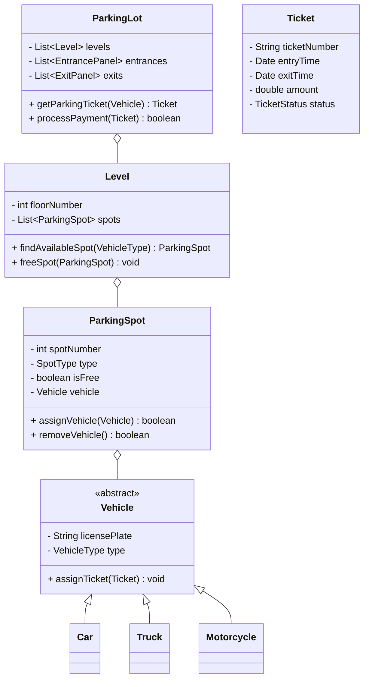

# Parking Lot

## Problem Statement
Design a parking lot system that can manage a multi-floor parking structure. The system needs to assign tickets to incoming vehicles, track the capacity of different types of parking spots (Compact, Large, Handicapped, Motorcycle), calculate fees based on the duration of stay, and process payments upon exit.

## Requirements

### Functional Requirements
1. The parking lot should have multiple floors.
2. Each floor should have multiple parking spots of different types: Motorcycle, Compact, Large, Handicapped.
3. The system should support different types of vehicles: Motorcycle, Car, Truck.
4. A vehicle should be assigned a ticket upon entry.
5. The system should automatically find the nearest available parking spot for a vehicle type.
6. The system should process payments at an exit panel or via a customer portal.
7. Payment should be calculated based on a per-hour rate (e.g., $4/hr for a car).

### Non-Functional Requirements
1. **Concurrency:** Multiple vehicles can enter and exit simultaneously through different gates.
2. **Scalability:** The system should easily support adding new floors or gates.
3. **Consistency:** A single spot should never be double-booked.

## Class Diagram



## Implementation (Java)

```java
import java.util.*;

// ENUMS
enum VehicleType { MOTORCYCLE, CAR, TRUCK }
enum SpotType { MOTORCYCLE, COMPACT, LARGE, HANDICAPPED }

// VEHICLE
abstract class Vehicle {
    private String licensePlate;
    private VehicleType type;

    public Vehicle(String licensePlate, VehicleType type) {
        this.licensePlate = licensePlate;
        this.type = type;
    }
    public VehicleType getType() { return type; }
}

class Car extends Vehicle {
    public Car(String licensePlate) { super(licensePlate, VehicleType.CAR); }
}

// PARKING SPOT
class ParkingSpot {
    private int spotNumber;
    private SpotType type;
    private boolean isFree;
    private Vehicle vehicle;

    public ParkingSpot(int spotNumber, SpotType type) {
        this.spotNumber = spotNumber;
        this.type = type;
        this.isFree = true;
    }

    public synchronized boolean assignVehicle(Vehicle v) {
        if (!isFree) return false;
        this.vehicle = v;
        this.isFree = false;
        return true;
    }

    public synchronized void removeVehicle() {
        this.vehicle = null;
        this.isFree = true;
    }

    public boolean isFree() { return isFree; }
    public SpotType getType() { return type; }
}

// PARKING LOT (Singleton Facade)
class ParkingLot {
    private static ParkingLot instance;
    private List<ParkingSpot> spots = new ArrayList<>();

    private ParkingLot() {
        // Initialize a simple 1-floor lot for the skeleton
        for (int i = 0; i < 10; i++) {
            spots.add(new ParkingSpot(i, SpotType.COMPACT));
        }
    }

    public static synchronized ParkingLot getInstance() {
        if (instance == null) {
            instance = new ParkingLot();
        }
        return instance;
    }

    // Assigning a spot requires locking to prevent double booking
    public synchronized ParkingSpot getAvailableSpot(Vehicle vehicle) {
        // Simple logic: mapping CAR to COMPACT spot
        SpotType requiredType = (vehicle.getType() == VehicleType.CAR) ? SpotType.COMPACT : SpotType.LARGE;
        
        for (ParkingSpot spot : spots) {
            if (spot.isFree() && spot.getType() == requiredType) {
                return spot; // Found a spot
            }
        }
        return null; // Lot Full
    }
}
```

## Test Cases
1. **Happy Path:** Car enters, gets a ticket, stays for 2 hours, exits, and pays $8.
2. **Lot Full:** 11 Cars try to enter a 10-spot lot. The 11th car should be denied entry.
3. **Vehicle Mismatch:** A Truck tries to park in a Motorcycle spot. Should be rejected.

## Edge Cases
1. **Lost Ticket:** How does the system handle a customer who lost their ticket? (Usually requires looking up the license plate in the DB and charging a flat maximum fee).
2. **Concurrency:** Two cars enter different gates at the exact same millisecond when only 1 spot is left. The `getAvailableSpot()` method MUST be synchronized so only one car gets the spot, and the other is told the lot is full.

## Complexity Analysis
- **Finding a spot:** O(N) where N is the total number of spots, if we linearly search. 
  - *Improvement:* Use an array of queues/deques for each SpotType. `availableCompactSpots.poll()` becomes **O(1)**.

## Improvements & Extensions
- **Strategy Pattern for Pricing:** Different days (weekends vs weekdays) might have different pricing strategies. Inject a `PricingStrategy` interface into the checkout system.
- **Microservices:** In a real-world massive system, the ticketing system, the payment gateway, and the barrier control hardware logic would be separate microservices communicating via Kafka.
