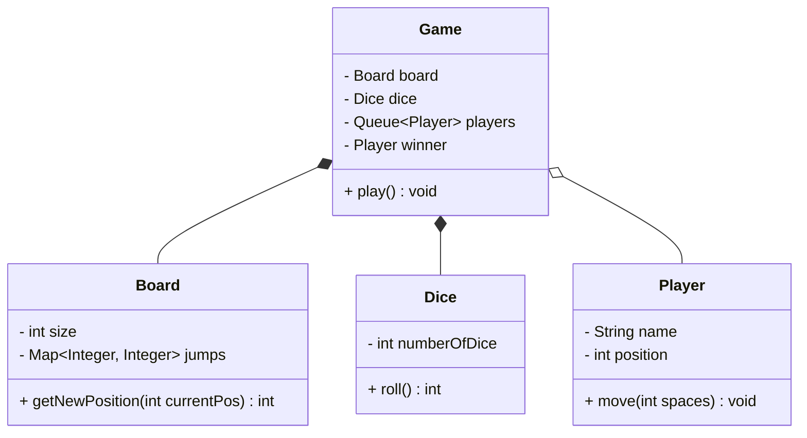

# Snake & Ladder

## Problem Statement
Design a classic Snake and Ladder game. The game is played on a board with numbered squares. Players roll a die to move their pieces. If they land on a ladder, they climb up. If they land on a snake, they slide down. The first player to reach the final square wins.

## Requirements

### Functional Requirements
1. The board should have 100 squares (1 to 100).
2. The board contains predefined snakes and ladders. A snake moves a player down; a ladder moves a player up.
3. The game must support 2 or more players.
4. Players take turns rolling a standard 6-sided die (1 to 6).
5. If a player rolls a number that would take them beyond 100, they do not move.
6. The first player to land exactly on square 100 wins the game.

### Non-Functional Requirements
1. **Configurability:** The board size, number of snakes, number of ladders, and number of dice should be easily configurable.
2. **Fairness:** The die roll must be random and fair.

## Class Diagram



## Implementation (Java)

```java
import java.util.*;

// PLAYER
class Player {
    private String name;
    private int position;

    public Player(String name) {
        this.name = name;
        this.position = 0; // Starts off the board
    }

    public String getName() { return name; }
    public int getPosition() { return position; }
    public void setPosition(int position) { this.position = position; }
}

// DICE
class Dice {
    private int numberOfDice;

    public Dice(int numberOfDice) {
        this.numberOfDice = numberOfDice;
    }

    public int roll() {
        int sum = 0;
        Random random = new Random();
        for (int i = 0; i < numberOfDice; i++) {
            sum += random.nextInt(6) + 1; // 1 to 6
        }
        return sum;
    }
}

// BOARD
class Board {
    private int size;
    // Map of StartPosition -> EndPosition (Handles both Snakes and Ladders)
    private Map<Integer, Integer> jumps = new HashMap<>();

    public Board(int size, Map<Integer, Integer> snakes, Map<Integer, Integer> ladders) {
        this.size = size;
        this.jumps.putAll(snakes);
        this.jumps.putAll(ladders);
    }

    public int getSize() { return size; }

    // Resolves any snakes or ladders at the current position
    public int getNewPosition(int position) {
        if (jumps.containsKey(position)) {
            int newPosition = jumps.get(position);
            if (newPosition > position) {
                System.out.println("Climbed a ladder! Up to " + newPosition);
            } else {
                System.out.println("Swallowed by a snake! Down to " + newPosition);
            }
            return newPosition;
        }
        return position;
    }
}

// GAME CONTROLLER
class Game {
    private Board board;
    private Dice dice;
    private Queue<Player> players = new LinkedList<>();
    private Player winner;

    public Game(Board board, Dice dice, List<Player> playerList) {
        this.board = board;
        this.dice = dice;
        this.players.addAll(playerList);
    }

    public void play() {
        while (winner == null) {
            Player currentPlayer = players.poll();
            int rollValue = dice.roll();
            System.out.println(currentPlayer.getName() + " rolled a " + rollValue);

            int newPosition = currentPlayer.getPosition() + rollValue;

            if (newPosition > board.getSize()) {
                System.out.println("Invalid move. You need exactly " + (board.getSize() - currentPlayer.getPosition()) + " to win.");
                players.add(currentPlayer); // Skip turn
                continue;
            }

            // Check for snakes or ladders
            newPosition = board.getNewPosition(newPosition);
            currentPlayer.setPosition(newPosition);

            System.out.println(currentPlayer.getName() + " moved to " + newPosition);

            if (newPosition == board.getSize()) {
                winner = currentPlayer;
                System.out.println(winner.getName() + " WINS THE GAME!");
            } else {
                players.add(currentPlayer); // Put back in queue for next turn
            }
        }
    }
}
```

## Test Cases
1. **Normal Move:** Player at position 5 rolls a 3. Moves to position 8.
2. **Ladder Jump:** Player lands on position 10. `jumps` map has an entry `{10: 25}`. Player is instantly moved to 25.
3. **Snake Bite:** Player lands on position 99. `jumps` map has an entry `{99: 5}`. Player slides down to 5.
4. **Overshoot Win:** Player is at 98. Rolls a 5. `98 + 5 = 103 > 100`. Move is rejected, player stays at 98.

## Edge Cases
1. **Infinite Loops:** If the board is configured incorrectly (e.g., a ladder goes from 10 to 20, and a snake goes from 20 to 10), landing on 10 creates an infinite loop. The `Board` constructor should validate the input maps to prevent cyclic jumps.
2. **Consecutive Sixes:** Some rules state that rolling a 6 gives you an extra turn. This can be handled by adding an `if (rollValue == 6)` block in the `Game.play()` loop that does not `poll()` the next player, but lets the current player roll again.

## Improvements & Extensions
- **Rule Engine:** If you want to add complex rules (e.g., "Rolling three 6s in a row resets your position to 0"), hardcoding it in the `Game` class becomes messy. Implement a `RuleEngine` using the Strategy Pattern to evaluate the board state after every turn.
