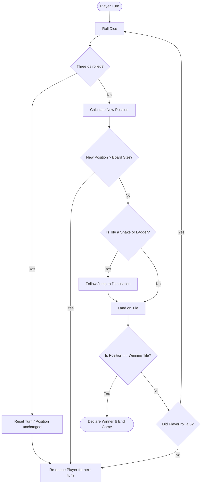
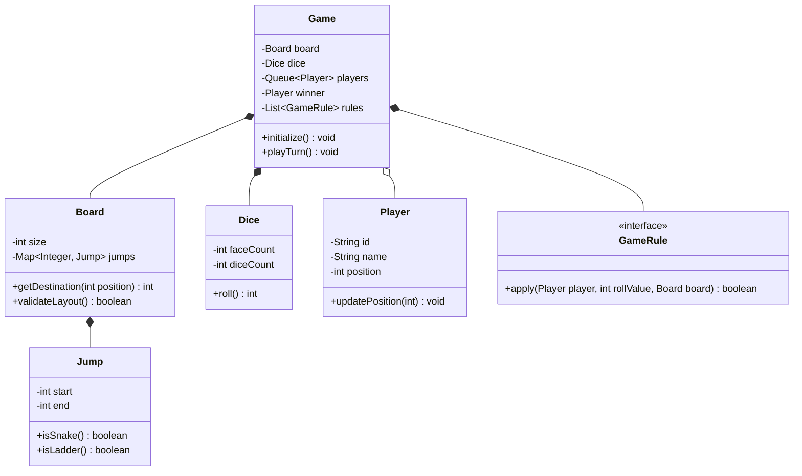

# Snake & Ladder Game Design

## Introduction
Snake & Ladder is a classic multiplayer board game played on a grid of numbered squares. Low-level design of this game showcases turn-based game loop modeling, cycle detection in graphs (preventing infinite snake-ladder loops), and extensible rules engines to support custom dice policies.

---

## Problem Statement
Design a console-based or API-driven Snake & Ladder game. The system must support configurable board sizes, custom counts of snakes and ladders, multiple players, fair dice rolls, and custom rules (such as rolling three consecutive 6s or landing exactly on the winning tile). It must detect invalid layouts containing cyclical paths that trap players indefinitely.

---

## Why this exists
To coordinate turn-based board mechanics safely. Without cycle checking, an operator could place a ladder from 10 to 20, and a snake from 20 to 10, trapping players in an infinite loop. A robust design separates board layouts from game flow state, leverages graph algorithms to check configurations, and utilizes the Strategy Pattern for game rules.

---

## Real-world analogy
Think of a board game night:
- The game board is the layout (the **Board**). It is completely static once printed.
- The players sit in a circle (the **Turn Queue**). A turn token moves clockwise.
- A rulebook (the **Rules Engine**) dictates special cases: what happens when you roll a 6, how you win, and what happens if your pawn lands on another player's pawn.

---

## Definition
A **Snake & Ladder Game** is a turn-based execution system consisting of Boards, Tiles, Jumps (Snakes/Ladders), Dice, and Rule Engines designed to simulate turn play, coordinate coordinates, and declare winners.

---

## Key concepts
1. **Cycle Detection (DFS):** Running Depth First Search on the board jumps graph to verify there are no infinite cycles (e.g. a loop of snakes and ladders).
2. **Turn Queue Modeling:** Using a FIFO queue (`Queue<Player>`) to manage turn rotations, allowing extra rolls (like rolling a 6) without complex state variables.
3. **Decoupled Jumps:** Abstracting both Snakes and Ladders into a single `Jump` concept since both simply map a starting tile index to a destination tile index.
4. **Rules Engine:** Decoupling dice policies (e.g., consecutive sixes) into pluggable validation rules.

---

## Internal working / Mermaid diagram

### Game Flow Diagram


### Class Diagram


---

## Python/Java implementation

### 1. Bad Implementation: Unsafe State Loops and Hardcoded Board
The entire game runs inside a single class. It does not validate board layout safety, leading to infinite loops, and turn management uses nested index modifications that are hard to scale.

```java
import java.util.*;

public class BadSnakeLadder {
    public int[] board = new int[101]; // maps index to target (0 means normal tile)
    public List<String> players = new ArrayList<>();
    public int[] positions = new int[10];

    public void play() {
        // CRITICAL BUG: Cyclic layout triggers infinite while loop.
        board[14] = 48; // Ladder
        board[48] = 14; // Snake (creates a loop)

        Random r = new Random();
        while (true) {
            for (int i = 0; i < players.size(); i++) {
                int roll = r.nextInt(6) + 1;
                positions[i] = positions[i] + roll;
                if (positions[i] == 100) {
                    System.out.println(players.get(i) + " wins!");
                    return;
                }
                // Resolve jumps recursively without limits
                while (board[positions[i]] != 0) {
                    positions[i] = board[positions[i]];
                }
            }
        }
    }
}
```

### 2. Better Implementation: Basic OOP but Missing Layout Validation & Rules Pattern
Using basic classes, but lacking cycle checks on the board setup, and hardcoding turn rules (like consecutive rolls) inside the main execution loop.

```java
import java.util.*;

class BetterPlayer {
    String name;
    int pos = 0;
    public BetterPlayer(String name) { this.name = name; }
}

public class BetterGame {
    private final Map<Integer, Integer> jumps = new HashMap<>();
    private final Queue<BetterPlayer> players = new LinkedList<>();

    public void addJump(int start, int end) {
        // BUG: Does not verify if adding this jump creates an infinite loop.
        jumps.put(start, end);
    }

    public void playTurn() {
        BetterPlayer p = players.poll();
        int roll = new Random().nextInt(6) + 1;
        int next = p.pos + roll;
        if (jumps.containsKey(next)) {
            next = jumps.get(next);
        }
        p.pos = next;
        players.add(p);
    }
}
```

### 3. Best Implementation: High-Safety Board Builder with DFS Cycle Checker
Applying clean abstractions for Jumps, a board builder with DFS validation to prevent infinite cycles, a queue-driven game loop, and custom rule strategy components (e.g., handling consecutive rolls).

```java
import java.util.*;
import java.util.concurrent.ConcurrentLinkedQueue;

// 1. Jump Entity (Snakes & Ladders unified)
class Jump {
    private final int start;
    private final int end;

    public Jump(int start, int end) {
        if (start == end) {
            throw new IllegalArgumentException("Start and End tiles cannot be identical.");
        }
        this.start = start;
        this.end = end;
    }

    public int getStart() { return start; }
    public int getEnd() { return end; }
    public boolean isLadder() { return end > start; }
    public boolean isSnake() { return start > end; }
}

// 2. Safe Board Representation with Cycle Checker
class Board {
    private final int size;
    private final Map<Integer, Jump> jumps = new HashMap<>();

    public Board(int size) {
        this.size = size;
    }

    public void addJump(Jump jump) {
        if (jump.getStart() >= size || jump.getEnd() >= size) {
            throw new IllegalArgumentException("Jump coordinates out of board boundary.");
        }
        jumps.put(jump.getStart(), jump.getEnd());
        
        // Cycle checking on every insertion to prevent infinite loops
        if (hasCycle()) {
            jumps.remove(jump.getStart()); // Rollback
            throw new IllegalStateException("Adding this jump creates an infinite cycle!");
        }
    }

    public int getDestination(int currentPos) {
        if (jumps.containsKey(currentPos)) {
            return jumps.get(currentPos).getEnd();
        }
        return currentPos;
    }

    public int getSize() { return size; }

    // DFS implementation to detect cycles in jumps
    private boolean hasCycle() {
        Set<Integer> visiting = new HashSet<>();
        Set<Integer> visited = new HashSet<>();

        for (Integer startNode : jumps.keySet()) {
            if (hasCycleDFS(startNode, visiting, visited)) {
                return true;
            }
        }
        return false;
    }

    private boolean hasCycleDFS(int node, Set<Integer> visiting, Set<Integer> visited) {
        if (visiting.contains(node)) return true; // Cycle detected
        if (visited.contains(node)) return false;

        visiting.add(node);
        if (jumps.containsKey(node)) {
            int neighbor = jumps.get(node).getEnd();
            if (hasCycleDFS(neighbor, visiting, visited)) {
                return true;
            }
        }
        visiting.remove(node);
        visited.add(node);
        return false;
    }
}

// 3. Dice Component
class Dice {
    private final int count;
    private final Random random = new Random();

    public Dice(int count) {
        this.count = count;
    }

    public int roll() {
        int sum = 0;
        for (int i = 0; i < count; i++) {
            sum += random.nextInt(6) + 1;
        }
        return sum;
    }
}

// 4. Player Entity
class Player {
    private final String id;
    private final String name;
    private int position = 0;

    public Player(String id, String name) {
        this.id = id;
        this.name = name;
    }

    public String getName() { return name; }
    public int getPosition() { return position; }
    public void setPosition(int position) { this.position = position; }
}

// 5. Rule Engine Strategy Interface
interface TurnRule {
    boolean processTurn(Player player, int roll, Board board);
}

// Concrete Rule: Rolling a 6 gives an extra turn, but rolling three 6s cancels the turn
class StandardTurnRule implements TurnRule {
    private final Map<String, Integer> consecutiveSixesMap = new HashMap<>();

    @Override
    public boolean processTurn(Player player, int roll, Board board) {
        String playerId = player.getName();
        consecutiveSixesMap.putIfAbsent(playerId, 0);

        if (roll == 6) {
            consecutiveSixesMap.put(playerId, consecutiveSixesMap.get(playerId) + 1);
            if (consecutiveSixesMap.get(playerId) == 3) {
                System.out.println(player.getName() + " rolled three consecutive 6s! Turn forfeited.");
                consecutiveSixesMap.put(playerId, 0);
                return false; // Turn forfeited, no movement
            }
            System.out.println(player.getName() + " gets an extra turn for rolling a 6!");
            return true; // Extra roll allowed
        } else {
            consecutiveSixesMap.put(playerId, 0);
            return false; // No extra turn
        }
    }
}

// 6. Game Orchestrator
public class Game {
    private final Board board;
    private final Dice dice;
    private final Queue<Player> players = new ConcurrentLinkedQueue<>();
    private final TurnRule turnRule = new StandardTurnRule();
    private Player winner;

    public Game(Board board, Dice dice, List<Player> initialPlayers) {
        this.board = board;
        this.dice = dice;
        this.players.addAll(initialPlayers);
    }

    public void playTurn() {
        if (winner != null) return;

        Player player = players.poll();
        if (player == null) return;

        boolean extraTurn;
        do {
            int roll = dice.roll();
            System.out.println(player.getName() + " rolled: " + roll);

            extraTurn = turnRule.processTurn(player, roll, board);
            
            // Check if three 6s were rolled (forfeiting the turn)
            if (roll == 6 && !extraTurn) {
                break; 
            }

            int nextPos = player.getPosition() + roll;

            if (nextPos > board.getSize()) {
                System.out.println("Roll exceeds winning tile. " + player.getName() + " stays at " + player.getPosition());
            } else {
                nextPos = board.getDestination(nextPos);
                player.setPosition(nextPos);
                System.out.println(player.getName() + " moved to " + nextPos);

                if (nextPos == board.getSize()) {
                    winner = player;
                    System.out.println(player.getName() + " WINS!");
                    return;
                }
            }
        } while (extraTurn);

        players.add(player); // Return to turn queue
    }

    public Player getWinner() { return winner; }
}
```

---

## Step-by-step explanation
1. **Cycle Checking**: In `Board.addJump()`, the DFS algorithm checks if the new jump creates a cycle.
   - The DFS traverses jumps recursively. If a node is visited twice in the same recursion stack (`visiting` set), a cycle is detected. The jump is removed, and an exception is thrown.
2. **Turn Management**: Turn rotations are handled by a thread-safe `ConcurrentLinkedQueue`. The active player is polled, processes their roll, and is appended back to the tail of the queue.
3. **Turn Rules**: The `TurnRule` strategy manages consecutive rolls.
   - If a player rolls a 6, the counter increments. If the count reaches 3, the movement is skipped and the turn is forfeited.
   - Otherwise, the player gets an extra roll immediately in a `do-while` loop.
4. **Jump Resolution**: The destination is resolved using `board.getDestination()`. If the tile matches a jump key, the player's position is updated to the destination tile index.

---

## Multiple real-world examples
1. **Classic Ludo/Parcheesi Engines:** Managing turn-based movements, handling player pathing, and managing home tile landing zones.
2. **Turn-based Board Game Platforms:** Multi-game portals managing player connections, turn timers, and game histories.
3. **Gamified Education Systems:** Interactive systems mapping student quiz points to move forward on a virtual board, processing jumps and reward rules.

---

## Pros
- **Layout Safety:** DFS validation prevents infinite loops during board configuration.
- **Modularity:** Jumps are treated as generic mapping links, allowing easy integration of new tile interactions (e.g., portals or speed boosts).
- **Rule Extensibility:** Dice policies are decoupled, allowing easy addition of custom rules.

---

## Cons
- **Single-Winner Limit:** The default loop terminates immediately once a winner is declared; extra code is required to let remaining players continue for ranking.
- **Synchronous Execution:** The turn loop blocks caller execution, requiring async wrapper integrations for network play.

---

## Interview questions

### Beginner
- **Q: How does the system handle a player rolling a number that takes them beyond the winning tile?**
  - **A:** In the game controller, if `nextPos > board.getSize()`, the movement is skipped and the player's position remains unchanged, passing the turn to the next player.

### Intermediate
- **Q: Why do we combine Snakes and Ladders into a single `Jump` class?**
  - **A:** Snakes and ladders share the same behavior: they map a starting tile index to a destination tile index. Treating them as a single `Jump` abstraction simplifies lookup and cycle checking logic.

### Senior
- **Q: How does the DFS cycle checker work, and when is it executed?**
  - **A:** The DFS cycle checker is executed every time a new `Jump` is added to the board. It traverses the jumps graph. If a node is visited twice in the same recursion stack (indicating a path that leads back to itself), it returns `true` for a cycle. If a cycle is detected, the transaction rolls back.

### Staff Engineer
- **Q: How would you scale this design to support multiplayer network play with real-time updates and spectator modes?**
  - **A:** 
    - **Architecture:** We separate the game engine into a stateless microservice and manage player connections via WebSockets (e.g., using Netty or Spring WebFlux).
    - **State Management:** Active game states (board layout, player positions, turn queue) are stored in an in-memory cache like Redis. Action requests (e.g., `RollDiceAction`) are routed to the matching game instance worker thread.
    - **Event Streaming:** Every turn action publishes events (e.g., `PlayerRolledEvent`, `PlayerMovedEvent`, `WinnerDeclaredEvent`) to a Redis Pub/Sub topic or Kafka. Active players and spectators subscribe to this stream via WebSockets to render updates in real-time.
    - **Audit Log:** Turn histories are written to a database (e.g., MongoDB) to support game replays.

---

## Common mistakes
- **Allowing cyclic layouts:** Setting up boards that loop infinitely.
- **Handling snakes and ladders separately in code:** Duplicating index checks for snakes and ladders.
- **Hardcoding turn rules:** Hardcoding complex dice rules directly inside the game loop, making it difficult to customize.

---

## Best practices
- **Validate board boundaries:** Ensure all snakes and ladders are within board coordinates (1 to 99).
- **Use thread-safe collections:** Use thread-safe queues to coordinate player turn transitions.
- **Inject Dice:** Allow injecting custom dice classes to support loaded dice or testing mocks.

---

## When NOT to use
- **Deterministic Games:** For games with zero random chance (like Chess or Go), dice-based movement architectures are completely irrelevant.

---

## Comparison with similar concepts

| Design Aspect | Graph-Validated Board (DFS) | Unvalidated Board |
| :--- | :--- | :--- |
| **Stability** | High (guarantees game termination) | Low (susceptible to infinite loops) |
| **Setup Cost** | Minor validation overhead during builder creation | Zero setup validation overhead |
| **Flexibility** | Supports dynamic jump additions at runtime safely | Risky to modify layouts at runtime |

---

## Summary
Designing Snake & Ladder requires separating layout definitions from game loop execution. Utilizing DFS cycle checking prevents infinite loops, and applying strategy patterns for rules simplifies turn calculations.

---

## Related topics
- [Chess Game](../chess)
- [Design Principles](../../design-principles/composition-vs-inheritance)
- [UML Activity Diagrams](../../uml/activity-diagrams)
