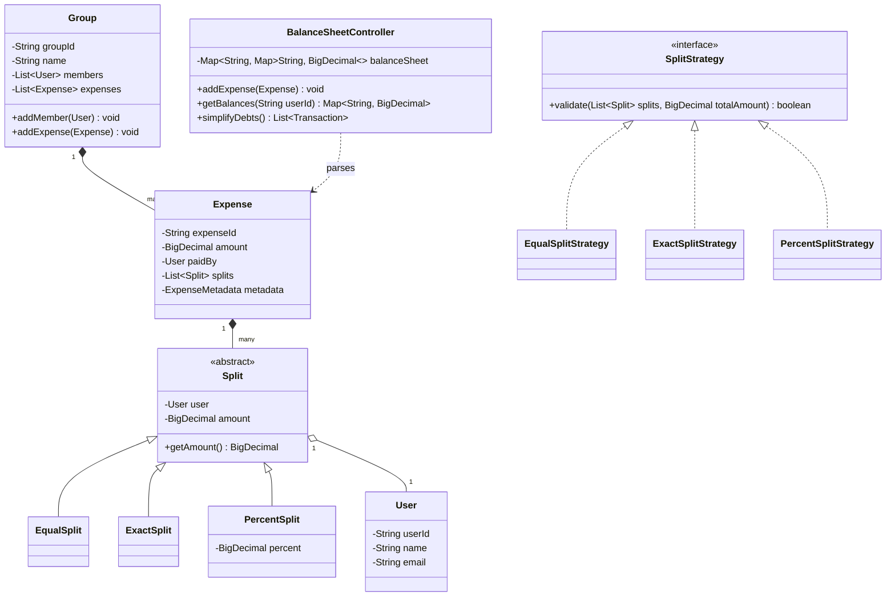

# Splitwise (Expense Sharing System)

## Introduction
Splitwise is a popular mobile and web application that allows users to split expenses with friends, track balances, and settle debts. Designing Splitwise at a low level demonstrates the application of the Strategy Pattern for split calculations, handling precision in financial mathematics (`BigDecimal`), and graph-based minimization algorithms for debt simplification.

---

## Problem Statement
Design an expense sharing system like Splitwise. The system must allow users to register, create groups, add expenses, split expenses among participants in multiple ways (equally, by exact amounts, or by percentages), track balances between any two users, and run a simplification utility to minimize the total number of transactions needed to settle all debts.

---

## Why this exists
To automate group debt ledger calculations. If 10 people go on a trip, keeping track of every individual payout is chaotic. If A owes B $20 and B owes C $20, executing two transactions is inefficient. A robust design ensures clean split strategies, prevents rounding issues (such as allocating $100 equally among 3 users), and settles debts with minimal transactions.

---

## Real-world analogy
Think of roommates sharing household bills:
- Alice pays the electric bill ($100).
- Bob pays for groceries ($150).
- Charlie pays for internet ($60).
- Instead of Alice writing a check to Bob, Charlie writing to Alice, and so on, they wait until the end of the month. They tally up their net contributions and run a single calculation where the person who paid the least pays the person who paid the most directly.

---

## Definition
A **Splitwise System** is a ledger-based financial coordination system consisting of Users, Groups, Expenses, Splits, and Settlement Engines designed to calculate debt balances, record transactions, and simplify payouts.

---

## Key concepts
1. **Strategy Pattern for Splits:** Encapsulating different split algorithms (Equal, Exact, Percentage, Shares) behind a common interface.
2. **Financial Precision:** Using `BigDecimal` instead of `double` to prevent binary floating-point rounding errors (e.g., $0.1 + 0.2 \neq 0.3$).
3. **Debt Simplification (Min-Flow Graph):** Treating debts as a directed graph, computing the net balance of each user (sum of what they are owed minus what they owe), and using a greedy algorithm to settle balances with minimum transfers.
4. **Group Isolation:** Categorizing expenses within specific Group contexts while updating global peer-to-peer balance sheets.

---

## Internal working / Mermaid diagram



---

## Python/Java implementation

### 1. Bad Implementation: Unsafe Floating-Point & Monolithic Ledger
Using raw `double` types for financial calculations leads to rounding errors (e.g., losing pennies when dividing by 3), and hardcoded loops process splits without verification checks.

```java
import java.util.*;

public class BadSplitwise {
    // CRITICAL BUG: Using double causes binary representation rounding errors.
    // Lacks extensibility and validation checks for split percentages or exact amounts.
    public Map<String, Double> balances = new HashMap<>();

    public void addEqualExpense(String paidBy, double amount, List<String> participants) {
        double splitAmount = amount / participants.size(); // e.g. 100 / 3 = 33.333333333333336
        for (String participant : participants) {
            if (!participant.equals(paidBy)) {
                String key = participant + "_owes_" + paidBy;
                balances.put(key, balances.getOrDefault(key, 0.0) + splitAmount);
            }
        }
    }
}
```

### 2. Better Implementation: OOP Entities but Lacking BigDecimal & Debt Simplification
Separating users and splits using concrete classes, but still using `double` for calculations and missing a global settlement algorithm.

```java
import java.util.*;

class BetterUser {
    String id, name;
    public BetterUser(String id, String name) { this.id = id; this.name = name; }
}

abstract class BetterSplit {
    BetterUser user;
    double amount;
    public BetterSplit(BetterUser u) { this.user = u; }
}

class BetterEqualSplit extends BetterSplit {
    public BetterEqualSplit(BetterUser u) { super(u); }
}

public class BetterSplitwiseController {
    // Outer Map: Debtor -> Inner Map: (Creditor -> Amount)
    private final Map<String, Map<String, Double>> ledger = new HashMap<>();

    public void addExpense(BetterUser paidBy, double amount, List<BetterSplit> splits) {
        // BUG: Floating point additions accumulate errors.
        // Also, doesn't simplify transaction paths (e.g., A->B->C remains two payments).
        for (BetterSplit split : splits) {
            if (split.user.id.equals(paidBy.id)) continue;
            ledger.putIfAbsent(split.user.id, new HashMap<>());
            Map<String, Double> debts = ledger.get(split.user.id);
            debts.put(paidBy.id, debts.getOrDefault(paidBy.id, 0.0) + split.amount);
        }
    }
}
```

### 3. Best Implementation: Precise Financial Ledgers with Greedy Debt Simplification
Applying the Strategy Pattern for split validations, `BigDecimal` with rounding scale checks to manage currency math safely, and a Greedy Graph Min-Flow Algorithm to simplify debts globally.

```java
import java.math.BigDecimal;
import java.math.RoundingMode;
import java.util.*;
import java.util.concurrent.ConcurrentHashMap;

// 1. Domain User class
class User {
    private final String id;
    private final String name;

    public User(String id, String name) {
        this.id = id;
        this.name = name;
    }
    public String getId() { return id; }
    public String getName() { return name; }
}

// 2. Extensible Split Hierarchy
abstract class Split {
    private final User user;
    private BigDecimal amount;

    public Split(User user) {
        this.user = user;
    }
    public User getUser() { return user; }
    public BigDecimal getAmount() { return amount; }
    public void setAmount(BigDecimal amount) { this.amount = amount; }
}

class EqualSplit extends Split {
    public EqualSplit(User user) { super(user); }
}

class ExactSplit extends Split {
    public ExactSplit(User user, BigDecimal amount) {
        super(user);
        setAmount(amount);
    }
}

class PercentSplit extends Split {
    private final BigDecimal percent;

    public PercentSplit(User user, BigDecimal percent) {
        super(user);
        this.percent = percent;
    }
    public BigDecimal getPercent() { return percent; }
}

// 3. Strategy Pattern for Split Validations & Computations
interface SplitStrategy {
    void calculateSplits(List<Split> splits, BigDecimal totalAmount);
}

class EqualSplitStrategy implements SplitStrategy {
    @Override
    public void calculateSplits(List<Split> splits, BigDecimal totalAmount) {
        int n = splits.size();
        BigDecimal share = totalAmount.divide(BigDecimal.valueOf(n), 2, RoundingMode.HALF_UP);
        
        // Handle rounding penny leftovers (e.g. $100 / 3 results in $33.33, leaving $0.01)
        BigDecimal totalCalculated = share.multiply(BigDecimal.valueOf(n));
        BigDecimal difference = totalAmount.subtract(totalCalculated);

        for (int i = 0; i < n; i++) {
            splits.get(i).setAmount(share);
        }
        
        // Add difference to first participant
        if (difference.compareTo(BigDecimal.ZERO) != 0) {
            splits.get(0).setAmount(splits.get(0).getAmount().add(difference));
        }
    }
}

class ExactSplitStrategy implements SplitStrategy {
    @Override
    public void calculateSplits(List<Split> splits, BigDecimal totalAmount) {
        BigDecimal sum = BigDecimal.ZERO;
        for (Split s : splits) {
            sum = sum.add(s.getAmount());
        }
        if (sum.compareTo(totalAmount) != 0) {
            throw new IllegalArgumentException("Exact split sum does not match total amount.");
        }
    }
}

class PercentSplitStrategy implements SplitStrategy {
    @Override
    public void calculateSplits(List<Split> splits, BigDecimal totalAmount) {
        BigDecimal totalPercent = BigDecimal.ZERO;
        for (Split s : splits) {
            PercentSplit ps = (PercentSplit) s;
            totalPercent = totalPercent.add(ps.getPercent());
        }
        if (totalPercent.compareTo(BigDecimal.valueOf(100)) != 0) {
            throw new IllegalArgumentException("Percentages must sum to exactly 100%.");
        }
        
        for (Split s : splits) {
            PercentSplit ps = (PercentSplit) s;
            BigDecimal share = totalAmount.multiply(ps.getPercent())
                    .divide(BigDecimal.valueOf(100), 2, RoundingMode.HALF_UP);
            ps.setAmount(share);
        }
    }
}

// 4. Transaction record for outputs
class Transaction {
    String from, to;
    BigDecimal amount;
    public Transaction(String from, String to, BigDecimal amount) {
        this.from = from; this.to = to; this.amount = amount;
    }
}

// 5. Central Ledger & Debt Settlement Engine
class LedgerController {
    // Debtor -> Creditor -> Balance
    private final Map<String, Map<String, BigDecimal>> ledger = new ConcurrentHashMap<>();

    public void addExpense(User paidBy, BigDecimal totalAmount, List<Split> splits, SplitStrategy strategy) {
        strategy.calculateSplits(splits, totalAmount);

        String creditor = paidBy.getId();
        for (Split split : splits) {
            String debtor = split.getUser().getId();
            if (debtor.equals(creditor)) continue;

            BigDecimal amount = split.getAmount();
            
            ledger.putIfAbsent(debtor, new ConcurrentHashMap<>());
            Map<String, BigDecimal> debtorBalances = ledger.get(debtor);
            debtorBalances.put(creditor, debtorBalances.getOrDefault(creditor, BigDecimal.ZERO).add(amount));

            // Subtract reverse debt to keep balance clean
            ledger.putIfAbsent(creditor, new ConcurrentHashMap<>());
            Map<String, BigDecimal> creditorBalances = ledger.get(creditor);
            creditorBalances.put(debtor, creditorBalances.getOrDefault(debtor, BigDecimal.ZERO).subtract(amount));
        }
    }

    // 6. Greedy Graph Min-Flow Algorithm for Debt Simplification
    public List<Transaction> simplifyDebts() {
        Map<String, BigDecimal> netBalances = new HashMap<>();

        // Calculate net balances for each user
        for (Map.Entry<String, Map<String, BigDecimal>> debtorEntry : ledger.entrySet()) {
            String debtor = debtorEntry.getKey();
            for (Map.Entry<String, BigDecimal> creditorEntry : debtorEntry.getValue().entrySet()) {
                String creditor = creditorEntry.getKey();
                BigDecimal amount = creditorEntry.getValue();

                netBalances.put(debtor, netBalances.getOrDefault(debtor, BigDecimal.ZERO).subtract(amount));
                netBalances.put(creditor, netBalances.getOrDefault(creditor, BigDecimal.ZERO).add(amount));
            }
        }

        // Separate debtors and creditors into two heaps
        // Max-heap for creditors (positive balance)
        PriorityQueue<Map.Entry<String, BigDecimal>> maxCreditors = new PriorityQueue<>(
                (a, b) -> b.getValue().compareTo(a.getValue())
        );
        // Min-heap for debtors (negative balance)
        PriorityQueue<Map.Entry<String, BigDecimal>> maxDebtors = new PriorityQueue<>(
                (a, b) -> a.getValue().compareTo(b.getValue())
        );

        for (Map.Entry<String, BigDecimal> entry : netBalances.entrySet()) {
            if (entry.getValue().compareTo(BigDecimal.ZERO) > 0) {
                maxCreditors.add(entry);
            } else if (entry.getValue().compareTo(BigDecimal.ZERO) < 0) {
                maxDebtors.add(entry);
            }
        }

        List<Transaction> transactions = new ArrayList<>();

        while (!maxCreditors.isEmpty() && !maxDebtors.isEmpty()) {
            Map.Entry<String, BigDecimal> creditor = maxCreditors.poll();
            Map.Entry<String, BigDecimal> debtor = maxDebtors.poll();

            BigDecimal creditorVal = creditor.getValue();
            BigDecimal debtorVal = debtor.getValue().abs();

            BigDecimal minSettle = creditorVal.min(debtorVal);

            transactions.add(new Transaction(debtor.getKey(), creditor.getKey(), minSettle));

            BigDecimal newCreditorVal = creditorVal.subtract(minSettle);
            BigDecimal newDebtorVal = debtor.getValue().add(minSettle); // debtor is negative, so add shifts it toward zero

            if (newCreditorVal.compareTo(BigDecimal.ZERO) > 0) {
                maxCreditors.add(new AbstractMap.SimpleEntry<>(creditor.getKey(), newCreditorVal));
            }
            if (newDebtorVal.compareTo(BigDecimal.ZERO) < 0) {
                maxDebtors.add(new AbstractMap.SimpleEntry<>(debtor.getKey(), newDebtorVal));
            }
        }

        return transactions;
    }
}
```

---

## Step-by-step explanation
1. **Precision Check**: In `EqualSplitStrategy`, the system divides the total amount by the number of splits using `RoundingMode.HALF_UP` to two decimal places. Any rounding remainder (e.g., $100 / 3 = 33.33 \times 3 = 99.99$, leaving $0.01$) is calculated and added to the first user's split.
2. **Strategy Routing**: When `addExpense()` is called, the corresponding `SplitStrategy` (Equal, Exact, Percent) validates the splits and calculates the final split amounts before updating the ledger.
3. **Net Balance Tally**: The simplification engine runs through all ledger entries to compute the net balance for each user:
   $$\text{Net Balance} = \sum(\text{Amounts Owed to User}) - \sum(\text{Amounts User Owes})$$
4. **Greedy Settlement**: Debtors (negative balance) and Creditors (positive balance) are pushed to priority heaps. The engine matches the largest debtor with the largest creditor.
   - The debtor pays the minimum of the two balances (`minSettle`).
   - The balances are updated and returned to the heaps if they are not fully settled. This process repeats until all debts are resolved.

---

## Multiple real-world examples
1. **Travel Expense Trackers:** Managing group trips where roommates track shared hotel stays, flights, and meals.
2. **Billing Systems for Coworking Spaces:** Tracking shared utility bills among multiple tenants using customized allocation ratios.
3. **Corporate Cost Allocation:** Distributing central server infrastructure costs across multiple business units based on usage percentages.

---

## Pros
- **Extensible Split Options:** The Strategy Pattern makes adding new split models (e.g., by shares or weight) simple.
- **Settlement Efficiency:** The greedy simplification algorithm reduces the number of payments, minimizing transaction fees.
- **Mathematical Precision:** Using `BigDecimal` prevents decimal rounding leaks.

---

## Cons
- **Settlement Friction:** Simplifying debts can route payments to people a user does not know directly, requiring group confirmation.
- **Simplification Processing Cost:** Running the settlement engine on large graphs (thousands of users) requires $O(V \log V + E)$ execution times.

---

## Interview questions

### Beginner
- **Q: Why should we use `BigDecimal` instead of `double` for expense sharing applications?**
  - **A:** `double` uses binary floating-point representation, which cannot represent base-10 fractions (like $1/10$ or $1/3$) accurately. This leads to rounding errors (e.g. $99.99$ instead of $100.00$). `BigDecimal` provides exact decimal representation and configurable rounding scales.

### Intermediate
- **Q: How does the Equal Split strategy resolve cases where the total amount cannot be divided equally?**
  - **A:** It divides the total amount up to two decimal places, calculates the total sum of the splits, computes the difference from the original total, and adds this remainder (typically a few cents) to the first participant's split.

### Senior
- **Q: What is the time complexity of the debt simplification algorithm, and how does it scale?**
  - **A:** The complexity is dominated by the priority queue operations. If there are $N$ users, calculating net balances takes $O(E)$ (where $E$ is the number of raw debts). Inserting users into heaps takes $O(N \log N)$. Settle iterations run at most $O(N)$ times, executing $O(\log N)$ heap updates. The overall complexity is $O(E + N \log N)$, which scales efficiently for thousands of users.

### Staff Engineer
- **Q: How would you design a distributed Splitwise system supporting 50 million active users where expenses can be settled in real-time?**
  - **A:** 
    - **Data Partitioning:** We partition the database by `GroupId` or `UserTripId`. Peer-to-peer relationships are indexed in a distributed graph database or partitioned SQL database (e.g., CockroachDB) to prevent cross-node transaction locks.
    - **Event-Driven Processing:** When an expense is added, we publish an `ExpenseCreatedEvent` to Kafka. Consumer groups update local balance sheets asynchronously.
    - **On-Demand Simplification:** Instead of simplifying debts globally across all 50 million users, we run the simplification algorithm locally within specific groups or clusters of connected components. Connected components can be identified in background Spark/Flink jobs and cached in Redis.

---

## Common mistakes
- **Using double for money:** Leads to rounding errors that accumulate over time.
- **Hardcoding split validations:** Validating splits inside the core ledger instead of using split strategies.
- **Simplifying debts globally without user consent:** routing transactions to strangers outside the group can cause privacy issues.

---

## Best practices
- **Enforce exact scaling:** Set `BigDecimal` scale to 2 digits with `RoundingMode.HALF_UP` for all financial operations.
- **Validate split inputs:** Ensure percentages sum to exactly 100, and exact amounts sum to the total expense amount.
- **Maintain transaction history:** Keep an immutable log of expenses to allow audits and rollbacks.

---

## When NOT to use
- **Direct Peer-to-Peer Transfers:** For simple 1-on-1 transactions (e.g., Venmo transfers), a balance ledger is unnecessary.

---

## Comparison with similar concepts

| Metric | Peer-to-Peer Ledger | Simplified Graph Ledger |
| :--- | :--- | :--- |
| **Transaction Count** | Equal to the number of raw debts ($O(E)$) | Minimized ($O(V)$ where $V \le N$) |
| **Payment Paths** | Follows the original expense paths | Routes payments directly between net debtors and net creditors |
| **Implementation Complexity** | Low | High (requires priority queues and graph traversals) |

---

## Summary
Designing Splitwise requires decoupling expense structures from split strategies. Using `BigDecimal` ensures financial precision, and applying a Greedy Graph Min-Flow algorithm simplifies group debts efficiently.

---

## Related topics
- [Library Management System](../library-management)
- [Design Principles](../../design-principles/composition-vs-inheritance)
- [Design Patterns](../../../01-design-patterns/creational/factory)
