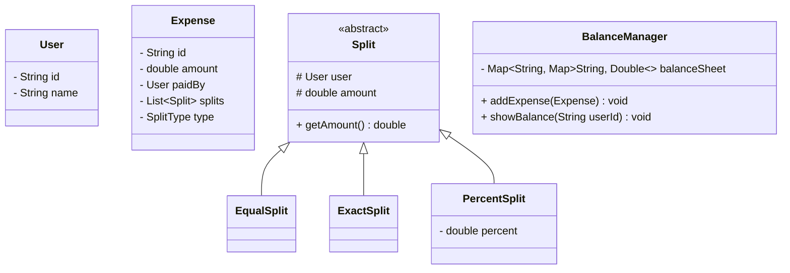

# Splitwise (Expense Sharing System)

## Problem Statement
Design an expense sharing application like Splitwise. Users can add expenses, split them among friends in various ways (EQUAL, EXACT, PERCENTAGE), track balances, and see who owes whom. The system must also be able to simplify debts (e.g., if A owes B $10, and B owes C $10, the system simplifies it so A just owes C $10).

## Requirements

### Functional Requirements
1. **Users:** A user has an ID, name, email, and mobile number.
2. **Expenses:** A user can add an expense, specifying the total amount, who paid, and who the participants are.
3. **Splits:** Expenses can be split in 3 ways:
   - *EQUAL:* Split equally among all participants.
   - *EXACT:* Explicit amounts specified for each person.
   - *PERCENT:* Explicit percentages specified for each person.
4. **Balances:** The system must show the total balances for a user (how much they owe, how much they are owed).
5. **Passbook:** The system must show detailed balances between any two specific users (e.g., Alice owes Bob $50).

### Non-Functional Requirements
1. **Precision:** Financial calculations must not suffer from floating-point errors.
2. **Extensibility:** It should be easy to add new split types (e.g., "By Shares").

## Core Pattern: The Strategy Pattern
Because there are multiple, interchangeable ways to calculate how an expense is split (Equal, Exact, Percent), the **Strategy Design Pattern** is the perfect fit. We define a standard interface `ExpenseSplitStrategy` and inject the specific algorithm at runtime.

## Class Diagram



## Implementation (Java)

```java
import java.util.*;

// USERS & SPLITS
class User {
    String id, name;
    public User(String id, String name) { this.id = id; this.name = name; }
}

abstract class Split {
    User user;
    double amount; // The calculated final amount this person owes
    public Split(User user) { this.user = user; }
}

class ExactSplit extends Split {
    public ExactSplit(User user, double amount) {
        super(user);
        this.amount = amount;
    }
}

class EqualSplit extends Split {
    public EqualSplit(User user) { super(user); }
}

// STRATEGY PATTERN FOR SPLITTING
class Expense {
    double totalAmount;
    User paidBy;
    List<Split> splits;

    public Expense(double totalAmount, User paidBy, List<Split> splits) {
        this.totalAmount = totalAmount;
        this.paidBy = paidBy;
        this.splits = splits;
    }
}

// THE BALANCE SHEET (CORE ENGINE)
class BalanceManager {
    // Stores who owes whom. 
    // Outer Map: The person who owes money (Debtor).
    // Inner Map: The person owed money to (Creditor) -> Amount.
    Map<String, Map<String, Double>> balanceSheet = new HashMap<>();

    public void addExpense(Expense expense) {
        String paidBy = expense.paidBy.id;

        for (Split split : expense.splits) {
            String paidTo = split.user.id;
            double amountOwed = split.amount;

            // If I paid for myself, ignore
            if (paidBy.equals(paidTo)) continue;

            // Initialize maps if missing
            balanceSheet.putIfAbsent(paidTo, new HashMap<>());
            balanceSheet.putIfAbsent(paidBy, new HashMap<>());

            // Update balances
            // Case 1: paidTo already owes paidBy money. Increase debt.
            Map<String, Double> paidToBalances = balanceSheet.get(paidTo);
            paidToBalances.put(paidBy, paidToBalances.getOrDefault(paidBy, 0.0) + amountOwed);

            // Case 2: paidBy actually owed paidTo money from a previous expense. 
            // We must subtract it to keep the net balance accurate.
            Map<String, Double> paidByBalances = balanceSheet.get(paidBy);
            paidByBalances.put(paidTo, paidByBalances.getOrDefault(paidTo, 0.0) - amountOwed);
        }
    }

    public void showBalances() {
        for (Map.Entry<String, Map<String, Double>> allBalances : balanceSheet.entrySet()) {
            String personOwning = allBalances.getKey();
            for (Map.Entry<String, Double> userBalance : allBalances.getValue().entrySet()) {
                if (userBalance.getValue() > 0) {
                    System.out.println(personOwning + " owes " + userBalance.getKey() + ": $" + userBalance.getValue());
                }
            }
        }
    }
}
```

## Test Cases
1. **Equal Split:** Alice pays $300 for Alice, Bob, and Charlie. The `EqualSplitStrategy` calculates $100 per `Split`. `BalanceManager` records: Bob owes Alice $100. Charlie owes Alice $100.
2. **Exact Split:** Alice pays $200. She says Bob owes $150, Charlie owes $50. The sum of exact splits must be validated to equal the total amount ($200) before processing.
3. **Netting Balances:** Alice pays $100 for Bob (Bob owes Alice $100). Next day, Bob pays $50 for Alice. The system must net this out so that Bob only owes Alice $50. (Handled by Case 2 in the implementation).

## Edge Cases
1. **Rounding Errors:** Splitting $100 equally among 3 people is $33.333... If you just do `100 / 3`, the total becomes $99.99, losing a penny. 
   - *Fix:* The Split logic must give the remainder penny to the first person in the list to ensure the total perfectly matches. Use `BigDecimal` in Java instead of `double` for currency.

## Improvements & Extensions
- **Debt Simplification Algorithm:** If A owes B $10, and B owes C $10, it's inefficient for two transactions to occur. The system can simplify this to A owes C $10. This is solved using a **Graph Algorithm**. We build a directed graph of all debts, calculate the Net Balance for every node (Positive = Creditor, Negative = Debtor), and use a Greedy approach to match the largest Creditor with the largest Debtor to settle debts with the minimum number of transactions.
