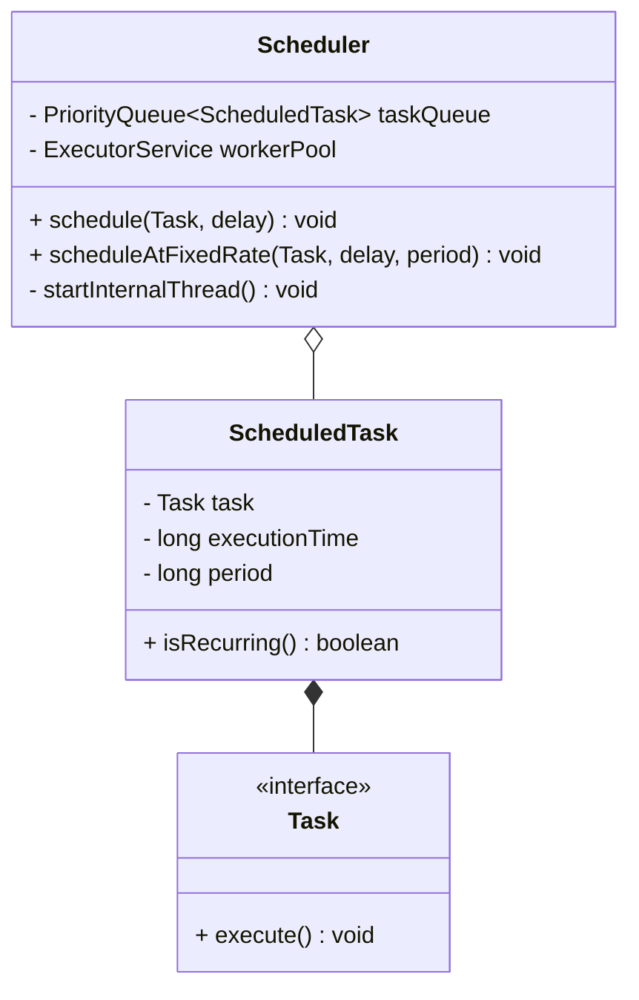

# Task Scheduler (Cron Job System)

## Problem Statement
Design a Task Scheduler that executes arbitrary jobs at specified times or periodic intervals. Similar to Linux `cron` or Quartz Scheduler. The system must accept tasks, evaluate when they need to run next, and execute them reliably without missing the deadline.

## Requirements

### Functional Requirements
1. **Submit Tasks:** A user can submit a task with an execution time (e.g., execute this at 5:00 PM).
2. **Periodic Tasks:** Support recurring tasks (e.g., execute this every 5 minutes).
3. **Execution:** The system must execute the task as close to the target time as possible.

### Non-Functional Requirements
1. **High Concurrency:** The system might need to execute 1,000 different tasks at exactly 5:00 PM. It cannot execute them one-by-one.
2. **Scalability:** It must not consume massive amounts of CPU while waiting for a task scheduled a year from now.

## Core Architecture
The standard, most optimal way to build a timer/scheduler is using a **Min-Heap (Priority Queue)**. 
Instead of checking every single task every second to see if it's time to run, you put all tasks in a Min-Heap sorted by their `NextExecutionTime`. The thread only needs to look at the task at the top of the heap. If it's not time for the top task to run, the thread can safely go to sleep until that exact time.

## Class Diagram



## Implementation (Java)

```java
import java.util.*;
import java.util.concurrent.*;

// Wrapper for the actual job, adding timing information
class ScheduledTask implements Comparable<ScheduledTask> {
    Runnable job;
    long executionTime;
    long period; // If 0, it's a one-time task

    public ScheduledTask(Runnable job, long executionTime, long period) {
        this.job = job;
        this.executionTime = executionTime;
        this.period = period;
    }

    // Sort so the earliest execution time is at the top of the Min-Heap
    @Override
    public int compareTo(ScheduledTask other) {
        return Long.compare(this.executionTime, other.executionTime);
    }
}

// THE SCHEDULER ENGINE
class MyTaskScheduler {
    // Thread-safe Priority Queue
    private PriorityBlockingQueue<ScheduledTask> queue = new PriorityBlockingQueue<>();
    
    // Thread pool to actually run the jobs so the main scheduler thread doesn't block
    private ExecutorService workers = Executors.newFixedThreadPool(10);

    public MyTaskScheduler() {
        startSchedulerThread();
    }

    public void schedule(Runnable job, long delayMillis) {
        long executeAt = System.currentTimeMillis() + delayMillis;
        queue.add(new ScheduledTask(job, executeAt, 0));
    }

    public void scheduleRecurring(Runnable job, long delayMillis, long periodMillis) {
        long executeAt = System.currentTimeMillis() + delayMillis;
        queue.add(new ScheduledTask(job, executeAt, periodMillis));
    }

    private void startSchedulerThread() {
        new Thread(() -> {
            while (true) {
                try {
                    // Peek at the top task
                    ScheduledTask task = queue.peek();
                    if (task == null) {
                        Thread.sleep(100); // Queue empty, sleep a bit
                        continue;
                    }

                    long now = System.currentTimeMillis();
                    if (now >= task.executionTime) {
                        // Time to execute!
                        queue.poll(); // Remove from queue
                        
                        // Hand off to worker pool to execute asynchronously
                        workers.submit(task.job);

                        // If recurring, calculate next execution time and put it back in queue
                        if (task.period > 0) {
                            task.executionTime = now + task.period;
                            queue.add(task);
                        }
                    } else {
                        // Not time yet. Sleep until it is time.
                        long sleepTime = task.executionTime - now;
                        Thread.sleep(sleepTime);
                    }
                } catch (InterruptedException e) {
                    Thread.currentThread().interrupt();
                    break;
                }
            }
        }).start();
    }
}
```

## Test Cases
1. **One-Time Task:** Schedule a print job for 5 seconds from now. The scheduler thread peeks, sleeps for 5 seconds, wakes up, polls it, and executes it.
2. **Recurring Task:** Schedule a ping every 2 seconds. The scheduler executes it, recalculates `executionTime = now + 2000`, and pushes it back into the heap.

## Edge Cases
1. **Long-Running Tasks:** If a task takes 10 minutes to run, the main `startSchedulerThread` MUST NOT execute it directly. If it does, the entire scheduler freezes for 10 minutes, and all other jobs miss their deadlines. This is why the code above passes `task.job` to a separate `ExecutorService workerPool`.
2. **Spurious Wakeups & New Tasks:** If the top task is scheduled for tomorrow, the thread sleeps until tomorrow. What if you submit a new task right now that needs to run in 5 seconds? The thread is asleep! The `schedule()` method must notify/interrupt the sleeping thread to wake up and re-evaluate the top of the Min-Heap. (Java's built-in `ScheduledThreadPoolExecutor` handles this lock-signaling perfectly).

## Improvements & Extensions
- **Distributed Scheduler:** The code above works for a single JVM. If you have a cluster of 5 servers, and they all run this code, the task will execute 5 times. To build a distributed scheduler, you need a shared database (like Redis or Zookeeper) with a locking mechanism so that only one server "claims" the right to execute a specific job at a specific time.
