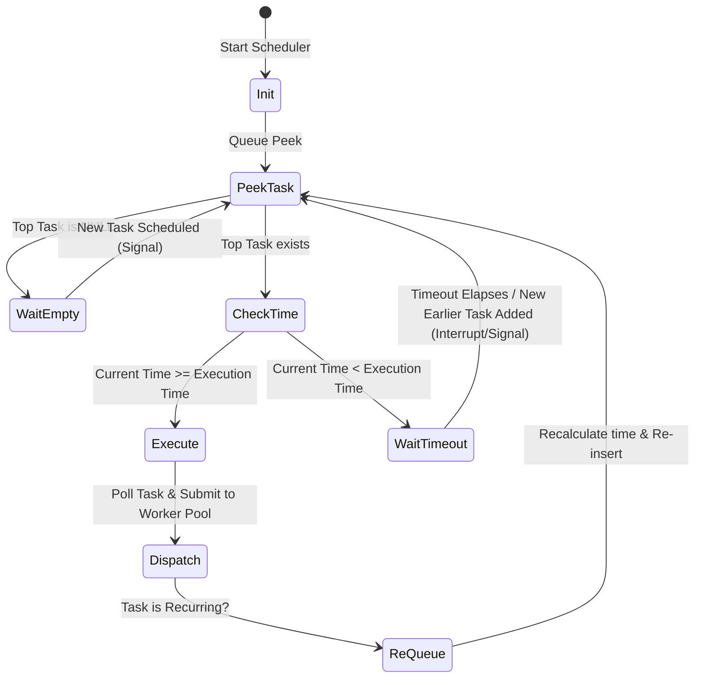
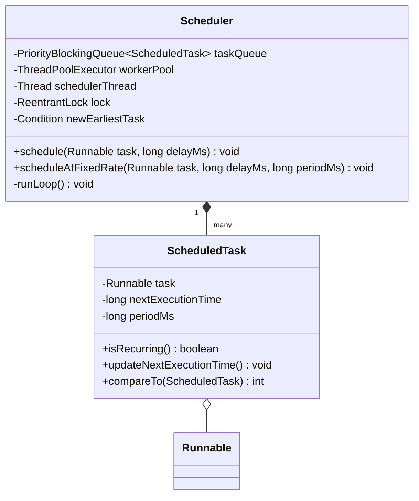

# Task Scheduler (Cron Job System)

## Introduction
A Task Scheduler is an in-memory or distributed engine designed to execute arbitrary tasks at specific future times or periodic intervals. Low-level design of a scheduler highlights concurrent task queues, priority-heap sorting, custom worker thread pool management, and lock coordination to prevent busy-waiting.

---

## Problem Statement
Design an in-memory Task Scheduler system. The system must accept one-off and recurring tasks with delayed start times, execute them as close to their scheduled deadlines as possible, support concurrent task executions, and prevent CPU starvation by avoiding busy-waiting loops. It must handle race conditions when a new task with an earlier deadline is scheduled while the scheduler thread is sleeping.

---

## Why this exists
To coordinate time-based task executions efficiently. A naive system that polls a database or list of tasks every second consumes excessive CPU and fails to execute tasks concurrently. A robust system structures tasks using priority heaps, manages execution workers using bounded thread pools, and uses lock signaling to handle dynamic schedule changes.

---

## Real-world analogy
Think of an alarm clock app on a phone:
- You set multiple alarms (one-off alarms, recurring morning alarms).
- The phone's OS does not run a continuous loop checking every second: *"Is it 7:00 AM? Is it 7:00 AM?"*
- Instead, the OS finds the next closest alarm (the **Min-Heap Top**) and schedules a hardware timer interrupt. The CPU goes to sleep.
- If you set a new alarm for 10 minutes from now (which is sooner than your next alarm), the OS wakes up, adjusts the timer interrupt, and goes back to sleep.

---

## Definition
A **Task Scheduler** is a time-driven execution engine consisting of Schedulers, Priority Queues, Worker Pools, and Lock Coordinators designed to manage task lists, schedule execution times, and execute jobs concurrently.

---

## Key concepts
1. **Min-Heap Priority Queue:** Storing tasks sorted by their next execution timestamp, ensuring the earliest task is always at the top ($O(\log N)$ insertion, $O(1)$ peek).
2. **Lock Signaling (`Condition`):** Using lock conditions (`Condition.awaitNanos()`) to put the scheduler thread to sleep until the next task's execution time, and waking it if a new task with an earlier deadline is scheduled.
3. **Execution Offloading:** Handing tasks to a separate worker thread pool (`ExecutorService`) to prevent long-running tasks from blocking the main scheduler loop.
4. **Recurring Task Scheduling:** Recalculating the next execution timestamp once a task completes and re-adding it to the priority queue.

---

## Internal working / Mermaid diagram

### Scheduler Execution Thread Flow


### Class Diagram


---

## Python/Java implementation

### 1. Bad Implementation: CPU Busy-Waiting & Synchronous Execution
Using a flat list with a sleeping loop consumes significant CPU, and running tasks synchronously on the main thread blocks subsequent tasks.

```java
import java.util.*;

public class BadScheduler {
    // CRITICAL BUG: CPU busy-waiting.
    // Executing tasks synchronously on this single thread blocks other tasks.
    public List<Map<String, Object>> tasks = new ArrayList<>();

    public void run() throws InterruptedException {
        while (true) {
            long now = System.currentTimeMillis();
            for (Map<String, Object> task : tasks) {
                long time = (Long) task.get("time");
                if (now >= time) {
                    Runnable job = (Runnable) task.get("job");
                    job.run(); // Blocks the entire scheduler thread!
                }
            }
            Thread.sleep(1000); // Inefficient polling interval
        }
    }
}
```

### 2. Better Implementation: Priority Queue with Missing Lock Signals
Using a priority queue is better, but sleeping for fixed durations means the scheduler cannot adapt if a new task with an earlier deadline is scheduled.

```java
import java.util.*;
import java.util.concurrent.*;

class BetterTask implements Comparable<BetterTask> {
    Runnable job;
    long time;
    public BetterTask(Runnable j, long t) { this.job = j; this.time = t; }
    @Override public int compareTo(BetterTask o) { return Long.compare(this.time, o.time); }
}

public class BetterScheduler {
    private final PriorityBlockingQueue<BetterTask> queue = new PriorityBlockingQueue<>();

    public void schedule(Runnable job, long delay) {
        // BUG: If the scheduler thread is currently sleeping for a task scheduled tomorrow,
        // adding a task scheduled for 5 seconds from now will not wake up the thread.
        queue.add(new BetterTask(job, System.currentTimeMillis() + delay));
    }

    public void start() throws InterruptedException {
        while (true) {
            BetterTask top = queue.peek();
            if (top == null) {
                Thread.sleep(100);
                continue;
            }
            long diff = top.time - System.currentTimeMillis();
            if (diff <= 0) {
                new Thread(queue.poll().job).start(); // Spawns unmanaged threads
            } else {
                Thread.sleep(diff); // Stuck here, cannot wake up if a sooner task is added
            }
        }
    }
}
```

### 3. Best Implementation: High-Performance Bounded Scheduler with Lock Conditions
Implementing a custom thread-safe scheduler engine, using `ReentrantLock` and `Condition` variables to coordinate sleeping and waking, and handing off task executions to a dedicated `ThreadPoolExecutor`.

```java
import java.util.*;
import java.util.concurrent.*;
import java.util.concurrent.locks.Condition;
import java.util.concurrent.locks.ReentrantLock;

// 1. Scheduled Task wrapper
class ScheduledTask implements Comparable<ScheduledTask> {
    private final Runnable task;
    private long nextExecutionTime;
    private final long periodMs; // 0 for one-off tasks

    public ScheduledTask(Runnable task, long executionTime, long periodMs) {
        this.task = task;
        this.nextExecutionTime = executionTime;
        this.periodMs = periodMs;
    }

    public void runTask() { task.run(); }
    public boolean isRecurring() { return periodMs > 0; }
    
    public void calculateNextExecutionTime() {
        if (isRecurring()) {
            this.nextExecutionTime = System.currentTimeMillis() + periodMs;
        }
    }

    public long getNextExecutionTime() { return nextExecutionTime; }

    @Override
    public int compareTo(ScheduledTask other) {
        return Long.compare(this.nextExecutionTime, other.nextExecutionTime);
    }
}

// 2. Custom Scheduler Engine
public class TaskScheduler {
    private final PriorityQueue<ScheduledTask> taskQueue = new PriorityQueue<>();
    private final ThreadPoolExecutor workerPool;
    
    private final ReentrantLock lock = new ReentrantLock();
    private final Condition newEarliestTask = lock.newCondition();
    private final Thread schedulerThread;
    private boolean isRunning = true;

    public TaskScheduler(int corePoolSize, int maxPoolSize) {
        this.workerPool = new ThreadPoolExecutor(
                corePoolSize,
                maxPoolSize,
                60L, TimeUnit.SECONDS,
                new LinkedBlockingQueue<>(1000),
                new ThreadPoolExecutor.CallerRunsPolicy()
        );
        
        this.schedulerThread = new Thread(this::runSchedulerLoop, "task-scheduler-engine");
        this.schedulerThread.start();
    }

    public void schedule(Runnable task, long delayMs) {
        long executionTime = System.currentTimeMillis() + delayMs;
        ScheduledTask scheduledTask = new ScheduledTask(task, executionTime, 0);
        addTask(scheduledTask);
    }

    public void scheduleAtFixedRate(Runnable task, long delayMs, long periodMs) {
        long executionTime = System.currentTimeMillis() + delayMs;
        ScheduledTask scheduledTask = new ScheduledTask(task, executionTime, periodMs);
        addTask(scheduledTask);
    }

    private void addTask(ScheduledTask task) {
        lock.lock();
        try {
            taskQueue.add(task);
            // If this new task is at the top of the queue, signal the scheduler thread to wake up
            if (taskQueue.peek() == task) {
                newEarliestTask.signal();
            }
        } finally {
            lock.unlock();
        }
    }

    private void runSchedulerLoop() {
        while (isRunning) {
            lock.lock();
            try {
                while (taskQueue.isEmpty() && isRunning) {
                    newEarliestTask.await(); // Sleep until a task is added
                }

                if (!isRunning) break;

                ScheduledTask earliestTask = taskQueue.peek();
                long now = System.currentTimeMillis();
                long delay = earliestTask.getNextExecutionTime() - now;

                if (delay <= 0) {
                    // Time to run
                    taskQueue.poll();
                    
                    // Dispatch to worker thread pool
                    workerPool.submit(earliestTask::runTask);

                    if (earliestTask.isRecurring()) {
                        earliestTask.calculateNextExecutionTime();
                        taskQueue.add(earliestTask);
                        // Re-evaluating the top of the queue
                        newEarliestTask.signal();
                    }
                } else {
                    // Sleep until the execution time, or until signaled by a new earliest task
                    newEarliestTask.awaitNanos(TimeUnit.MILLISECONDS.toNanos(delay));
                }
            } catch (InterruptedException e) {
                Thread.currentThread().interrupt();
                break;
            } finally {
                lock.unlock();
            }
        }
    }

    public void shutdown() {
        lock.lock();
        try {
            this.isRunning = false;
            newEarliestTask.signalAll();
        } finally {
            lock.unlock();
        }
        workerPool.shutdown();
        schedulerThread.interrupt();
    }
}
```

---

## Step-by-step explanation
1. **Lock Signaling**: In `addTask()`, if the newly added task has the earliest deadline (`taskQueue.peek() == task`), `newEarliestTask.signal()` is called to wake the scheduler thread immediately.
2. **Conditional Wait**: The scheduler thread calculates the sleep duration:
   `delay = earliestTask.getNextExecutionTime() - now`
   It calls `newEarliestTask.awaitNanos(delay)` to sleep. It wakes up when the delay expires or when a signal is received from a new, earlier task.
3. **Execution Offloading**: When the deadline is met, the task is polled and handed to `workerPool.submit()`. This prevents long-running tasks from blocking the scheduler thread.
4. **Recurring Calculations**: If the task is recurring, `calculateNextExecutionTime()` updates its timestamp, and it is re-inserted into the priority queue.

---

## Multiple real-world examples
1. **Operating System Schedulers:** Managing timer interrupts and cron job executions.
2. **Database Query Planners:** Coordinating scheduled data cleanups, vacuuming, and stats compilation.
3. **IoT Alert Systems:** Scheduling telemetry pings, device checks, and sending offline alerts.

---

## Pros
- **Resource Efficiency:** Avoids CPU busy-waiting, reducing CPU overhead.
- **High Throughput:** Decoupling task scheduling from execution prevents long-running tasks from blocking the engine.
- **Dynamic Adjustments:** The lock condition signal allows the scheduler to adapt to new, earlier tasks dynamically.

---

## Cons
- **Single-Machine Limit:** This in-memory design does not scale across multiple JVM instances without a distributed lock manager.
- **Queue Memory Storage:** High numbers of scheduled tasks consume heap space.

---

## Interview questions

### Beginner
- **Q: Why is a Priority Queue (Min-Heap) preferred over an ArrayList for a task scheduler?**
  - **A:** An ArrayList requires an $O(N)$ scan to find the earliest task on every tick. A Priority Queue keeps the earliest task at the top, allowing the scheduler to find it in $O(1)$ time and manage insertions in $O(\log N)$ time.

### Intermediate
- **Q: How does the scheduler handle a new task scheduled to run sooner than the current sleeping thread's target time?**
  - **A:** When a new task is added, the system checks if it is at the top of the queue. If true, the system calls `newEarliestTask.signal()`, waking the scheduler thread to recalculate its sleep delay.

### Senior
- **Q: How would you prevent worker thread pool exhaustion if many tasks are scheduled to run at the same time?**
  - **A:** Bounding the worker pool with a thread limit and a bounded queue prevents thread exhaustion. If the pool is saturated, the `CallerRunsPolicy` executes tasks on the submitting thread, acting as a backpressure mechanism.

### Staff Engineer
- **Q: How would you scale this system to support a distributed task scheduler executing millions of tasks across multiple servers?**
  - **A:** 
    - **Distributed Storage:** Replace the in-memory priority queue with a distributed database like Redis using Sorted Sets (`ZADD`), where the score is the execution timestamp.
    - **Leader Election:** Use ZooKeeper or Consul to elect a scheduler coordinator. The leader reads the earliest task from Redis.
    - **Distributed Locks:** Before executing a task, worker nodes acquire a distributed lock (e.g. via Redisson) on the task ID, ensuring the task is executed only once across the cluster.
    - **Message Broker:** Once a lock is acquired, the task metadata is pushed to Kafka or RabbitMQ, and worker nodes consume the task and execute it.

---

## Common mistakes
- **Executing tasks on the scheduler thread:** Running long-running tasks on the main scheduler thread, which blocks other scheduled tasks.
- **Using busy-waiting loops:** Using simple `while(true)` loops without lock conditions, consuming excessive CPU.
- **Neglecting thread safety:** Accessing the priority queue without proper locks, causing data corruption under concurrent task submissions.

---

## Best practices
- **Always bound worker pools:** Enforce maximum limits on worker thread pools to protect system memory.
- **Release locks in finally blocks:** Ensure locks are always released in a `finally` block to prevent resource leaks.
- **Use meaningful thread names:** Name scheduler threads to simplify debugging and profiling.

---

## When NOT to use
- **Simple Delayed Actions:** For simple one-off delayed tasks, using Java's built-in `ScheduledThreadPoolExecutor` directly is sufficient, making custom engines redundant.

---

## Comparison with similar concepts

| Strategy | In-Memory Priority Queue | Distributed Redis Queue |
| :--- | :--- | :--- |
| **Scope** | Single JVM instance | Distributed cluster instances |
| **Persistence** | Lost on JVM restart | Persisted in Redis memory/disk |
| **Execution Reliability** | High (local memory execution) | Medium-High (requires network call coordination) |

---

## Summary
Designing a Task Scheduler requires separating scheduling coordination from job execution. Using a Min-Heap priority queue keeps the earliest task accessible, and applying lock conditions manages sleep timeouts efficiently.

---

## Related topics
- [Movie Ticket Booking](../movie-booking)
- [Design Principles](../../design-principles/composition-vs-inheritance)
- [Executors & Thread Pools](../../concurrency-java/executors-thread-pools)
