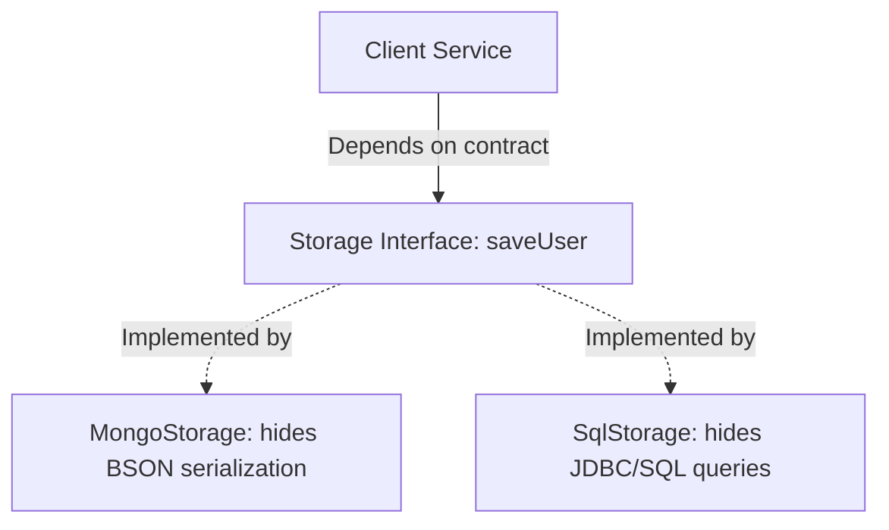

# Abstraction

## Introduction
Abstraction is the process of hiding complex implementation details and showing only the essential features of a component. It allows developers to focus on *what* an object does rather than *how* it does it, serving as a critical tool for managing complexity in large-scale software systems.

## Problem Statement
Without abstraction, high-level business logic must directly coordinate low-level tasks, such as managing database drivers, configuring socket buffers, or parsing raw HTTP headers. This tight coupling makes the codebase rigid, hard to test, and difficult to adapt when underlying technologies or APIs change.

## Why this exists
To decouple application logic from infrastructure details. By defining clear boundaries and contracts (interfaces/abstract classes), developers can build plug-and-play architectures that isolate high-level code from low-level implementation details.

## Real-world analogy
Consider a **car steering wheel and pedals**.
To accelerate, you press the gas pedal. You do not need to understand how the electronic control unit (ECU) calculates fuel injection volume or how the transmission shifts gears. The mechanical details are **abstracted** behind a simple driver interface (the pedal).

Another analogy is a **light switch**. To turn on a light, you flip a switch. You do not need to understand the electrical grid, AC voltage, or physics of electrons flowing through a wire. The switch is a simple interface representing the abstraction "toggle power".

## Definition
Abstraction is a design principle that isolates conceptual contracts from their physical implementations using interfaces and abstract classes, exposing only the functional capabilities of a module.

## Key concepts
- **Abstract Classes:** Classes declared with the `abstract` keyword that cannot be instantiated directly. They can contain a mix of implemented methods and abstract methods (signatures without bodies).
- **Interfaces:** Pure abstract blueprints containing method signatures (and default/static helper methods in modern Java) that define a contract subclasses must implement.
- **Dependency Inversion Principle (DIP):** A design rule stating that high-level modules should depend on abstractions (interfaces) rather than concrete implementations.
- **Leaky Abstractions:** Abstractions that fail to completely hide implementation details, forcing the caller to handle underlying details (e.g., catching database-specific SQLExceptions in UI controllers).

## Internal working / Mermaid diagram



## Python/Java implementation

### Bad implementation
*A client class that directly depends on a concrete MySQL database implementation, executing raw SQL queries and managing connections. This leaks low-level details and prevents swapping databases.*

```java
package bad;

import java.sql.Connection;
import java.sql.DriverManager;
import java.sql.Statement;

class UserDashboard {
    // Bad: Direct dependency on concrete database classes and configurations
    private Connection conn;

    public UserDashboard() throws Exception {
        // Direct dependency on database driver details
        this.conn = DriverManager.getConnection("jdbc:mysql://localhost:3306/db", "user", "pass");
    }

    public void renderUserInfo(String userId) throws Exception {
        // Leaking SQL syntax details directly into the UI dashboard logic!
        Statement stmt = conn.createStatement();
        stmt.executeQuery("SELECT * FROM users WHERE id = '" + userId + "'");
        System.out.println("Rendering user info from raw SQL result...");
    }
}
```

### Better implementation
*An abstract class is introduced to separate storage logic, but it leaks implementation details (such as database-specific connection references) to the client class.*

```java
package better;

import java.sql.Connection;

abstract class DatabaseStore {
    protected Connection rawConnection; // Leaky implementation detail exposed to subclasses

    public abstract void saveUser(String userId, String data);
    
    public void closeConnection() throws Exception {
        if (rawConnection != null) rawConnection.close();
    }
}

class SqlStore extends DatabaseStore {
    @Override
    public void saveUser(String userId, String data) {
        // Concrete SQL logic
        System.out.println("Saving to SQL via rawConnection...");
    }
}
```

### Best implementation
*A pure interface defines the contract, and concrete implementations are hidden behind a Factory pattern. The client interacts only with the interface, remaining unaware of the underlying database technology.*

```java
package best;

import java.util.HashMap;
import java.util.Map;

// 1. Pure Abstraction Contract (Interface)
interface UserStorage {
    void save(String userId, Map<String, String> data);
    Map<String, String> findById(String userId);
}

// 2. Encapsulated Concrete Implementation (Package-Private)
class InMemoryUserStorage implements UserStorage {
    private final Map<String, Map<String, String>> db = new HashMap<>();

    @Override
    public void save(String userId, Map<String, String> data) {
        db.put(userId, new HashMap<>(data));
    }

    @Override
    public Map<String, String> findById(String userId) {
        return db.getOrDefault(userId, Map.of());
    }
}

class SQLUserStorage implements UserStorage {
    @Override
    public void save(String userId, Map<String, String> data) {
        System.out.println("Saving to SQL Database: " + data);
    }

    @Override
    public Map<String, String> findById(String userId) {
        System.out.println("Querying SQL Database for user: " + userId);
        return Map.of("id", userId, "source", "SQL");
    }
}

// 3. Factory encapsulates instantiation details
class StorageFactory {
    public static UserStorage getStorage(String env) {
        if ("PROD".equalsIgnoreCase(env)) {
            return new SQLUserStorage();
        }
        return new InMemoryUserStorage(); // Testing or development environment
    }
}

// 4. Client class depends solely on the abstraction
class UserRegistrationService {
    private final UserStorage storage;

    // Client depends strictly on the interface, injected via constructor
    public UserRegistrationService(UserStorage storage) {
        this.storage = storage;
    }

    public void registerUser(String userId, String name) {
        Map<String, String> profile = Map.of("name", name);
        storage.save(userId, profile); // Abstraction in action: clean and simple
    }
}
```

## Step-by-step explanation
1. **Define the Contract:** We establish the `UserStorage` interface, which defines the operations `save` and `findById` without exposing how data is serialized or stored.
2. **Encapsulate Implementations:** Concrete implementations (`InMemoryUserStorage` and `SQLUserStorage`) are declared with package-private access modifiers to hide them from the client code.
3. **Decouple Instantiation:** We use `StorageFactory` to instantiate concrete classes. The client class remains unaware of which concrete class it is interacting with.
4. **Implement Dependency Injection:** `UserRegistrationService` accepts a `UserStorage` reference in its constructor, allowing different storage backends to be injected dynamically during testing or deployment.

## Multiple real-world examples
- **Cloud Storage SDKs:** Interfaces like `BlobStore` provide generic `upload` and `download` methods, abstracting away AWS S3, Google Cloud Storage, or Azure Blob storage details.
- **Microservice API Clients:** Feign or Retrofit clients abstract remote HTTP calls behind standard Java interface methods.
- **Operating System File APIs:** The OS provides system calls like `open()`, `read()`, and `write()`, abstracting away physical disk sectors and block allocations.

## Pros
- **Decoupled Architecture:** Modifying concrete storage logic (e.g., migrating from SQL to MongoDB) does not require changing client code.
- **Improved Testability:** Unit testing is simplified by mocking the interface rather than setting up real databases or external services.
- **Clear Code Division:** Developers can work on concrete storage components and client components in parallel.

## Cons
- **Cognitive Overhead:** Having multiple layers of interfaces can make the codebase harder to navigate for simple applications.
- **Debugging Complexity:** Finding the exact class executing a method requires tracing interface implementations.

## Interview questions

### Beginner
- **Q: What is the main difference between an abstract class and an interface in Java?**
- **A:** An abstract class can hold instance states (fields) and implement default behaviors, and a class can extend only one abstract class. An interface traditionally defines only abstract method signatures, although Java 8+ supports default and static methods. A class can implement multiple interfaces.

### Intermediate
- **Q: Why would you choose an abstract class over an interface?**
- **A:** Choose an abstract class when subclasses share common state or helper code that should be inherited. Choose an interface when defining a contract for unrelated classes or when implementing multiple inheritance of behavior is necessary.

### Senior
- **Q: What is a leaky abstraction, and how does it violate the principles of OOP?**
- **A:** A leaky abstraction occurs when the underlying implementation details of a class leak through its abstract interface. For example, if an interface method throws a database-specific exception (like `SQLException` or `MongoException`), the calling code must handle database-specific errors, breaking encapsulation and decoupling.

### Staff Engineer
- **Q: How does Java 8+ interface changes (default methods, private methods) impact the design pattern of abstract classes, and when do abstract classes remain necessary?**
- **A:** Java 8+ introduced default and static methods, and Java 9 added private methods, allowing interfaces to share behavior without forcing subclasses to implement them. This reduced the need for helper abstract classes (e.g., `AbstractList`). However, abstract classes remain necessary when:
  1. The abstraction must maintain instance fields or state, which interfaces cannot do.
  2. The abstraction requires access to protected fields or non-public constructor validation.
  3. You want to prevent class-wide multiple inheritance of behavior to enforce strict class taxonomies.

## Common mistakes
- **Creating Interfaces prematurely:** Defining interfaces for every single class even when there is only one implementation and no likelihood of future changes.
- **Leaking Concrete names:** Naming an interface `MySQLUserRepository` instead of `UserRepository`. The interface should remain technology-agnostic.

## Best practices
- Program to interfaces rather than concrete implementations (Dependency Inversion Principle).
- Name interfaces as adjectives indicating capabilities (e.g., `Serializable`, `Closable`) or nouns representing general roles (e.g., `PaymentProcessor`).
- Throw custom, technology-neutral exceptions from interface methods to prevent leaky abstractions.

## When NOT to use
- **Simple scripts or DTOs:** If a class only transfers data or executes straightforward logic without external dependencies, introducing interfaces adds unnecessary boilerplate.

## Comparison with similar concepts
- **Abstraction vs Encapsulation:**
  - **Abstraction:** Hides complexity and low-level details behind a simple interface.
  - **Encapsulation:** Restricts direct access to internal state to protect data integrity.

## Summary
Abstraction isolates design contracts from implementation details using interfaces and abstract classes. This simplifies code maintenance and makes systems easier to test and extend.

## Related topics
- [Encapsulation](../encapsulation)
- [Polymorphism](../polymorphism)
- [SOLID Principles](../../solid-principles)
