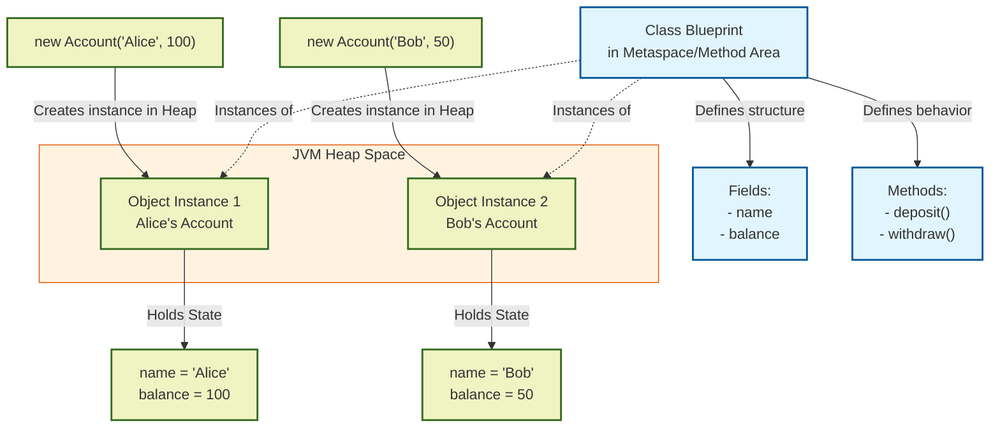

# Classes & Objects

## Introduction
At the core of Object-Oriented Programming (OOP) are **Classes** and **Objects**. OOP is a programming paradigm designed to solve software complexity by bundling data and the behaviors that manipulate that data into cohesive, self-contained units.

## Problem Statement
In procedural programming (e.g., C), data structures and the functions that modify them are separate. As systems scale, any function can modify any variable across the application. This makes tracking down bugs difficult, couples unrelated parts of code, and results in hard-to-maintain "spaghetti code."

## Why this exists
Classes and Objects solve this separation of data and logic. By grouping variables and functions together, they create a clear boundary around a concept. This enables code reuse, modularity, and natural mental modeling of real-world problems.

## Real-world analogy
Think of a **Class** as a **blueprinted mold for a plastic toy**. The blueprint defines the properties (height, weight, color) and functions (squeak, move legs). It is just a design document on a computer.
An **Object** is the **actual plastic toy** stamped out by the factory machine. You can stamp out 10,000 toys (Objects) from that single blueprint (Class). Each individual toy can have a different color, and if you break one toy, the others remain undamaged.

## Definition
- **Class:** A user-defined template or blueprint that defines the structure, variables, and methods common to all instances of that type. It resides in the compiler metadata/bytecode space.
- **Object:** A concrete instance of a class allocated on the heap at runtime. It occupies physical memory and has state, behavior, and a unique identity.

## Key concepts
- **State (Attributes/Fields):** The data held by an object. It represents the object's properties at a given moment.
- **Behavior (Methods):** The operations or actions an object can perform on its own state or in collaboration with other objects.
- **Identity:** A unique identifier that distinguishes an object from all other objects in memory, even if their state is identical. (In Java, this is represented by its memory address and retrieved via `System.identityHashCode()`).
- **Instantiation:** The process of allocating memory on the heap for a new object using the `new` keyword and calling its constructor.

## Internal working / Mermaid diagram



## Python/Java implementation

### Bad implementation
*A procedural approach in Java where data and logic are separated. The data is held in arrays, and functions manipulate them by passing indices. This leaks state, lacks safety checks, and makes code modification error-prone.*

```java
package bad;

public class ProceduralBank {
    // Separation of data: parallel arrays track accounts
    public static String[] accountHolders = new String[10];
    public static double[] accountBalances = new double[10];
    public static int accountCount = 0;

    public static void deposit(int accountIndex, double amount) {
        if (amount > 0) {
            accountBalances[accountIndex] += amount;
            System.out.println("Deposited $" + amount + " to account index: " + accountIndex);
        }
    }

    public static void main(String[] args) {
        // Hard to manage index correspondence and state consistency
        accountHolders[0] = "Alice";
        accountBalances[0] = 100.0;
        accountCount++;

        // Any client code can bypass rules and corrupt values
        accountBalances[0] = -500.0; // Corrupted state!
        deposit(0, 50);
    }
}
```

### Better implementation
*An anemic domain model where data is wrapped in a class, but all fields are public. External code has direct access to mutate state, leading to inconsistent object states.*

```java
package better;

class BankAccount {
    public String holderName;
    public double balance; // Leaked state: mutable directly by anyone
    
    public BankAccount(String holderName, double initialBalance) {
        this.holderName = holderName;
        this.balance = initialBalance;
    }
    
    public void deposit(double amount) {
        if (amount > 0) {
            this.balance += amount;
        }
    }
}

public class Main {
    public static void main(String[] args) {
        BankAccount account = new BankAccount("Alice", 100.0);
        
        // Better structure, but fields are still vulnerable
        account.balance = -1000.0; // Bypasses deposit validation rules
    }
}
```

### Best implementation
*A rich, encapsulated class design. The state is private, validation is enforced in the constructor and mutators, and behavior resides entirely within the class.*

```java
package best;

import java.util.Objects;
import java.util.UUID;

public class BankAccount {
    // Private variables prevent external modification
    private final String accountId;
    private final String holderName;
    private double balance;

    // Constructor enforces invariant state rules
    public BankAccount(String holderName, double initialBalance) {
        this.accountId = UUID.randomUUID().toString();
        this.holderName = Objects.requireNonNull(holderName, "Holder name cannot be null");
        if (initialBalance < 0) {
            throw new IllegalArgumentException("Initial balance cannot be negative");
        }
        this.balance = initialBalance;
    }

    // Public methods provide controlled behavioral access to state
    public synchronized void deposit(double amount) {
        if (amount <= 0) {
            throw new IllegalArgumentException("Deposit amount must be positive");
        }
        this.balance += amount;
    }

    public synchronized void withdraw(double amount) {
        if (amount <= 0) {
            throw new IllegalArgumentException("Withdrawal amount must be positive");
        }
        if (amount > this.balance) {
            throw new IllegalStateException("Insufficient funds");
        }
        this.balance -= amount;
    }

    // Read-only getters protect state mutability
    public String getAccountId() { return accountId; }
    public String getHolderName() { return holderName; }
    public double getBalance() { return balance; }

    @Override
    public boolean equals(Object o) {
        if (this == o) return true;
        if (o == null || getClass() != o.getClass()) return false;
        BankAccount that = (BankAccount) o;
        return Objects.equals(accountId, that.accountId);
    }

    @Override
    public int hashCode() {
        return Objects.hash(accountId);
    }
}
```

## Step-by-step explanation
1. **Class Definition:** We define the `BankAccount` class. This defines the blueprint: fields (`accountId`, `holderName`, `balance`) and methods (`deposit`, `withdraw`).
2. **Memory Allocation:** When `new BankAccount("Alice", 100)` is called, the JVM allocates memory on the heap for the instance variables.
3. **Initialization:** The JVM runs the constructor, initializing the state and validating that variables meet business rules.
4. **Behavior Execution:** When `account.deposit(50)` is executed, the method runs in the context of that specific object's memory partition, modifying only that object's `balance` field.

## Multiple real-world examples
1. **Operating Systems:** A `Thread` class defining state (thread ID, priority, state) and behaviors (`start()`, `join()`, `sleep()`).
2. **Game Engines:** A `GameObject` class representing items on screen with states (coordinates, scale, velocity) and behaviors (`render()`, `update()`).
3. **Database Drivers:** A `Connection` class representing a network channel with status indicators and execution queries.

## Pros
- **Localization of State:** Bugs are limited to the methods of the class, making debugging easier.
- **Maintainability:** Internal implementations can be modified without breaking client code, as long as the public interface remains constant.
- **Natural Abstraction:** Simplifies reasoning about large systems by mapping code objects directly to real-world entities.

## Cons
- **Overhead:** Frequent object instantiation and garbage collection can introduce latency and memory overhead.
- **Boilerplate:** Requires writing constructors, getters, and structural overrides compared to procedural scripts.
- **State Mutability Issues:** Mutable objects can cause synchronization bugs in concurrent systems.

## Interview questions

### Beginner
- **Q: What is the difference between a Class and an Object?**
- **A:** A Class is a logical template or blueprint defined in source code. An Object is a physical instance of that class created at runtime, residing in the system's heap memory.

### Intermediate
- **Q: What is the purpose of the `this` keyword in Java?**
- **A:** The `this` keyword is a reference to the current object instance inside a method or constructor. It is used to access instance variables and resolve naming conflicts with local variables.

### Senior
- **Q: How does the JVM allocate memory for classes and objects?**
- **A:** The JVM stores class definitions (metadata, method bytecode, runtime constant pool) in the **Metaspace** (Java 8+) or **Method Area**. Object instances and their non-static fields are stored on the **Heap**. Local variable references pointing to those objects are stored on the **Thread Stack**.

### Staff Engineer
- **Q: How does Java's object model handle identity vs equality, and how do you design objects for concurrent environments?**
- **A:** Identity is the physical uniqueness of an object in memory (`==` comparison). Equality (`equals()`) is a logical definition of matching state. In concurrent environments, objects should ideally be designed as **immutable** (fields declared `final` and set at construction). This eliminates the need for synchronization, as read-only state is thread-safe by default. If mutable, thread safety must be enforced using synchronization primitives or atomic variables.

## Common mistakes
- **Creating God Classes:** Packaging too many responsibilities into a single class, violating the Single Responsibility Principle.
- **Exposing Mutable Fields:** Declaring fields as public, allowing external classes to bypass validation rules.

## Best practices
- Keep classes small and focused on a single responsibility.
- Declare variables as private and expose read-only access where possible.
- Always implement `equals()` and `hashCode()` for objects used in collection keys or sets.

## When NOT to use
- **Pure Mathematical Calculations:** When writing utility functions (e.g., `Math.sin()`), standard static functions are preferred over object instantiation.
- **High-Performance Memory Constraints:** In real-time embedded systems, creating many short-lived objects can cause garbage collection latency, making data-oriented arrays or primitive arrays a better choice.

## Comparison with similar concepts
- **Class vs Struct:**
  - **Class:** Supports inheritance, polymorphism, and resides on the heap (in managed languages like Java/C#).
  - **Struct:** Typically passed by value, lacks class inheritance, and is often allocated on the stack (in languages like C++ or Go) to minimize memory overhead.

## Summary
Classes act as blueprints defining data structures and operations, while objects are the dynamic instances created from them. Designing cohesive classes is the foundation for modular, testable, and maintainable software.

## Related topics
- [Encapsulation](../encapsulation)
- [Inheritance](../inheritance)
- [Polymorphism](../polymorphism)
