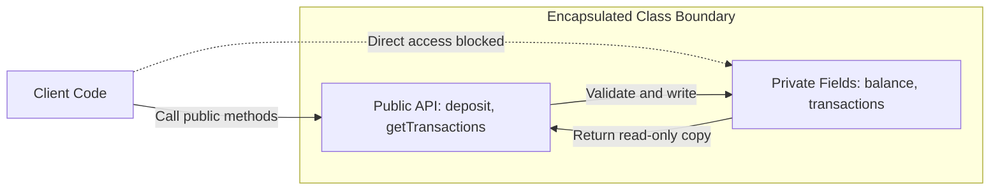

# Encapsulation

## Introduction
Encapsulation is one of the four fundamental pillars of Object-Oriented Programming (OOP). It refers to the bundling of data (attributes) and methods that operate on that data into a single unit (a class), while restricting direct access to the object's internal components.

## Problem Statement
If all variables inside an object are public, any external code can modify them directly. For example, in a `BankAccount` object, client code could do `account.balance = -99999;` or alter database status flags. This bypasses validation logic, leads to corrupted states, and makes debugging difficult because the source and timing of modifications are untraceable.

## Why this exists
To protect an object's internal state from unauthorized or unintended modifications. By forcing external callers to interact with the object through a strictly defined public interface (methods), the class preserves its invariants and remains the single source of truth for its own state.

## Real-world analogy
Consider a **gelatin capsule of medicine**. The active ingredients (data) are sealed inside the capsule shell. You swallow the capsule whole. You do not manually break the capsule apart, measure the powder, and place it directly on your tongue. The shell ensures the active ingredients are released under correct biological conditions (validation).

Another analogy is a **vending machine**. The snacks (data) and the coin vaults are locked behind a glass screen. The only way to get a snack is by entering a code and inserting money (public interface). You cannot simply reach inside the machine and grab a snack (unencapsulated access).

## Definition
Encapsulation is the mechanism of wrapping data and the code acting on it into a single unit, hiding the object's internal representation from the outside world, and exposing only controlled access paths.

## Key concepts
- **Access Modifiers:** Keywords (`private`, `protected`, `public`, and package-private default) that define the visibility boundaries of classes, methods, and fields.
- **Data Hiding:** Declaring fields `private` to isolate them from external packages.
- **Getters (Accessors):** Public methods that expose read-only access to a field's value.
- **Setters (Mutators):** Public methods that validate inputs before updating a field's value.
- **Defensive Copying:** Returning copies of mutable fields (e.g., Dates, Lists) from getters to prevent callers from modifying the original object state.

## Internal working / Mermaid diagram



## Python/Java implementation

### Bad implementation
*Direct field exposure. External code can corrupt the balance, age, and transactions list without any validation or tracking.*

```java
package bad;

import java.util.ArrayList;
import java.util.List;

public class BankAccount {
    public String accountHolder;
    public double balance;
    public List<String> transactionHistory = new ArrayList<>(); // Exposed directly

    public static void main(String[] args) {
        BankAccount account = new BankAccount();
        account.accountHolder = "Alice";
        account.balance = -5000.0; // Invalid state accepted
        account.transactionHistory.add("Stole all money"); // Direct list tampering
    }
}
```

### Better implementation
*Using private fields and getters/setters, but leaking internal mutable references. Callers can bypass the setter logic by modifying the returned list directly.*

```java
package better;

import java.util.ArrayList;
import java.util.List;

public class BankAccount {
    private String accountHolder;
    private double balance;
    private List<String> transactions = new ArrayList<>();

    public BankAccount(String accountHolder, double initialBalance) {
        this.accountHolder = accountHolder;
        this.balance = initialBalance;
    }

    public double getBalance() {
        return this.balance;
    }

    public void deposit(double amount) {
        if (amount > 0) {
            this.balance += amount;
            this.transactions.add("Deposit: " + amount);
        }
    }

    // Leaky getter: returns the direct reference to the mutable list!
    public List<String> getTransactions() {
        return this.transactions;
    }
}
```

### Best implementation
*A fully encapsulated class design. Attributes are kept private, mutators enforce validation logic, and getters use defensive copying or unmodifiable wrappers to prevent external tampering.*

```java
package best;

import java.util.ArrayList;
import java.util.Collections;
import java.util.List;
import java.util.Objects;

public class BankAccount {
    private final String accountHolder;
    private double balance;
    private final List<String> transactions;

    public BankAccount(String accountHolder, double initialBalance) {
        this.accountHolder = Objects.requireNonNull(accountHolder, "Holder cannot be null");
        if (initialBalance < 0) {
            throw new IllegalArgumentException("Initial balance cannot be negative");
        }
        this.balance = initialBalance;
        this.transactions = new ArrayList<>();
        this.transactions.add("Account created with balance: " + initialBalance);
    }

    public double getBalance() {
        return this.balance;
    }

    public String getAccountHolder() {
        return this.accountHolder;
    }

    // Encapsulated write operation with state validation
    public synchronized void deposit(double amount) {
        if (amount <= 0) {
            throw new IllegalArgumentException("Deposit amount must be positive");
        }
        this.balance += amount;
        this.transactions.add("Deposited: " + amount);
    }

    // Encapsulated read operation returning a read-only list wrapper
    public List<String> getTransactions() {
        return Collections.unmodifiableList(this.transactions);
    }
}
```

## Step-by-step explanation
1. **Declare Variables Private:** In `best.BankAccount`, `balance` and `transactions` are declared `private`, preventing direct external modifications.
2. **Implement Input Validation:** In the `deposit` method, incoming parameters are validated. If the parameter is invalid, an exception is thrown, preserving the object's internal consistency.
3. **Encapsulate Collections:** The `getTransactions()` method returns `Collections.unmodifiableList(this.transactions)`. If an external class calls `account.getTransactions().add("Hack")`, Java throws an `UnsupportedOperationException`, preventing unauthorized writes.

## Multiple real-world examples
- **Database Connection Managers:** Connection parameters are kept private, and connections are requested through a public `getConnection()` pool gateway.
- **Game Engine Character Stats:** Player health is modified using a `takeDamage(int damage)` method rather than exposing the health variable directly. This ensures death animations are triggered correctly.
- **Enterprise User Management:** Passwords are kept private and are verified using a public `verifyPassword(String rawPassword)` method, keeping the raw hash hidden.

## Pros
- **Consistent Internal State:** Enforces business rules and validation logic at the object level.
- **Implementation Independence:** Internal data structures can be changed (e.g., swapping a `List` for a `Set`) without affecting external classes.
- **Improved Testability:** Simpler to isolate and mock behavior when all operations go through public APIs.

## Cons
- **Increased Boilerplate:** Requires writing accessors, mutators, and copy constructors.
- **Runtime Performance Overhead:** Creating defensive copies of collections can add minor memory and CPU overhead.

## Interview questions

### Beginner
- **Q: How is encapsulation implemented in Java?**
- **A:** By declaring instance variables as `private` and exposing public getter and setter methods to control access.

### Intermediate
- **Q: What is a leaky abstraction in encapsulation, and how do you fix it?**
- **A:** A leaky abstraction occurs when a getter returns a direct reference to a mutable internal object (like a `Date` or a `List`). External classes can modify the state of the object directly, bypassing the class's methods. You fix this by returning defensive copies or using unmodifiable collection wrappers (e.g., `Collections.unmodifiableList()`).

### Senior
- **Q: How does the "Tell, Don't Ask" principle apply to encapsulation?**
- **A:** The principle states that you should instruct an object to perform an action rather than querying its internal state to make decisions yourself. Exposing too many getters leads to procedural code where logic is scattered across the application rather than encapsulated within the data-owning class.

### Staff Engineer
- **Q: How does encapsulation impact JVM performance, and how do you design encapsulated classes to minimize memory footprint?**
- **A:** Frequent object allocation for defensive copies can increase Garbage Collection pressure. To optimize performance:
  1. Use **Immutable Objects** (e.g., Java `Record` types) to avoid defensive copying, as their read-only state is safe to share directly.
  2. Return specialized lightweight collections, such as `List.of()` or `Map.copyOf()`.
  3. Design classes with high cohesion to reduce the amount of shared state needed by external components.

## Common mistakes
- **Generating Getters and Setters blindly:** Exposing accessors for every field without considering if the data should be read-only or entirely private.
- **Forgetting defensive copying:** Returning internal mutable variables directly from getters.

## Best practices
- Keep variables private by default and expose only essential public APIs.
- Throw descriptive exceptions (e.g., `IllegalArgumentException`) inside setters to handle invalid input early.
- Keep classes small and cohesive.

## When NOT to use
- **Simple Data Transfer Objects (DTOs):** If a class only transfers data across network boundaries and contains no business logic, simple public fields or Java `record` types are preferred over custom getters and setters.

## Comparison with similar concepts
- **Encapsulation vs Information Hiding:**
  - **Encapsulation:** The language mechanism of bundling data and methods together (e.g., inside a class).
  - **Information Hiding:** The design principle of hiding design decisions (like internal variables) to decouple code modules. Encapsulation is a tool used to achieve Information Hiding.

## Summary
Encapsulation groups data and behavior, hiding internal states to prevent unauthorized mutations. Exposing controlled public APIs ensures the object maintains consistent internal states.

## Related topics
- [Classes & Objects](../classes-objects)
- [Abstraction](../abstraction)
- [Polymorphism](../polymorphism)
