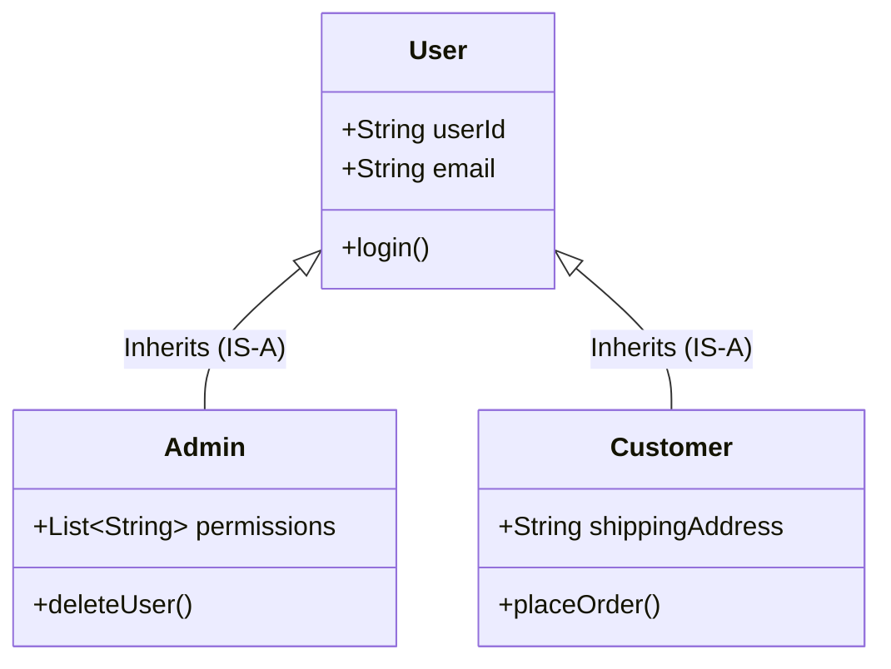

# Inheritance

## Introduction
Inheritance is a fundamental concept of Object-Oriented Programming (OOP) that allows a new class (subclass/child) to acquire the properties and behaviors (fields and methods) of an existing class (superclass/parent). It models hierarchical taxonomies and facilitates code reuse.

## Problem Statement
When modeling systems with related entities (e.g., different types of users: `Admin`, `Customer`, `SupportAgent`), writing separate classes from scratch leads to duplicating common fields (like `id`, `email`, `login()`) and behaviors. If the login mechanism changes, developers must update every class individually, increasing the risk of bugs and inconsistencies.

## Why this exists
To eliminate code redundancy and organize classes into logical hierarchies. It allows developers to define a general class with common attributes and specialize it in subclasses without modifying the base code.

## Real-world analogy
Consider **biology and genetics**. A child inherits genetic attributes (eye color, blood type) from their parents. However, the child can also express unique behaviors (e.g., playing a musical instrument) that the parent does not possess.

Another analogy is a **product catalog**. A basic `Product` represents name and price. A `SmartPhone` IS-A `Product` but adds a screen size and camera specification. It inherits the base properties of a product while extending them.

## Definition
Inheritance is a design mechanism that establishes an "IS-A" relationship between a superclass and a subclass, allowing the subclass to inherit, override, or extend the fields and methods of the superclass.

## Key concepts
- **Superclass (Base/Parent):** The class whose properties are inherited.
- **Subclass (Derived/Child):** The class that inherits from the superclass and can introduce additional fields or override existing methods.
- **"IS-A" Relationship:** The logical validation that a subclass can substitute the superclass (e.g., A `Dog` IS-A `Animal`).
- **Method Overriding:** Re-defining a superclass method in a subclass to provide specialized behavior.
- **`super` Keyword:** A reference used to call the superclass's constructors or methods from within the subclass.
- **Liskov Substitution Principle (LSP):** A design rule stating that objects of a superclass must be replaceable with objects of its subclasses without affecting program correctness.

## Internal working / Mermaid diagram



## Python/Java implementation

### Bad implementation
*Using inheritance solely for code reuse without a valid "IS-A" relationship. For example, making a `Square` inherit from `Rectangle` (violating LSP because setting width changes height in a square) or making `UserManager` extend `DatabaseHelper` just to access database helper methods.*

```java
package bad;

// Violation of Liskov Substitution Principle (LSP)
class Rectangle {
    protected int width;
    protected int height;

    public void setWidth(int width) { this.width = width; }
    public void setHeight(int height) { this.height = height; }
    public int getArea() { return width * height; }
}

class Square extends Rectangle {
    @Override
    public void setWidth(int width) {
        this.width = width;
        this.height = width; // Enforces square property but breaks Rectangle invariant!
    }

    @Override
    public void setHeight(int height) {
        this.width = height;
        this.height = height;
    }
}

public class Main {
    public static void resize(Rectangle r) {
        r.setWidth(5);
        r.setHeight(10);
        // If 'r' is a Square, this assertion fails, breaking client expectations!
        assert r.getArea() == 50 : "Area must be 50";
    }
}
```

### Better implementation
*Standard subclassing tree. It establishes a correct hierarchy, but remains tightly coupled to the superclass. If internal parent methods change their signatures or state-handling logic, child classes can break (the Fragile Base Class problem).*

```java
package better;

class DatabaseHelper {
    public void connect() { System.out.println("Connecting..."); }
    public void query(String sql) { System.out.println("Executing: " + sql); }
}

// Inheriting database helper class to reuse code. Tight coupling created.
class UserManager extends DatabaseHelper {
    public void createNewUser(String username) {
        connect(); // Inherited method
        query("INSERT INTO users VALUES ('" + username + "')");
    }
}
```

### Best implementation
*Applying "Composition over Inheritance" (HAS-A relationship) combined with interfaces. The `Square` and `Rectangle` implement a shared `Shape` contract, and `UserManager` uses composition to delegate database interactions, making the design flexible and decoupled.*

```java
package best;

// 1. Decoupled Interface Contract
interface Shape {
    int getArea();
}

class Rectangle implements Shape {
    private final int width;
    private final int height;

    public Rectangle(int width, int height) {
        this.width = width;
        this.height = height;
    }

    @Override
    public int getArea() {
        return width * height;
    }
}

class Square implements Shape {
    private final int side;

    public Square(int side) {
        this.side = side;
    }

    @Override
    public int getArea() {
        return side * side;
    }
}

// 2. Composition (HAS-A) instead of Inheritance
interface DatabaseConnector {
    void executeQuery(String sql);
}

class PostgresConnector implements DatabaseConnector {
    public void executeQuery(String sql) {
        System.out.println("Executing Postgres Query: " + sql);
    }
}

class UserManager {
    private final DatabaseConnector dbConnector; // Composed dependency

    public UserManager(DatabaseConnector dbConnector) {
        this.dbConnector = dbConnector;
    }

    public void createNewUser(String username) {
        dbConnector.executeQuery("INSERT INTO users VALUES ('" + username + "')");
    }
}
```

## Step-by-step explanation
1. **Define the Base Contract (Interface):** In `best`, the `Shape` interface defines the expected behavior (`getArea()`) without imposing structure.
2. **Implement concrete shapes independently:** `Rectangle` and `Square` implement `Shape` using their own fields, maintaining encapsulation and preventing Liskov Substitution Principle violations.
3. **Decouple database operations:** `UserManager` delegates database actions to a `DatabaseConnector` interface via composition. This allows swapping database implementations without modifying the `UserManager` class.

## Multiple real-world examples
- **UI Toolkits:** Base classes like `Component` define dimensions and focus listeners, which are inherited by concrete widgets like `Button` and `TextField`.
- **E-commerce Systems:** A base `Product` class holds fields like `sku` and `price`, which are inherited by specialized subclasses like `DigitalBook` and `PhysicalBook`.
- **Java Exception Handling:** Custom application exceptions inherit from `RuntimeException` to integrate with the JVM's exception-catching architecture.

## Pros
- **Polymorphic substitution:** Code can accept superclass instances and interact with subclasses uniformly.
- **Code reuse:** Shared logic is declared once in the superclass, reducing code duplication.
- **Structural organization:** Groups classes into clear hierarchies, simplifying domain modeling.

## Cons
- **Brittle Base Classes:** Modifying a superclass can unintentionally break subclasses.
- **Tightly coupled designs:** Inheritance hierarchies are defined at compile-time and cannot be changed dynamically at runtime.
- **Single-Inheritance limits:** In languages like Java or C#, a class can extend only one superclass.

## Interview questions

### Beginner
- **Q: Does Java support multiple inheritance of classes?**
- **A:** No. Java does not support multiple inheritance of classes to avoid the "Diamond Problem" (ambiguities that arise when two parent classes define a method with the same name). However, Java supports multiple inheritance of interfaces.

### Intermediate
- **Q: What is the difference between Method Overloading and Method Overriding?**
- **A:** Method Overloading occurs within the same class (or across subclasses) and involves creating methods with the same name but different signatures (compile-time polymorphism). Method Overriding occurs when a subclass redefines a superclass method with the exact same name, return type, and signature (runtime polymorphism).

### Senior
- **Q: How does the Liskov Substitution Principle (LSP) limit the use of inheritance?**
- **A:** LSP states that subclasses must be substitutable for their superclass without altering program correctness. If a subclass overrides superclass methods and changes expected invariants (such as a `Square` altering the dimensions of a `Rectangle`), it violates LSP. In such cases, inheritance is inappropriate, and composition should be used instead.

### Staff Engineer
- **Q: Explain how the JVM handles method invocation for overridden methods under the hood (vtable lookup).**
- **A:** When compiling code, the compiler determines method calls for static or private methods using `invokestatic` or `invokespecial` (static binding). For public/protected instance methods, it uses `invokevirtual` (dynamic binding). At runtime, the JVM looks up the object's class metadata and consults its **virtual method table (vtable)**. The vtable holds pointers to the actual bytecode of the methods. If a subclass overrides a method, the pointer in its vtable is updated to point to the subclass's implementation, directing the execution path.

## Common mistakes
- **Inheriting solely for code reuse:** Extending a class to reuse a helper method when there is no "IS-A" relationship.
- **Deeply nested hierarchies:** Creating deep inheritance chains (e.g., `Object -> Entity -> Unit -> Character -> Monster -> Dragon`). These are hard to maintain and modify. Keep hierarchies shallow (1-2 levels).

## Best practices
- Prefer Composition over Inheritance when reusing code.
- Mark classes as `final` if they are not designed to be subclassed, protecting their encapsulation.
- Annotate overridden methods with `@Override` to catch compilation errors early.

## When NOT to use
- **Varying runtime behaviors:** If an object's behavior needs to change dynamically at runtime, use the Strategy or State pattern instead of static inheritance.
- **No true hierarchy:** Avoid inheritance if the subclass cannot logically substitute the parent class in all scenarios.

## Comparison with similar concepts
- **Inheritance vs Composition:**
  - **Inheritance:** An "IS-A" relationship that is defined statically at compile-time.
  - **Composition:** A "HAS-A" relationship that allows components to be swapped dynamically at runtime.

## Summary
Inheritance defines "IS-A" hierarchies to reuse code and enable polymorphism. However, deep or incorrect hierarchies introduce tight coupling, so developers should favor composition to build flexible systems.

## Related topics
- [Polymorphism](../polymorphism)
- [Composition vs Inheritance](../../design-principles/composition-vs-inheritance)
- [SOLID Principles](../../solid-principles)
