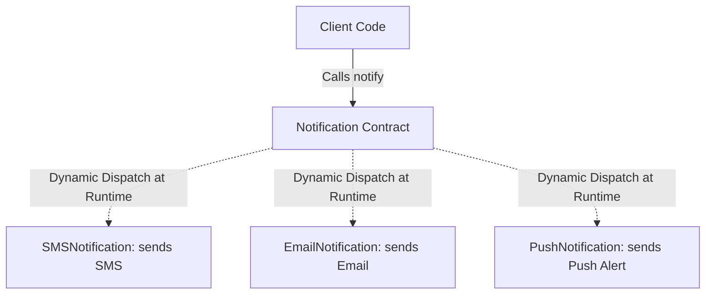

# Polymorphism

## Introduction
Polymorphism, derived from the Greek words for "many forms," is a core pillar of Object-Oriented Programming (OOP). In software design, it refers to the ability of a single interface, abstract class, or method signature to support multiple distinct behaviors depending on the runtime instance type.

## Problem Statement
Without polymorphism, executing shape rendering, payment processing, or notifications across different types requires writing nested conditional checks (`if-else` or `switch` blocks) that inspect class types manually. When a new implementation is added, developers must locate and modify all type check blocks across the codebase, violating the Open/Closed Principle.

## Why this exists
To decouple client code from concrete implementations. By interacting with a single, abstract contract, the system can execute different behaviors at runtime based on the actual object type, allowing codebases to remain clean and extensible.

## Real-world analogy
Consider a **smartphone power button**.
- If the phone is locked, pressing the button **wakes the screen**.
- If the phone is active, long-pressing the button **triggers the voice assistant**.
- If the camera app is open, pressing the button can act as a **shutter trigger**.
The same physical input (method call) displays different behaviors depending on the current context (state/type).

Another analogy is a **musical note**. A sheet of music instructs the musician to play "C Major". If the musician is sitting at a piano, it sounds like a piano note. If they are holding a trumpet, it sounds like a trumpet note. The instruction (method signature) is identical, but the execution (behavior) depends on the instrument (object instance).

## Definition
Polymorphism is the capability of different object classes to respond to the same method invocation in specialized ways, resolved either at compile-time (static binding) or at runtime (dynamic binding).

## Key concepts
- **Compile-Time Polymorphism (Static Binding):** Resolved during compilation. It is achieved using **Method Overloading**, where methods in the same class share a name but differ in parameter count, type, or order.
- **Run-Time Polymorphism (Dynamic Binding):** Resolved during execution by the runtime environment. It is achieved using **Method Overriding**, where a subclass redefines a method declared in a superclass or interface.
- **Upcasting:** Assigning a child class object to a parent class reference variable (e.g., `List<String> list = new ArrayList<>()`).
- **Dynamic Dispatch:** The mechanism by which the runtime environment selects which overridden method to call based on the actual type of the object in memory.

## Internal working / Mermaid diagram



## Python/Java implementation

### Bad implementation
*A procedural design using `instanceof` checks and downcasting inside a central runner. Every time a new notification channel is added, this runner code must be modified, leading to fragile designs.*

```java
package bad;

class NotificationSender {
    public void send(Object notification, String message) {
        if (notification instanceof EmailNotification) {
            ((EmailNotification) notification).sendEmail(message);
        } else if (notification instanceof SMSNotification) {
            ((SMSNotification) notification).sendSMS(message);
        }
        // Adding PushNotification requires modifying this code!
    }
}

class EmailNotification {
    public void sendEmail(String msg) { System.out.println("Email: " + msg); }
}

class SMSNotification {
    public void sendSMS(String msg) { System.out.println("SMS: " + msg); }
}
```

### Better implementation
*Using basic method overriding with a shared base class, but lacking compile-time overloading flexibility and leaking internal casting requirements or specialized parameters.*

```java
package better;

abstract class Notification {
    public abstract void send(String message);
}

class EmailNotification extends Notification {
    @Override
    public void send(String message) {
        System.out.println("Sending Email: " + message);
    }
}

class SMSNotification extends Notification {
    @Override
    public void send(String message) {
        System.out.println("Sending SMS: " + message);
    }
}

public class NotificationService {
    public void dispatch(Notification notification, String message) {
        // Works, but lacks overloading options for bulk sending or priority handling
        notification.send(message);
    }
}
```

### Best implementation
*Combining Compile-Time (Overloading) and Run-Time (Overriding) Polymorphism using interfaces. The client interacts strictly with the interface, and the code is open to extension but closed to modification.*

```java
package best;

import java.util.List;

// 1. Unified Interface defining the contract
interface Notification {
    void send(String message);
}

// 2. Specialized concrete implementations
class EmailNotification implements Notification {
    @Override
    public void send(String message) {
        System.out.println("Sending Email: " + message);
    }
}

class SMSNotification implements Notification {
    @Override
    public void send(String message) {
        System.out.println("Sending SMS: " + message);
    }
}

class PushNotification implements Notification {
    @Override
    public void send(String message) {
        System.out.println("Sending Push Alert: " + message);
    }
}

// 3. Service leveraging Overloading (Compile-Time) and Overriding (Run-Time)
public class NotificationManager {

    // Overloaded Method A: Send single notification (Dynamic Dispatch)
    public void sendNotification(Notification notification, String message) {
        notification.send(message);
    }

    // Overloaded Method B: Send notification with custom priority
    public void sendNotification(Notification notification, String message, boolean priority) {
        String finalMessage = priority ? "[URGENT] " + message : message;
        notification.send(finalMessage); // Dynamic Dispatch resolves implementation
    }

    // Overloaded Method C: Bulk send (Dynamic Dispatch over collection)
    public void sendNotification(List<Notification> channels, String message) {
        for (Notification channel : channels) {
            channel.send(message);
        }
    }
}
```

## Step-by-step explanation
1. **Declare Unified Interface:** We define the `Notification` interface with a single method signature: `send(String message)`.
2. **Implement Specializations:** `EmailNotification`, `SMSNotification`, and `PushNotification` implement this interface, defining their own custom behavior for `send`.
3. **Apply Method Overloading (Compile-time):** In `NotificationManager`, we overload `sendNotification` with different parameter lists, allowing compile-time resolution of the method signature.
4. **Execute Method Overriding (Runtime):** When calling `channel.send(message)`, the JVM inspects the actual object type in memory at runtime and dispatches to the corresponding overridden method implementation.

## Multiple real-world examples
- **JDBC Driver Managers:** The JDBC API defines interfaces like `Connection` and `Statement`. Database providers write concrete implementations (Oracle, MySQL, Postgres), and applications run queries without knowing which database driver is running under the hood.
- **Java Collection Framework:** Algorithms accept the `List` or `Collection` interface, allowing developers to swap an `ArrayList` for a `LinkedList` without modifying the business logic.
- **Spring Framework Controllers:** Spring MVC resolves different request payloads and dispatches them to appropriate handlers polymorphically.

## Pros
- **Extensibility:** Adding new implementations (e.g., `SlackNotification`) does not require modifying client code (Open/Closed Principle).
- **Code Organization:** Eliminates massive `if-else` and `switch` type-checking blocks, making code cleaner.
- **Improved Reusability:** Writes generic algorithms that operate on abstract contracts.

## Cons
- **Cognitive Overhead:** It is harder to trace execution paths statically, as the resolved method is only determined at runtime.
- **Performance overhead:** Dynamic dispatch requires a vtable lookup, which adds a minor performance penalty compared to static binding.

## Interview questions

### Beginner
- **Q: What is the difference between upcasting and downcasting?**
- **A:** Upcasting is casting a subclass object to a superclass reference (e.g., `Animal a = new Dog()`), which is safe and done automatically. Downcasting is casting a superclass reference back to a subclass reference (e.g., `Dog d = (Dog) a`), which is unsafe and requires explicit casting and runtime validation.

### Intermediate
- **Q: Why can't static or final methods be overridden in Java?**
- **A:** Static methods belong to the class rather than instance variables, and the compiler binds static calls at compile time (static binding) based on the reference type. Final methods are explicitly marked to prevent overriding.

### Senior
- **Q: What is Method Hiding, and how does it differ from Method Overriding?**
- **A:** Method Hiding occurs when a subclass defines a static method with the exact same signature as a static method in the superclass. Unlike method overriding, which resolves the implementation based on the runtime instance type (dynamic binding), method hiding resolves the implementation based on the reference variable type at compile time (static binding).

### Staff Engineer
- **Q: How does JVM class loading and class verification impact the resolution of overridden interface methods (itable vs vtable)?**
- **A:**
  - **vtable (Virtual Method Table):** Used for standard class inheritance. Each class has an array of method pointers. Subclasses inherit indices and overwrite pointers for overridden methods. vtable lookups are performed in $O(1)$ time using fixed offsets.
  - **itable (Interface Method Table):** Used when a class implements interfaces. Since a class can implement multiple interfaces, interface methods cannot reside at fixed indices across different classes. The JVM resolves itable lookups by locating the matching interface within the class's metadata and then looking up the method pointer, which has a higher overhead than a vtable lookup.

## Common mistakes
- **Using type checks instead of overriding:** Writing code blocks filled with `instanceof` checks rather than defining abstract methods.
- **Assuming constructors are polymorphic:** Trying to call overridden methods from inside a constructor, which can run before subclass instance variables are initialized.

## Best practices
- Program to interfaces rather than concrete implementations.
- Always use the `@Override` annotation when overriding methods to detect signature typos at compile time.
- Limit method overriding to maintain the Liskev Substitution Principle (LSP).

## When NOT to use
- **Simple, Non-Extensible Logic:** If a concept has only one implementation and is unlikely to change, introducing interfaces and polymorphism adds unnecessary abstraction overhead.

## Comparison with similar concepts
- **Runtime vs Compile-time Polymorphism:**
  - **Runtime Polymorphism:** Resolved at runtime via method overriding and dynamic dispatch.
  - **Compile-time Polymorphism:** Resolved at compile-time via method overloading and signature matching.

## Summary
Polymorphism decoupling client logic from concrete implementations by executing behaviors dynamically at runtime. Combining compile-time overloading with runtime overriding creates flexible and maintainable systems.

## Related topics
- [Inheritance](../inheritance)
- [Abstraction](../abstraction)
- [SOLID Principles](../../solid-principles)
