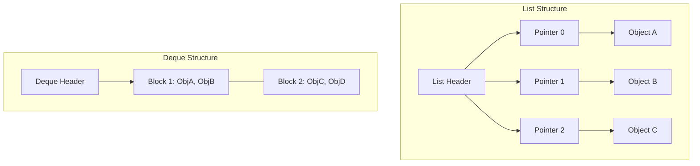

# Python Collections

## Introduction
Python offers a rich set of built-in data structures along with the specialized container datatypes in the `collections` module. Understanding the internal workings, performance trade-offs, and time complexities of lists, dictionaries, sets, tuples, deques, and counters is essential for writing optimized, idiomatic Python code.

---

## Problem Statement
Selecting the wrong data structure can severely degrade application performance. For example, using a list to check for element membership in a loop converts an $O(N)$ operation into an $O(N^2)$ algorithm. Similarly, using a list as a queue forces the interpreter to shift all remaining elements in memory during every dequeue operation. We need to match our data structures to their algorithmic requirements.

---

## Why this exists
To balance memory usage and execution speed. Python's built-in collections are optimized for generic use cases:
- **Lists** provide fast, index-based random access.
- **Dictionaries and Sets** provide near-instant, key-based lookups using internal hashing.
- **Deques and Counters** solve specific queueing and counting workloads without manual logic overhead.

---

## Real-world analogy
Think of an office organizing system:
- **List:** A stack of documents sorted by order of arrival. Finding the 5th document is instant, but checking if a specific document exists requires reading the entire stack one-by-one.
- **Dictionary:** A filing cabinet with alphabetically labeled tabs. You jump directly to the tab to retrieve the file.
- **Set:** A box of unique name tags. If a duplicate tag is thrown in, it is ignored because only unique tags are kept.

---

## Definition
- **List:** A mutable, ordered sequence of elements implemented internally as a dynamic array of object references.
- **Dictionary (Dict):** An ordered (since Python 3.7) key-value map implemented internally using a compact hash table with collision resolution.
- **Deque:** A double-ended queue supporting $O(1)$ insertions and deletions at both ends, implemented as a doubly linked list of fixed-size blocks.

---

## Key concepts
1. **Dynamic Array Allocation (Lists):** When a list grows, Python over-allocates memory to avoid calling `realloc` on every `append` operation. The allocation pattern is:
   $$\text{Allocated size} \approx \text{Size} + (\text{Size} \gg 3) + 6$$
   This ensures `append` runs in amortized $O(1)$ time.
2. **Compact Dictionary Representation (Python 3.6+):** Dictionaries store hashes and keys in a dense array, and maintain a separate, smaller index array of offsets. This reduces dictionary memory footprint by 30% to 95% and preserves insertion order.
3. **Immutability of Tuples:** Tuples are immutable arrays. Because their size is fixed at creation, Python optimizes their memory allocation, allocating them in a single memory block (unlike lists which allocate separate pointer blocks).
4. **Specialized Collections:**
   - `defaultdict`: Automates key initialization by calling a default factory function when a missing key is accessed.
   - `Counter`: A dictionary subclass designed to count hashable objects.
   - `namedtuple`: Creates tuple subclasses with named fields, combining the memory efficiency of tuples with class readability.

---

## Internal working / Mermaid diagram

### Python List (Dynamic Array of Pointers) vs Deque (Blocks Linkages)



---

## Python implementation

### 1. Bad Implementation: Inefficient Queue and Membership Checks
Using a standard list as a queue (`list.pop(0)`) and searching for membership (`in list`) inside a loop results in $O(N^2)$ complexity.

```python
# A naive processor tracking unique processed tasks in order.
# CRITICAL BUG: list.pop(0) shifts all elements left (O(N)),
# and "task in list" scans the entire list (O(N)), resulting in O(N^2) complexity.
class BadTaskProcessor:
    def __init__(self):
        self.pending_tasks = [] # Used as a Queue
        self.completed_tasks = [] # Used for membership checks

    def add_task(self, task):
        self.pending_tasks.append(task)

    def process_next(self):
        if not self.pending_tasks:
            return None
        task = self.pending_tasks.pop(0) # O(N) shift operation
        
        # O(N) linear scan check
        if task not in self.completed_tasks:
            self.completed_tasks.append(task)
        return task
```

### 2. Better Implementation: Manual Dict Initialization
Using a set for fast membership checks ($O(1)$ lookups) and standard dictionaries, but manually handling missing keys with verbose check-and-insert loops.

```python
# Using a set for completed checks, but relying on manual dict key checks.
# TIME COMPLEXITY: O(1) lookups and inserts
# SPACE COMPLEXITY: O(N)
class BetterTaskProcessor:
    def __init__(self):
        self.pending_tasks = [] # Still using list for queue (suboptimal)
        self.completed_tasks = set() # O(1) lookup set
        self.task_frequencies = {}

    def add_task(self, task):
        self.pending_tasks.append(task)

    def track_frequency(self, task):
        # Manual check-and-insert logic for dictionary keys
        if task not in self.task_frequencies:
            self.task_frequencies[task] = 0
        self.task_frequencies[task] += 1

    def process_next(self):
        if not self.pending_tasks:
            return None
        task = self.pending_tasks.pop(0) # O(N) shift is still present
        self.completed_tasks.add(task) # O(1) average
        return task
```

### 3. Best Implementation: Using collections.deque, Counter, and sets
An optimized implementation utilizing `collections.deque` for $O(1)$ queue operations, a `set` for $O(1)$ membership checks, and `defaultdict`/`Counter` to simplify code and maximize performance.

```python
from collections import deque, Counter, defaultdict

# Fully optimized collections utilization.
# TIME COMPLEXITY:
#   - process_next: O(1) (deque popleft + set add)
#   - track_frequency: O(1) (defaultdict update)
# SPACE COMPLEXITY: O(N)
class BestTaskProcessor:
    def __init__(self):
        self.pending_tasks = deque() # O(1) push and popleft
        self.completed_tasks = set() # O(1) membership lookups
        self.task_frequencies = Counter() # Automatically counts elements
        self.task_metadata = defaultdict(list) # Autocreates list values on missing keys

    def add_task(self, task):
        self.pending_tasks.append(task)

    def track_frequency(self, task):
        self.task_frequencies[task] += 1 # O(1) automatic increment

    def append_metadata(self, task, meta):
        # Bypasses manual check, automatically creates list if missing
        self.task_metadata[task].append(meta)

    def process_next(self):
        if not self.pending_tasks:
            return None
        
        # Deque popleft is O(1), no element shifting in memory
        task = self.pending_tasks.popleft() 
        self.completed_tasks.add(task) # O(1)
        return task
```

---

## Step-by-step explanation
1. **The Cost of list.pop(0)**: In `BadTaskProcessor`, when `pop(0)` is called, the item at index 0 is deleted. To maintain a contiguous array, Python must shift all remaining $N-1$ element pointers one position to the left in memory, taking $O(N)$ operations.
2. **Membership Scanning**: The expression `task not in completed_tasks` in `BadTaskProcessor` scans the list element-by-element. If the list has $N$ items, this takes $O(N)$ operations in the worst case.
3. **Doubly Linked Block Queues (Best)**: In `BestTaskProcessor`, `collections.deque` stores elements in blocks linked together. Popping from the left only requires updating the block's head pointer, completing in constant $O(1)$ time.
4. **Hashing Lookups**: The `set` and `Counter` objects use Python's hash table implementation. When checking membership or incrementing counts, Python hashes the key to compute the array offset, skipping the need to scan the collection.

---

## Multiple real-world examples
1. **LRU Cache Implementation:** Combining a dictionary (for $O(1)$ key lookups) and a doubly linked list / deque (to track access order and evict the least recently used item in $O(1)$ time).
2. **Word Count Frequency Analysis:** Analyzing server log lines using `collections.Counter` to find the top 10 most frequent IP addresses or error codes.
3. **Graph BFS Traversal:** Using a `deque` to queue discovered nodes during breadth-first searches.

---

## Pros
- **Constant Time Lookups:** Sets and Dictionaries provide average $O(1)$ time for key operations.
- **Fast Queue Operations:** `collections.deque` provides stable, high-performance $O(1)$ queue operations.
- **Clean Syntax:** Classes like `defaultdict` and `Counter` reduce boilerplate code.

---

## Cons
- **High Memory Footprint:** Hash-based collections (dict, set) consume significant memory due to over-allocated bucket arrays.
- **Hash Collisions:** Poorly distributed hash keys can cause collision resolution searches, degrading performance to $O(N)$.
- **No Indexing:** Sets and dictionaries do not support direct index-based slicing (e.g. `my_set[0:5]`).

---

## Interview questions

### Beginner
- **Q: What is the difference between a list and a tuple in Python?**
  - **A:** 
    - **Mutability:** Lists are mutable (you can modify, append, or delete elements). Tuples are immutable (once created, they cannot be changed).
    - **Memory:** Tuples are stored in a single contiguous memory block, consuming less memory than lists.
    - **Syntax:** Lists use square brackets `[]`; tuples use parentheses `()`.
    - **Usage:** Tuples are used for heterogeneous records (e.g., database rows `(user_id, name, age)`) and can be used as dictionary keys if all elements are hashable.

### Intermediate
- **Q: What is the average and worst-case time complexity of dictionary operations in Python? How does it resolve conflicts?**
  - **A:** 
    - **Average Complexity:** $O(1)$ for search, insertion, and deletion.
    - **Worst-Case Complexity:** $O(N)$ if all keys hash to the same index (causing collisions).
    - **Conflict Resolution:** Python dictionaries use **Open Addressing** with a pseudo-random probing sequence:
      $$\text{next\_idx} = (\text{5} \times \text{current\_idx} + \text{perturb} + 1) \pmod{\text{capacity}}$$
      where `perturb` decreases on each step to ensure all slots are eventually checked.

### Senior
- **Q: Explain the internal implementation of Python lists. Why does list.append() run in O(1) time if it is a dynamic array?**
  - **A:** Python lists are implemented as dynamic arrays of object references.
    - **Memory Allocation:** When the list fills its allocated capacity, Python allocates a new, larger memory block (usually over-allocating by $\approx 12.5\%$) and copies the element pointers to the new block.
    - **Complexity:** Although the resize step takes $O(N)$ time, it happens rarely. The cost of copying is distributed across many insertions, resulting in an **amortized** time complexity of $O(1)$ per `append`.

### Staff Engineer
- **Q: How does the compact dictionary representation introduced in Python 3.6 optimize memory usage?**
  - **A:** 
    - **Legacy Dict:** Stored key-value pairs in a sparse array of 24-byte entries containing: `(hash, key_ptr, value_ptr)`. Because the array was kept sparse (at least 1/3 empty to prevent collisions), it wasted significant memory.
    - **Compact Dict:** Uses two arrays:
      1. A dense array of 24-byte entries containing only the active key-value pairs.
      2. A sparse array of small integers (indices/offsets) that map hash codes to offsets in the dense array.
      Since the sparse array stores small integers (e.g., 1-byte integers for tables with less than 256 elements) instead of full 24-byte entries, it reduces memory usage by 30% to 95% and preserves insertion order naturally.

---

## Common mistakes
- **Using list.pop(0) in loops:** Using a list as a queue, causing $O(N)$ memory shifts.
- **Using mutable objects as keys:** Using lists or dicts as dictionary keys, which throws a `TypeError: unhashable type` exception.
- **Re-counting elements manually:** Writing `for` loops to count occurrences instead of using `collections.Counter`.

---

## Best practices
- **Use `deque` for queues:** Always replace `list.pop(0)` with `collections.deque.popleft()`.
- **Use sets for membership checks:** Convert lists to sets if you perform frequent `item in collection` checks.
- **Use defaultdict to simplify grouping:** Replace manual key checks with `defaultdict(list)` or `defaultdict(int)`.

---

## When NOT to use
- **Sorted Traversals:** Standard sets do not preserve order. If you need to iterate through unique items in a sorted order, use a sorted list or the third-party `sortedcontainers` library.

---

## Comparison of Collection Types

| Collection | List | Tuple | Set | Dict | Deque |
| :--- | :--- | :--- | :--- | :--- | :--- |
| **Ordered** | Yes | Yes | No | Yes (since 3.7) | Yes |
| **Mutable** | Yes | No | Yes | Yes | Yes |
| **Lookup Time** | $O(N)$ | $O(N)$ | $O(1)$ | $O(1)$ | $O(N)$ |
| **Append Time** | $O(1)$ amortized | N/A | $O(1)$ | $O(1)$ | $O(1)$ |

---

## Summary
Python Collections offer a range of data structures tailored to different performance requirements. Selecting the correct structure—such as using `deque` for queues, `set` for membership checks, and `Counter`/`defaultdict` for grouping—is crucial for building efficient applications.

---

## Related topics
- [Generators & Decorators](../generators-decorators)
- [Exceptions & Context Managers](../exceptions-context-managers)
- [File I/O & Serialization](../file-io-serialization)
