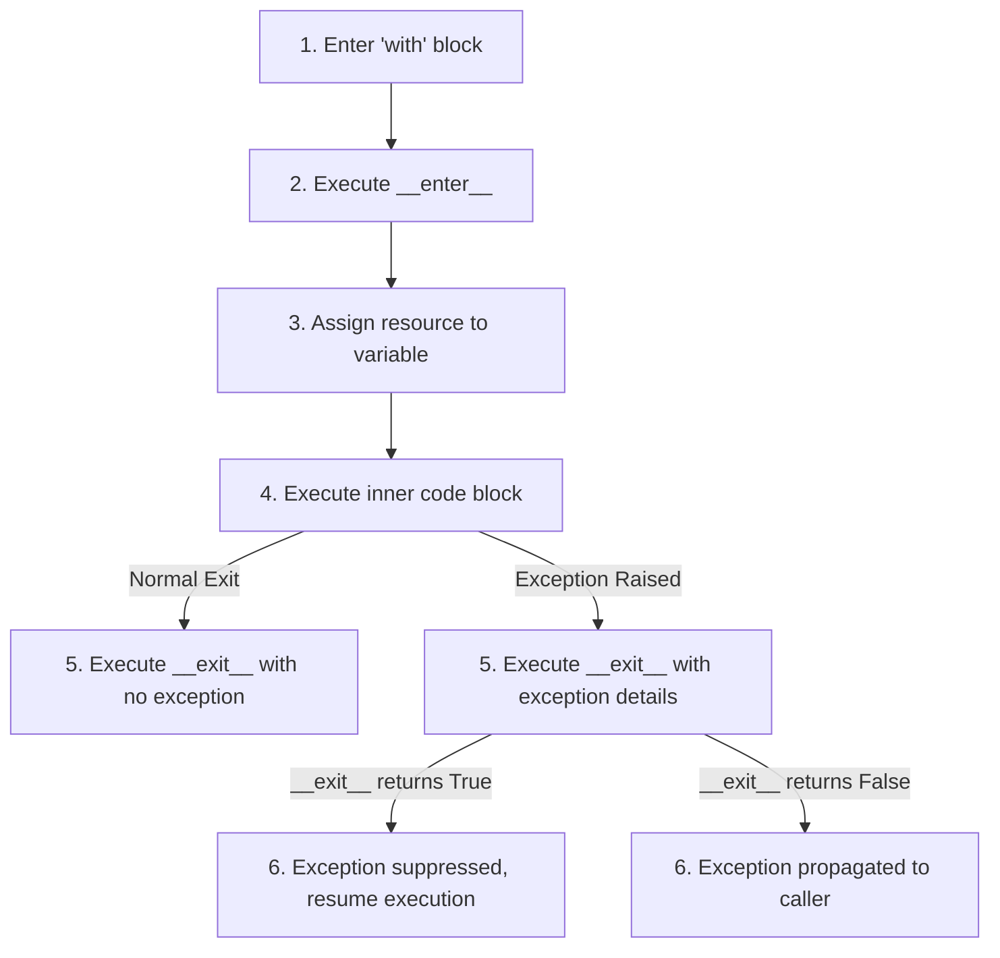

# Exceptions & Context Managers

## Introduction
In Python, **Exceptions** are the standard mechanism for handling runtime errors, while **Context Managers** provide a structured way to manage system resources (such as files, network sockets, or database connections). Together, they ensure that applications fail gracefully and release resources reliably, preventing resource leaks and maintaining system stability.

---

## Problem Statement
Software systems encounter runtime failures: network dropouts, database connection losses, or invalid user inputs. If exceptions are not handled, they halt the application. Conversely, if exceptions are caught blindly (e.g. `except: pass`), critical bugs are silenced, making debugging impossible. Additionally, failing to release resources (like open files or database connections) when errors occur leads to resource leaks and crashes. We need structured error handling and resource cleanup patterns.

---

## Why this exists
- **Exceptions (Robustness):** Separate error-handling logic from the main application flow, making code easier to read and maintain.
- **Context Managers (Safety):** Enforce the **RAII (Resource Acquisition Is Initialization)** pattern. They guarantee that cleanup code runs automatically when block execution finishes, even if exceptions are raised.

---

## Real-world analogy
Think of dining at a restaurant:
- **Normal Flow:** You enter, get seated (resource allocated), eat your meal, pay the bill, and leave (resource released).
- **Exception:** You choke on a bone (runtime error).
- **Try-Except-Finally:** The staff calls an ambulance (exception handler). Regardless of whether you finish your meal or get taken to the hospital, the table must be cleaned and reset (finally block) for the next customer.
- **Context Manager:** The restaurant's policy. The seating, dining, cleaning, and billing are managed by the restaurant's system. You just walk in and eat; the system handles the setup and cleanup automatically.

---

## Definition
- **Exception:** An event that occurs during program execution that disrupts the normal flow of instructions.
- **Context Manager:** An object that defines the runtime context to be established when executing a `with` statement, implementing the `__enter__()` and `__exit__()` methods.
- **BaseException vs Exception:** `BaseException` is the root of the exception hierarchy (includes system-exit signals). `Exception` is the base class for all non-system-exiting exceptions; user-defined exceptions should inherit from it.

---

## Key concepts
1. **Try-Except-Else-Finally Structure:**
   - `try`: The block of code to monitor for exceptions.
   - `except`: Catches and handles specific exceptions.
   - `else`: Runs only if no exceptions were raised in the try block.
   - `finally`: Always runs, making it ideal for cleanup code.
2. **The contextmanager Protocol:**
   - `__enter__()`: Sets up the resource and optionally returns it.
   - `__exit__(exc_type, exc_val, exc_tb)`: Runs when exiting the `with` block. If it returns `True`, exceptions raised inside the block are suppressed; if `False`, they propagate.
3. **Contextlib Module:** Provides the `@contextmanager` decorator, allowing developers to build context managers using generator functions instead of writing classes.

---

## Internal working / Mermaid diagram

### Context Manager Execution Flow



---

## Python implementation

### 1. Bad Implementation: Silencing Errors and Leaking Sockets
Catching exceptions blindly using `except: pass` (silencing bugs) and failing to close network connections when errors occur, leading to socket exhaustion.

```python
import socket

# A naive client sending data.
# CRITICAL BUG: Catches all exceptions blindly, hiding bugs (like NameError or TypeError),
# and fails to close the socket if sending fails, causing connection leaks.
def bad_socket_sender(host, port, data):
    try:
        s = socket.socket(socket.AF_INET, socket.SOCK_STREAM)
        s.connect((host, port))
        s.sendall(data)
        s.close()
    except:
        # Silently swallows all errors, making debugging impossible
        pass 
```

### 2. Better Implementation: Explicit Exception Catching and Finally Cleanup
Catching specific exceptions explicitly and using a `finally` block to guarantee the socket connection is closed.

```python
import socket

# Explicit exception handling and cleanup.
# TIME COMPLEXITY: O(1) socket operations
# SPACE COMPLEXITY: O(1)
def better_socket_sender(host, port, data):
    s = None
    try:
        s = socket.socket(socket.AF_INET, socket.SOCK_STREAM)
        s.connect((host, port))
        s.sendall(data)
    except socket.error as e:
        # Handle specific network exceptions explicitly
        print(f"Network error occurred: {e}")
        raise
    finally:
        # Guarantee resource release
        if s is not None:
            s.close()
```

### 3. Best Implementation: Custom Context Manager for Database Transactions
An optimized custom Context Manager class that handles database connection allocation and cleanup, and automatically executes a `rollback()` if an exception occurs during the transaction.

```python
# Custom database transaction exception
class TransactionError(Exception):
    """Raised when database transactions fail"""
    pass

class DatabaseTransactionManager:
    def __init__(self, db_client):
        self.db = db_client
        self.connection = None

    def __enter__(self):
        # 1. Acquire resource
        self.connection = self.db.connect()
        # 2. Begin transaction context
        self.connection.begin_transaction()
        return self.connection

    def __exit__(self, exc_type, exc_val, exc_tb):
        try:
            if exc_type is not None:
                # 3A. Exception occurred: rollback transaction to preserve data integrity
                print(f"Exception detected: {exc_val}. Rolling back transaction...")
                self.connection.rollback()
                
                # Wrap and raise custom exception for the caller
                raise TransactionError("Transaction failed") from exc_val
            else:
                # 3B. Normal exit: commit changes
                self.connection.commit()
        finally:
            # 4. Always release resource
            self.db.disconnect(self.connection)
            
        return False # Propagate wrapped exceptions

# Usage:
# with DatabaseTransactionManager(db) as conn:
#     conn.execute("INSERT INTO users ...")
```

---

## Step-by-step explanation
1. **The Silence of Blind Catching**: In `bad_socket_sender`, using `except:` catches everything, including system-exit signals (`SystemExit`, `KeyboardInterrupt`) and syntax/reference errors (`NameError`). This masks bugs and leaves sockets open if errors occur before `s.close()`.
2. **Explicit Targeting**: In `better_socket_sender`, we catch `socket.error` specifically. The `finally` block runs regardless of whether the code succeeds, fails, or raises an unexpected error, ensuring the socket is closed.
3. **Context Manager Lifecycle (Best)**: In `DatabaseTransactionManager`, when the `with` block is entered:
   - Python executes `__enter__()`, which connects to the database, begins a transaction, and assigns the connection reference to the variable after the `as` keyword.
   - The code inside the `with` block runs.
   - When the block exits (normally or via exception), Python calls `__exit__()` with any exception details (`exc_type`, `exc_val`, `exc_tb`).
   - If an exception occurred, `__exit__()` executes a rollback to protect data integrity, wraps the error in a custom `TransactionError`, and closes the connection.

---

## Multiple real-world examples
1. **Lock Management in Concurrency:** Using `with threading.Lock():` to acquire and automatically release locks, preventing deadlocks if exceptions occur.
2. **File Processing:** Using `with open('file.txt', 'r') as f:` to read files, guaranteeing the file descriptor is closed automatically.
3. **Mocking in Unit Tests:** Using `with mock.patch('module.Class'):` to temporarily replace classes with mocks during tests, restoring original classes when tests exit.

---

## Pros
- **Resource Leak Prevention:** Guarantees resource release (files, locks, connections).
- **Graceful Failures:** Keeps applications running by handling expected exceptions explicitly.
- **Clean Code:** Context managers remove duplicate cleanup code, separating concerns.

---

## Cons
- **Debugging Complexity:** Context managers change execution flow, which can make debugging stack traces difficult.
- **Exception Masking Risks:** Returning `True` in `__exit__()` silences exceptions, which can hide critical bugs if used incorrectly.
- **Context Allocation Cost:** Creating context objects adds minor runtime overhead compared to simple try-finally blocks.

---

## Interview questions

### Beginner
- **Q: What is the purpose of the else block in a try-except statement?**
  - **A:** The `else` block runs only if no exceptions were raised in the `try` block. This is useful for code that should execute only on success, keeping the `try` block small and focused on lines that can raise exceptions.

### Intermediate
- **Q: What happens if an exception is raised inside a context manager's __exit__ method?**
  - **A:** If an exception is raised inside `__exit__()`, it halts the cleanup process and propagates to the caller, overwriting any exception that occurred inside the `with` block. Therefore, `__exit__()` methods should be written defensively, wrapping their own cleanup code in internal try-except-finally blocks to ensure all resources are released.

### Senior
- **Q: How does the @contextmanager decorator in contextlib work? Write a generator-based equivalent of a file-opener context manager.**
  - **A:** The `@contextmanager` decorator converts a generator function into a context manager. The code before the `yield` statement acts as the `__enter__()` block, the yielded value is assigned to the `as` variable, and the code after `yield` acts as `__exit__()`:
    ```python
    from contextlib import contextmanager

    @contextmanager
    def custom_open(file_path, mode):
        # __enter__ equivalent
        file = open(file_path, mode)
        try:
            yield file # Yield resource to caller
        finally:
            # __exit__ equivalent
            file.close()
    ```

### Staff Engineer
- **Q: How do you handle exception chaining in Python 3? Explain the difference between `raise Exception from err` and `raise Exception`.**
  - **A:** 
    - **`raise Exception` (Default):** Python raises the new exception but retains the original exception in the `__context__` attribute. The stack trace displays both errors, stating: *"During handling of the above exception, another exception occurred"*.
    - **`raise Exception from err` (Explicit Chaining):** Sets the `__cause__` attribute of the new exception to `err`. The stack trace displays both errors, stating: *"The above exception was the direct cause of the following exception"*.
    - **`raise Exception from None`:** Suppresses the original exception context entirely, hiding it from the stack trace. This is useful for exposing clean APIs to external clients while keeping internal implementation errors hidden.

---

## Common mistakes
- **Using raw `except: pass`:** Silencing critical bugs.
- **Returning True in __exit__ blindly:** Suppressing all exceptions, including syntax and memory errors.
- **Leaking resource references:** Accessing variables assigned in the `with` statement after the block has exited (the resource may be closed and invalid).

---

## Best practices
- **Catch specific exceptions:** Always catch specific exception classes (e.g. `FileNotFoundError`, `ValueError`) rather than the base `Exception` class.
- **Use with for cleanup:** Always use `with` statements when working with files, locks, or database connections.
- **Wrap custom exceptions:** Wrap low-level database or network exceptions in custom domain exceptions (e.g., `TransactionError`) before raising them to external APIs.

---

## When NOT to use context managers
- **Long-lived Resources:** If a resource must remain open across multiple asynchronous tasks or different parts of an application lifecycle (e.g. a shared database connection pool), do not use a short-lived `with` block. Manage the resource lifecycle manually.

---

## Comparison of Error Handling Strategies

| Strategy | Try-Except-Finally | Context Manager (with) | Assertions |
| :--- | :--- | :--- | :--- |
| **Primary Focus** | General error handling | Resource lifecycle management | Invariant checks during dev |
| **Code Verbosity** | High | Low | Low |
| **Exception Suppression** | No (must handle explicitly) | Yes (via returning True in `__exit__`) | No (always raises `AssertionError`) |
| **RAII Support** | Manual | Automatic | None |

---

## Summary
Exceptions handle runtime errors gracefully, while context managers ensure system resources are released reliably. Combining explicit exception handling and custom context managers helps build robust, leak-free Python applications.

---

## Related topics
- [Collections](../collections)
- [Generators & Decorators](../generators-decorators)
- [File I/O & Serialization](../file-io-serialization)
